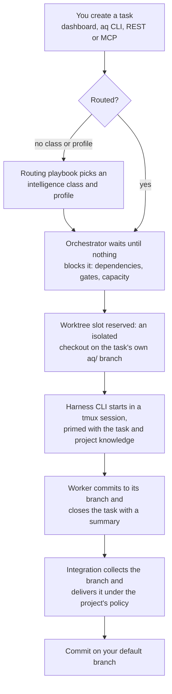

# Agent Queue

**Agent Queue (AQ) is a background service that runs AI coding agents against your
Git repositories.**

You describe work as *tasks*. AQ decides which task is ready, gives it an isolated Git
worktree, starts a coding-agent CLI inside a terminal session, records what came back,
and carries the finished branch toward your default branch under a policy you choose.
Tasks, dependencies, gates, sessions and outcomes live in PostgreSQL rather than in one
model's context, so a crashed or exhausted agent is a retry rather than the end of the
job.

It is for people who already run coding-agent CLIs by hand and want a queue, isolation
and an audit trail around them — not a hosted product. The interesting unit here is not a
chat with one agent but a local software factory: an operational system that expresses
work, assigns it to a fleet, observes it and keeps it moving. AQ is under active
development; expect to read logs and use `aq doctor`.

## Start here

**→ [Install and start Agent Queue](docs/tutorials/install.md)**, then
[run your first isolated task](docs/tutorials/first-task.md).

Installing on Windows? Use the [Windows + WSL2 quickstart](docs/tutorials/install.md#windows-wsl2-quickstart).
On a Mac, use the [macOS quickstart](docs/tutorials/install.md#macos-quickstart).
Both paths lead to the same resumable installer and [recovery guidance](docs/tutorials/install.md#recovery-upgrade-and-uninstall).
The versioned release's platform matrix, artifact checks, and intentionally
visible acceptance limits are in the [installation release record](docs/validation/installation-release-0.1.0.md).

The short version, once the prerequisites on that page are in place:

```bash
git clone https://github.com/ElectricJack/agent-queue.git
cd agent-queue
./setup.sh          # virtualenv, Python + dashboard packages, `aq` entry point,
                    # then `aq install` — the onboarding wizard: prerequisites,
                    # PostgreSQL, agent CLIs, configuration, daemon, dashboard
aq status           # what the daemon that `aq install` started thinks of itself
```

You need Linux or macOS (WSL2 counts, if everything stays on the Linux side), Python
3.12+, Git, tmux, a PostgreSQL database, and at least one authenticated agent CLI —
`claude`, `codex` or `gemini`. PostgreSQL is the only supported backend. `npm` is needed
for the dashboard, and the GitHub CLI (`gh`) for the GitHub-facing delivery paths.

Unsure what a word means? The [glossary](docs/reference/glossary.md) defines the
vocabulary the rest of the documentation uses.

## What happens to a task



1. **Work enters as a durable record.** Create a task from the dashboard, the `aq` CLI,
   the REST API or an MCP client. A task can stand alone or sit in a typed dependency
   graph (`aq task create --graph` / `--from-spec`, `--dry-run` to validate first).
   Approved specs take a longer road: the shipped
   [default pipeline](src/prompts/default_playbooks/default-pipeline.md) creates a
   spec-ingest task, which proposes a task batch, which waits at a human gate before
   anything is written into the graph.
2. **Routing chooses capabilities, not a hard-coded model.** A task missing an
   intelligence class or a profile makes the orchestrator emit `task.route_needed`. The
   shipped [routing playbook](src/prompts/default_playbooks/default-assignment-routing.md)
   asks a small model to pick a class and a profile from the catalog of what this install
   can actually run, and writes both onto the task. A *profile* is the markdown role —
   what the agent is for, which tools it may use, which harness runs it. An *intelligence
   class* maps a level such as `standard-medium` onto provider-specific model and
   reasoning settings.
3. **A shared worker runs it.** Workers are global identities reused across projects. For
   each assignment the daemon starts the profile's harness in an observable tmux session;
   the shipped harnesses are [Claude Code, Codex and Gemini CLI](src/sessions/default_harnesses/).
   No coding model runs inside the daemon.
4. **Git work is isolated.** Repository tasks run in reusable worktree slots, normally on
   an `aq/<task-id>` branch. The worktree is disposable execution space; the branch, the
   task history, its comments and its session attempts are the durable artifacts. Project
   caps, workspace locks, leases and heartbeats bound concurrency and make stalled work
   visible.
5. **Closing is not delivering.** A task closes with an explicit summary — that means the
   worker pushed a branch and said it was done.
   [Integration](docs/concepts/integration.md) is the separate, restartable job that
   decides which branches still apply, proves they work, and publishes them. Nothing
   reaches your default branch outside that path.
6. **You steer it while it runs.** The dashboard shows the live task graph, task list,
   gates, files, diffs, sessions, playbook runs and worker terminals. The CLI, REST API
   and MCP server reach the same command layer rather than reimplementing it.

## What ships on, what you turn on

AQ ships deliberately conservative. Four things are easy to confuse, so the
documentation labels all of them:

| | |
|---|---|
| **Shipped defaults** | Spec-ingest, the proposal gate and batch commit ([default pipeline](src/prompts/default_playbooks/default-pipeline.md)); playbook-driven routing; per-task delivery as a pull request (`integration.default_mode`); project integration mode `disabled`; worker pools off (`swarm.enabled`); Discord notification-only, and `messaging_platform: none` fully supported. |
| **Configured local policy** | Anything you set in `~/.agent-queue/config.yaml` or the vault. This repository, for example, configures `development` integration mode — batched validate-and-publish straight to `main` — and runs pull-based worker pools. Yours does not unless you say so. |
| **Optional compatibility modes** | `hierarchy` and `train` integration modes; the older triage-task routing shape; the `reviewer` / `final-reviewer` profiles, which still ship but which **no default configuration creates work for**. |
| **Proposed work** | Lives in [`docs/specs/`](docs/specs/) and [`docs/superpowers/`](docs/superpowers/) and is not a description of what runs. |

Two things AQ specifically does *not* do, despite what older pages may say: the default
pipeline does not create a reviewer for every finished task or a final branch review, and
Discord has no slash commands, buttons or task controls — it is one channel carrying an
hourly [activity digest and escalation threads](docs/concepts/messaging.md), and the reply
you type in an escalation thread is the only thing that travels back in.

## Where things live

Operator-editable policy is markdown under `~/.agent-queue/vault/`, watched by the daemon:
agent profiles, harness definitions, intelligence classes, workspace kinds, playbooks,
formulas, and per-project overrides, specs, notes and memory. Markdown is the editable
source; database rows and compiled artifacts are projections of it. Obsidian works on the
vault, and nothing requires it.

Durable state — tasks, gates, sessions, claims, workspaces, delivery journals — is in
PostgreSQL. The control path is deterministic on purpose: scheduling, dependency and gate
resolution, assignment and recovery need no LLM call. Models do the parts that need
judgment.

## Documentation

**[The documentation home](docs/README.md)** is the reading order and the index for
everything below.

| Start with | For |
|---|---|
| [Install](docs/tutorials/install.md) · [First task](docs/tutorials/first-task.md) | Getting a healthy daemon and watching one worker finish a job. |
| [Glossary](docs/reference/glossary.md) | The words the rest of the documentation assumes. |
| [Architecture](docs/concepts/architecture.md) | What the daemon starts, in what order, and who owns which state. |
| [Agents and routing](docs/concepts/agents-and-routing.md) · [Sessions](docs/concepts/sessions.md) · [Providers](docs/concepts/providers.md) | How a task becomes a running agent, and what happens when one dies. |
| [Integration](docs/concepts/integration.md) | How a finished branch becomes a commit on `main`. |
| [Playbooks](docs/concepts/playbooks.md) | Markdown workflow graphs: events, gates, activation. |
| [Messaging, digests and escalations](docs/concepts/messaging.md) | Talking to workers, and how a machine asks a human a question. |
| [CLI reference](docs/reference/cli/README.md) · [HTTP API](docs/reference/api/README.md) · [Database](docs/reference/database/README.md) | Exhaustive look-up material. |
| [Contributing](docs/contributing/README.md) | Setting up a development checkout and delivering a change. |

## Working on Agent Queue

```bash
pip install -e packages/aq-client     # generated typed API client
pip install -e ".[dev,cli]"
npm install
```

Then run only the checks your change needs — the test suite is large enough that running
all of it is a whole-box event:

```bash
ruff check <the files you edited>
aq test tests/test_<area>.py          # `aq test` takes a box-wide slot and caps workers
npm -w dashboard run lint             # for dashboard changes
npm -w dashboard run typecheck
```

[Local checks](docs/contributing/checks.md) maps what you changed to what you should run;
[testing](docs/contributing/testing.md) explains why bare `pytest tests/` is the wrong
habit here. `npm run dev` serves the dashboard on `http://127.0.0.1:5173`, proxying the
daemon API at `http://127.0.0.1:8081`.

## License

MIT — see [LICENSE](LICENSE).
