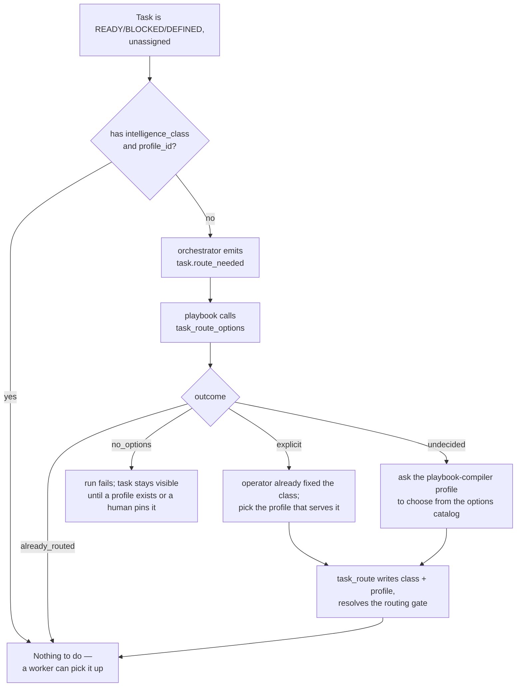

# Agents and routing

How AQ decides *who* does a task and *how hard they think about it* — agent
profiles, intelligence classes, harnesses and the routing playbook that puts
them together.

## Why it exists

A queue of tasks is useless without an answer to "which worker picks this up".
Answering it badly is expensive in two directions: send a one-line typo fix to
the most capable model and you burn money on nothing; send a subtle
cross-cutting refactor to the cheapest one and you get a plausible patch that
does not work.

AQ splits that decision into two independent halves so neither one has to
guess about the other:

* **How much thinking the work needs** — the task's *intelligence class*
  (`fast-low`, `standard-high`, `deep-high`, …). This is about the work, not
  about any vendor.
* **Which command-line tool executes it** — the worker's *agent profile*,
  whose `harness` field names the CLI (`claude`, `codex`, `gemini`).

The class and the harness meet at launch: the harness implies a *provider*, the
class maps that provider to a concrete *model*, and the session starts. Because
the halves are separate, the same task can run on any vendor whose model
mapping exists, and switching a worker to a different CLI does not silently
change how hard it thinks.

Deciding a task's class is *policy*, so it does not live in the daemon. It
lives in a playbook you can read and edit
([`src/prompts/default_playbooks/default-assignment-routing.md`](../../src/prompts/default_playbooks/default-assignment-routing.md)).
The orchestrator's entire contribution is to notice a task that cannot be
picked up yet and emit one event.

## Vocabulary

These six words get used interchangeably in conversation and mean six
different things. Getting them apart is most of understanding this page. See
also the [glossary](../reference/glossary.md).

| Term | What it is | Where it lives |
|---|---|---|
| **Intelligence class** | How much thinking the work needs, as a named policy: `standard-high`. Vendor-neutral. | Markdown in `vault/intelligence-classes/<id>.md` |
| **Harness** | *Which* CLI runs the agent: `claude`, `codex`, `gemini`. | A profile's `## Config` `harness` field |
| **Provider** | The vendor keyed by that CLI: `anthropic`, `openai`, `google`. Not configured directly — it is implied by the harness. | Derived at launch |
| **Model** | The concrete model the class resolves to for that provider: `claude-opus-5`. | The class file's JSON block |
| **Agent (worker) identity** | A durable, named worker row that survives tasks and is shared between projects. May carry its own saved overrides. | `agents` table |
| **Agent profile (agent type)** | The reusable definition of a *kind* of worker: harness, lifecycle, role prompt, tools, default class. | `vault/agent-types/<id>/profile.md` |
| **Profile pin / class pin** | An explicit `profile_id` or `intelligence_class` written onto **one task**, which routing must respect. | `tasks` columns |

Two more that this page leans on:

* **Lifecycle** — `task` profiles have work *pushed* to them (the scheduler
  starts a session per assigned task); `pool` profiles *pull* work by claiming
  it; `named` profiles are long-lived sessions addressed by name, like the
  supervisor. See `docs/concepts/scheduling.md` (planned).
* **Routing gate** — an open gate of type `routing` on a task, which holds it
  out of the queue until something writes a route.

> **Note.** A profile is *not* a model and a class is *not* a profile. The
> shipped profile `worker-standard-medium-claude` names the harness `claude`
> and the class `standard-medium`; the class file names the model. Two files
> and one task column, three separate jobs.

## A realistic example

**Prerequisites:** a checkout of this repository. No daemon, no database, no
credentials — everything below is shipped markdown you can read on disk.

Read the class that says how hard to think:

```bash
cat src/prompts/default_intelligence_classes/standard-high.md
```

````text
---
id: standard-high
name: "Standard · High"
description: "Balanced mid-tier — most implementation, multi-file refactors, clear-spec work. Thinking: extended reasoning."
tier: standard
thinking: high
---

```json
{
  "anthropic": {"model": "claude-opus-5", "thinking": "high"},
  "openai":    {"model": "gpt-5.6-terra", "reasoning_effort": "high"},
  "codex":     {"model": "gpt-5.6-terra", "reasoning_effort": "high"},
  "google":    {"model": "gemini-2.5-pro",    "thinking_budget": 24576}
}
```
````

Read the profile that says which CLI runs, and what it is allowed to do:

````bash
sed -n '/## Config/,/^```$/p' src/profiles/defaults/worker-standard-medium-claude/profile.md
````

````text
## Config
```json
{
  "harness": "claude",
  "lifecycle": "task",
  "needs_workspace": true,
  "default_class": "standard-medium",
  "workspaces": ["project-repo"]
}
```
````

Now put them together for one task. Say the routing playbook decided the task
needs `standard-high` and picked the profile above:

1. The profile's `harness` is `claude`, so the provider is `anthropic`
   ([`_infer_provider_from_harness`](../../src/sessions/spec.py)).
2. The task's class `standard-high` beats the profile's `default_class`
   `standard-medium` ([`_resolve_class_config`](../../src/sessions/spec.py)).
3. The class's `anthropic` slice supplies `model: claude-opus-5` and
   `thinking: high`.
4. The session launches the `claude` CLI with that model and that thinking
   level, and the model actually used is written to the attempt row — never
   inferred back from the profile. See [sessions](sessions.md).

Nothing was created and nothing needs cleaning up; you read three files.

## How a task gets routed

A task needs **both** an `intelligence_class` and a `profile_id` before any
worker will take it. Every cycle, the orchestrator looks for tasks that are
otherwise eligible and missing one of them, and emits `task.route_needed` — at
most once every two minutes per task
([`src/orchestrator/route_needed.py`](../../src/orchestrator/route_needed.py)).
It decides nothing else. The `default-assignment-routing` playbook does the
rest.



Three outcomes are worth reading twice:

* **`explicit`** — the class was already fixed (by an operator, or at task
  creation). The playbook does not re-decide it; it only asks which profile can
  serve that class, and the answer is deterministic
  ([`profile_for_class`](../../src/commands/routing_commands.py)).
* **`undecided`** — no class yet. The playbook asks a model to choose one, from
  the supplied catalog only. The guidance it follows is
  [the "Choosing a class" section of the playbook](../../src/prompts/default_playbooks/default-assignment-routing.md).
* **`no_options`** — nothing configured can execute the task. The run fails
  loudly, `aq task explain --task-id <id>` names it, and the orchestrator keeps
  re-emitting so a fix takes effect without a restart.

The playbook has no retry: a failed run leaves a `failed` terminal you can see,
and the next `task.route_needed` two minutes later is the retry.

### Which class the shipped policy picks

The shipped playbook's guidance, in one paragraph, is: **default to
`standard-high`** for ordinary feature work, debugging, refactoring, tests and
coordinated multi-module changes. Use a *fast* class only for clearly trivial,
localized work whose requirements are already settled. Use `deep-high` only for
exceptionally difficult work — an unresolved architectural problem, or a hard
investigation with concrete evidence that standard reasoning was not enough —
and the recorded reason must name that difficulty. C++, several files, native
builds, integration tests, a high priority and a red CI run are explicitly *not*
reasons to escalate to deep.

That is shipped default policy, and it is a markdown file. A project that wants
different rules keeps a project-scope copy of the playbook; no code changes.

### Pins, and how clearing one reroutes

An operator can decide instead of the playbook. Both pins are ordinary task
fields:

```bash
aq task edit --task-id demo.4 --intelligence-class deep-high
aq task edit --task-id demo.4 --profile-id worker-deep-high-claude
```

A pinned class makes the next routing run take the `explicit` path — the class
is preserved and only the profile is filled in. A pinned *profile* narrows the
catalog to that profile's own rows even before the task has a class, because
choosing another profile would silently change the provider.

Clearing a pin hands the decision back:

```bash
aq task edit --task-id demo.4 --intelligence-class null --profile-id null
```

The task is now missing both fields, so the next cycle emits
`task.route_needed` for it and the playbook chooses again. Two rules apply to
both commands: routing fields may only be changed while the task is **not**
running or claimed (otherwise the command answers *"Task is running or
claimed; stop the task before changing its routing"*), and a class that has no
model mapping for the profile's provider is rejected rather than launched with
a fallback ([`_validate_routing_class`](../../src/commands/task_commands.py)).

## Compatibility: when a worker may not take a task

Routing produces a *requirement*. Whether a given worker satisfies it is a
separate, purely computed question with no I/O, in
[`task_agent_mismatch`](../../src/agents/routing.py). It returns either `None`
or a sentence saying what is wrong. The rules, in the order they are checked:

| Check | Rule |
|---|---|
| Class | A worker saved with a class takes only tasks carrying **exactly** that class. Class names are editable and have no ordering, so "higher" is not a concept — `deep-high` does not satisfy a request for `standard-high`. |
| Harness | An explicit, non-generic task profile (or one with a class or a model) binds its harness. A worker on a different CLI is refused. |
| Provider | When a provider is required, the worker's harness must imply that provider. |
| Class exists | A required class that is not in the vault is refused by name, not silently ignored. |
| Model mapping | A required class with no model for the worker's provider is refused — a `google`-only class cannot run on the `codex` harness. |
| Model | The resolved models must match. A worker's own saved model is fixed; otherwise the class supplies it. |

A worker with no fixed class and no fixed model is *generic*: it may inherit
whatever the task asks for. That is what makes the shipped `worker-*` ladder
reusable — the ladder is matched by id prefix plus `harness == "claude"`,
not by an enumerated list, so an operator's own `worker-…-codex` siblings stay
provider-bound.

### Pools, disabled pools and roster reuse

A `pool` profile's workers pull work with `aq task claim`. Two consequences:

* A pool worker's claim query only matches tasks whose class equals the class
  its **live session** was launched with — not the profile's current setting. A
  running pool cannot change model or class between claims
  ([`_pool_claim_routing`](../../src/commands/claim_commands.py)).
* A pool profile with no `default_class` offers nothing to routing at all:
  there would be no class for its workers to claim
  ([`build_route_options`](../../src/commands/routing_commands.py)).

Setting `enabled: false` on a profile is the operator kill switch. It does not
delete anything: the profile, its markdown and its row all stay. What changes
is that the next `aq task claim` answers `drain_requested` (*"pool is
disabled"*), so in-flight tasks finish and idle workers stand down. Disabled
rows remain in the routing catalog as `disabled_options` for diagnostics, and
an *existing* pin to a disabled profile is still honoured — but automatic
selection never picks one.

Worker rows themselves are reused rather than multiplied. Workers are
**global**: the idle pool the agent reconciler draws from is the whole roster,
not one project's, because a durable worker belongs to whichever task it is
currently holding. It creates a new agent only for READY work that no idle,
*compatible* worker could take
([`src/orchestrator/agent_reconciler.py`](../../src/orchestrator/agent_reconciler.py))
— an idle triage worker cannot stand in for an explicitly routed Codex task,
so it does not suppress supply for one. Deleting an agent removes that
identity from the usable roster but is not a scaling policy: the tombstone is
never resurrected, and the reconciler still grows a *fresh* worker when demand
needs one. To cap capacity persistently, change the pool's `max_active` bound
or the project's `max_concurrent_agents` rather than deleting workers.

### Project defaults

A task with no profile of its own falls back to its project's
`default_profile_id`. A project with none of those gets one picked
deterministically, in this order: `claude-opus`, `claude-sonnet`,
`worker-standard-medium-claude`, `worker-standard`, then the alphabetically
first general-purpose profile, then the alphabetically first non-supervisor
profile ([`src/profiles/default_selection.py`](../../src/profiles/default_selection.py)).
The standard tier is named explicitly because plain alphabetical order picks
`worker-deep-high-claude` out of the shipped ladder, which would quietly make
the most expensive tier every project's default.

## Inputs and outputs

**In:** a task row; the profile definitions parsed from vault markdown; the
intelligence classes parsed from vault markdown; the harness registry; the
current agent roster and its idle/busy counts.

**Out:** two columns on the task (`intelligence_class`, `profile_id`,
optionally `preferred_workspace_id`), a resolved `routing` gate, and a
`route_reason` metadata entry recording *why* — capped at 400 characters and
readable with `aq task show`.

**Not out:** a separate routing decision record. There is deliberately no such
table. "The task row itself is the route"
([`src/assignment_routing.py`](../../src/assignment_routing.py)); a task with no
class has no route, and the cascade keeps saying so.

## State ownership

| State | Written by | Lives in |
|---|---|---|
| Profile definitions | You, in an editor; seeded write-if-absent at startup | `vault/agent-types/<id>/profile.md` — **source of truth** |
| Profile rows | [`src/profiles/sync.py`](../../src/profiles/sync.py), on vault change | `agent_profiles` table — a cache of the markdown |
| Intelligence classes | You, or `aq system edit-intelligence-class` | `vault/intelligence-classes/<id>.md` — **source of truth, no table at all** |
| Loaded classes | [`IntelligenceClassRegistry`](../../src/intelligence_classes/registry.py), kept live by the vault watcher | Memory only |
| Worker identities and their overrides | `aq agent create` / `aq agent edit`, and the agent reconciler | `agents` table |
| A task's route | `task_route` (the playbook, or `aq task route`) and `aq task edit` | `tasks.intelligence_class`, `tasks.profile_id` |
| The model that actually ran | The session launcher | `task_session_attempts` — the only evidence of a model |
| Deleted shipped profiles | `aq agent delete-profile` | `vault/agent-types/.retired-defaults` |

Two things follow from "the markdown is the source of truth". Adding a class
file makes it launchable with **no daemon restart** — the orchestrator owns one
registry and hands the same live object to every consumer. And a file that
stops parsing keeps its previous loaded value rather than disappearing, so a
half-saved file in an editor cannot take a class, and every profile naming it,
offline mid-run.

## Local versus shipped policy

Everything above describes what the repository **ships**. What an installed
vault actually holds is a separate question, and the answer is routinely quite
different — the fleet that develops AQ itself, for example, retires all three
shipped `worker-*` profiles (tombstoned in `.retired-defaults`), runs a fuller
`<tier>-<level>-<provider>` ladder on `lifecycle: pool` instead of the shipped
`lifecycle: task`, and adds an extra very-fast class that this repository does
not ship.

None of that is a fork. Profiles and classes are markdown in the operator's
vault, and seeding is write-if-absent precisely so local edits survive
upgrades. The cost is that a vault silently keeps old semantics, which is what
`aq agent profile-drift` and `aq doctor --check profiles.system_drift` are for.

Because a vault is not in this repository, no page here can tell you what
*yours* contains. Look:

```bash
ls ~/.agent-queue/vault/agent-types/ ~/.agent-queue/vault/intelligence-classes/
cat ~/.agent-queue/vault/agent-types/.retired-defaults    # absent = nothing retired
```

When reading a claim on this page, check whether it says *ships* — a file under
[`src/profiles/defaults/`](../../src/profiles/defaults/) or
[`src/prompts/`](../../src/prompts/) that you can open in the checkout — or
*configured*, which means your vault decides.

## Common failures and recovery

| Symptom | Diagnose | Fix |
|---|---|---|
| A task sits READY and nothing starts | `aq task explain --task-id <id>` — it names the routing run | If routing failed with `no_options`, no configured profile can execute it: add or enable one, or pin by hand with `aq task route`. |
| Routing runs keep failing every two minutes | `aq playbook list-runs` for `default-assignment-routing` | Read the failed terminal. A permanent cause (no profile serves the class) stays until you add a profile or pin the task. |
| `intelligence class '<id>' not found in vault` | `aq doctor --check intelligence_classes.parse` | The file is missing or stopped parsing; the check names the file and the reason. Fix the frontmatter or the JSON block, then `aq system reload-config`. |
| `intelligence class '<id>' has no model mapping for provider '<p>'` | Read the class file's JSON block | Add the provider slice, or route the task to a profile whose harness matches a provider the class does map. |
| `Task is running or claimed; stop the task before changing its routing` | `aq task show <id>` | Routing fields are frozen while a worker holds the task. Stop the task first. |
| `aq task claim` answers `drain_requested: pool is disabled` | `aq agent list-profiles` | Expected after `enabled: false`. Re-enable the profile to resume claiming; the worker's current task is unaffected. |
| A worker behaves like an older version of its profile | `aq agent profile-drift` | Startup seeding never overwrites an existing vault profile. `aq agent profile-reseed --profile-id <id>` replaces it, keeping a `.bak-<epoch>` copy. |
| A deleted shipped profile keeps coming back | Read `vault/agent-types/.retired-defaults` | Delete through `aq agent delete-profile` so a tombstone is written; `aq agent profile-reseed` is the way back. |
| A `project:<pid>:<id>` profile still exists | `aq doctor --check profiles.project_overrides` | Project-scoped profiles were retired. `--fix` promotes the override into the system profile. |

## Related pages

* [Sessions](sessions.md) — what happens after routing: the terminal, the
  attempt row, and the model that actually ran.
* `docs/concepts/scheduling.md` — **planned** — how a routed task becomes a
  running worker, and how pools are sized.
* [Worker pools](../guides/worker-pools.md) — operating the pull-based fleet.
* [Profile and class reference](../reference/profiles-and-classes.md) — every
  `## Config` field and every class file field, with examples.
* `docs/concepts/playbooks.md` — **planned** — the machinery the routing
  policy runs on. Until it lands, read the
  [routing playbook itself](../../src/prompts/default_playbooks/default-assignment-routing.md).

## Source and tests

The 23 production modules behind this page are catalogued in
[the routing module shard](../reference/modules/routing.md). The ones to read
first:

* [`src/agents/routing.py`](../../src/agents/routing.py) — the compatibility
  rules, as one pure function.
* [`src/assignment_routing.py`](../../src/assignment_routing.py) — why there is
  no routing table.
* [`src/commands/routing_commands.py`](../../src/commands/routing_commands.py) —
  the options catalog the playbook chooses from.
* [`src/intelligence_classes/`](../../src/intelligence_classes/) — class files,
  parsing, the live registry.
* [`src/profiles/parser.py`](../../src/profiles/parser.py) — the profile
  markdown format.

Focused tests:

```bash
aq test tests/test_assignment_routing.py tests/test_agent_task_routing.py \
        tests/test_default_assignment_routing_playbook.py \
        tests/test_intelligence_classes.py tests/test_intelligence_class_registry.py \
        tests/test_profile_parser.py tests/test_profile_default_selection.py
```
