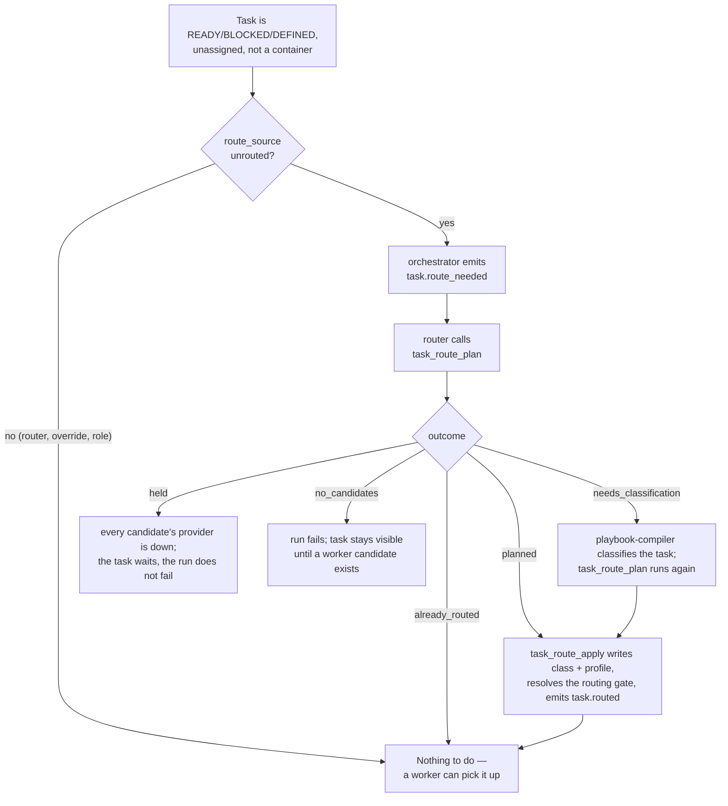

# Agents and routing

How AQ decides *who* does a task and *how hard they think about it* — agent
profiles, intelligence classes, harnesses and the routing playbook that puts
them together.

## Why it exists

A queue of tasks is useless without an answer to "which worker picks this up".
Answering it badly is expensive in two directions: send a one-line typo fix to
the most capable model and you burn money on nothing; send a subtle
cross-cutting refactor to the cheapest one and you get a plausible patch that
does not work.

AQ splits that decision into two independent halves so neither one has to
guess about the other:

* **How much thinking the work needs** — the task's *intelligence class*
  (`fast-low`, `standard-high`, `deep-high`, …). This is about the work, not
  about any vendor.
* **Which command-line tool executes it** — the worker's *agent profile*,
  whose `harness` field names the CLI (`claude`, `codex`, `gemini`).

The class and the harness meet at launch: the harness implies a *provider*, the
class maps that provider to a concrete *model*, and the session starts. Because
the halves are separate, the same task can run on any vendor whose model
mapping exists, and switching a worker to a different CLI does not silently
change how hard it thinks.

Deciding a task's class and worker is *policy*, so it does not live in the
daemon. It lives in the project's routing playbook, which you can read and edit
([`src/prompts/default_playbooks/default-assignment-routing.md`](../../src/prompts/default_playbooks/default-assignment-routing.md)
ships). Filers give hints, never routes, and the router is the only writer of a
route. The orchestrator's entire contribution is to notice a task that cannot
be picked up yet and emit one event.

## Vocabulary

These six words get used interchangeably in conversation and mean six
different things. Getting them apart is most of understanding this page. See
also the [glossary](../reference/glossary.md).

| Term | What it is | Where it lives |
|---|---|---|
| **Intelligence class** | How much thinking the work needs, as a named policy: `standard-high`. Vendor-neutral. | Markdown in `vault/intelligence-classes/<id>.md` |
| **Harness** | *Which* CLI runs the agent: `claude`, `codex`, `gemini`. | A profile's `## Config` `harness` field |
| **Provider** | The vendor keyed by that CLI: `anthropic`, `openai`, `google`. Not configured directly — it is implied by the harness. | Derived at launch |
| **Model** | The concrete model the class resolves to for that provider: `claude-opus-5`. | The class file's JSON block |
| **Agent (worker) identity** | A durable, named worker row that survives tasks and is shared between projects. May carry its own saved overrides. | `agents` table |
| **Agent profile (agent type)** | The reusable definition of a *kind* of worker: harness, lifecycle, role prompt, tools, default class. | `vault/agent-types/<id>/profile.md` |
| **Route / hint** | A route is the class, profile and provider intent the project's router wrote onto **one task**, with its source and reason. A hint (kind, class hint) is all a filer may give instead. | `tasks` columns |

Two more that this page leans on:

* **Lifecycle** — `task` profiles have work *pushed* to them (the scheduler
  starts a session per assigned task); `pool` profiles *pull* work by claiming
  it; `named` profiles are long-lived sessions addressed by name, like the
  supervisor. See `docs/concepts/scheduling.md` (planned).
* **Routing gate** — an open gate of type `routing` on a task, which holds it
  out of the queue until something writes a route.

> **Note.** A profile is *not* a model and a class is *not* a profile. The
> worker profile `standard-high-claude` names the harness `claude` and the
> class `standard-high`; the class file names the model. Two files and one
> task column, three separate jobs.
>
> Worker profiles are **derived**, not authored: one rung per (class x
> harness), generated from a `worker-<harness>` template that holds the role,
> rules and capabilities they share. A rung is a stub carrying only its class
> and its pool state, and it inherits the rest through `extends` — see
> [worker pools §7b](../guides/worker-pools.md).

## A realistic example

**Prerequisites:** a checkout of this repository. No daemon, no database, no
credentials — everything below is shipped markdown you can read on disk.

Read the class that says how hard to think:

```bash
cat src/prompts/default_intelligence_classes/standard-high.md
```

````text
---
id: standard-high
name: "Standard · High"
description: "Balanced mid-tier — most implementation, multi-file refactors, clear-spec work. Thinking: extra-high reasoning."
tier: standard
thinking: xhigh
---

```json
{
  "anthropic": {"model": "claude-opus-5", "thinking": "xhigh"},
  "openai":    {"model": "gpt-5.6-terra", "reasoning_effort": "xhigh"},
  "codex":     {"model": "gpt-5.6-terra", "reasoning_effort": "xhigh"},
  "google":    {"model": "gemini-2.5-flash",  "thinking_budget": 24576}
}
```
````

Read the template that says which CLI runs, and what it is allowed to do.
Every Claude rung inherits this; only the class differs between them:

````bash
sed -n '/## Config/,/^```$/p' src/profiles/defaults/worker-claude/profile.md
````

````text
## Config
```json
{
  "harness": "claude",
  "lifecycle": "task",
  "needs_workspace": true,
  "default_class": "standard-high",
  "workspaces": ["project-repo"]
}
```
````

Now put them together for one task. Say the routing playbook decided the task
needs `deep-high` and routed it to the `deep-high-claude` rung:

1. The rung inherits `harness: claude` from its template, so the provider is
   `anthropic` ([`_infer_provider_from_harness`](../../src/sessions/spec.py)).
2. Its own `## Config` overrides `default_class` with `deep-high`, and the
   task's class — also `deep-high` — agrees
   ([`_resolve_class_config`](../../src/sessions/spec.py)).
3. That class's `anthropic` slice supplies `model: claude-fable-5` and
   `thinking: xhigh`.
4. The session launches the `claude` CLI with that model and that thinking
   level, and the model actually used is written to the attempt row — never
   inferred back from the profile. See [sessions](sessions.md).

Nothing was created and nothing needs cleaning up; you read three files.

## How a task gets routed

A task needs a **route** — an `intelligence_class` and a `profile_id` written
by its project's router — before any worker will take it. Filing never supplies
one: a new task carries only its hints and `route_source = unrouted`. Every
cycle, the orchestrator looks for queued, unassigned tasks that still owe a
route and emits `task.route_needed` — at most once every two minutes per task
([`src/orchestrator/route_needed.py`](../../src/orchestrator/route_needed.py)).
A container (a task with children) is never routed. The orchestrator decides
nothing else. The project's bound router — the `default-assignment-routing`
playbook unless the operator re-bound it — does the rest.


```mermaid
flowchart TD
  A["Task is READY/BLOCKED/DEFINED,<br/>unassigned, not a container"] --> B{"route_source<br/>unrouted?"}
  B -- "no (router, override, role)" --> Z["Nothing to do —<br/>a worker can pick it up"]
  B -- yes --> C["orchestrator emits<br/>task.route_needed"]
  C --> D["router calls<br/>task_route_plan"]
  D --> E{outcome}
  E -- already_routed --> Z
  E -- planned --> I["task_route_apply writes class + profile,<br/>resolves the routing gate, emits task.routed"]
  E -- needs_classification --> G["playbook-compiler classifies the task;<br/>task_route_plan runs again"]
  E -- held --> H["every candidate's provider is down;<br/>the task waits, the run does not fail"]
  E -- no_candidates --> F["run fails; task stays visible<br/>until a worker candidate exists"]
  G --> I
  I --> Z
```

Four outcomes are worth reading twice:

* **`planned`** — the task's kind (`task_type`) and class hint were enough. The
  plan is deterministic: the routing policy picks the class and the lane, and a
  load score over live pool slots, routed backlog, provider usage and provider
  availability picks the profile among the candidates the policy allows
  ([`src/routing/planner.py`](../../src/routing/planner.py)). No model is asked.
* **`needs_classification`** — the task has neither a kind nor a class hint, or
  it is narrow work an OpenCode lane could take. The playbook asks the
  `playbook-compiler` profile to classify it — kind, class, narrow,
  test-verified — and plans again. The model never sees a profile, a provider or
  a load, so it cannot choose one. A failed classification still routes the
  task, on the policy's defaults.
* **`held`** — every candidate is on a provider that cannot launch right now.
  The run ends without failing, and the task waits for a provider to recover.
* **`no_candidates`** — no configured worker can take the task under the policy
  (for example `workspace_requirement` or `preferred_provider_unavailable`). The
  run fails loudly, `aq task explain --task-id <id>` names it, and the
  orchestrator keeps re-emitting so a fix takes effect without a restart.

`task_route_apply` re-checks the plan on fresh capacity, so a burst of routes
spreads out, then writes `profile_id`, `intelligence_class`, `provider_intent`
and `route_source = router` in one update, records why in `tasks.route`,
resolves any open `routing` gate and emits `task.routed`. It refuses every
caller except the project's bound router: the operator CLI, the supervisor and
workers cannot write a route through it.

The playbook has no retry: a failed run leaves a `failed` terminal you can see,
and the next `task.route_needed` two minutes later is the retry.

### Which class and lane the shipped policy picks

The shipped playbook carries its policy as a reviewed YAML block, its
`## Routing policy` section, which `task_route_plan` applies verbatim. In one
paragraph: every kind has a default class and a ceiling — `standard-high` for
feature, bugfix, refactor, research, test and docs work, `fast-high` for chore
and sync, `deep-high` for `design` (code design), `art` (art-heavy design) and
`plan`. A class hint is honoured up to the kind's ceiling and clamped above it
(`route.class_clamped_from` records the clamp). Code design runs on the
`code-design` lane, Claude first and Codex only when Claude cannot take it; art
design runs on Codex and holds for it (`provider_intent = pinned`). `deep-high`
on Claude is reserved for code design and design review, so a hard bug fix
hinted `deep-high` lands on `deep-high` Codex. Narrow, test-verified work goes
to an OpenCode rung while one has a free slot: local OpenCode (the `narrow`
lanes) first, then OpenCode on the hosted Zen gateway (the `narrow-hosted`
lane, `standard-high` only), which is a separate provider with its own
availability. Repairs never go to either. A self-hosted model (a harness
whose `provider` is `ollama`, such as local OpenCode) takes only low-stakes
work: the policy's `local_models` gate drops it for a bugfix in a project
delivering through an integration train (`hierarchical_integration_mode`
`hierarchy`, `train` or `development`) and for a task an unfinished task waits
on (`no_candidates` reason `local_model_gate` when nothing else remains). The
hosted Zen gateway is not local. A task's priority never routes it: no lane
and no local-model rule reads it, so it orders the claim frontier and nothing
else. Among what remains, the least-pressed candidate wins, and a tie goes to
Codex, then Claude, then OpenCode, then hosted OpenCode.

When the classifier has to pick a class, its guidance is the playbook's
"Classifying a task" section: **default to `standard-high`** for ordinary
feature work, debugging, refactoring, tests and coordinated multi-module
changes; a *fast* class only for clearly trivial, localized work whose
requirements are already settled; a *deep* class only for design or
exceptionally difficult work. C++, several files, native builds, integration
tests, a high priority and a red CI run are explicitly *not* reasons to escalate
to deep.

That is shipped default policy, and it is a markdown file. A project that wants
different rules runs a reviewed project-scope copy of the playbook under its own
id and is bound to it with `aq project set <project> router <playbook-id>`
(local operator only); no code changes.

### Hints, re-routing and the emergency override

A filer — operator, supervisor, worker or playbook — gives **hints**, never a
route: the kind (`--type`) and an intelligence-class hint
(`--intelligence-class`, stored as `tasks.class_hint`):

```bash
aq task create --project demo --title "Design the cache API" --type design
aq task create --project demo --title "Fix the flaky retry test" --type bugfix \
  --intelligence-class deep-high
```

A filer may also state a **preference**: a harness or worker profile the router
weighs before scoring, in `soft` mode (take it when it has headroom) or
`strict` (only it; the task waits rather than falling back). It is an input to
the router, not a bypass of it — the router still writes the route, still picks
the profile, and records whether the preference decided it:

```bash
aq task create --project demo --title "Draft the ADR" --prefer claude
aq task route --task-id demo.7 --prefer codex --prefer-mode strict
```

An unknown harness, a disabled profile and a profile that is never a worker
route are refused at filing, and so is a mode outside `soft`/`strict`. See the
[routing guide](../guides/routine-routing-preference.md#a-per-task-preference---prefer)
for what each mode does when the target is busy, out of usage or pinned by a
lane.

Every filing surface — `aq task create`, `--graph` and `--from-spec`, formulas,
`aq task edit`, batch proposals, MCP and the API — refuses a profile, a
provider, a model, a harness, a pin or a provider intent with
`routing.choice_forbidden` and writes nothing
([`src/routing/filing.py`](../../src/routing/filing.py)). The one exception is a
system role profile (`triage`, `spec-ingest`, `reviewer`, `final-reviewer`)
that a service or playbook passes when it files a stage task; that task keeps
`route_source = role` and is not routed.

To change a queued task's route, change its hints and send it back to the
router:

```bash
aq task route --task-id demo.4 --intelligence-class deep-high --reason "needs deeper reasoning"
aq task edit --task-id demo.4 --task-type research
```

`aq task route` stores any new hints, clears the task's profile, class and route
record, sets `route_source = unrouted` and clears the emission throttle, so the
next cycle asks the router at once. It never takes a profile. The local
operator, the supervisor, and a worker for a task it filed may run it. Editing
the class hint or the kind with `aq task edit` on a queued, unclaimed task does
the same reset. Both are refused while a worker holds the task (*"Task is
running or claimed; stop the task …"*), and on a role task.

When a human requires a specific worker the router did not pick, the local
operator or a live supervisor session may override one queued task:

```bash
aq task route-override --task-id demo.4 --profile-id deep-high-claude \
  --reason "The operator requires Claude for this spec"
```

The override writes `route_source = override`, pins the task to that profile's
provider (`provider_intent = pinned`, so failover holds it instead of moving
it), records `route.override = {by, at, reason}`, emits
`task.route_overridden` and comments on the task. The reason is required (10-400
characters); workers, playbooks and API or MCP tokens are refused. It still
refuses a control or role profile, a profile that is not a worker candidate, and
a class the profile cannot run
([`_validate_routing_class`](../../src/commands/task_commands.py)).
`aq doctor --check routing.bypassed` lists every open override, and a later
`aq task route` clears it.

## Compatibility: when a worker may not take a task

Routing produces a *requirement*. Whether a given worker satisfies it is a
separate, purely computed question with no I/O, in
[`task_agent_mismatch`](../../src/agents/routing.py). It returns either `None`
or a sentence saying what is wrong. The rules, in the order they are checked:

| Check | Rule |
|---|---|
| Class | A worker saved with a class takes only tasks carrying **exactly** that class. Class names are editable and have no ordering, so "higher" is not a concept — `deep-high` does not satisfy a request for `standard-high`. |
| Harness | An explicit, non-generic task profile (or one with a class or a model) binds its harness. A worker on a different CLI is refused. |
| Provider | When a provider is required, the worker's harness must imply that provider. |
| Class exists | A required class that is not in the vault is refused by name, not silently ignored. |
| Model mapping | A required class with no model for the worker's provider is refused — a `google`-only class cannot run on the `codex` harness. |
| Model | The resolved models must match. A worker's own saved model is fixed; otherwise the class supplies it. |

A worker with no fixed class and no fixed model is *generic*: it may inherit
whatever the task asks for. That is what makes the shipped `worker-*` ladder
reusable — the ladder is matched by id prefix plus `harness == "claude"`,
not by an enumerated list, so an operator's own `worker-…-codex` siblings stay
provider-bound.

### Pools, disabled pools and roster reuse

A `pool` profile's workers pull work with `aq task claim`. Two consequences:

* A pool worker's claim query only matches tasks whose class equals the class
  its **live session** was launched with — not the profile's current setting. A
  running pool cannot change model or class between claims
  ([`_pool_claim_routing`](../../src/commands/claim_commands.py)).
* A pool profile with no `default_class` is not a worker candidate at all:
  there would be no class for its workers to claim
  ([`worker_route`](../../src/profiles/catalog.py)).

Setting `enabled: false` on a profile is the operator kill switch. It does not
delete anything: the profile, its markdown and its row all stay. What changes
is that the next `aq task claim` answers `drain_requested` (*"pool is
disabled"*), so in-flight tasks finish and idle workers stand down. A disabled
profile is not a worker candidate, so the router never picks one; a queued task
already routed to it stays routed until `aq task route` sends it back to the
router.

Worker rows themselves are reused rather than multiplied. Workers are
**global**: the idle pool the agent reconciler draws from is the whole roster,
not one project's, because a durable worker belongs to whichever task it is
currently holding. It creates a new agent only for READY work that no idle,
*compatible* worker could take
([`src/orchestrator/agent_reconciler.py`](../../src/orchestrator/agent_reconciler.py))
— an idle triage worker cannot stand in for a task routed to Codex,
so it does not suppress supply for one. Deleting an agent removes that
identity from the usable roster but is not a scaling policy: the tombstone is
never resurrected, and the reconciler still grows a *fresh* worker when demand
needs one. To cap capacity persistently, change the pool's `max_active` bound
or the project's `max_concurrent_agents` rather than deleting workers.

### No project default: a router binding

There is no project default profile and no fallback to one anywhere — not at
claim time, not in the push scheduler, not in failover. A task without a route
waits, and `aq task explain` says why. Instead, every project is **bound** to a
routing playbook through `projects.assignment_playbook_id`, whose default is the
config key `routing.default_router` (`default-assignment-routing`). New projects
are created bound. The local operator re-binds one with
`aq project set <project> router <playbook-id>`, which refuses a playbook whose
role is not `assignment-routing` or that is not active.

A router is **ready** when its bound playbook has an enabled activation that
grants `task_route_apply`. In a ready project a task is claimable only when its
route came from the router, an override or a role. Before readiness, a route
written before the cutover (`route_source = legacy`) also runs; an unrouted
task never does. `aq doctor --check routing.bypassed` reports an unbound or
misbound project (`--fix` binds it to `routing.default_router`), a router that
is not ready, unrouted tasks older than 15 minutes, open overrides and in-flight
legacy routes.

## Inputs and outputs

**In:** a task row with its hints (`task_type`, `class_hint`), its routing
preference (`prefer_target`, `prefer_mode`) and any
constraint (`exclude_providers`, which only review dispatch writes); the policy
block of the project's bound router; the profile definitions and intelligence
classes parsed from vault markdown; the harness registry; live pool slots and
busy sessions, the routed backlog, provider availability and provider usage.

**Out:** the route on the task (`intelligence_class`, `profile_id`,
`provider_intent`, `route_source = router`, and `task_type` when the task had
none and the classification supplied one), a resolved `routing` gate, a
`task.routed` event, and the `tasks.route` record — the hints, the
classification, the rule and lane, the candidates and their scores, the
preference and whether it was honoured, the reason,
the policy digest and the playbook run — readable with `aq task show`.

**Not out:** a separate routing decision table. There is deliberately none.
"The task row itself is the route"
([`src/assignment_routing.py`](../../src/assignment_routing.py)); a task without
a claimable route has none, and the cascade keeps saying so.

## State ownership

| State | Written by | Lives in |
|---|---|---|
| Profile definitions | You, in an editor; seeded write-if-absent at startup | `vault/agent-types/<id>/profile.md` — **source of truth** |
| Profile rows | [`src/profiles/sync.py`](../../src/profiles/sync.py), on vault change | `agent_profiles` table — a cache of the markdown |
| Intelligence classes | You, or `aq system edit-intelligence-class` | `vault/intelligence-classes/<id>.md` — **source of truth, no table at all** |
| Loaded classes | [`IntelligenceClassRegistry`](../../src/intelligence_classes/registry.py), kept live by the vault watcher | Memory only |
| Worker identities and their overrides | `aq agent create` / `aq agent edit`, and the agent reconciler | `agents` table |
| A task's route | The project's router (`task_route_apply`); failover, spill and reroute-undo moves among its candidates; `aq task route-override` | `tasks.intelligence_class`, `tasks.profile_id`, `tasks.provider_intent`, `tasks.route_source`, `tasks.route` |
| A task's hints | The filer (`aq task create --type/--intelligence-class`), `aq task edit`, `aq task route` | `tasks.task_type`, `tasks.class_hint` |
| A task's routing preference | The filer (`aq task create --prefer/--prefer-mode`), `aq task route` | `tasks.prefer_target`, `tasks.prefer_mode` |
| The model that actually ran | The session launcher | `task_session_attempts` — the only evidence of a model |
| Deleted shipped profiles | `aq agent delete-profile` | `vault/agent-types/.retired-defaults` |

Two things follow from "the markdown is the source of truth". Adding a class
file makes it launchable with **no daemon restart** — the orchestrator owns one
registry and hands the same live object to every consumer. And a file that
stops parsing keeps its previous loaded value rather than disappearing, so a
half-saved file in an editor cannot take a class, and every profile naming it,
offline mid-run.

## Local versus shipped policy

Everything above describes what the repository **ships**. What an installed
vault actually holds is a separate question, and the answer is routinely quite
different — the fleet that develops AQ itself, for example, retires all three
shipped `worker-*` profiles (tombstoned in `.retired-defaults`), runs a fuller
`<tier>-<level>-<provider>` ladder on `lifecycle: pool` instead of the shipped
`lifecycle: task`, and adds an extra very-fast class that this repository does
not ship.

None of that is a fork. Profiles and classes are markdown in the operator's
vault, and seeding is write-if-absent precisely so local edits survive
upgrades. The cost is that a vault silently keeps old semantics, which is what
`aq agent profile-drift` and `aq doctor --check profiles.system_drift` are for.
The one exception is the supervisor's `## Capabilities`: the daemon merges the
shipped grants its vault copy lacks on every start and profile reload
(additive only; `capability_sync: false` in its frontmatter opts out).

Because a vault is not in this repository, no page here can tell you what
*yours* contains. Look:

```bash
ls ~/.agent-queue/vault/agent-types/ ~/.agent-queue/vault/intelligence-classes/
cat ~/.agent-queue/vault/agent-types/.retired-defaults    # absent = nothing retired
```

When reading a claim on this page, check whether it says *ships* — a file under
[`src/profiles/defaults/`](../../src/profiles/defaults/) or
[`src/prompts/`](../../src/prompts/) that you can open in the checkout — or
*configured*, which means your vault decides.

## Common failures and recovery

| Symptom | Diagnose | Fix |
|---|---|---|
| A task sits READY and nothing starts | `aq task explain --task-id <id>` — it names the routing state | `awaiting_route`: the router has not answered yet. `route_failed` or `route_no_candidates`: no worker candidate satisfies the policy — add or enable a profile, or change the hints with `aq task route`. `route_held`: every candidate's provider is down. `router_not_ready` or `router_unbound`: `aq doctor --check routing.bypassed` names the binding or activation to fix. |
| Routing runs keep failing every two minutes | `aq playbook list-runs` for the project's router (`default-assignment-routing` unless re-bound) | Read the failed terminal. A permanent cause (no worker candidate for the kind's lane or class) stays until you add a profile or change the task's hints. |
| `intelligence class '<id>' not found in vault` | `aq doctor --check intelligence_classes.parse` | The file is missing or stopped parsing; the check names the file and the reason. Fix the frontmatter or the JSON block, then `aq system reload-config`. |
| `intelligence class '<id>' has no model mapping for provider '<p>'` | Read the class file's JSON block | Add the provider slice. The router only offers a profile whose provider the class maps, so this refusal comes from an override naming such a pair: pick another profile. |
| `Task is running or claimed; stop the task …` or `… is running or claimed; stop it first` | `aq task show <id>` | Hints and routes are frozen while a worker holds the task. Stop the task first, then `aq task route`. |
| `aq task claim` answers `drain_requested: pool is disabled` | `aq agent list-profiles` | Expected after `enabled: false`. Re-enable the profile to resume claiming; the worker's current task is unaffected. |
| A worker behaves like an older version of its profile, or is denied a command prime told it to run | `aq agent profile-drift` (names `missing_grants` when the gap is a capability, not just `## Config`) | Startup seeding never overwrites an existing vault profile. `aq agent profile-reseed --profile-id <id> --grants-only` merges in just the missing grants, keeping every other edit; the plain form replaces the whole file. Either keeps a `.bak-<epoch>` copy. |
| A deleted shipped profile keeps coming back | Read `vault/agent-types/.retired-defaults` | Delete through `aq agent delete-profile` so a tombstone is written; `aq agent profile-reseed` is the way back. |
| A `project:<pid>:<id>` profile still exists | `aq doctor --check profiles.project_overrides` | Project-scoped profiles were retired. `--fix` promotes the override into the system profile. |

## Related pages

* [Sessions](sessions.md) — what happens after routing: the terminal, the
  attempt row, and the model that actually ran.
* `docs/concepts/scheduling.md` — **planned** — how a routed task becomes a
  running worker, and how pools are sized.
* [Worker pools](../guides/worker-pools.md) — operating the pull-based fleet.
* [Profile and class reference](../reference/profiles-and-classes.md) — every
  `## Config` field and every class file field, with examples.
* `docs/concepts/playbooks.md` — **planned** — the machinery the routing
  policy runs on. Until it lands, read the
  [routing playbook itself](../../src/prompts/default_playbooks/default-assignment-routing.md).

## Source and tests

The 23 production modules behind this page are catalogued in
[the routing module shard](../reference/modules/routing.md). The ones to read
first:

* [`src/agents/routing.py`](../../src/agents/routing.py) — the compatibility
  rules, as one pure function.
* [`src/assignment_routing.py`](../../src/assignment_routing.py) — why there is
  no routing table.
* [`src/routing/`](../../src/routing/) — the routing policy, the deterministic
  planner, the filing refusal and the explain reasons.
* [`src/commands/routing_commands.py`](../../src/commands/routing_commands.py) —
  `task_route_plan`, `task_route_apply`, `aq task route` and the override.
* [`src/intelligence_classes/`](../../src/intelligence_classes/) — class files,
  parsing, the live registry.
* [`src/profiles/parser.py`](../../src/profiles/parser.py) — the profile
  markdown format.

Focused tests:

```bash
aq test tests/test_assignment_routing.py tests/test_agent_task_routing.py \
        tests/test_default_assignment_routing_playbook.py tests/test_routing_planner.py \
        tests/test_routing_router.py tests/test_task_route.py tests/test_routing_mandatory.py \
        tests/test_intelligence_classes.py tests/test_intelligence_class_registry.py \
        tests/test_profile_parser.py
```
