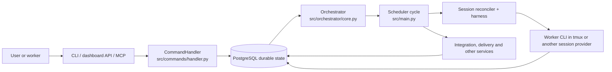
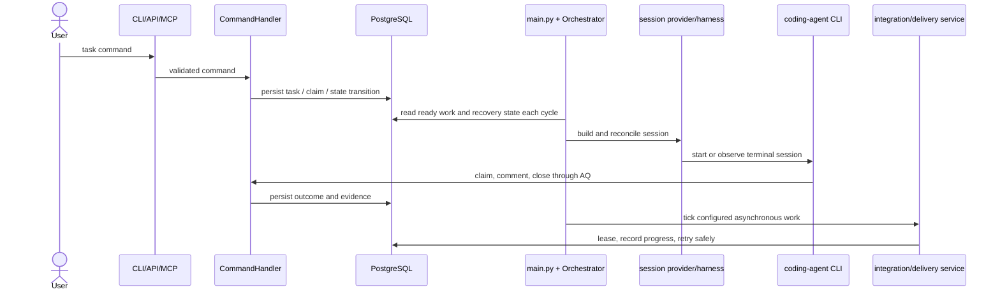

# System architecture

Agent Queue (AQ) is a daemon that turns durable work records into work done by
coding-agent sessions. It is useful when a project needs more than a chat log:
tasks have state, dependencies and ownership; workers can survive a daemon
restart; and integrations can publish completed work under a local policy.

This page describes the architecture that ships today. It is an orientation,
not an operations recipe: use [Getting started](../guides/getting-started.md)
to run AQ and the [task state-machine guide](../guides/task-state-machine.md)
to learn task transitions.

## The short version

The daemon is one long-lived process, composed in
[`src/main.py`](../../src/main.py). It loads configuration, opens and recovers
the durable system through an `Orchestrator`, then keeps a scheduler cycle
running. Commands from the CLI, dashboard API, embedded MCP server and
configured messaging adapter converge on the same command handler and
database-backed state.

The daemon does **not** run coding models in-process. A task normally becomes
a terminal session selected by its profile's harness; the session subsystem
observes and recovers that process. [`src/runtimes/`](../../src/runtimes/)
contains an ABC and an injectable registry for tests and extensions, but
`default_registry()` deliberately registers no production runtime.

The diagram's composition root and scheduler loop are
[`src/main.py`](../../src/main.py); the durable work and scheduling owner is
[`src/orchestrator/core.py`](../../src/orchestrator/core.py); the process
boundary is documented in [Sessions](sessions.md). The supporting API,
command, integration and session modules have their own catalog shards so one
page does not duplicate their reference material.

## Vocabulary and responsibilities

* **Daemon** — the `aq` service process. It owns startup, shutdown, one
  `Orchestrator`, process-wide services and the recurring scheduler loop.
* **Command handler** — the shared command boundary. It validates and applies
  a requested operation; it is not a separate scheduler or database.
* **Orchestrator** — the in-memory coordinator over configuration, database,
  event bus, session reconciliation, watchers and scheduling steps. It is
  initialized and shut down by the daemon.
* **Worker** — an agent session doing a claimed task. A pool worker claims
  work through `aq task claim`; it must use its `.aq/claim.json` proof rather
  than assume it owns a task. See [Sessions](sessions.md).
* **Supervisor** — a configured agent/session that helps coordinate a project
  and receives routed questions. It is an AQ session role, not the daemon and
  not a privileged replacement for a user.
* **User** — the person or service issuing commands, supplying configuration,
  deciding policies, and responding to escalations. The dashboard, CLI and
  API are user-facing surfaces, not independent sources of truth.

The glossary has the shared definitions for [task](../reference/glossary.md#task),
[claim](../reference/glossary.md#claim), [profile](../reference/glossary.md#profile)
and [playbook](../reference/glossary.md#playbook).

## One task, end to end

Consider a project where a user creates a task with a title, acceptance
criteria and a `standard-high` worker class. The input is command arguments;
the output is a durable task record (initially gated or ready), not a process
that has already started.

| Stage | Input | Owner and durable output | What happens next |
|---|---|---|---|
| Command | A user or authorized worker calls an AQ command. | `CommandHandler` applies the command through its domain services and database queries; task state, comments, claim epoch and attachments are stored in PostgreSQL. | The next orchestrator cycle sees the new state. |
| Scheduling | A ready task, dependency/gate results, available profile/session capacity and workspace requirements. | The `Orchestrator` chooses a legal launch or records why it must wait. | A session specification combines the task, profile and harness. |
| Session | The session specification and its workspace attachment. | The session provider starts or observes a terminal process; the reconciler records liveness and terminal outcomes. | The worker edits its assigned workspace and reports/claims through AQ. |
| Completion/integration | A terminal task outcome and the configured project integration policy. | Completion and integration evidence are durable. Services may materialize branches, publish a batch, or leave it awaiting a configured gate. | Later cycles recover pending work safely after interruption. |

For example, after a pool worker claims `docs-42`, the durable claim gives it
an epoch and a workspace. Its harness launches the configured coding CLI. The
worker's result is not trusted merely because text appeared in a terminal:
the session reconciler and completion path record the outcome, while the
project's integration configuration decides whether any branch publication is
attempted. A lost daemon does not turn that claim into an undocumented
success; recovery reads the durable records and re-observes the session.

This is a sequence of contracts, not a promise that every integration is
enabled. The scheduler/session handoff is owned by
[`src/orchestrator/core.py`](../../src/orchestrator/core.py) and the session
implementation is covered by the [sessions module catalog](../reference/modules/sessions.md).
Integration policy and branch publication are explained in
[Integration](integration.md).

## What starts, and in which order

[`run()`](../../src/main.py) is the daemon composition root. Its notable order
is intentional:

1. It removes inherited harness-session markers, marks the process as a
   daemon for the database migration guard, configures early logging, then
   loads and validates configuration. A worker-scoped environment still wins
   the guard, so launching a daemon from a worktree refuses production schema
   migration instead of upgrading it.
2. It creates the `Orchestrator`, its daemon-wide doctor registry, an empty
   runtime registry and one `CommandHandler`. The handler is installed before
   initialization, so the embedded MCP/API and later services share the same
   command boundary.
3. `Orchestrator.initialize()` opens its database-backed subsystems, creates
   recovery/watch services and plugin-dependent components. Only after this
   does the daemon attach the tool registry and start the daemon-owned fleet
   metrics sampler.
4. It creates the configured messaging adapter, installs signal handlers, and
   starts independent messaging and scheduler tasks. If embedded MCP is
   enabled, it starts as a third task and receives health and plan-content
   callbacks from the same daemon state.
5. The scheduler waits up to 120 seconds for messaging readiness, but an
   authentication failure or timeout leaves command/API/MCP and scheduling
   available in degraded messaging mode. A scheduler-cycle exception is
   logged and the next cycle is attempted.

`run_one_cycle()` is deliberately owned by the `Orchestrator`; the thin loop
in [`_run_scheduler_cycles()`](../../src/main.py) supplies cadence, failure
containment and long-cycle diagnostics. See the cycle's numbered phases in
[`src/orchestrator/core.py`](../../src/orchestrator/core.py).

### Extension seams

AQ composes explicit interfaces rather than making every boundary a daemon
global:

| Seam | Supplied at composition | Why it matters |
|---|---|---|
| Messaging adapter | `create_messaging_adapter(config, orch)` | A configured adapter may provide readiness and an optional handler override; a null adapter keeps the core usable without messaging. |
| Command handler | `orch.set_command_handler(handler)` | API, embedded MCP and supported command surfaces operate on the same orchestrator-bound handler. |
| Health and plan callbacks | Passed into the embedded MCP/API app | The HTTP surface reads daemon state without owning a second orchestrator. |
| Tool registry | Installed after `initialize()` | Plugins are initialized first, then their tools become discoverable. |
| Runtime registry | `default_registry(config)` | Tests or extension code can inject `Runtime` classes/singletons. The shipped registry is empty. |
| External delivery | Created only with a usable configured Discord transport | Escalation/digest durable records remain core state even when external delivery is not wired. |

The last two rows are frequently confused. The presence of `RuntimeRegistry`
is **not evidence of in-tree runtime implementations**. AQ's shipped agent
execution path is profiles → harness definitions → session providers; an
in-process runtime is an optional compatibility/extension contract only.

## Ownership, configuration and recovery

The database owns durable facts: tasks, claims, outcomes, sessions,
integration evidence and delivery outboxes. `Orchestrator` owns live
coordination objects and in-memory caches for a running daemon. The daemon
owns process-lifetime objects it composes itself, notably its metrics sampler,
messaging task, scheduler task and optional MCP task. A worker owns only its
active local work and proof-of-claim file; it does not own the global
scheduler or operator database.

| Kind of behaviour | Current meaning |
|---|---|
| **Shipped default** | `default_registry()` has no runtime classes; scheduling retries after a failed cycle; `src._compat` applies its import compatibility shim on `src` import. |
| **Configured local policy** | Configuration selects logging, messaging adapter, whether embedded MCP is enabled, workspace/worktree use, integration policy and external Discord delivery settings. |
| **Optional compatibility** | `src._compat` supplies a minimal `pkg_resources` substitute only when the real package is unavailable, protecting legacy memory dependencies on modern Python/setuptools. Plugin/test code may register runtime classes or singleton runtimes. |
| **Proposed / not shipped as a default** | Plugin-as-runtime discovery is described as a possible future evolution of the registry; it is not currently how the daemon starts workers. |

Common recovery paths follow those boundaries:

* **Messaging login fails or readiness hangs:** the scheduler continues after
  the bounded readiness wait; CLI, MCP and HTTP/API remain usable. Fix the
  configured credentials or adapter separately. A non-auth adapter startup
  exception requests daemon shutdown instead of silently pretending delivery
  works.
* **One scheduler cycle fails:** the daemon logs it and tries the next cycle;
  it does not abandon all scheduling because one reconciliation pass failed.
* **Daemon receives `SIGINT` or `SIGTERM`:** it closes the adapter, cancels
  embedded MCP and child tasks, stops metrics, then asks the `Orchestrator` to
  stop recovery/watch services and close the database in dependency order.
* **Daemon restart:** durable state remains in PostgreSQL. On startup,
  initialization and later reconciliation restore watchers, leases and
  observable sessions rather than inferring success from a vanished process.
* **Legacy dependency import fails on Python 3.12+ or setuptools 82+:** the
  early, idempotent [`src._compat`](../../src/_compat.py) shim supplies the
  narrow symbols old `pkg_resources` consumers require. It is not a package
  manager or a general replacement for setuptools.

## Related pages and source-oriented checks

* [Task state machine](../guides/task-state-machine.md) — task transitions.
* [Worker pools](../guides/worker-pools.md) — capacity and pool workers.
* [Agents and routing](agents-and-routing.md) — profiles and assignment.
* [Sessions](sessions.md) — worker processes, harnesses and recovery.
* [Integration](integration.md) — branch/publish policy and integration state.
* [Messaging](messaging.md) — adapter, digest and escalation semantics.
* [Architecture module catalog](../reference/modules/architecture.md) — all
  modules owned by this page and their focused tests.

Focused source checks are
[`tests/test_main_lifecycle.py`](../../tests/test_main_lifecycle.py),
[`tests/test_health_platform.py`](../../tests/test_health_platform.py),
[`tests/test_runtimes_registry.py`](../../tests/test_runtimes_registry.py) and
[`tests/test_compat.py`](../../tests/test_compat.py). They cover startup and
degraded messaging, health reporting, the registry's injection contract, and
the compatibility shim respectively.
