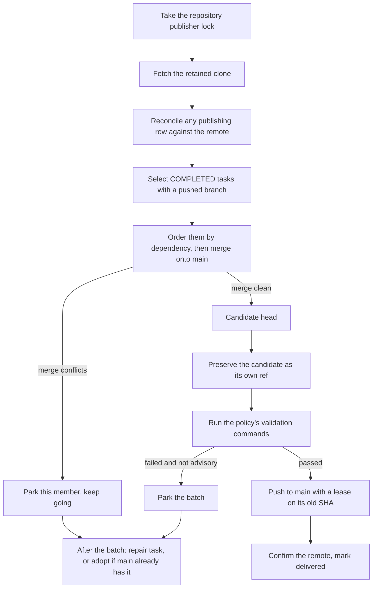

# Integration

How a finished task branch becomes a commit on your default branch: collection,
validation, publication and recovery.

A task closing successfully does **not** mean its work has been delivered. It
means the worker pushed a branch and said it was done. *Integration* is
everything that happens afterwards, and it is a separate, batched, restartable
job the daemon owns.

## Why it exists

A fleet of agents produces finished branches faster than a human can merge
them, and each branch was written against whatever `main` looked like when the
worker started. Something has to decide which branches still apply, prove they
work together, and put them on `main` without losing anyone's commits when a
merge conflicts, a validation fails, or the daemon is killed halfway through a
`git push`.

Integration is that component. Its design commitments are worth stating up
front, because they explain most of the behaviour on this page:

* **Nothing is invented.** Validation evidence records the commands that
  actually ran and their exit codes. When a human accepts work by hand, the
  journal calls it operator acceptance, never a CI attestation.
* **Nothing is discarded.** A conflict parks a batch member; it does not
  delete a branch or rewrite a worker's commits. Every candidate is preserved
  as a ref before it is published anywhere.
* **Every step is restartable.** State lives in PostgreSQL, not in the process.
  A crash mid-publication is reconciled by looking at the remote on the next
  pass.
* **One publisher per repository.** Two daemons, or a daemon and an impatient
  operator, cannot race each other onto the same ref.

## Vocabulary

* **Task branch** — the `aq/<task-id>` branch a worker's commits land on. See
  the [glossary](../reference/glossary.md).
* **Source completion** — a task reaching `COMPLETED` with a pushed branch.
* **Delivery** — that branch's content reaching the default branch.
* **Batch / candidate** — the merge of several task branches that integration
  builds, validates and publishes as one unit.
* **Manifest** — the list of `(task_id, source_sha)` pairs a batch contains.
  It is what makes a delivery auditable.
* **Delivery journal** — the durable record of every batch, its manifest, its
  evidence and its outcome (`development_deliveries`).
* **Parked** — an assembled thing that could not be delivered (a conflict, a
  failed validation) and is retained for a later pass or a human.
* **Integration mode** — the per-project choice of *which* delivery machinery
  runs. `development` is the configured mode on this repository;
  `hierarchy` and `train` are optional stricter modes.

> **Two different settings are both called "integration mode".** The
> per-project `hierarchical_integration_mode` described on this page chooses
> the delivery machinery. The unrelated per-task `integration_mode`
> (`direct` / `pull_request`, defaulting from `integration.default_mode` in
> [`src/config.py`](../../src/config.py)) belongs to the older
> review-and-merge path, and a development-mode project suppresses that path
> entirely — see [Modes](#modes).

## A realistic example

Assumes the daemon is running. Substitute your own project id — the output
below is this repository's own project, read back as it stands. The command is
read-only and safe on any install.

```bash
aq integration status agent-queue
```

```text
{
  "outcome": "status",
  "project_id": "agent-queue",
  "effective_mode": "development",
  "desired_mode": "development",
  "generation": 14,
  "policy": {
    "validation": "focused",
    "commands": ["~/.agent-queue/operator-checks/isolated-tests.py tests/test_development_integration.py"],
    "timeout_seconds": 300,
    "interval_seconds": 300,
    "max_batch_size": 50
  },
  "deliveries": [ … 46 rows … ],
  "ownership": [
    {"ref": "aq/keen-forge", "classification": "reserved", "owner_id": "keen-forge"},
    {"ref": "aq/sharp-orbit", "classification": "stopped_awaiting_preservation", "owner_id": "sharp-orbit"},
    …
  ],
  "blockers": [],
  "ready": true,
  "pending_publications": [],
  "parked": ["c42c31a8-6446-488f-9df4-0920c6b822f7"]
}
```

That output says: this project delivers through development batches; its
policy runs one local validation command with a five-minute timeout every five
minutes; no publication is mid-flight; one delivery is parked and waiting.

One of the delivered rows in that journal looks like this — a real batch that
carried this documentation overhaul's sibling ticket to `main`:

```text
{
  "id": "fb0f1204-41c2-45e8-8489-7c0c860b28db",
  "target_ref": "refs/heads/main",
  "state": "delivered",
  "expected_sha": "a62833d5819ca10179a0ea8f9b793dc6e7bcd7c1",
  "prepared_sha": "a9a10b3183d13f0b0fdec44ab6bbe3b6c4fbdd37",
  "reason": "development batch",
  "manifest": [{"task_id": "solid-grove.12", "source_sha": "0e9f949f…", "parent_task_id": "solid-grove"}, …],
  "evidence": {"kind": "local", "validation": "focused", "checks": [{"command": "…", "exit_code": 0, …}], "conclusion": "passed"}
}
```

`expected_sha` is where `main` was, `prepared_sha` is what was published,
the manifest says whose work is in it, and the evidence says what was run to
believe it. Nothing in that row is a summary of a run that did not happen.

To act on this project rather than read it, see the
[development integration guide](../guides/development-integration.md).

## How a development batch is built

Every sweep is one pass of
[`DevelopmentIntegration.sweep`](../../src/integration/development.py). The
daemon runs it per project on the policy's `interval_seconds` (default 300);
an operator can run it immediately with `aq integration sweep <project>`.



Step by step:

1. **Exclusion.** The sweep takes a PostgreSQL advisory lock keyed by the
   repository id. A second sweep raises `DevelopmentBusy` rather than
   publishing concurrently. Process death releases it; the durable journal is
   what makes an interrupted publication recoverable, not the lock.
2. **Retained clone.** Integration works in its own clone under
   `<data_dir>/development-integration/…` — cloned `--no-checkout` and driven
   by detached checkouts — never in a worker's worktree slot.
   A clone whose `origin` no longer matches the configured repository URL is
   refused.
3. **Reconciliation first.** Any journal row left in `publishing` from a
   previous crash is compared against the real remote: the ref already carries
   the prepared SHA (or a descendant of it) → `delivered`; the ref is still at
   the old SHA → `parked`; anything else → the sweep stops and asks for
   attention rather than guessing.
4. **Candidate selection.** Tasks that are `COMPLETED`, not blocked, belong to
   this repository and have a branch name are candidates. Their branch heads
   are read from **one** `for-each-ref` snapshot of the fetched remote, not
   one network call per task.
5. **Ordering.** Candidates are topologically ordered by their `blocks`,
   `waits-for` and `conditional-blocks` dependencies, so a dependent is never
   merged before its prerequisite. A dependent of a parked task is skipped for
   this batch; so is every sibling under a parent whose earlier child
   conflicted.
6. **Assembly.** Each source is merged with an ordinary merge commit (author
   `Agent Queue <aq@localhost>`). A child of a parent task is first merged into
   a per-parent aggregate ref, which is published on its own so the parent's
   work stays independently reusable, and the aggregate is then merged into the
   batch. A member whose source is already an ancestor of `main` joins the
   manifest without being merged again. Assembly stops at `max_batch_size` members (default 50).
7. **Preservation.** Before validation can reject anything, the candidate head
   is pushed to `refs/heads/aq/development/<project digest>/<head sha>`. No
   worker owns that ref, and it is what lets a failed batch be inspected.
8. **Validation.** See below.
9. **Publication.** See below.
10. **Aftermath.** Parked rows are re-examined once the batch outcome is known
    — see [conflicts and repair](#conflicts-parking-and-repair).

## Validation

The project's `DevelopmentPolicy` chooses one of three levels
([`src/integration/development.py`](../../src/integration/development.py)):

| `validation` | Behaviour |
|---|---|
| `focused` | Runs every configured command in the retained clone. All must exit 0 or the batch is parked. At least one command is required — a `focused` policy with no commands is rejected at configuration time. |
| `advisory` | Runs the same commands and records failures in the evidence, but publishes anyway. |
| `none` | Runs nothing and records `"conclusion": "not_run"`. |

Each command runs under `/bin/bash -c` in its own process group, in the
retained clone, with the daemon's environment, bounded by
`timeout_seconds` (default 300, maximum 3600). A timeout kills the whole
process group and is recorded as exit code 124. The last 8,000 characters of
combined output are kept per command.

Validation is not allowed to change what is being published: if `HEAD` moved
or the working tree is dirty afterwards, the sweep refuses to publish with
*"validation modified the candidate; refusing publication"*.

> **Note.** Because commands run in AQ's clone with the daemon's environment,
> a command like `pytest` only works if its dependencies are installed there.
> Use an absolute interpreter path or a small wrapper script. This repository
> configures exactly that: one wrapper under `~/.agent-queue/operator-checks/`.

## Publication

Publication is the only place integration writes to your default branch, and
it is deliberately narrow
([`DevelopmentIntegration.publish`](../../src/integration/development.py)):

1. A journal row is written **before** the push, in state `prepared`, carrying
   the manifest, the evidence, the target ref, the SHA the target is expected
   to be at, and the SHA about to be published.
2. If the remote has moved off `expected_sha`, the row becomes `parked` with
   reason `base_moved` and nothing is pushed. The next sweep rebuilds against
   the new base.
3. The candidate must contain the current target as an ancestor. A publication
   that would drop history is refused outright: integration only ever adds
   commits on top of what is already there, never rewrites them.
4. The row flips to `publishing`, then the push runs with
   `--force-with-lease=<ref>:<expected sha>` (forty zeroes when the ref must
   not exist yet). The lease is what makes a concurrent write lose instead of
   being silently clobbered.
5. The remote is read back. Confirmed → `delivered`. Not confirmed → the row
   stays `publishing` and the *next* sweep's reconciliation decides, because
   only the remote knows whether the push landed.

A crash at any point leaves a durable row whose state names exactly what is
unknown, which is why recovery never needs a human to guess.

## Conflicts, parking and repair

A member whose merge conflicts is parked with the conflict text as evidence,
the batch continues without it, and independent work still ships. Repair is
deliberately deferred until the whole batch is assembled: a later member may
contain the very fix the earlier conflict needed, and dispatching a worker
mid-assembly would spend tokens repairing something the same batch is about to
resolve.

Once the batch outcome is known,
[`reconcile_parked`](../../src/integration/development.py) looks at every
parked row:

* every source in it is now an ancestor of the accepted head → the row becomes
  `adopted`; nothing else happens.
* otherwise → `ensure_repair` files **one** ordinary task per distinct parked
  content set: id `development-repair-<manifest digest>`, branch
  `aq/development-repair-…`, type `BUGFIX`, three task retries. It is an
  ordinary resumable task on the queue, not a wall-clock repair episode: time
  spent waiting for a worker or a provider does not expire it.

Repair generations are capped at three. Beyond that the candidate stays parked
for a human, rather than starting an unbounded repair chain.

Parked content is not retried automatically while its sources are unchanged: a
worker pushing new commits makes the member eligible again on its own, and
`aq integration sweep <project> --retry` retries unchanged parked content under
the current policy.

## Inputs and outputs

| | |
|---|---|
| **Inputs** | `COMPLETED` tasks with a pushed `aq/<task-id>` branch; their dependency edges; the project's `DevelopmentPolicy`; the current remote state of the default branch. |
| **Outputs** | Commits on the default branch; candidate and per-parent aggregate refs under `refs/heads/aq/development/…`; one journal row per batch, park, adoption, configuration change and preservation; repair tasks for content that could not be merged. |
| **Never outputs** | Rewritten worker history, deleted task branches, synthetic review verdicts, synthetic CI receipts. |

## State ownership

Integration owns durable state in PostgreSQL. Nothing important lives in
process memory: the per-project `next_due` map and the reconciliation loop's
paging cursors are the only in-memory state, and losing them costs one early
sweep and one re-scan.

| State | Where | Written by |
|---|---|---|
| Mode, desired mode, drain flag, generation, policy | `projects.hierarchical_integration_*` | [`controls.py`](../../src/integration/controls.py), [`development.py`](../../src/integration/development.py) |
| Delivery journal (batches, parks, adoptions, cancellations, preservations) | `development_deliveries` | [`development.py`](../../src/integration/development.py) |
| Branch writer fences | `integration_branch_owners` | [`ownership.py`](../../src/integration/ownership.py) |
| Reserved / materialized task branch origins | `task_branch_origins` | [`hierarchy.py`](../../src/integration/hierarchy.py), [`branch_materialization.py`](../../src/integration/branch_materialization.py) |
| Strict-mode batches, candidate revisions, members, repair operations and stages | `integration_batches`, `integration_candidate_*`, `integration_repair_*` | [`candidates.py`](../../src/integration/candidates.py), [`repair.py`](../../src/integration/repair.py) |
| Trusted CI evidence and attestation publications | `integration_check_evidence`, `integration_attestation_publications` | [`ci.py`](../../src/integration/ci.py), [`attestation.py`](../../src/integration/attestation.py) |
| Promotion intents and receipts | `integration_promotion_intents`, `integration_root_intent_members` | [`promotion.py`](../../src/integration/promotion.py), [`main_promotion.py`](../../src/integration/main_promotion.py) |
| Sweep schedule and leases | `project_integration_schedules`, `project_integration_leases` | [`scheduler.py`](../../src/integration/scheduler.py) |
| Rollout audit, history waivers, legacy suppression | `integration_rollout_transitions`, `integration_history_waivers`, `integration_legacy_suppression` | [`controls.py`](../../src/integration/controls.py) |
| Integration events awaiting a playbook | `integration_outbox` | [`outbox.py`](../../src/integration/outbox.py) |
| The retained clone and its refs | `<data_dir>/development-integration/…` and the remote | [`development.py`](../../src/integration/development.py) |

Everything above is per-repository or per-project. There is no global
integration state and no configuration-file source of truth for it: the
project row is authoritative, and `aq integration status` reads it from one
consistent snapshot.

## Modes

`hierarchical_integration_mode` is per project. Every mode is durable state, is
changed only through an authenticated command, and bumps the project's
integration *generation* when it changes.

| Mode | What runs | Status |
|---|---|---|
| `development` | The batched development publisher on this page. | **The configured mode on this repository.** Set with `aq integration develop`. |
| `disabled` | No managed delivery. Task branches are pushed and left for whatever review or merge automation the project configures. | Shipped default for a new project. |
| `observe` | Preflight and readiness reporting only; no managed mutation. | Optional; a staging step before enabling a strict mode. |
| `hierarchy` | Parent-owned delivery branches, child filing, checkpoints, verifier and repair operations. | **Optional compatibility mode, off by default.** |
| `train` | `hierarchy` plus scheduled sweeps that seal a reviewed frontier into a candidate, require trusted CI evidence for it, and promote an exactly tested SHA to `main`. | **Optional compatibility mode, off by default.** |

Development mode also suppresses the older review-and-merge automation for that
project: the `pr-merge-sweep` playbook is skipped and legacy final-review
routing is off ([`src/playbooks/services.py`](../../src/playbooks/services.py)),
and a suppression row records the same decision durably
([`integration_legacy_suppression`](../../src/database/tables.py)). No
per-task reviewer, final reviewer, PR gate or squash is created or required by
this path — and none is created by the shipped default pipeline either.

`aq integration enable` accepts `disabled`, `observe`, `hierarchy` and `train`,
takes the generation reported by `aq integration status` as a compare-and-swap
guard, and requires a reason. Development mode is entered through
`aq integration develop` instead, because it takes a policy rather than a bare
mode. See the [migration guide](../guides/integration-migration.md).

### What the strict modes add

You do not need this section to use AQ. It exists so that the machinery you
can see in `src/integration/` is not mysterious, and so that an install still
running `hierarchy` or `train` can be read about honestly.

In `hierarchy` mode a child task's branch is cut from its parent's delivery
branch rather than from `main`, and claiming is gated on that branch actually
existing ([`hierarchy.py`](../../src/integration/hierarchy.py),
[`branch_materialization.py`](../../src/integration/branch_materialization.py)).
Children are collected into the parent under a durable episode
([`collection.py`](../../src/integration/collection.py),
[`parent_completion.py`](../../src/integration/parent_completion.py)), and each
merge is a crash-recoverable promotion with an exact lease and a receipt
([`promotion.py`](../../src/integration/promotion.py)).

`train` adds the root half: a scheduled sweep seals the reviewed frontier into
an immutable batch ([`scheduler.py`](../../src/integration/scheduler.py)), a
candidate revision is built from its members
([`candidates.py`](../../src/integration/candidates.py)), CI evidence for that
exact candidate must be observed from authenticated GitHub reads and stored as
a trusted receipt ([`ci.py`](../../src/integration/ci.py),
[`attestation.py`](../../src/integration/attestation.py)), failures enter a
bounded repair ladder with real wall-clock stage deadlines and delegate repair
tasks ([`repair.py`](../../src/integration/repair.py)), and only an exactly
tested SHA is promoted to `main`
([`main_promotion.py`](../../src/integration/main_promotion.py)), after which
cleanup and release run independently
([`cleanup.py`](../../src/integration/cleanup.py),
[`release.py`](../../src/integration/release.py)).

That is a lot of machinery, and it is why development mode exists: it keeps the
durable-journal and exact-lease properties while dropping the per-parent
verifier, hosted-CI attestation and wall-clock repair ladder.

## How it works: where the loop lives

Integration is not its own daemon. `IntegrationService`
([`service.py`](../../src/integration/service.py)) is one bounded
reconciliation loop started by the orchestrator
([`src/orchestrator/core.py`](../../src/orchestrator/core.py)), ticking every
five seconds and, in this order: development sweeps (in a background task, so a
long validation cannot stall the rest), branch materialization, sweep
schedules, child collection, candidate CI, repair deadlines, parent CI,
promotion intents, cleanup, drains, branch discards and the outbox.

Each source is paged with its own cursor and each item is isolated: a handler
that raises is logged and its durable row is left retryable, so one bad project
cannot stop the others.

## Common failures and recovery

| Symptom | First command |
|---|---|
| Work is finished but not on `main` | `aq integration status <project>` — look at `parked` and `pending_publications` |
| `blockers: [{"code": "publication_pending"}]` | Wait one sweep; it reconciles against the remote |
| A repair task called `development-repair-…` appeared | Read its description: it names the parked sources |
| Every claim of one task fails "canonical branch is not reserved by this task" | `aq doctor --check integration.stranded_fences` |
| A deleted task's branch is still on the remote | `aq doctor --check integration.branch_discards` |

The full symptom-to-command runbook is
[integration troubleshooting](../guides/integration-troubleshooting.md).

## Related pages

* [Development integration guide](../guides/development-integration.md) — how
  to turn this on, run it and read its output.
* [Integration troubleshooting](../guides/integration-troubleshooting.md) —
  when a delivery is stuck.
* [Switching integration modes](../guides/integration-migration.md) — moving a
  project between development and the strict modes.
* [Sessions](sessions.md) — what a worker is doing before any of this starts.
* [Module catalog: integration](../reference/modules/integration.md) — every
  module in `src/integration/`, one row each.

## Source and tests

Source: [`src/integration/`](../../src/integration/), commands in
[`src/commands/integration_commands.py`](../../src/commands/integration_commands.py),
CLI in [`src/cli/integration.py`](../../src/cli/integration.py), health checks
in [`src/doctor/integration_checks.py`](../../src/doctor/integration_checks.py).

```bash
aq test tests/test_development_integration.py tests/test_integration_service.py
```
