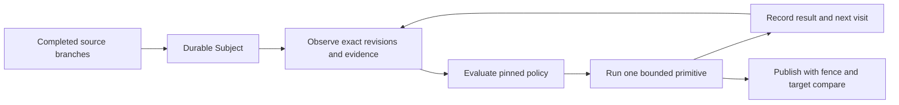

# Integration

A successful task close means the worker pushed its branch and recorded its
result. Delivery means the completed work reached the configured target branch.
The daemon reconciles that work through durable integration Subjects.

## Durable work and ownership

A Subject identifies a source, parent assembly, root batch or promotion. It pins
a reviewed policy artifact and records its phase, exact revisions, writer lease,
branch fence, last decision and next visit time. The reconciler observes current
facts, evaluates the pinned policy and invokes one bounded primitive. Its next
visit resumes from durable state after a restart.

There is one publication owner per repository. Root mutations require the active
Subject's authority and a matching branch fence. Publication checks the expected
target revision and exact CI evidence before pushing. A moved target, unresolved
remote write or human hold causes a recorded wait or gate; it does not authorize
another publisher.


```mermaid
flowchart LR
    A[Completed source branches] --> B[Durable Subject]
    B --> C[Observe exact revisions and evidence]
    C --> D[Evaluate pinned policy]
    D --> E[Run one bounded primitive]
    E --> F[Record result and next visit]
    F --> C
    E --> G[Publish with fence and target compare]
```

## Read current state

```bash
aq integration status agent-queue
aq task show <task-id>
```

Project status reports current mode, configuration generation, designated
repository and live Subjects with their last journal records. Development
projects also report Git delivery evidence for completed work that holds open
successors or containers. Unknown delivery includes its cause; a task close,
historical operation or branch tip is not proof of delivery.

Task blockers show the specific prerequisite, revision or resource that still
holds the task. Use these facts to resolve the Subject's policy gate or producer
failure. Durable visits retry eligible work; the retired manual sweep, flush,
adopt and legacy recovery controls are unavailable.

## Modes and policy

The project's `hierarchical_integration_mode` selects development, hierarchy,
train or disabled integration. All active modes use the reconciler. This setting
is distinct from the task's direct or pull-request delivery preference.

Configure reviewed policy routes through the existing project configuration
command with its expected generation and operator reason. Repository changes are
refused while a live Subject owns that repository; changing configuration does
not rewrite the policy pinned by an existing Subject. See the
[current integration guide](../guides/hierarchical-integration-trains.md).

## Delivery proof and cleanup

Canonical delivery readers bind the exact completion generation, project,
repository and target ref, then prove containment or explicit retained
replacement evidence in Git. They recheck that binding on the database snapshot
before settlement, archive or branch cleanup. A reopened completion invalidates
an older observation. An explicit no-artifact completion releases successors
without inventing a delivered commit.

Shared cleanup preserves stopped writers' unpublished work before releasing an
owner. Obsolete task closes release graph dependencies without republishing the
obsolete source and refuse work still owned by a live Subject. Historical
integration tables and operation journals remain audit data; current controls
do not cancel or adopt their records.

## GitHub access during delivery

GitHub API operations and authenticated Git transfer use the daemon's selected
credential source. Install GitHub CLI (`gh`) on the daemon host in either mode.
Without `integration.github_app`, AQ uses that OS user's existing `gh` login or
token (`GH_TOKEN`, then `GITHUB_TOKEN`, then stored login). With an App
configured, AQ supplies a repository-scoped installation token for each
AQ-owned `gh` call and isolates Git transfer credentials. It does not overwrite
the stored login, expose the token to worker shells or retry an App failure
with a PAT or SSH key. See [configuration](../reference/configuration.md#github-credentials)
for setup and the daemon restart boundary.

The credential only authorizes access to a repository. Task and project scope,
branch ownership, exact revisions, leases, CI evidence and integration trust
still decide whether AQ may publish. Strict-mode App attestation retains its
trust manifest, producer identity and hosted-variable checks; existing-login
mode retains its policy-derived checks. The shared GitHub client and runner
are mapped in the [projects and workspaces module catalog](../reference/modules/workspaces.md#git-boundaries).

App-backed worker and integration delivery are implemented for an already
registered, authorized GitHub repository. App-only onboarding by URL can
validate access, but its clone step remains unavailable in this staged
migration. The final removal of compatibility clients and a live disposable
private-repository acceptance run are still outstanding; see the
[design and acceptance plan](../specs/github-access.md#11-verification-and-acceptance).

## Commit identity

Every commit AQ makes for a project carries one identity: the project's override
from Project Settings, else the installation default chosen at `aq install` (or
later with `aq system config git-identity`), else the documented fallback
`Agent Queue <agent-queue@localhost>` while none is chosen. Worker sessions get
it through `GIT_AUTHOR_*` / `GIT_COMMITTER_*`, and daemon-side merges,
checkpoints and integration commits resolve it the same way. Merges keep the
original authors and commit as the project's identity. Every AQ publication,
whether a worker's `aq git push` or the close pipeline's own push, refuses new
commits committed as anyone else. It reports kept authors without blocking
them. A pool session launched under an older identity is retired at
its next claim. See [Git commit identity](../specs/git-identity.md).

## Code and further reading

* [Subject model](../../src/integration/subjects.py) and
  [reconciler](../../src/integration/reconciler.py).
* [Root runtime](../../src/integration/root_runtime.py),
  [parent runtime](../../src/integration/parent_runtime.py) and
  [development runtime](../../src/integration/development_runtime.py).
* [Git delivery observer](../../src/integration/delivery_observer.py) and
  [shared receipt records](../../src/integration/records.py).
* [Integration troubleshooting](../guides/integration-troubleshooting.md).
* [Module catalogue](../reference/modules/integration.md).
