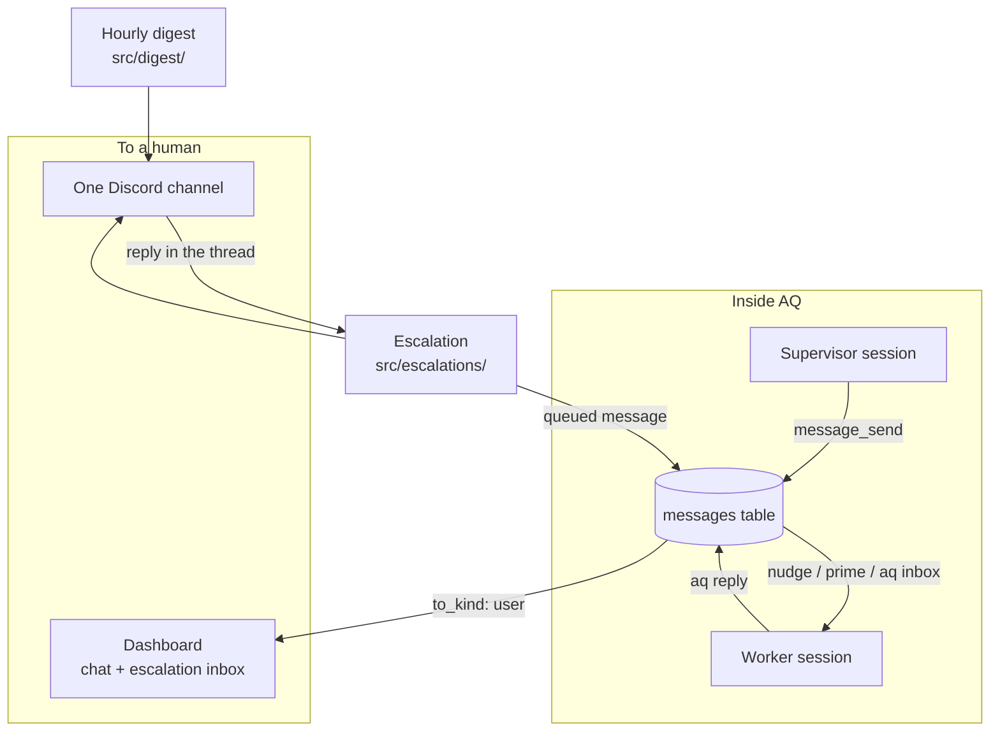
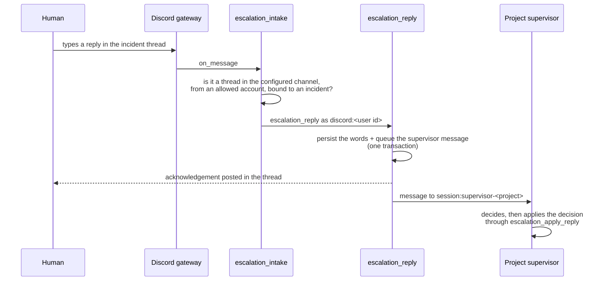

# Messaging, digests and escalations

How text moves in and out of Agent Queue: messages between the daemon, its
workers and you; one short activity digest an hour; and a durable escalation
thread whenever a machine needs a human to decide something.

## Why it exists

A fleet of coding agents generates two very different kinds of communication,
and AQ keeps them apart on purpose.

The first is **work traffic**: a supervisor telling a worker to try something
else, a worker asking a question, an operator answering it. That is
point-to-point, it must survive a session dying, and nobody should have to
watch a chat window for it. AQ stores it as rows in a queue and delivers it
into the recipient's terminal when the recipient is in a state to read it.

The second is **attention traffic**: the small amount that a person genuinely
has to see. AQ has exactly two shapes for it — a routine hourly summary that
stays silent when nothing happened, and an escalation that names one decision
and waits for an answer. Both go to one configured Discord channel and nowhere
else.

> **Discord is notification-only.** There are no AQ slash commands, no task
> controls, no buttons and no per-project channels. The six former slash
> commands were retired and the control views, the notification handler and
> the Discord command mirror were deleted; the dashboard and the `aq` CLI own
> every read and control surface now. The one thing Discord can still send
> *into* AQ is a reply typed in an escalation thread. See
> [what Discord no longer does](#what-discord-no-longer-does).

## Vocabulary

Skim the [glossary](../reference/glossary.md) for the rest; these are the
terms this page leans on.

| Term | Meaning here |
|---|---|
| **Message** | One durable row addressed to a session, a task, a profile or the user. |
| **Recipient kind** | Which of those four a message is addressed to; it decides how delivery happens. |
| **Nudge** | Text typed into a live session's input line and submitted, the way a human would. |
| **Prime** | The context an agent is given at the start of a task (`aq prime`); pending messages ride in with it. |
| **Supervisor** | A long-lived session that owns a project's judgement calls, addressed as `supervisor-<project-id>`. |
| **Digest** | The periodic Discord activity summary — one message, silent when nothing durable happened. |
| **Escalation** | A durable incident that needs a human decision; it gets one channel post and one thread. |
| **Delivery** | A row in an outbox recording one intended external send, and what happened to it. |
| **Transport** | The narrow port that actually talks to a chat platform. Today there is one: Discord. |

## The three lanes



Three things to take from the picture:

* the **message queue** is the substrate — the escalation path ends by writing
  into it, rather than by poking a process;
* the **digest** and **escalations** share one channel and one transport but
  keep separate outboxes, so an outage in one cannot stall the other;
* the only arrow pointing back *into* AQ from Discord is a reply inside an
  escalation thread.

## A realistic example

> Assumes the daemon is running, `messages.enabled` is true (it ships enabled)
> and you are inside a worker session so `$AQ_SESSION_ID` is set. Nothing here
> touches another session's mailbox.

Queue a message to your own session, read it, answer it, and consume it:

```bash
aq message send --to "session:$AQ_SESSION_ID" \
  --from-kind session --from-id "$AQ_SESSION_ID" \
  --project agent-queue \
  --subject "Docs example" --body "Reply here when you see this."
```

```text
Message queued: msg-c8555439f8134d8f869bbabe7c109997 →
session:ac5bb8c6-ca71-484d-827b-5dd8fcc93726
```

```bash
aq message inbox --to "session:$AQ_SESSION_ID"
```

```text
              Inbox — session:ac5bb8c6-ca71-484d-827b-5dd8fcc93726
┏━━━━━━━━━━━━━━━━━━━━━━━━━━━━━━━━━━━━━━┳━━━━━━━┳━━━━━━━┳━━━━━━━┳━━━━━━━┳━━━━━━━┓
┃ ID                                   ┃ From  ┃ To    ┃ Subj… ┃ Body  ┃ State ┃
┡━━━━━━━━━━━━━━━━━━━━━━━━━━━━━━━━━━━━━━╇━━━━━━━╇━━━━━━━╇━━━━━━━╇━━━━━━━╇━━━━━━━┩
│ msg-c8555439f8134d8f869bbabe7c109997 │ sess… │ sess… │ Docs  │ Reply │ queu… │
└──────────────────────────────────────┴───────┴───────┴───────┴───────┴───────┘
```

```bash
aq reply msg-c8555439f8134d8f869bbabe7c109997 "Seen — closing the loop."
```

```text
Replied to msg-c8555439f8134d8f869bbabe7c109997 (reply
msg-eb4b28932e244b258ccdbf0d68965760)
```

The reply is itself a message row addressed back to the sender, so both are now
in the mailbox. Clean up by consuming them the way the harness hook does —
`--inject` marks each row delivered and prints it:

```bash
aq inbox --inject
```

```text
[msg-c8555439f8134d8f869bbabe7c109997 from session:ac5bb8c6-…] Docs example
Reply here when you see this.

[msg-eb4b28932e244b258ccdbf0d68965760 from session:ac5bb8c6-…]
Seen — closing the loop.
```

```bash
aq message inbox --to "session:$AQ_SESSION_ID"
```

```text
No pending messages for session:ac5bb8c6-ca71-484d-827b-5dd8fcc93726.
```

That is the whole protocol an agent needs: `aq inbox` to see what is waiting,
`aq reply <id> "…"` to answer, `aq message send` to raise something. The
canonical human recipient is `user:dashboard`.

## Inputs and outputs

| Lane | Input | Output |
|---|---|---|
| Messages | `message_send` (`aq message send`), a playbook's `message_send` step, an escalation reply | A row in `messages`; a nudge typed into a session, a block in `aq prime`, or a `message.sent` event the dashboard renders |
| Digest | Durable evidence recorded by other subsystems — completions, attempt starts, progress comments, `pr_url` | At most one Discord message per interval, ≤1,200 characters, or a persisted silence |
| Escalation | `escalation_create` from a supervisor or trusted core source; `aq question escalate` | One channel post, one thread, and later an acknowledgement, relay or resolution in that thread |

### Recipient kinds, and what each one means

`to_kind` is not decoration: it selects the delivery policy in
[`src/messages/delivery.py`](../../src/messages/delivery.py).

| `to_kind` | `to_id` looks like | How it is delivered | Parked if undeliverable? |
|---|---|---|---|
| `session` | `supervisor-agent-queue`, or a session name | Nudged into the live terminal; a supervisor address is woken if asleep | Yes — after 24 h it is re-addressed to the sender |
| `task` | a task id | Rides into the next `aq prime` for that task | No — it waits for the next session |
| `profile` | a profile id such as `worker-deep-high-claude` | Consumed by `aq inbox` / prime; the engine never touches a session for it | No |
| `user` | `dashboard` | Marked delivered immediately and emitted as `message.sent` for the dashboard chat | No |

Senders (`from_kind`) are `session`, `user` or `system`. A message whose
`project_id` is null is system chat and requires a global administrator.

## How a message reaches a worker

Every orchestrator cycle (once per `messages.delivery_interval`, five seconds
by default) the daemon runs one delivery pass. For each recipient with pending
rows it asks the session runtime a single coarse question through
[`src/messages/session_lens.py`](../../src/messages/session_lens.py) — *what
is this recipient doing right now?* — and acts on the answer:

| Activity | Meaning | What the engine does |
|---|---|---|
| `idle` | Live and quiet | Renders the batch as one nudge and types it in |
| `busy` | Live and mid-turn (output within the last 30 s) | Skips this pass; the prompt-boundary `aq inbox` hook will catch it |
| `sleeping` | A wake-able supervisor with no live session | Cold-starts the supervisor, then nudges |
| `absent` | No live session, and the messenger may not spawn one | Leaves it pending; a `session` recipient is parked after 24 h |

Three delivery paths therefore exist, and each stamps the row's `via` column so
you can tell them apart afterwards: `nudge` (typed into a live terminal),
`prime` (rendered into a starting agent's context by
[`src/prime/sections.py`](../../src/prime/sections.py)), and `inject` (claimed
by `aq inbox --inject` at a prompt boundary). All three compare-and-set the
same row, so a racing nudge and a racing inject can never both deliver it.

If a delivered message goes unanswered past `messages.reply_timeout` (120 s by
default) and the recipient's transcript shows a completed assistant turn since
delivery, the engine materialises that turn as a reply with
`via="transcript_tail"`. This is a convenience for agents that answered in
prose instead of running `aq reply`; it is deliberately never applied to an
`agent_question` or `task_recovery` row, because those have explicit commands
and a fabricated answer would be treated as a decision.

## The hourly digest, in one paragraph

Once per interval the daemon reserves a window row, asks the database what
durably happened in it, and either renders one short message or records why it
stayed silent. Only four things count as evidence — a task completion, an
attempt that started, a task comment explicitly marked as progress, and a
`pr_url` becoming available — plus a count of tasks with a live, non-stale
attempt right now. Heartbeats, `updated_at` churn, retried notifications and
elapsed time are not progress and never wake a window. The walkthrough,
including how to preview one without sending it, is in
[Escalations and the hourly digest](../guides/escalations.md).

## When a machine needs a human

An **escalation** is a durable incident: a project supervisor has decided it
cannot proceed without a person, and has recorded what is blocked, what it
already tried, and exactly what decision it needs. That record lives in the
database and is visible in the dashboard whether or not Discord is configured
at all.

Delivery is a thin renderer over it: one post in the configured channel, one
thread hanging off that post, and every follow-up inside that thread. The
reply path is the interesting half, because it is the only way words travel
from a chat platform into AQ's state:



Four properties of that path are worth knowing before you rely on it:

* **Correlation is durable, not clever.** The thread is matched against the
  confirmed receipt stored on the incident's root delivery — never against a
  thread name or a task id — so it survives a restart, a reconnect and a
  second daemon.
* **Identity comes from the gateway.** The author is the account Discord
  authenticated, checked against `discord.authorized_users`, and handed to the
  core as `human:discord:<id>`. A field in the message body claiming to be a
  human, an actor or a project is refused.
* **The reply decides nothing by itself.** It is evidence. Resolving a gate,
  retrying a task or answering a question is the supervisor's call, made with
  `escalation_apply_reply`, which binds the reply to one target and one
  idempotency key.
* **Refusals are silent.** The channel is shared with people; a message that
  does not correlate is dropped without an answer, because replying to every
  unrelated line would turn the channel into a chatbot.

## What Discord no longer does

These are removed, not merely discouraged. If a page, prompt or habit still
tells you to use one, it is out of date.

| Retired | Do this instead |
|---|---|
| The `/status`, `/tasks`, `/explain`, `/peek`, `/gates` and `/attach` slash commands | `aq task list`, `aq task explain`, `aq session peek`, `aq task gate-list`, or the dashboard |
| Creating or controlling tasks from Discord | The `aq` CLI, the MCP tools or the dashboard |
| Per-project channels, channel auto-creation and channel lookup helpers | One channel, set as `discord.channel_id` |
| The lifecycle notification feed (task started / failed / PR opened cards) | The dashboard's live event stream, and the hourly digest for the summary |
| Interactive approval buttons and gate views in Discord | The dashboard, `aq task gate-resolve`, and escalation threads for decisions |

Startup still *unregisters* the six retired command names so a stale
registration cannot linger
([`src/discord/slash_commands.py`](../../src/discord/slash_commands.py)), and a
one-way cutover pass converts pre-existing questions, gates and task threads
into escalation identities before inbound routing goes live
([`src/discord/cutover.py`](../../src/discord/cutover.py)).

The `notify.*` event family survives and is not a Discord feature: those events
feed the dashboard's WebSocket stream and any plugin that subscribes
([`src/notifications/events.py`](../../src/notifications/events.py),
[`src/api/websocket.py`](../../src/api/websocket.py)). What was deleted is the
Discord consumer that turned them into channel posts.

## State ownership

| State | Written by | Lives in |
|---|---|---|
| Message rows, replies, delivery stamps | `message_*` commands and [`MessageDeliveryEngine`](../../src/messages/delivery.py) | `messages` table |
| Escalation incidents and their immutable message history | `escalation_*` commands | `escalations`, `escalation_messages` tables |
| One row per intended escalation send, with its receipt | [`EscalationDeliveryService`](../../src/escalations/dispatch.py) | `escalation_deliveries` table |
| One row per digest window, sent or suppressed | [`DigestScheduleService`](../../src/digest/dispatch.py) | `digest_windows` table |
| Channel, digest and escalation settings | You, via the config file or Settings → Messaging | `~/.agent-queue/config.yaml`, `discord:` section |
| Which account may reply, and who may be mentioned | You | `discord.authorized_users`, `discord.escalation.mention_user_ids` / `mention_role_ids` |

Nothing in this subsystem keeps delivery state in memory. Every "have we
already said this?" question is answered from a durable row: the outbox's
unique `dedup_key` for an escalation, the window key for a digest, the
`(transport, external_message_id)` uniqueness for an inbound reply.

## Common failures and recovery

| Symptom | Diagnose | Fix |
|---|---|---|
| `messages are disabled (messages.enabled=false)` from any message command | `aq system get-config` | Set `messages.enabled: true`; it ships enabled, so this is a local override |
| `out of scope: message_list` (or `digest_status`, `escalation_list`) inside a worker session | Nothing is wrong — a worker token may read its own mailboxes only | Run the command from an operator shell or the dashboard |
| A message to a session is never delivered | `aq message list --to-kind session --to-id <name>` and check `delivered` | The target is `absent`; after 24 h a `user`-sent row is re-addressed back to the sender as `[parked] …` |
| Nothing is posted in Discord at all | `aq digest status` — check `settings_errors`, `warnings` and `cutover` | Usually `discord.channel_id` is unset, or the cutover pass has not reported `complete` |
| The channel is quiet but work is happening | `aq digest preview` and read `suppression_reason` | `idle_only` and `already_reported` are correct silence; `all_filtered` means `discord.digest.project_ids` excludes the work |
| A delivery is stuck as `unknown` | `aq escalation get --escalation-id <id>`, or `delivery_health` in `aq digest status` | An external send was ambiguous and could not be reconciled; AQ refuses to repost. Read the thread, then resolve or re-raise the incident deliberately |

## Related pages

* [Escalations and the hourly digest](../guides/escalations.md) — the
  walkthrough: configuring the channel, previewing a digest, answering an
  incident, and the full delivery contract.
* [Sessions](sessions.md) — what `idle`, `busy`, `sleeping` and `absent`
  actually mean, and why a nudge is typed rather than injected.
* [Glossary](../reference/glossary.md) — the terms this page assumes.
* [Module catalog: messaging, digests and escalations](../reference/modules/communications.md)
  — every module named here, one row each.
* [Discord migration runbook](../guides/discord-migration.md) — the operator
  procedure for an installation that predates the single-channel model.

## Source and tests

The implementation is
[`src/messages/`](../../src/messages/),
[`src/messaging/`](../../src/messaging/),
[`src/notifications/`](../../src/notifications/),
[`src/digest/`](../../src/digest/),
[`src/escalations/`](../../src/escalations/) and
[`src/discord/`](../../src/discord/). The spec behind the current shape is
[the Discord simplification implementation spec](../superpowers/specs/2026-09-08-discord-simplification-implementation.md).

```bash
aq test tests/test_message_delivery.py tests/test_session_lens.py \
  tests/test_digest.py tests/test_escalation_delivery.py tests/test_escalation_intake.py
```
