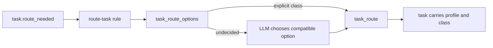

# Playbooks V2

Playbooks are AQ's event-driven automation: a Markdown policy is compiled into a typed, immutable graph, activated deliberately, and then produces durable runs when matching events arrive.

## Why they exist

Some work should happen consistently without putting policy into a daemon branch: route an unassigned task, turn an approved specification into a task proposal, or pause until a person makes a decision. A Playbook V2 makes that policy inspectable. It is a graph of typed steps, not an agent conversation that must be inferred after the fact. The engine records the artifact, state changes, waits, and step receipts so an operator can see both what was configured and what actually happened.

## Vocabulary

* **Source** is the Markdown file in the vault. Its YAML frontmatter states an id, scope and triggers; its body is human-readable policy. See [source parsing](../../src/playbooks/authoring.py).
* **Semantic body** is the proposed JSON `rules` and `steps` graph. AQ supplies source identity, version and live dependency fingerprints rather than trusting those values from the proposal. See [proposal construction](../../src/playbooks/proposal.py).
* **Artifact** is the canonical, SHA-256-addressed V2 JSON definition. It has typed rules, seven possible step kinds, and the command/profile contracts it was compiled against. See [the definition model](../../src/playbooks/definition.py).
* **Activation** selects one artifact at a system, project, or agent-type scope and may enable or disable it. An artifact can exist without being active. See [activation health](../../src/playbooks/activation.py).
* **Run** is one durable execution of one matching rule, pinned to the artifact hash it started with. Its mutable snapshot, receipts and waits are separate from the immutable artifact. See [run state](../../src/playbooks/run_state.py).
* **Human gate** is a durable, operator-resolved decision checkpoint. It can cause an event or resume a playbook wait; it is not a task dependency. A dependency controls whether a task is ready, whereas a gate waits for a decision and may be attached to several tasks.

## A realistic example: route a new task

AQ ships a reviewed system bundle for `default-assignment-routing`. On a new data directory, the required-playbook reconciler imports and activates that reviewed bundle if the system activation does not already exist; it never overwrites an operator's existing activation. The reviewed policy listens for `task.route_needed`, obtains valid routing options, chooses a compatible class/profile, and calls `task_route`. The orchestrator emits that event only when a task lacks the worker-facing `intelligence_class`, `profile_id`, or both. [The current shipped source](../../src/prompts/default_playbooks/default-assignment-routing.md), [reviewed bundle](../../src/prompts/reviewed_playbooks/default-assignment-routing/), and [required reconciler](../../src/playbooks/required.py) are the evidence for those claims.



The input is an event containing at least the task and project identifiers. The output is either a routed task or a failed, inspectable run. The current shipped Markdown source recommends `standard-high` for ordinary implementation and coordinated changes, reserving `deep-high` for a specifically justified exceptional problem. That is a **shipped source policy**. The required activation instead runs the immutable reviewed source/artifact recorded in its bundle; inspect that bundle and its active hash rather than assuming it changed with the Markdown source. A project can use a project-scope copy with a different policy.

The following read-only command was run while writing this page; it shows the exact validation interface without modifying a vault:

```bash
aq playbook v2-validate --help
```

```text
Usage: aq playbook v2-validate [OPTIONS]

  Validate an immutable Playbook V2 JSON artifact inside the vault against the
  strict model, registered command contracts, profiles, and event schemas.
  Read-only; never installs or activates.

Options:
  --path TEXT  Vault-relative or absolute path to a V2 artifact JSON file.
```

## Inputs and outputs

A rule has one event trigger, an optional typed guard, and an entry step. Triggers can use an equality/membership filter. Within a run, values resolve from the triggering event, the durable run context, prior declared bindings, and a `foreach` item. Validation rejects unavailable names, invalid event paths, incompatible values, unreachable steps, unsafe loops, undeclared outputs, unsupported command outcomes, excessive schemas, and capability violations rather than guessing that they are safe. [Expressions](../../src/playbooks/expressions.py) and [validation](../../src/playbooks/validation.py) implement these checks.

The V2 step vocabulary is deliberately closed:

| Step | Input / output purpose |
|---|---|
| `command` | Calls a registered AQ command with typed inputs and follows its declared outcomes. |
| `llm` | Calls the direct LLM path under a profile, JSON output schema, bounded budget, and optionally narrowed tool policy. |
| `agent_task` | Creates and optionally waits for a delegated task; child capability policy is an intersection, never an escalation. |
| `decision` | Selects an edge from typed conditions plus an explicit default. |
| `wait` | Suspends for an event, a human resolution, a child task, or a timer. |
| `foreach` | Iterates a bounded collection and aggregates its declared result. |
| `terminal` | Ends the rule as `completed`, `failed`, `blocked`, or `cancelled`. |

Live, dry-run, and shadow modes use the same graph and validator. Dry-run and shadow executors report command/AI/delegation/wait behavior without performing live side effects. The executor registry is [explicit](../../src/playbooks/executors/__init__.py), so a newly introduced step cannot silently run in an unsafe mode.

## Playbook commands

A `command` step is the only way a playbook changes durable state, and the set of commands it may call is closed. [`CONTRACTS`](../../src/commands/contracts/registry.py) registers each one with a typed argument model, a typed result, named outcomes, the capability a caller's policy must grant, and machine-readable effect clauses. Three surfaces read that single registry, so none of them can drift from it or from each other.

**The reference section.** [Playbook commands](../reference/playbook-commands/README.md) is one page per registered command. The block between the `aq:generated` markers — title, summary, parameters, result fields, outcomes and the execution contract — is written from the registry by [`scripts/gen-command-docs.py`](../../scripts/gen-command-docs.py); everything outside the markers is hand-written prose explaining what the command is for, how it works internally, what it persists, and how it fails. Two families share one state machine and are described once on the index rather than restated per page: [the escalation incident lifecycle](../reference/playbook-commands/README.md#the-escalation-incident-lifecycle) and [the integration operation model](../reference/playbook-commands/README.md#the-integration-operation-model). `aq test tests/test_command_docs.py` is the drift guard — it fails when a registered command has no page, a page names a command that is no longer registered, or a generated block is stale.

**The catalog command.** `aq playbook commands` returns the same registry as data: name, title, summary, documentation URL and the parameter JSON Schema for every command. It reads no vault and touches no run, and it is what the dashboard calls to build its links.

**The documentation link.** A command's page URL is derived once, from the `docs.base_url` setting, as `<docs.base_url>reference/playbook-commands/<command_name>.md` ([`src/docs_urls.py`](../../src/docs_urls.py)). It is never copied into a contract, and presentation metadata is excluded from the contract fingerprint, so pointing `docs.base_url` at a fork or a mirror does not invalidate artifacts compiled against those commands. The dashboard carries it to two places: selecting a command node in a playbook graph shows a **Documentation** link in the side pane, and in a playbook's rendered source preview a backticked command name becomes a link to that command's page. [Command contracts](../reference/cli/contracts.md) documents the contract layer underneath both.

## State ownership

| State | Owner and location | What changes it |
|---|---|---|
| Authored policy | Vault Markdown | An operator/editor writes source; `update-source` supports a source-hash compare-and-swap. |
| Review bundle | Vault bundle directory | `v2-import` verifies exact source, artifact, digest, and manifest metadata before storing its artifact. |
| Artifact bytes | Content-addressed compiled-artifact store plus artifact record | Proposal/import path writes canonical bytes atomically; artifacts are immutable. |
| Active policy | Durable `playbook_activations` row | `activate` chooses an artifact and `set-enabled` controls delivery. Health is recomputed from live contracts and profiles. |
| Run progress | Durable V2 run snapshot and step receipts | The engine advances with versioned transaction boundaries; each run remains pinned to its starting artifact. |
| Suspensions and held events | Durable playbook waits and pending-event records | The wait scheduler and event dispatcher claim/resume them; operators can inspect or resolve held events. |

The in-process [EventBus](../../src/event_bus.py) owns subscriptions only, not a durable event log. It adds `_event_type` and an `event_id`, validates registered payloads by default, and dispatches subscribers sequentially. In development an invalid payload raises; in non-development environments it is warned about and still delivered. `src/event_schemas.py` is the registry that makes source-event references checkable.

## Author, validate, import, and activate

Author the Markdown source in the vault first. Frontmatter must include `id`, `scope`, and a non-empty `triggers` list. Backticked identifiers in the source grant the compiler the names it may place in the semantic graph; this prevents a proposal from smuggling in a command or event path the source never authorized.

For a normal reviewed workflow, the sequence is:

1. Read the authoritative source with `aq playbook get-source` and preserve its hash.
2. Prepare a semantic JSON file containing only `rules` and `steps`; run `aq playbook v2-propose --playbook-id <id> --semantic-body-path <vault-path>` to obtain a reviewable proposal. This read path does not persist or activate anything.
3. Review the exact bundle, then use `aq playbook v2-import --path <bundle-dir>`. Import validates source and canonical artifact bytes, contracts, profiles, and event schemas, but it still does not activate.
4. Check `aq playbook activation-health --playbook-id <id>` and deliberately run `aq playbook activate --playbook-id <id> --artifact-sha256 sha256:<64-hex>`. Activation refuses invalid or incompatible artifacts.
5. Use `aq playbook dry-run --playbook-id <id> --event '{...}'` for a no-side-effect trace, then inspect real executions with `list-runs`, `inspect-run`, and `run-overlay`.

`update-source` is a separate convenience path: it atomically writes full Markdown and compiles synchronously. If compilation fails, the previous compiled version stays live. It is not a shortcut around deliberate activation. The exact flags are documented by the [CLI command reference](../reference/cli/commands.md#aq-playbook), and the command implementation is [PlaybookV2Commands](../../src/commands/playbook_v2_commands.py).

> **Warning.** `v2-import` is operator-only and `activate` changes running policy. Test artifacts in a disposable project or vault before activating a policy that can create tasks or mutate operational state.

## Gates, waits, and dependencies

A V2 `wait` with `wait_kind: human` has a closed `outcomes` vocabulary. The eventual decision must be one of those declared values; otherwise the engine records a contract violation instead of inventing an undisplayed branch. Event, task, and timer waits have their own result vocabulary. The pause, receipt, and wait registration commit together, and pending-event matching closes the race where an event arrives while a run begins waiting. [Wait execution](../../src/playbooks/executors/wait.py) and [wait records](../../src/playbooks/waits.py) implement this boundary.

The default pipeline source illustrates a different use of a human gate: `proposal.ready` creates a durable `human` gate and a later filtered `gate.resolved` event commits the approved task batch. It does **not** mean a task waits for another task, and the current default source explicitly does **not** create automatic per-task reviewers, final reviewers, or review/PR gates. See [default-pipeline.md](../../src/prompts/default_playbooks/default-pipeline.md) and [gate commands](../../src/commands/gate_commands.py).

## Shipped policy, local policy, and compatibility

**Shipped required defaults.** `default-assignment-routing` and `provider-usage-probe` are the IDs in `REQUIRED_SYSTEM_PLAYBOOK_IDS`. AQ seeds their reviewed bundles, creates only a missing system activation — an existing one is durable operator state and is never overwritten — and checks that each is enabled and healthy. An inactive required router retains `task.route_needed` events rather than dropping them. [Required policy handling](../../src/playbooks/required.py) is the source of truth.

**Shipped shared defaults.** `blocked-task-escalation` and `default-pipeline` are the IDs in `DEFAULT_SYSTEM_PLAYBOOK_IDS`. They are activated once, on the first start that finds no activation for them, and are never re-enabled after an operator disables one — so unlike the required router they are not a readiness requirement. The default pipeline describes spec approval → spec-ingest task and proposal-ready → human gate → task-batch commit. It is not the retired review/triage workflow.

**Shipped sources, not necessarily active policy.** Integration lifecycle sources and the agent-queue project sources ship as Markdown policies, and `ci-main-sentinel` also ships its reviewed bundle so an operator can import it. Their presence does not prove an installation activated them: a project-scoped policy is always activated per project, by hand.

**Shipped bundles reach an install only through the vault.** `v2-import` refuses every path outside the vault root, so a reviewed bundle is importable only once seeding has written it to `vault/reviewed-playbooks/<id>/`. Seeding copies every directory under [`src/prompts/reviewed_playbooks/`](../../src/prompts/reviewed_playbooks/) and *refreshes* one whose bytes have gone stale, which is how a bundle rebuilt against a changed command contract reaches an existing install. It rewrites only the five recording files and leaves anything else in that directory alone; operator variants belong under their own id.

**Configured local policy.** Activations are durable operator state. A project activation, enabled bit, profile availability, integration policy, and a vault copy can differ from repository sources. Ask `aq playbook activation-health`, `aq playbook list`, and `aq playbook artifacts` rather than inferring policy from a checked-out Markdown file.

**Optional compatibility.** V1 is not an execution runtime: the V1 compiler/runner/manager/store were removed. The V2 lowering path can translate supported legacy pipeline-shaped source into a V2 semantic body, and workflow-stage/human-review resume handlers remain compatibility bridges for durable legacy workflow references. They should not be used to describe V1 as the default. [Pipeline lowering](../../src/playbooks/pipeline_lowering.py), [playbook resume handler](../../src/playbooks/resume_handler.py), and [workflow-stage handler](../../src/workflow_stage_resume_handler.py) show the boundary.

**Proposed work.** Historical specifications under `docs/specs/` and `docs/superpowers/` are design records, not operating instructions. This page only describes code and shipped sources in this checkout.

## Common failures and recovery

| Symptom | Meaning | Recovery |
|---|---|---|
| A trigger appears to do nothing | No enabled, healthy artifact could execute it, or its filter/guard did not match. | Run `aq playbook activation-health`, then `aq playbook pending-events`; use `pending-event-action --action dispatch` only after fixing the cause. |
| Activation is `stale_contract` | A referenced command contract or profile capability fingerprint changed after compilation. The activation stops executing; it does not run the old behaviour. | For a bundle AQ ships, restart the daemon so seeding refreshes `vault/reviewed-playbooks/<id>/`, then `aq playbook v2-import --path reviewed-playbooks/<id>` and `aq playbook activate --playbook-id <id> --artifact-sha256 sha256:<64-hex>` — the artifact carries its own scope, and `--enabled` defaults to true. For local policy, re-propose/review/import against current contracts, inspect `artifact-diff`, and activate the compatible artifact. |
| Activation is `invalid` or `question_required` | Validation errors or unresolved compile questions block execution. | Run `v2-validate` on the artifact, correct the source/semantic body, and repeat review/import. |
| An artifact is `unavailable` | The activated artifact bytes are missing, unreadable, or fail their hash check. | Restore/re-import the exact reviewed bundle; do not replace bytes under the same hash. |
| A run paused unexpectedly | A `wait` step or child task requires an external event/decision. | Inspect `run-overlay` for the pinned artifact and receipts; resolve the declared gate or use `aq playbook resume` where the policy expects manual input. |
| A workflow is left after restart | Its owning run/session no longer lines up with durable workflow state. | The startup/periodic orphan recovery reconciles it; inspect the workflow and playbook run rather than recreating it manually. |

## Related pages

* [Glossary](../reference/glossary.md) defines the task and gate vocabulary used here.
* [Agents and routing](agents-and-routing.md) explains profiles and intelligence classes selected by assignment policy.
* [Playbook commands](../reference/playbook-commands/README.md) documents every command a `command` step may call, one page each.
* [Command contracts](../reference/cli/contracts.md) explains the contract layer those pages are generated from, and how a changed contract makes an activation stale.
* [CLI reference](../reference/cli/commands.md#aq-playbook) lists the command surface used to operate V2.
* [API event stream](../reference/api/events.md) explains externally visible fleet events; the internal event contract is narrower and lives here.
* [Module catalog](../reference/modules/playbooks.md) maps every implementation file in this subsystem to this page.

## Source and tests

The main implementation is [the runtime](../../src/playbooks/runtime.py), [engine](../../src/playbooks/engine.py), [definition](../../src/playbooks/definition.py), and [validator](../../src/playbooks/validation.py). Focused coverage is organized around the same boundaries:

```bash
aq test tests/test_playbook_v2_definition.py tests/test_playbook_v2_validation.py \
  tests/test_playbook_v2_compiler.py tests/test_playbook_v2_import.py \
  tests/test_playbook_activation.py tests/test_playbook_artifact_store.py \
  tests/test_v2_engine.py tests/test_event_bus.py tests/test_event_schemas.py \
  tests/test_workflow_pipeline_view.py tests/test_required_playbooks.py
```
