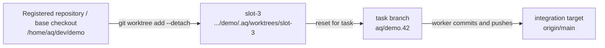

# Projects, Git branches, and workspaces

An AQ **project** connects one software repository to AQ's task queue; a worker edits a task branch in an isolated workspace rather than your default branch or everyday checkout.

## Why this exists

Several agents can change one repository only if each has a clear place to
work and a clear branch to publish. AQ separates the repository you register
from the directory a worker borrows. That separation keeps an agent from
resetting an operator's checkout, lets a stopped task resume on its branch,
and makes a slot safe to reuse after its previous task ends.

AQ ships worktree slots behind the `worktrees.enabled` rollout setting. When
that setting is enabled, a registered repository is a base checkout plus
reusable Git worktrees. When it is disabled, AQ uses the compatible
exclusive-clone acquisition path instead. The integration policy is separate:
this repository is configured for development-mode batch delivery; a worker
closing a task means its source branch is ready, not that it is already on
`main`. See [integration](integration.md) for delivery.

## Vocabulary

The [glossary](../reference/glossary.md) has the short definitions. These
distinctions matter in everyday operation:

| Term | What it is | Who owns it |
| --- | --- | --- |
| Project | AQ's record for a repository and its scheduling/integration settings. | Daemon database and project vault content. |
| Repository | The Git history and files on the daemon host. | Git and the filesystem. |
| Workspace kind | A capability contract such as `project-repo`, `vault`, or `readonly-dir`. | Markdown under `vault/[projects/<project-id>/]workspace-kinds/`. |
| Workspace | One registered directory implementing a kind. | `workspaces` database rows. |
| Base checkout | The shared Git checkout from which AQ creates and manages slots. It is not normal worker space. | AQ/operator filesystem plus its workspace row. |
| Worktree slot | A reusable `slot-N` Git worktree below `<base>/.aq/worktrees/`. | AQ's slot row, sentinel file, and Git worktree registry. |
| Task branch | The branch a task owns, normally `aq/<task-id>`. | Git; the task row records its branch name. |

`project-repo` is writable and lockable by default; `vault` is auto-attached
and does not take a lock; `readonly-dir` is a shipped read-only directory
kind. A task can declare several kinds. AQ resolves them in a canonical order
and either acquires every required lockable workspace or releases the partial
set, so one task cannot hold half its required environment.

## A realistic example

Assume the daemon host has a configured root named `development`, a disposable
repository at `development/demo`, and no project called `demo`. Onboarding
links that repository without changing its Git state:

```bash
aq project onboard --source-mode link --root-id development \
  --relative-path demo --project-name Demo --project-id demo \
  --request-id link-demo-20260909
```

The response records the project, primary workspace, detected default branch,
and the idempotency request. Repeating the same command with the same inputs
returns that stored result; changing inputs while reusing the request ID is
rejected. The complete setup, including clone and new-repository modes, is in
the [project onboarding guide](../guides/project-onboarding.md).

When a ready task `demo.42` is assigned under worktree mode, AQ can prepare
the following topology:



The branch and slot names above come from the current implementation:

```bash
python3 - <<'PY'
from src.orchestrator.worktree_manager import slot_name, task_branch_name
print(slot_name(3))
print(task_branch_name("demo.42"))
PY
```

```text
slot-3
aq/demo.42
```

The task's input is its workspace requirements, project and task metadata;
the output is a locked workspace attachment and a prepared branch/work
directory for the session. On a successful close, the worker commits and
pushes its task branch. The configured integration service later validates and
publishes an eligible batch. Remove a throwaway project only after its tasks,
workers, and published/unpublished branch decisions have been resolved; AQ
does not treat deleting a database row as permission to delete a repository.

## Inputs and outputs

### Project setup inputs

`aq project onboard` accepts a configured root ID and a *relative* path, never
an arbitrary filesystem capability. It supports these shipped source modes:

| Source mode | Input | Result |
| --- | --- | --- |
| `link` | Existing Git-worktree root below a configured root. | Registers it without fetch, checkout, reset, commit, or deletion. |
| `init` | A new destination below a writable configured root. | Initializes Git (normally `main`), optionally writes an initial README/commit, and can optionally create a GitHub repository. |
| `github_clone` | A validated GitHub URL/shorthand and a new destination. | Clones through host credentials, then registers the result. |

Paths are expanded and resolved on the daemon host. AQ rejects absolute paths,
empty or traversal components, control characters, Windows-invalid names when
applicable, symlink escapes, and a path inside `.aq/worktrees`. That last rule
prevents a disposable agent slot from accidentally becoming a project.

The host platform paths are intentionally conservative: configured roots may
be absolute or home-relative, while client-provided descendants are relative.
Validation recognizes POSIX paths and rejects Windows drive/root forms even on
POSIX; on Windows it additionally rejects reserved device names and invalid
filename characters. AQ requires a real, readable root; creating or cloning
also requires it to be writable.

### Workspace inputs

Tasks normally receive a synthesized `project-repo` requirement and any
auto-attached kinds. An explicit task requirement replaces that synthesized
choice. The kind's lock mode applies unless the task supplies a workspace-mode
override. A preferred workspace is a hint, not a guarantee: AQ may pick another
available compatible workspace, and releases partial locks if a later required
kind cannot be acquired.

An operator can inspect the inventory and kinds before changing anything:

```bash
aq project list-workspaces --project-id demo
aq project list-workspace-kinds --project-id demo
```

The first command reports each registered workspace and its lock holder; the
second reports the project-visible system and project overrides. These are
operator-facing inventory commands, so a narrowly scoped worker token can be
refused. That refusal is authorization working, not a missing workspace.

## State ownership

| State | Writer | Durable location | Recovery implication |
| --- | --- | --- | --- |
| Project roots and worktree rollout | Operator configuration | `~/.agent-queue/config.yaml` | Fix a missing/unreadable root there, then retry onboarding. |
| Project identity and registered workspace rows | Onboarding/project commands | Database | A repeated onboarding request returns its durable result. |
| Workspace kind definitions | Operator or project author | Vault markdown | The registry keeps the last valid parsed kind if an edited file is malformed. |
| Base checkout and slot directories | Git plus `WorktreeSlotManager` | Filesystem/Git worktree registry | They persist across tasks and daemon restarts. |
| Slot identity and last assignment | AQ | Workspace row and `.aq-worktree.json` sentinel | Used to adopt an intact slot rather than clobber it. |
| Task branch and commits | Worker via Git | Local and remote Git refs | The branch, not the slot, is the durable deliverable. |
| Dirty uncommitted work | AQ salvage path | Task context/patch evidence | Saved before a slot is reused; it is not silently reset away. |
| Spec/document references | Workspace watcher | `vault/projects/<id>/references/` | A later scan updates/deletes the stub and emits `workspace.spec.changed`. |

The base-checkout guard derives a base structurally: it is a non-slot workspace
that slot rows point to. Ordinary profiles are refused from launching there,
because a linked base can be an operator's working tree. A deliberate special
profile may opt in with `allow_base_checkout: true`, but that is an exception,
not a way to get more parallel capacity.

## Slot lifecycle, resume, and preservation

When AQ needs capacity, it lazily provisions only missing slots. Creating one
updates the base's managed Git exclude, prunes stale Git registrations, fetches
the starting ref, creates a detached worktree, applies any kind setup, writes
the sentinel, and then creates the slot row. An intact directory found after a
crash is re-registered rather than overwritten.

For a new task, AQ first clears an interrupted merge/rebase/cherry-pick,
pushes committed-but-unpushed work when possible, archives dirty changes with
task attribution, then resets and cleans **without `-x`**. Ignored dependency
caches therefore survive slot reuse. AQ creates or switches to `aq/<task-id>`
from the task's requested baseline or the repository default branch.

A resumed task is different: when a task checkpoint exists, AQ restores its
saved branch rather than making a new baseline. If a retry needs the same
branch, AQ prefers the slot already holding it; Git cannot check out one branch
in two worktrees. A sibling legitimately sharing a resume branch waits for
that branch. A task branch unexpectedly held by another slot is surfaced as a
branch-held condition instead of being reset or detached behind the worker's
back.

After a task, AQ salvages again and makes the slot clean. It detaches a clean
slot from its task branch only after confirming that the local and remote refs
match. An unpushed branch stays checked out for recovery and forensics. This
is why an operator must not use `git reset --hard`, `git clean -fdx`, or manual
worktree removal as routine recovery: those commands can destroy the very
evidence AQ intentionally preserves.

## Common failures and recovery

| Symptom | Diagnose | Safe recovery |
| --- | --- | --- |
| `root_escape`, `root_unavailable`, or invalid repository during onboarding | Recheck the configured root and exact relative path; use [onboarding recovery](../guides/project-onboarding.md#recover-from-errors). | Restore access or choose a valid descendant. Do not point AQ at `.aq/worktrees` or bypass root validation. |
| `destination_locked` or a request already in progress | Read onboarding status with `aq project get-onboarding <request-id>`. | Wait, then replay the unchanged request ID; use a new ID only for a materially new request. |
| No workspace/slot can be acquired | `aq project list-workspaces --project-id <id>` and `aq project workspace-doctor --project-id <id>`. | Finish/release the actual owner, or correct capacity/kind configuration. Do not delete a locked directory. |
| A dead task appears to hold a workspace | Identify the row in the inventory and confirm the worker is gone. | An operator may run `aq project release-workspace --workspace-id <id>`; it force-releases the database lock, so never use it merely to bypass live work. |
| Doctor reports exclude drift, stale registration, dirty unlocked slot, or retired slot | `aq project workspace-doctor --project-id <id>` is read-only. | Let normal adoption/recovery repair what it can; investigate unpushed work before any destructive action. |
| A retired slot is known unused and needs removal | First run doctor and confirm no process is using it. | `aq project workspace-reap --workspace-id <slot-id>`; AQ performs a `/proc` liveness check and refuses a live slot. `--all-retired --project-id <id>` is a deliberate sweep, not normal cleanup. |
| A task's branch is busy in another slot | Read the task/slot evidence and the doctor result. | Let its current owner finish or recover it through AQ. Never force-checkout or delete the branch from another worktree. |

`workspace-doctor` is deliberately read-only. `release-workspace` changes only
the AQ lock; `workspace-reap` removes a retired slot directory and row after
its liveness fence. Neither command publishes, deletes, or resets a task
branch. Branch disposition belongs to the task/integration recovery path.

## How workspace reference stubs fit in

`WorkspaceSpecWatcher` is adjacent to, but not part of, slot scheduling. It
periodically scans the first workspace for each active project for configured
specification/document patterns. The shipped `mtime` mode works for Git and
non-Git directories; optional `git_diff` mode requires a Git checkout with a
remote. The first scan only records a snapshot. Later creations, edits, and
deletions write/remove a small vault reference stub and emit
`workspace.spec.changed`; a downstream playbook or plugin may enrich it. It
does not modify task branches or choose a worker workspace.

## Related pages

* [Project onboarding](../guides/project-onboarding.md) — safe link, init, and clone setup with its full error table.
* [Integration](integration.md) — what happens after a worker has pushed a source branch.
* [Sessions](sessions.md) — how a task's prepared work directory becomes a terminal-hosted worker session.
* [Workspace module catalog](../reference/modules/workspaces.md) — source-level ownership and focused tests.
* [Workspace kinds design](../specs/design/workspaces-v2.md) — the detailed typed-workspace contract.

## Source and tests

The public onboarding path is implemented by
[`src/projects/onboarding.py`](../../src/projects/onboarding.py), with
root-relative validation in [`src/projects/paths.py`](../../src/projects/paths.py).
Slot lifecycle and preservation live in
[`src/orchestrator/worktree_manager.py`](../../src/orchestrator/worktree_manager.py)
and acquisition in [`src/orchestrator/workspace_attachments.py`](../../src/orchestrator/workspace_attachments.py).

Focused coverage is in `tests/test_project_onboarding_service.py`,
`tests/test_project_paths.py`, `tests/test_worktree_manager.py`,
`tests/test_worktree_acquisition.py`, `tests/test_worktree_doctor.py`, and
`tests/test_workspace_spec_watcher.py`:

```bash
aq test tests/test_project_onboarding_service.py tests/test_project_paths.py \
  tests/test_worktree_manager.py tests/test_worktree_acquisition.py \
  tests/test_worktree_doctor.py tests/test_workspace_spec_watcher.py
```
