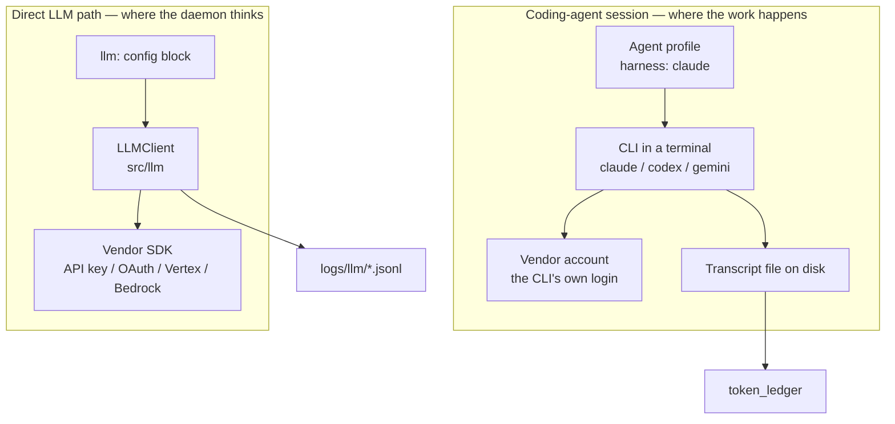
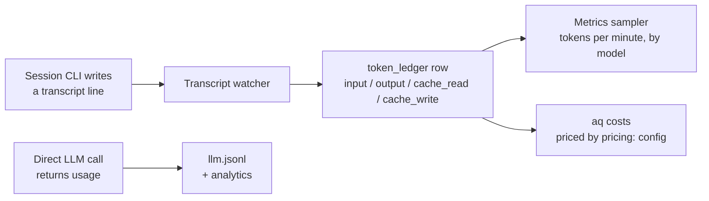

# Providers, models and token accounting

Where the intelligence comes from: which vendor answers a request, which model
is chosen, who counts the tokens, and what the numbers on the dashboard
actually mean.

## Why it exists

AQ spends money on somebody else's models, and almost every question an
operator asks about that spend is really one of three questions:

* **Which model did this work?** Not "which model was configured" — profiles
  and configuration say what *should* run; only the record of an attempt says
  what did.
* **How much did it cost?** Tokens are counted in several places, by several
  mechanisms, with different reliability. A number that is a guess must never
  be displayed as if it were a receipt.
* **How much is left?** That is not a number AQ can compute. It belongs to the
  provider's account, and the only honest way to get it is to ask the provider.

This page explains the three answers and the machinery behind each. The one
rule that runs through all of it: **AQ prefers a missing number to an invented
one.** A cost with no model attribution stays unpriced, a budget with no
reported usage fails closed, and a quota reading nobody has confirmed lately is
labelled stale rather than drawn as current.

## Vocabulary

Skim the [glossary](../reference/glossary.md) first; these are the terms this
page adds to it.

| Term | Meaning here |
|---|---|
| **Provider** | A model vendor: `anthropic`, `google` or `openai`. Not to be confused with a *session provider* (`tmux`), which hosts terminals. |
| **Harness** | The description of which coding-agent CLI to run (`claude`, `codex`, `gemini`). Each harness implies one vendor. |
| **Direct LLM path** | The daemon calling a vendor SDK itself, in-process, with no CLI and no terminal. |
| **Intelligence class** | A named tier (`fast-low`, `standard-high`, …) that maps to one model per provider. Vault markdown, not code. |
| **Token ledger** | The append-only table of tokens AQ observed being spent, per project, agent, task and model. |
| **Provider usage snapshot** | One reading of one provider limit window, as a percentage the *provider* reported. |
| **Observed / estimated / unavailable** | The three qualities a token number can have. See [what the numbers mean](#what-the-numbers-mean). |
| **Unpriced tokens** | Ledger tokens that could not be priced honestly, because the row carries no model or no input/output split. |

## Two ways AQ talks to a model

This is the distinction everything else on the page depends on, and newcomers
almost always miss it.



**Coding-agent sessions** do the actual repository work. AQ starts the same CLI
a human would run, in a terminal, and the CLI authenticates itself — usually
against an interactive subscription login, not against a key AQ holds. AQ
never sees those requests; it reads what the CLI writes to its transcript.
Sessions are explained in [Sessions](sessions.md).

**The direct LLM path** ([`src/llm/`](../../src/llm/)) is the daemon making its
own API calls, with no CLI involved. Its callers are all internal:

* `llm` steps and transitions inside playbooks
  ([`src/playbooks/executors/llm.py`](../../src/playbooks/executors/llm.py)),
* a plugin calling `invoke_llm`,
* the reference-stub enricher,
* `aq vault rebuild-index --with-summaries`.

The two paths do not share credentials, model selection or accounting, and
mixing them up is the source of most confusion here. A profile's `harness`
picks the CLI for a *session*; it has no effect on the direct path, which
always uses the provider named by the `llm:` config block. That is deliberate:
`llm:` carries a single `api_key`/`base_url` pair bound to one provider, so
honouring a profile's harness there would hand one vendor's credentials to
another vendor's adapter
([`src/playbooks/executors/llm.py`](../../src/playbooks/executors/llm.py), `_spec`).

> **Note.** AQ has no in-process agent runtime. Every agent is a CLI in a
> terminal, selected by `harness`. If a page tells you an agent can run
> "in-process", it is describing something that was removed.

## Choosing a model: intelligence classes

Neither path hard-codes model ids. Both resolve a **class** — a named tier —
into a model, per provider. Classes are markdown files in the vault, so
changing which model a tier means is an edit, not a release
([`src/intelligence_classes/__init__.py`](../../src/intelligence_classes/__init__.py)).

A class file is frontmatter plus one fenced JSON block mapping provider →
slice. This is the shipped `standard-high`
([`src/prompts/default_intelligence_classes/standard-high.md`](../../src/prompts/default_intelligence_classes/standard-high.md)):

```json
{
  "anthropic": {"model": "claude-opus-5", "thinking": "high"},
  "openai":    {"model": "gpt-5.6-terra", "reasoning_effort": "high"},
  "codex":     {"model": "gpt-5.6-terra", "reasoning_effort": "high"},
  "google":    {"model": "gemini-2.5-pro", "thinking_budget": 24576}
}
```

Twelve classes ship, on two axes: a capability tier (`fast`, `standard`,
`deep`) and a reasoning level (`off`, `low`, `medium`, `high`). The `codex`
slice is a fourth key rather than a fourth provider: it overrides the OpenAI
slice **only** for the Codex CLI, whose account models are a separate namespace
from the OpenAI API's.

> **Do not trust the model ids printed on this page.** They are what shipped
> when it was written; the vault copy on your box is authoritative and an
> operator may have edited it. [Read the values you actually
> have](#example-see-which-models-your-classes-resolve-to) instead.

Which class applies, in order:

| Path | Source of the class | Source of the provider |
|---|---|---|
| Session | The worker's own class, else the task's `intelligence_class`, else the profile's `default_class` ([`src/sessions/spec.py`](../../src/sessions/spec.py), `_resolve_class_config`) | The harness's declared `provider`, else inferred from its id: `claude`→`anthropic`, `codex`→`openai`, `gemini`→`google` |
| Direct | The step profile's `default_class`, else `llm.default_class` ([`src/llm/spec.py`](../../src/llm/spec.py), `resolve_call`) | `llm.provider` — always |

On the direct path an explicit `model` beats the class, the class beats
`llm.model`, and `llm.model` beats the adapter's own fallback. An unknown class
id, or a class with no slice for the resolved provider, logs a warning and
falls through rather than failing the call — so a typo in a class name is a
quiet demotion to `llm.model`, not an error. On the session path the same
misses leave the launch model *unset*, and the CLI picks its own default.

### Example: see which models your classes resolve to

> Assumes a checkout with dependencies installed and a vault at
> `~/.agent-queue/`. Read-only; writes nothing.

```bash
python3 - <<'PY'
import os
from src.config import LLMConfig
from src.intelligence_classes import load_intelligence_classes, resolve_class
from src.llm.spec import LLMCallSpec, resolve_call

classes = load_intelligence_classes(os.path.expanduser("~/.agent-queue"))
print("classes:", ", ".join(sorted(classes)))

cfg = LLMConfig(provider="anthropic", max_tokens=4096)
for cid in ("fast-low", "standard-high"):
    r = resolve_call(LLMCallSpec(intelligence_class=cid), cfg, classes)
    print(f"{cid:14} anthropic -> {r.model!r} extras={r.extras}")

for p in ("anthropic", "openai", "codex", "google"):
    print(f"standard-high/{p:9} -> {resolve_class(classes['standard-high'], p)}")
PY
```

```text
classes: deep-high, deep-low, deep-medium, deep-off, fast-high, fast-low, fast-medium, fast-off, spark-low, standard-high, standard-low, standard-medium, standard-off
fast-low       anthropic -> 'claude-sonnet-5' extras={'thinking': 'low'}
standard-high  anthropic -> 'claude-opus-5' extras={'thinking': 'high'}
standard-high/anthropic -> {'model': 'claude-opus-5', 'thinking': 'high'}
standard-high/openai    -> {'model': 'gpt-5.6-terra', 'reasoning_effort': 'high'}
standard-high/codex     -> {'model': 'gpt-5.6-terra', 'reasoning_effort': 'high'}
standard-high/google    -> {'model': 'gemini-2.5-pro', 'thinking_budget': 24576}
```

`spark-low` in that listing is not a shipped class: it is one this box's
operator added. Your list is whatever is in your vault. Adding a file makes the
class usable without restarting the daemon — a shared watcher keeps the
registry current — and `aq system list-intelligence-classes` reports which
files loaded.

The extras beside the model are the reasoning controls, and each provider
spells them differently: Anthropic takes a `thinking` level that the factory
turns into a token budget, Google takes an explicit `thinking_budget`, OpenAI
takes a `reasoning_effort` string
([`src/llm/providers/__init__.py`](../../src/llm/providers/__init__.py)).

### Which model actually did the work

Everything above is *intent*. The record of what ran is the per-attempt
snapshot in `task_session_attempts`, written when a session takes a task, and
it is the only evidence that survives a profile edit or a class edit. Model
attribution never falls back to reading a profile: an attempt with no recorded
model is counted as unattributed rather than guessed.

```bash
aq task recent-activity --hours 24
```

The Tasks tab's *Time range* selector shows the same data. The ledger carries a
`model` column for the same reason — a cost row without one is unpriced, not
estimated.

## What the numbers mean

Three qualities, never blurred:

| Quality | Where it comes from | Where it is allowed to appear |
|---|---|---|
| **Observed** | A count the provider returned: `usage` on an API response, or a `usage` block on a transcript line. Carries `reported=True`. | The token ledger, cost rollups, metrics, hard budgets. |
| **Estimated** | Characters ÷ 4, computed locally when nothing better exists ([`src/llm_logger.py`](../../src/llm_logger.py)). | The `llm.jsonl` debug log and its `*_est` analytics fields — nowhere else. |
| **Unavailable** | The provider reported nothing. | Nothing. A hard budget refuses the step; a ledger row stays unpriced; a quota card stays blank. |

Estimated counts never enter the ledger, are never priced, and are never shown
as spend. They exist to compare prompts against each other in
`logs/llm/<date>/llm.jsonl`, where they are named `input_tokens_est` and
`output_tokens_est` so that nobody mistakes them.

`TokenUsage` ([`src/llm/types.py`](../../src/llm/types.py)) keeps `reported` as
a field separate from the counts precisely because zero is a legitimate
observation while *absence* is not: adding two usages yields `reported=True`
only if both halves were reported, so one silent turn taints the sum, which is
what makes a hard budget fail closed instead of passing on a phantom zero.

### From a turn to the dashboard



The **transcript watcher**
([`src/sessions/transcripts/watcher.py`](../../src/sessions/transcripts/watcher.py))
is the only routine writer of the token ledger. Note what that implies:
**direct-path calls are not ledgered at all.** A playbook's `llm` step is
budgeted and logged, but its tokens never reach `token_ledger`, so they never
appear in `aq costs` or the metrics token chart. Those surfaces measure agent
sessions. For each assistant entry it has
not already charged, it writes one row carrying the model and four separate
counts. Cache reads and cache writes are recorded *beside* `input_tokens`, not
folded into it, because they are billed at their own rates; folding them in
would inflate priced input and produce a wrong cost. Every entry is charged at
most once: a durable byte-offset checkpoint per transcript path means a restart
or a relaunch on the same workspace cannot replay a file.

Only harnesses with a transcript reader produce ledger rows. Claude and Codex
have one; the shipped `gemini` harness declares none, so a Gemini session does
real work that AQ cannot count. That is visible rather than hidden: those
tokens simply never appear.

The **metrics sampler** ([`src/metrics/sampler.py`](../../src/metrics/sampler.py))
rolls the ledger into rates by model, and reports the difference between
`tokens_used` and the sum of the four columns as `unattributed` rather than
assigning it somewhere convenient.

**Cost** is a separate step, and it is opt-in. `aq costs` prices a ledger row
only when the row carries both a model that matches a `pricing:` entry **and**
an input/output split; everything else is counted in `unpriced_tokens` with a
null cost ([`src/commands/ops_commands.py`](../../src/commands/ops_commands.py),
`_cmd_get_costs`). The price table ships **empty**, so on a fresh install every
token is unpriced until an operator writes the rates they are actually paying.
There are no built-in prices to go stale. See
[the setup guide](../guides/llm-providers.md#give-the-cost-rollup-some-prices).

## The provider's own account of the quota

Everything above measures what AQ spent. It cannot tell you what your
*subscription* has left, because that is account-wide state the provider owns —
another machine, another person, or a `claude` window you ran yourself all draw
on it. So AQ stores the provider's own numbers separately, as percentages
([`src/providers/`](../../src/providers/)).

The two supported harnesses expose it in completely different ways, and the
code follows that split rather than papering over it:

| Provider | Mechanism | Cost | Cadence |
|---|---|---|---|
| `codex` | Passive. Codex publishes a `rate_limits` block on the `token_count` transcript lines the watcher already reads. | None | Only while a Codex session is running |
| `claude` | Active. `claude -p "/usage" --output-format json` is run and its prose parsed. | None — a live probe reports `num_turns: 0` and `total_cost_usd: 0` | Every 10 minutes, if the probe playbook is activated |

Both land as the same
[`ProviderUsageSnapshot`](../../src/providers/snapshot.py) and nothing
downstream cares which produced one. The store is append-only, and a reading
identical to the newest one for its series is dropped — but it still advances
that row's `last_seen_at`, because an unchanged number is evidence the feed is
alive. `observed_at` says when the value appeared; `last_seen_at` says when it
was last confirmed; **staleness is always computed from the latter**
([`src/database/queries/provider_usage_queries.py`](../../src/database/queries/provider_usage_queries.py)).

### Example: read the quota cards' data

> Assumes the daemon is running with its API on the configured port (`8081`
> here — check `api.port` in `~/.agent-queue/config.yaml`). Read-only.

```bash
curl -s http://localhost:8081/api/providers/usage
```

```text
{"now":1788985759.95,"snapshots":[{"id":156,"provider":"codex","account_label":"pro",
"window":"primary","scope":"","used_percent":75.0,"resets_at":1789440393.0,
"observed_at":1788984679.667,"last_seen_at":1788984751.044,"source":"transcript",
"stale":false,"age_seconds":1008.91}],"series":{}}
```

One object per `(provider, window, scope)` series, newest reading each. `stale`
and `age_seconds` are computed **server-side**, from a per-provider horizon:
a Claude probe is late at 25 minutes, while a Codex reading four hours old is
normal on a Claude-only afternoon
([`src/api/providers.py`](../../src/api/providers.py)). Deriving that verdict
again in the client is how two surfaces end up disagreeing about one card, so
the dashboard does not.

Window names are printed as the provider spells them (`primary`, `session`,
`week`) and scopes are carried through verbatim — a scope nobody has seen
before round-trips untouched instead of being renamed into a guess.

### Example: parse a `/usage` body without running anything

> Pure function, no subprocess, no daemon, no network.

```bash
python3 - <<'PY'
import time
from src.providers.claude_usage import parse_usage_text

text = """Current session: 12% used · resets Sep 9, 2:59pm (America/Los_Angeles)
Current week (all models): 47% used · resets Sep 14, 11:00am (America/Los_Angeles)
Current week (Opus): 3% used · resets Sep 14, 11:00am (America/Los_Angeles)
"""
for s in parse_usage_text(text, now=time.time()).snapshots:
    print(f"{s.window:8} scope={s.scope!r:12} {s.used_percent:5.1f}% resets_at={s.resets_at}")

print(parse_usage_text("You are billed per token; see console.anthropic.com", now=time.time()))
print(parse_usage_text("Usage: 100 bananas", now=time.time()))
PY
```

```text
session  scope=''            12.0% resets_at=1788991140.0
week     scope='all models'  47.0% resets_at=1789408800.0
week     scope='Opus'         3.0% resets_at=1789408800.0
UsageParse(snapshots=[], unparsed=False)
UsageParse(snapshots=[], unparsed=True)
```

The last two lines are the interesting ones. An API-key account has no
subscription window, so *no limit lines* there is an answer (`unparsed=False`,
nothing stored). Text that has limit lines the parser cannot read is a fault
(`unparsed=True`) — and it stores nothing either, so the previous reading
survives and a doctor check raises it with a human. A blank card beats a wrong
number; a number labelled stale beats a blank card.

## Budgets, retries and errors

### Playbook `llm` steps are the only hard budget

Every `llm` step in a playbook must declare a budget — the schema has no
unbounded option ([`src/playbooks/definition.py`](../../src/playbooks/definition.py),
`AiBudget`): `max_calls`, `max_output_tokens`, `max_total_tokens` and
`timeout_seconds`. The executor enforces it, and every breach is a *typed
outcome* the playbook author can branch on rather than an exception:

| Outcome | Cause |
|---|---|
| `budget_exceeded` | Call count, output tokens or total tokens exceeded — **or** the provider does not report usage at all, checked before the first call |
| `timed_out` | The step exceeded `timeout_seconds` |
| `invalid_output` | The response did not parse or validate against the step's schema after its retries |
| `provider_error` | The adapter raised: credentials, network, vendor error |
| `unavailable` / `unauthorized` | The step's profile could not be resolved, or the principal may not use it |
| `cancelled` / `operator_decision_required` | The run was cancelled, or an interrupted tool turn needs a human |

The fail-closed rule is worth stating twice: a step with `max_total_tokens`
against an adapter whose `reports_usage` is false returns `budget_exceeded`
*without calling the provider*, and a step whose call returned unreported usage
returns `budget_exceeded` after it. A budget that cannot be measured is not a
budget. New adapters are ineligible by default —
[`LLMProvider.reports_usage`](../../src/llm/providers/base.py) returns `False`
until an adapter opts in.

Retries are declared per step (`retry.max_attempts`) and apply to *schema*
failures only: the executor appends a correction turn and asks again. Provider
errors are not retried inside the step.

### A fleet-wide ceiling, if you set one

`global_token_budget_daily` and a project's `budget_limit` are the two budgets
that can stop work outright. Both are compared against `token_ledger` totals in
the scheduler's rolling window (24 hours by default), so both measure session
spend and neither can be exhausted by direct-path calls. When either is
reached, the scheduler assigns nothing and `aq task claim` answers
`not_admissible` with reason `budget_exhausted` — a worker should report that
and exit rather than poll. Both are unset by default. See
[the reference](../reference/usage-accounting.md#fleet-and-project-token-budgets).

### Sessions back off instead

A coding-agent session has no such budget: the CLI spends what it spends. What
AQ does watch for is the CLI *dying* on a rate limit. The final pane capture is
matched against a small pattern list, and a match produces a `RATE_LIMIT`
verdict rather than a crash verdict
([`src/sessions/exit_classifier.py`](../../src/sessions/exit_classifier.py)).
That is pane text — a hint, not a structured channel — so it is used only to
choose between two safe outcomes.

On that verdict the session goes to `sleeping`, and either the task is paused
with a `resume_after` 15 minutes out, or (for a pool worker) the task returns to
the frontier and the *pool key* is quarantined for the same window, so a
different worker on a different account can pick the work straight back up
([`src/sessions/reconciler.py`](../../src/sessions/reconciler.py)).

> **Two settings that look relevant and are not.** The scheduler reads a
> `provider_cooldowns` map, but nothing on `main` writes an entry into the
> orchestrator's copy of it; and the `pause_retry:` config block is read only
> by the setup wizard. Do not plan around either.

## Inputs and outputs

**In:**

* `llm:`, `providers:`, `pricing:` and `llm_logging:` in
  `~/.agent-queue/config.yaml`.
* Vendor credentials, from the environment or the vendor's own login file —
  never from a task or a prompt.
* Vault markdown: `vault/intelligence-classes/*.md`.
* Transcript files written by the coding-agent CLIs.

**Out:**

* `token_ledger` rows — observed spend, per project/agent/task/model.
* `provider_usage_snapshots` rows — provider-reported quota percentages.
* `logs/llm/<date>/*.jsonl` — the direct path's request/response log and its
  estimated-token analytics.
* `GET /api/providers/usage` and `GET /api/metrics/series` — what the dashboard
  draws.
* `aq costs` — the priced rollup, with everything it could not price called out.

## State ownership

| State | Written by | Lives in | Lifetime |
|---|---|---|---|
| Provider selection, keys, `max_tokens` | Operator | `~/.agent-queue/config.yaml`, `llm:` | Until edited |
| Model per tier | Operator (shipped defaults seeded once) | `vault/intelligence-classes/<id>.md` | Until edited; hot-reloaded |
| Price table | Operator | `~/.agent-queue/config.yaml`, `pricing:` | Until edited; empty by default |
| Probe on/off, binary, staleness horizons | Operator | `~/.agent-queue/config.yaml`, `providers:` | Until edited |
| Observed token spend | Transcript watcher | `token_ledger` table | Durable |
| Transcript read offsets | Transcript watcher | Checkpoint table, keyed by transcript path | Durable — this is what stops double-charging |
| Quota snapshots | Watcher (`codex`), probe command (`claude`) | `provider_usage_snapshots` table | Durable, append-only |
| Probe verdict | `provider_usage_probe` | `system_config`, key `providers.claude_usage.last_probe` | One row, overwritten each probe |
| Direct-call log | `LLMLogger` | `<data_dir>/logs/llm/<date>/` | `llm_logging.retention_days`, swept hourly |
| Prompt analytics | `LLMLogger` | Memory, flushed hourly to `prompt_analytics.jsonl` | Lost on restart between flushes |
| Adapter instances | `LLMClient` | Memory, cached by provider/model/base-url/extras | Process lifetime |

Nothing in this subsystem is stored in the vault as *results*: the vault holds
policy (classes), the database holds evidence (ledger, snapshots), and the log
directory holds debugging material.

## Common failures and recovery

| Symptom | What it means | What to do |
|---|---|---|
| A quota card reads `stale · last seen 4h ago` | Nothing has confirmed that series inside its horizon. For `codex` this usually just means no Codex session ran. | For Claude, `aq doctor --check providers.claude_usage`. For Codex, nothing — it is honest, not broken. |
| Doctor: *"the CLI's wording moved"* | `/usage` answered with text no limit-line regex matched. Percentages are unchanged; our reading of them broke. | A human updates the regex in [`src/providers/claude_usage.py`](../../src/providers/claude_usage.py). Report-only by design — there is no `--fix`. |
| Doctor: *"no claude /usage probe has run"* | The `provider-usage-probe` playbook is not activated, or its timer is not firing. | Activate it — see [the setup guide](../guides/llm-providers.md#turn-on-the-claude-quota-probe). |
| Doctor INFO: *"no subscription window to report"* | An API-key account is billed per token and has no window. | Nothing. This is a fact about the account. |
| `aq costs` shows a large `unpriced` figure | Rows carry no matching `pricing:` entry, or no input/output split (older rows, and rows written by paths that only knew a total). | Add or widen a `pricing:` glob. AQ will not guess a rate. |
| A playbook step returns `budget_exceeded` immediately | `max_total_tokens` is set and the resolved adapter's `reports_usage` is false. | Use a provider that reports usage, or drop `max_total_tokens` from the step. |
| Metrics show a large `unattributed` token rate | Ledger rows whose four columns do not add up to `tokens_used` — typically written by a path that knew only a total. | Nothing to repair; it is the honest residue. Investigate the writer if it grows. |
| A task keeps pausing with `reason: rate_limit` | A session died with rate-limit text in its final pane. | Wait out the cooldown, or spread work across accounts/harnesses. See [session troubleshooting](../guides/session-troubleshooting.md). |
| `llm: not configured` in the logs, playbook steps `unavailable` | No credential resolved for `llm.provider`. | [Set up credentials](../guides/llm-providers.md#give-the-daemon-a-provider). |
| A Gemini session's tokens never appear | The shipped `gemini` harness declares no transcript reader, so nothing observes its usage. | Expected. Use the provider's own console for that spend. |

## Related pages

* [Sessions](sessions.md) — the other half of the story: how a CLI is launched,
  watched and classified when it dies.
* [Setting up LLM providers](../guides/llm-providers.md) — the task-shaped
  version of this page: credentials, probe, prices, verification.
* [Usage accounting reference](../reference/usage-accounting.md) — every field,
  table, config key and outcome, exhaustively.
* [Harness reference](../reference/harnesses.md) — how a harness declares its
  CLI, and where transcripts come from.
* [Module catalog — providers](../reference/modules/providers.md) — every module
  in this subsystem, one row each.

## Source and tests

Implementation: [`src/llm/`](../../src/llm/),
[`src/providers/`](../../src/providers/), [`src/tokens/`](../../src/tokens/),
[`src/llm_logger.py`](../../src/llm_logger.py). The read and write sides that
live elsewhere: [`src/api/providers.py`](../../src/api/providers.py),
[`src/database/queries/provider_usage_queries.py`](../../src/database/queries/provider_usage_queries.py),
[`src/database/queries/token_queries.py`](../../src/database/queries/token_queries.py).

```bash
aq test tests/llm tests/test_provider_usage_probe.py tests/test_claude_usage_parser.py \
    tests/test_provider_usage_queries.py tests/test_api_provider_usage.py \
    tests/test_llm_usage.py tests/test_llm_logger.py tests/test_budget.py
```
