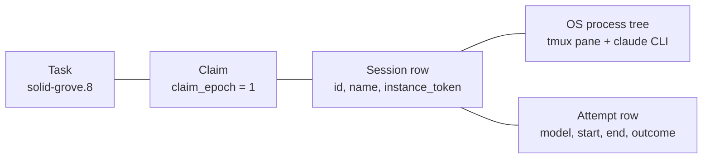
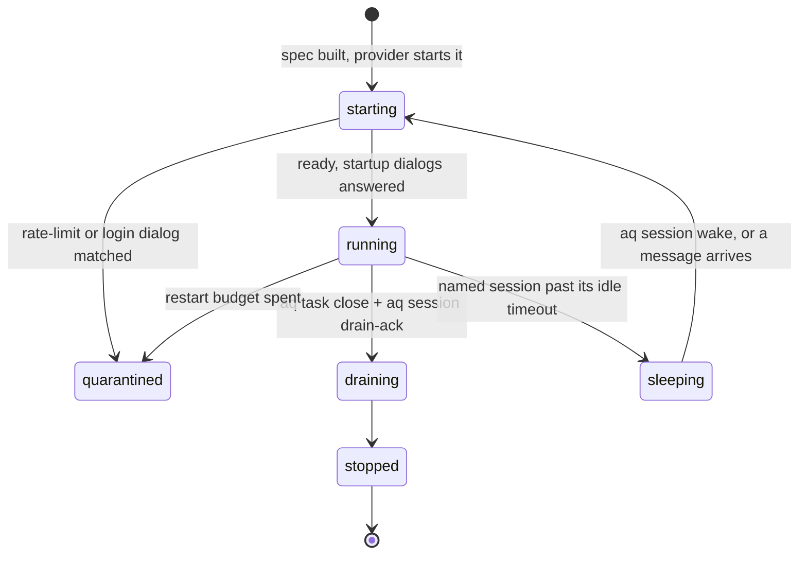

# Sessions

A **session** is one run of a coding-agent command-line tool, living in its own
terminal, working on one task at a time. Everything AQ actually *does* to your
repository happens inside a session.

## Why sessions exist

AQ does not call a model API and wait for an answer. It starts the same CLI a
human would run — `claude`, `codex`, `gemini` — inside a detached terminal, and
then watches it. That choice buys three things:

* **You can look.** A session is a real terminal you can attach to, peek at, or
  watch live in the dashboard. There is no hidden stream.
* **It outlives the daemon.** On the `tmux` provider the terminal is owned by
  the tmux server, not by AQ: restart the daemon and the agent keeps typing,
  and the daemon re-attaches to what it finds. (The fallback `subprocess`
  provider keeps the process but cannot re-find it — see
  [restarts and adoption](#restarts-and-adoption).)
* **Finishing is explicit.** A process that exits is *not* a finished task. A
  task finishes when the agent runs `aq task close`, and nothing else counts.
  This is the rule the whole runtime is built around
  ([`src/sessions/exit_classifier.py`](../../src/sessions/exit_classifier.py)).

The cost of that design is that the daemon has to *reconcile* rather than
*control*: it compares what it wants against what it can observe, once every
orchestrator cycle, and nudges reality toward intent. Most of this page is
about how that comparison stays honest.

## Vocabulary

Skim the [glossary](../reference/glossary.md) first; these are the terms this
page leans on hardest.

| Term | Meaning here |
|---|---|
| **Session** | One terminal-hosted run of an agent CLI. Has a name, an id, a state and a work directory. |
| **Harness** | The description of *which* CLI to run and how — a markdown file, not code. See the [harness reference](../reference/harnesses.md). |
| **Provider** | The mechanism that hosts the terminal: `tmux`, `subprocess` or `fake`. |
| **Attempt** | One recorded try at a task by a session, including the model that served it. A task can have several. |
| **Claim** | A pool worker's exclusive hold on a task, proved by a file in its workspace. |
| **Claim epoch** | A counter on the task that invalidates an old claim the instant a new one is granted. |
| **Instance token** | A per-launch random value used to make sure a kill hits the process AQ meant to kill. |
| **Lease** | The idle budget a working session gets before AQ starts asking whether it is alive. |
| **Nudge** | Text typed into a live session's input line and submitted, as a human would. |
| **Drain** | Asking a session to finish and stop rather than take more work. |

## Four identities, and why they are not one thing

Newcomers usually assume "the agent", "the process", "the session" and "the
task attempt" are the same thing. They are not, and nearly every confusing
symptom in this subsystem comes from conflating two of them.



* **The task** is the work. It survives every session that fails at it.
* **The claim** is permission to touch that task right now. It is a number
  (`tasks.claim_epoch`) plus a file in the worker's workspace
  ([`.aq/claim.json`](../../src/claim_file.py)). When a task is handed to a new
  worker the number goes up, and every write the old worker attempts is
  refused with `stale_claim`.
* **The session row** is AQ's record of a terminal: its name, its work
  directory, its harness, its provider, its `instance_token`, its state.
* **The process tree** is the actual `tmux` pane and the CLI inside it. The row
  can say `running` while the process is gone, and the process can be alive
  while the row says nothing at all. Reconciling those two is the daemon's job.
* **The attempt** is the historical record of one try, written to
  `task_session_attempts` — this is where the *model* that did the work is
  recorded. The profile is not evidence of which model ran; the attempt is.

### Epoch fencing, in one paragraph

Two workers must never write to one task. AQ does not solve this with a lock
that can be lost; it solves it with a number that can only go forward. Claiming
a task bumps `tasks.claim_epoch` and writes the new value into the claimant's
`.aq/claim.json`. Every task-mutating command a session sends carries that
epoch, and
[`_assert_session_owns`](../../src/commands/claim_commands.py) refuses anything
whose epoch is not the current one. A worker that was interrupted, resumed from
an old context, or restarted from a stale checkout cannot corrupt work that has
since moved on — it gets a refusal, not a race. The same principle guards
*kills*: a launch mints an `instance_token`, and the provider re-checks it
against the live process before signalling, so a recycled process id or a
same-named successor is never hit
([`src/sessions/proctable.py`](../../src/sessions/proctable.py)).

## A realistic example

> Assumes the daemon is running and a pool worker is currently holding a task.
> Everything below is read-only.

Inside a worker's workspace, the claim file is the worker's proof of what it
holds:

```bash
cat .aq/claim.json
```

```text
{"task_id": "solid-grove.8", "claim_epoch": 1, "session_id": "6a13cf70-6d7c-4762-b081-70d8bb04d311", "claimed_at": 1788983165.856642}
```

The identity markers the daemon set for that session are in its environment.
Print the *names* only — `AQ_API_TOKEN` is a credential:

```bash
env | grep -o '^AQ_[A-Z_]*' | sort
```

```text
AQ_AGENT_ID
AQ_API_TOKEN
AQ_API_URL
AQ_CPU_CORES
AQ_CPU_SHARE
AQ_DAEMON_EPOCH
AQ_DATABASE_URL
AQ_DB_SCOPE
AQ_INSTANCE_TOKEN
AQ_PROFILE
AQ_PROFILE_ID
AQ_PROJECT_ID
AQ_SESSION_ID
AQ_SESSION_KIND
AQ_STARTUP_PROMPT_DELIVERED
AQ_TEST_SLOTS
AQ_TEST_WORKERS
AQ_WORK_DIR
```

Nine of those are the identity markers every session carries
([`AQ_MARKER_KEYS`](../../src/sessions/env.py)); the rest come from database
isolation, pool launches and resource caps.

The terminals themselves belong to the tmux server, so they are visible without
the daemon at all. On a box configured with `sessions.provider: tmux` and the
default socket name:

```bash
tmux -L aq list-sessions
```

```text
n-supervisor--agent-queue: 1 windows (created Mon Sep  7 22:11:36 2026)
n-supervisor--global: 1 windows (created Tue Sep  8 09:31:36 2026)
p-standard-high-claude--agent-queue--444f78ef: 1 windows (created Wed Sep  9 12:45:57 2026)
p-standard-high-codex--agent-queue--62056393: 1 windows (created Wed Sep  9 06:29:55 2026)
```

`aq session list --live` is the daemon's view of the same thing, with the task,
harness and idle time each row is working on. It is an operator command: a
worker's own token is scoped to its task and is refused with
`out of scope: session_list`.

The name prefixes are the session's *kind*, and they are derived in exactly one
place, [`src/sessions/spec.py`](../../src/sessions/spec.py):

| Prefix | Kind | Shape | Started by |
|---|---|---|---|
| `s-` | task session | `s-<task_id>` | the scheduler, pushing one task to one session |
| `n-` | named session | `n-<profile>[--<project>]` | a message arriving for a supervisor, or `aq session wake` |
| `p-` | pool session | `p-<profile>--<project>--<nonce>` | pool sizing, when a profile is short of workers |

Nothing else parses those names apart; they exist so a human reading
`tmux list-sessions` can tell what is running.

## Inputs and outputs

**In.** A session is launched from an immutable *spec*
([`SessionSpec`](../../src/sessions/provider.py)) composed by
[`SessionSpecBuilder`](../../src/sessions/spec.py) out of three things: the
agent **profile** (which harness, which intelligence class, which tools), the
**harness markdown** (how to invoke that CLI), and the **task** (its id, its
workspace, its prompt). The spec carries an argv, a full child environment,
a work directory, and any files to write into the workspace before launch.
Providers receive that and nothing else — they know no harness names and read
no database.

**Out.** A running session produces four observable streams:

| Output | Where it goes | Read it with |
|---|---|---|
| Visible terminal output | the tmux pane | `aq session peek`, dashboard live pane |
| The harness's transcript | the CLI's own on-disk log | `aq session logs`, `GET /api/sessions/{id}/stream` |
| Token usage | `token_ledger` rows, from transcript entries | `aq costs`, provider usage surfaces |
| Lifecycle facts | `sessions`, `task_session_attempts` rows and bus events | `aq session show`, `aq task recent-activity` |

Text goes *in* the same way a human would put it there: a nudge types into the
input line and presses Enter. That is why "was it submitted?" is a real
question with its own error type — see
[nudges that never submitted](#a-nudge-that-was-typed-but-never-submitted).

## State ownership

This is the section to come back to when a symptom does not add up.

| State | Owner | Lives in | Survives a daemon restart? |
|---|---|---|---|
| Which CLI a harness runs | operator | `vault/harnesses/<id>.md` markdown | yes |
| Which harness a profile uses | operator | `vault/agent-types/<id>/profile.md` | yes |
| Session provider, lease and ladder settings | operator | `sessions:` in `~/.agent-queue/config.yaml` | yes |
| Session row: name, state, desired state, instance token | daemon | `sessions` table | yes |
| Attempt history and model attribution | daemon | `task_session_attempts` table | yes |
| Claim ownership | daemon | `tasks.claim_epoch` + the session row | yes |
| Claim proof, worker side | `aq task claim` | `<work_dir>/.aq/claim.json` | yes (it is a file) |
| Drain acknowledgement | the agent, via the provider | tmux server environment (`tmux`) or daemon memory (`subprocess`) | **tmux: yes. subprocess: no** |
| Pane observation cache | daemon | memory only, 2 s TTL | no |
| Transcript read offsets | daemon | memory *and* a durable per-path checkpoint | yes |
| The terminal itself | the tmux server | the tmux server | yes |

Two rows in that table are the ones that surprise people:

* **`sessions.state` is an observation, `sessions.desired_state` is an
  intention.** They were one column until they had to disagree — a session can
  be `running` while AQ wants it `sleeping`, and that gap is what lets
  `aq session sleep` be non-violent. Requesting sleep never signals the
  process; the next reconciler tick drains it.
* **The drain acknowledgement is deliberately allowed to be forgotten.** The
  provider stores it, and only the `tmux` provider stores it somewhere that
  survives a restart
  ([`SessionProvider.set_meta`](../../src/sessions/provider.py)). A lost ack
  self-heals: the agent is idle with its task already closed, so the next tick
  reaps it on the *task* state instead of the marker. Nothing else may ride
  that channel.

## The session lifecycle



`stalled` is **not** in that diagram on purpose: it is derived from the lease
(`sessions.lease_ttl_seconds`, 480 s by default) against `last_activity`, and
never stored. A stalled session is a running session that has been quiet too
long — which is a question, not a verdict.

### What the daemon does each cycle

Once per orchestrator cycle (~5 s), [`SessionReconciler.tick`](../../src/sessions/reconciler.py)
runs a fixed sequence, each step isolated so one failure does not skip the rest:

1. **Observe** — refresh who is alive, and from whom activity was seen.
2. **Drain-ack** — honour agents that said "I am finished".
3. **Prepare timeout** — release pool claims stuck mid-preparation.
4. **Exits** — a dead process with an open task becomes a typed verdict.
5. **Abandoned claim loop** — recycle a worker that stopped claiming.
6. **Orphans** — reconcile row-versus-task disagreement, in both directions.
7. **Stall ladder** — nudge, then restart, then quarantine.
8. **Named convergence** — start what is wanted, sleep what is idle.
9. **Backstop** — `agents.stuck_timeout_seconds` as the last net.

The single rule that governs all of it: **unknown is not dead.** If a provider
cannot enumerate its sessions it raises
[`PartialListError`](../../src/sessions/provider.py) carrying what it *did*
see, and every destructive action for that name prefix is deferred to a later
tick. If the process probe fails, the answer is "alive". Reaping on a failed
probe is the expensive mistake this design exists to avoid.

> **Note.** A database row is never proof that a process stopped.
> `sessions.state = 'stopped'` means "AQ last observed it stopped", which is a
> different claim. Code that must *know* — releasing a branch another writer
> might still hold, for instance — calls
> [`confirm_stopped`](../../src/sessions/provider.py), a fresh, cache-bypassing
> probe that answers `False` when it cannot tell. The `subprocess` provider
> does not implement it at all, so on that provider the honest answer is always
> "cannot confirm".

### Exit verdicts

When a process is gone and its task is still open,
[`classify_exit`](../../src/sessions/exit_classifier.py) turns that into one of
four values, checked in this order:

| Verdict | Trigger | What happens |
|---|---|---|
| `drained` | the task is already closed | normal teardown |
| `rate_limit` | rate-limit wording in the final screen | task paused with a cooldown; the session is not restarted straight back into the limit |
| `rapid_crash` | died inside `sessions.restart_window_seconds` of starting (600 s default) | restart with backoff — a launch or config problem, not work |
| `productive_death` | ran a while, then exited with the task open | never silently re-queued; flagged for attention |

Rate-limit detection reads *pane text*, which is a hint rather than a
structured channel. It is used only to choose between "pause with a cooldown"
and "treat as a crash" — both safe answers.

### The stall ladder

A quiet session is not a dead session, and killing one throws away work in
progress. So silence past the lease climbs a ladder rather than ending in a
kill ([`_step_stall_ladder`](../../src/sessions/reconciler.py)):

1. **Nudge** — up to `sessions.stall_max_nudges` times (3 by default), spaced
   by `stall_backoff_seconds` (300 s). The text asks the agent to close the
   task if it is done, heartbeat if it is not, or say it is blocked. This rung
   exists because the most common "stall" is an agent sitting at an idle prompt
   with the work finished and the close not typed.
2. **Restart** — interrupt, stop, pause the task with a backoff, and carry the
   harness resume key forward so context survives where the harness supports
   resuming.
3. **Quarantine** — once `sessions.max_restarts` (3) is spent.

Providers with no input channel skip the nudge rungs entirely rather than
spending three cycles talking to nobody. A session parked on a human question
is exempt from the ladder for as long as the question is open.

**Agents can stop the ladder from climbing.** Anything that will be quiet for
more than a few minutes — a long build, a full test run — should call
`aq task heartbeat <task-id>` first. The shipped bootstrap prompt says so
explicitly ([`BOOTSTRAP_PROMPT`](../../src/sessions/spec.py)), because on some
providers the only other activity signal is the mtime of a log file.

## Restarts and adoption

Restarting the daemon must not abort in-flight work. On boot,
[`adopt_on_start`](../../src/sessions/reconciler.py) lists the live sessions
each provider can see and compares them with the live rows:

* **Row and process agree, tokens match** → adopted. The task stays
  `IN_PROGRESS` and the row is re-stamped with this daemon's epoch. The epoch
  is *provenance*, not a validity test; an older-epoch session is adoptable.
* **Row with no live process** → falls through to the exit classifier.
* **Live process with no row** → killed. With no row there is nothing to match
  against — no task, no token, no profile — and an unreachable agent writing
  into a workspace the scheduler believes is free is the worse failure.
* **Listing incomplete** → the whole name prefix is deferred. Nothing is
  adopted *or* reaped.

Adoption is off if `sessions.adopt_on_start` is `false`; it ships `true`.

> **Warning.** Adoption is only as good as the provider's ability to enumerate.
> `SubprocessProvider.list_running` only knows sessions *this daemon process*
> started, so after a restart it sees nothing — no session is mis-reaped, but
> none is re-adopted either. This is one of the reasons this install sets
> `sessions.provider: tmux` in `~/.agent-queue/config.yaml` rather than leaving
> the shipped `subprocess` default.

## Idle sessions and drains

Not every session is working on a task, and the three kinds idle differently.

* **Task sessions** (`s-`) exist for one task. Idle equals stalled, and the
  ladder above applies.
* **Named sessions** (`n-`) are persistent — a project supervisor, an operator
  terminal. They are drained to `sleeping` after their profile's
  `idle_timeout`, and the *intent* is set to sleeping at the same moment so the
  up-branch does not immediately undo the down-branch. Waking is always
  explicit: a message arriving through the session lens, or `aq session wake`.
* **Pool sessions** (`p-`) pull their own work in a loop and are idle by design
  between claims. A pool worker sitting in a long poll is healthy. What is
  *not* healthy is a worker that stopped looping after a failed preparation,
  and that has its own bounded check
  ([`_step_abandoned_pool_claim_loop`](../../src/sessions/reconciler.py)),
  which recycles the session behind a database compare-and-set so a late claim
  can never lose a race with its own teardown.

Draining a pool session is cooperative. `aq task close --claim-next` returns
`drain_requested` or `session_exhausted` when the daemon wants the worker to
stop; the worker exits, and the pool starts a fresh one if it still needs the
capacity. By default (`swarm.fresh_context_per_task`) each task gets a new
conversation on the same worker rather than accumulating context forever.

## Pausing a task without losing its work

`aq task pause --task-id <id>` stops a running task and frees its slot. Because
that slot will be reused by someone else, AQ first takes a **Git checkpoint**
of the workspace: `HEAD`, the staged index, and the unstaged and untracked
working tree are each committed to unreachable objects and parked under a
`refs/aq/task-pauses/<hex>` ref
([`src/orchestrator/task_checkpoint.py`](../../src/orchestrator/task_checkpoint.py)).
Nothing about the live index or branch changes.

`aq task resume --task-id <id>` validates that checkpoint before touching
anything: the source repository must still exist, it must share a root commit
with the destination, and the branch must not have moved since. Any of those
failing leaves the workspace untouched with an explanation, rather than
resetting over work.

If the checkpoint genuinely cannot be taken — the workspace is gone, or the
repository cannot produce a commit — the pause still converges after a bounded
retry, and records *why* no checkpoint exists. A half-paused task is worse than
a paused one carrying a note about what could not be kept.

## Common failures and recovery

Symptom-to-command detail lives in the
[session troubleshooting guide](../guides/session-troubleshooting.md). The
short version:

| Symptom | First command | Page section |
|---|---|---|
| Task is `IN_PROGRESS`, nothing is happening | `aq task explain <id>` | [stalls](../guides/session-troubleshooting.md#a-session-that-has-gone-quiet) |
| Agent stopped responding to nudges | `aq doctor --check sessions.stuck_composer` | [stuck composer](#a-nudge-that-was-typed-but-never-submitted) |
| Task blocked with `session_not_live` | `aq task explain <id>` | [stale ownership](../guides/session-troubleshooting.md#stale-ownership-a-row-and-a-process-that-disagree) |
| Claim refused with `stale_claim` | `cat .aq/claim.json` | [claims](../guides/session-troubleshooting.md#stale_claim-the-task-moved-on-without-you) |
| Claim refused with `prepare_failed` / `slot_reset_failed` | `aq task explain <id>` | [slot reset](../guides/session-troubleshooting.md#slot_reset_failed-the-workspace-could-not-be-made-clean) |
| Session quarantined right after starting | `aq session peek <id>` | [startup](../guides/session-troubleshooting.md#a-session-that-quarantines-at-startup) |

### A nudge that was typed but never submitted

This one is worth knowing on the concept page, because it is the failure that
silently stops every other mechanism. A nudge is typed into the harness's input
line and then submitted with Enter, and Enter races the composer's repaint. When
Enter loses, the text stays in the input line — and the next nudge refuses to
type into a non-empty composer, forever. The stall ladder stops climbing and the
message is never seen.

The provider remembers the marker of any nudge it could not confirm, so the
condition is detectable rather than mysterious:

```bash
aq doctor --check sessions.stuck_composer
aq doctor --check sessions.stuck_composer --fix
```

`--fix` presses Enter, gated on the same marker still being on the input line —
the same key an operator would send by hand, and it can only ever submit text
this daemon typed.

## Privacy: what AQ reads and what it keeps

Sessions read and write more of your machine than any other part of AQ, so it
is worth being precise about what is retained.

* **The child environment is scrubbed, not inherited.** Every session starts
  from a filtered copy of the daemon environment
  ([`src/env_scrub.py`](../../src/env_scrub.py)): names containing `TOKEN`,
  `API_KEY`, `SECRET`, `PASSWORD`, `CREDENTIAL`, `AUTH`, `DSN` and similar are
  dropped, as are values shaped like credential-bearing URIs. The denylist is
  best-effort, not a guarantee. A short allowlist lets the agent CLI keep the
  credentials it needs to authenticate at all, and `security.env_allowlist`
  lets an operator add names deliberately.
* **Database credentials are replaced, not just removed.** Sessions carry
  `AQ_DB_SCOPE=worker` and a sentinel database URL, so a stray migration
  command inside a worktree is refused with an explanation instead of touching
  the operator's database. See [migrations](../guides/migrations.md).
* **Transcripts are the harness's own files, on your disk.** AQ reads
  `~/.claude/projects/…` and `~/.codex/sessions/…` — it does not create a
  second copy of the conversation. What it *stores* is derived: normalized
  entries served over the session stream, token counts, and read offsets.
* **Reading a transcript is scoped.** `aq session logs` and the SSE stream both
  run the same scope check, so a worker's task-scoped token cannot read another
  project's session.
* **Terminal input is ephemeral.** The interactive terminal WebSocket
  ([`src/api/terminal_stream.py`](../../src/api/terminal_stream.py)) dispatches
  no commands, records no replay and logs no input; it only attaches a
  disposable client to an existing pane. Closing it never stops the agent.
* **Errors are deliberately content-free.** A terminal or session error carries
  no terminal bytes and no tmux stderr, and a startup failure reports only an
  executable's basename — output reaches you through the authorized stream or
  not at all.
* **An operator can read everything.** `aq session peek`, the live pane and the
  interactive terminal show whatever is on the agent's screen, including
  anything the agent printed. AQ protects a session's contents from *other
  projects*, not from the person running the daemon.

## For contributors

* Providers must never reach back into the database or know harness names.
  Everything a launch needs is on the `SessionSpec`.
* Callers branch on [`Cap`](../../src/sessions/provider.py), never on
  `provider.name`. Calling an unadvertised capability raises
  `CapabilityUnsupported` rather than returning a plausible lie.
* `is_running` and `process_alive` are deliberately distinct: a tmux pane with
  `remain-on-exit on` outlives its dead agent, so "the artifact exists" and
  "the agent is alive" are two different facts.
* Every reconciler step that *writes* re-reads the row first. The live list is
  snapshotted once per tick, and a later step acting on the stale snapshot
  would undo an earlier one.
* [`src/claim_file.py`](../../src/claim_file.py) is a leaf module with only
  stdlib imports, on purpose: both the command layer and the reconciler need
  it, and importing either from the other forms a cycle. Do not add project
  imports to it.

## Related pages

* [Harness reference](../reference/harnesses.md) — every field of a harness
  file, and how the three shipped CLIs differ.
* [Terminals and claims](../reference/terminals-and-claims.md) — the pane
  stream, the interactive terminal and the claim-file mechanics in detail.
* [Session troubleshooting](../guides/session-troubleshooting.md) — the
  symptom-to-command runbook for everything on this page.
* [Worker pools](../guides/worker-pools.md) — how pool sessions are sized and
  placed, which is what decides when a `p-` session exists at all.
* [Module catalog: sessions](../reference/modules/sessions.md) — every module
  behind this page, one row each.

## Source and tests

Implementation: [`src/sessions/`](../../src/sessions/),
[`src/panes/`](../../src/panes/), [`src/claim_file.py`](../../src/claim_file.py),
[`src/env_scrub.py`](../../src/env_scrub.py).

```bash
aq test tests/test_session_reconciler.py tests/test_session_spec.py tests/test_session_provider_conformance.py
```
