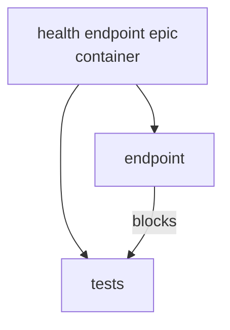
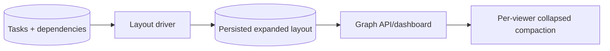

# Tasks, epics, dependencies and task graphs

A task is AQ's durable unit of work. This page explains how a task moves from an idea to completed work, how an epic groups work without becoming work itself, and how dependency graphs, formulas and layout make a large plan operable.

## Why it exists

An agent can only make a useful decision when the work, its prerequisites and its evidence are explicit. AQ stores those facts as tasks: a task says what should happen; a dependency says what must be true first; and a close records what actually happened. An **epic** (called a *container* in the data model) groups tasks into a hierarchy so a person can follow a plan without treating every parent as a job for a worker.

The graph view is a projection of that same durable work. It does not create a second workflow or decide whether work is runnable. It makes the hierarchy and relevant execution dependencies easier to inspect.

## Vocabulary

* **Task** — a durable record of a requested unit of work: title, description, priority, status, assignment information, deliverables and result evidence. See the [glossary](../reference/glossary.md).
* **Epic / container** — a task that owns child tasks. It is a planning and progress boundary; it may settle when its children settle and need not be claimed by a worker.
* **Dependency** — a typed directed edge from a downstream task to the task or container it needs. Only some types withhold readiness.
* **Deliverable** — a checkable promise attached to a task, such as a file, a test command, a command or a named registration. It is evaluated from local evidence at close time.
* **Formula** — a reusable, vault-backed `aq-graph` template with declared variables. A project formula can shadow a system formula of the same name.
* **Layout** — persisted, server-generated geometry for the task graph. A browser may derive a compact view from it when containers are collapsed.

## A realistic task graph

Suppose a team wants a small health endpoint. The epic is a container; its children are the actual worker tasks. `tests` waits for `endpoint`, but the epic itself does not need a worker claim.



This is a graph document that produces that structure. Save it as `health-graph.yaml`; `aq task create --graph` accepts JSON or YAML, and `--dry-run` validates and reports without writing rows.

```yaml
version: 1
parent:
  title: Health endpoint epic
  description: Add and verify a health endpoint.
nodes:
  - key: endpoint
    title: Add the health endpoint
    description: Return a small health response.
    acceptance:
      - GET /health returns 200.
    task_type: feature
  - key: tests
    title: Test the health endpoint
    description: Add focused endpoint coverage.
    acceptance:
      - The focused endpoint test passes.
    needs:
      - on: endpoint
        dep_type: blocks
    task_type: test
```

```bash
aq task create --project demo --graph health-graph.yaml --dry-run
```

The report contains a parent id, each node's assigned (or provisional) task id, the resolved edges, counts and `"dry_run": true`; a real invocation returns the same shape with `"created": true`. A new graph's children use dotted ids such as `solid-grove.1`; a graph added to an existing container reserves its child ordinals atomically.

After the dry run is satisfactory, omit `--dry-run`. Nodes start `DEFINED`; the normal cascade promotes an unblocked node to `READY`. The graph write is atomic: an invalid node, edge or context reference creates none of the parent, children or dependency rows. The implementation and report shape are in [src/task_graph/creator.py](../../src/task_graph/creator.py) and [src/task_graph/validator.py](../../src/task_graph/validator.py).

## Everyday lifecycle

### Create, refine, link and close

For a single task, create a focused request, then add a dependency only when it represents a real execution constraint. Use the actual identifiers returned by your installation.

```bash
aq task create --project demo --title "Add health endpoint" \
  --description "Return 200 from GET /health." --type feature \
  --deliverable '{"id":"endpoint","kind":"file","target":"src/health.py"}' \
  --deliverable '{"id":"tests","kind":"test","target":"aq test tests/test_health.py"}'

aq task edit --task-id <test-task-id> --priority 80
aq task add-dependency --task-id <test-task-id> --depends-on <endpoint-task-id> \
  --dep-type blocks
aq task deps --task-id <test-task-id>
```

`add-dependency` treats `--task-id` as the downstream task and `--depends-on` as its prerequisite. It validates task existence and rejects cycles on blocking edge types. `edit` is an operator-facing property update; workers should record their findings and work state with `aq task set` rather than changing a task's status directly.

A pool worker claims a `READY` task, makes and pushes its changes, then closes the task with reproducible evidence:

```bash
aq task close <task-id> --outcome pass \
  --summary "Added GET /health and focused coverage." \
  --test "aq test tests/test_health.py" \
  --command "ruff check src/health.py tests/test_health.py"

# After a failed or stopped attempt, an operator can deliberately make it
# eligible again (the state-machine event is RETRY / ADMIN_RESTART).
aq task restart <task-id> --yes
```

The close is the worker's completion event, not a claim that the code is already on the default branch. In the repository's configured development integration policy, completed source branches are collected and published later in validated batches. See [Integration](integration.md) for the separate meaning of *delivered*.

### Statuses and phases

`TaskStatus` has nine stored values. The claim record also has a finer-grained, transient phase; do not confuse it with a task status.

| State or phase | Meaning | What normally happens next |
|---|---|---|
| `DEFINED` | The task exists but is not yet eligible: it may have incomplete blocking dependencies, a gate, or routing work outstanding. | The cascade promotes it when its prerequisites are satisfied. |
| `READY` | Eligible for a compatible worker or pool claim. | A push scheduler can assign it, or a pool worker can claim it. |
| `ASSIGNED` | A push-scheduled worker has been selected but has not started. | `AGENT_STARTED` moves it to `IN_PROGRESS`; an execution error can return it to `READY`. |
| `claiming` / `preparing` / `active` | Claim-lease phases, not statuses: AQ is reserving a pool task, preparing its workspace, or has an active worker session. | A successful pool claim changes the task straight from `READY` to `IN_PROGRESS`. |
| `IN_PROGRESS` | A worker is executing the task. Graph containers can also use this status while their children are open, without being runnable worker work. | The worker closes it, it pauses, requests input, fails, or is stopped. |
| `WAITING_INPUT` | The worker asked a question and is awaiting a reply. | A reply resumes it; input timeout can pause it. |
| `PAUSED` | Work is temporarily stopped, for example token/backoff recovery or an explicit pause. | A resume timer or operator resume returns it to the ready path. |
| `COMPLETED` | AQ recorded successful task completion. | Integration may later deliver its branch; archival can move its record out of the active table. |
| `FAILED` | This attempt did not complete. It may be restarted while retry policy permits. | Restart/retry returns it to `READY`; exhausted retries become `BLOCKED`. |
| `BLOCKED` | Terminal failure or administrative stop requiring deliberate intervention. | An operator can restart or skip it; it does not quietly become complete. |

`delivered` is deliberately absent from this table: it is an integration journal outcome for branch content reaching the default branch, not a `TaskStatus`. Likewise, **archived** and **deleted** are data-lifecycle operations, not statuses. Archiving moves a terminal record to `archived_tasks` while retaining its identity and history; deletion removes an active task/subtree subject to hierarchy protections.

> **Compatibility note.** [src/state_machine.py](../../src/state_machine.py) is the authoritative transition table and dependency-cycle validator, but its strict enforcement setting ships off (`state_machine.enforce: false`). Current command paths still update durable task state through the command/database layer. Treat the table as the documented intended transition model, not a promise that every legacy write is rejected by that module today.

### Dependency types

The hierarchy (`parent_task_id`) tells readers what belongs together. Dependency edges tell AQ what waits for what. They are related but not interchangeable.

| Edge type | Blocks readiness? | Satisfaction / purpose |
|---|---:|---|
| `blocks` | Yes | The upstream task must be `COMPLETED`. Use for an ordinary prerequisite. |
| `parent-child` | Yes | Holds a child until its container has been released from `DEFINED`. This is an execution edge, separate from the structural parent field. |
| `waits-for` | Yes | Dynamic fan-in: waits for every `parent-child` child of the named container to complete. |
| `conditional-blocks` | Yes | A contingency runs only after the upstream task has terminally failed. If that upstream task completes, the contingency is closed as a no-op. |
| `discovered-from` | No | Provenance: this work was discovered while doing another task. |
| `related`, `duplicates`, `supersedes` | No | Association and planning metadata; these never withhold readiness. |

AQ checks cycles across every blocking type and also rejects an impossible `waits-for` edge from a descendant to its own ancestor. A non-blocking provenance cycle is allowed because it cannot deadlock execution. The source definitions are [src/models.py](../../src/models.py) and [src/state_machine.py](../../src/state_machine.py).

## Formulas and layout

### Formulas

A formula lives as Markdown under `vault/formulas/<name>.md` (system) or `vault/projects/<project>/formulas/<name>.md` (project). Its YAML frontmatter declares `name`, `description`, variables and an optional single `extends`; it contains exactly one fenced `aq-graph` document. Project formulas shadow a same-named system formula.

```bash
aq formula list --project-id demo
aq formula show health-endpoint --project-id demo --var service=api
aq formula cook health-endpoint --project-id demo --var service=api --dry-run
```

`show` is read-only: it resolves inheritance, substitutes variables and validates the result. `cook` creates the resulting graph in one transaction (or reports it with `--dry-run`) and records the resolved snapshot and provenance on the container. Cooking is an operator action, not an agent-session command. [src/task_graph/formulas.py](../../src/task_graph/formulas.py) keeps the in-memory registry fresh from vault changes and retains the previous valid formula if a half-saved edit cannot parse.

### Layout

The layout engine reads task hierarchy and selected sibling execution dependencies, then writes deterministic geometry for the `all` and `active` variants. It ranks only `blocks`, `waits-for` and `conditional-blocks` edges between siblings; hierarchy remains the nesting structure. This prevents a graph drawing from implying that every parent is a worker prerequisite.



The fully expanded layout is durable. Collapsing a container is a per-viewer derived calculation: it shrinks that container to a tile and reclaims space without rewriting the stored layout. Dirty marks cause incremental recomputation; a full tidy recomputes a project. The dashboard and API are consumers of the projection, while the layout driver owns the write process. See [src/task_graph/layout/driver.py](../../src/task_graph/layout/driver.py), [src/task_graph/layout/engine.py](../../src/task_graph/layout/engine.py), and [src/task_graph/layout/compaction.py](../../src/task_graph/layout/compaction.py).

## Inputs and outputs

| Mechanism | Inputs | Durable outputs |
|---|---|---|
| Single task | Project, title/description, optional profile, type, priority, deliverables and workspace requirements. | A `tasks` row plus optional labels, contexts, criteria and dependencies. |
| Graph / formula | Parsed nodes, parent, edges, declared variables and optional vault references. | Container and child task rows, hierarchy, edges, contexts, criteria, labels and formula provenance — all or nothing. |
| Close | `pass` or `fail`, summary, branch/commit information, and repeatable test/command evidence. | Task result, summary note where configured, completion state and deliverable evaluation. |
| Layout | Project snapshot, hierarchy, relevant sibling edges, statuses and dirty marks. | `task_layouts`, layout cells and project layout metadata for `all`/`active` views. |

## State ownership

* **PostgreSQL task model** owns active task rows, typed dependencies, hierarchy, labels, contexts, deliverable declarations/results, comments, claims and archive rows. The query and lifecycle paths are the source of runtime truth.
* **The command handler** owns user-visible mutations: create, edit, dependency changes, close, archive, delete, pause and restart all enter through its command contracts.
* **The cascade and scheduler/pool claim paths** own readiness, assignment and leases. A `hold:<who>` label can intentionally keep an otherwise ready task out of the runnable frontier.
* **The vault** owns formula source Markdown and receives completion summary notes; formula snapshots/provenance are recorded with the cooked container so an old cook remains auditable.
* **The layout tables** own expanded server geometry. Browser expansion state is viewer-local, so compaction is derived rather than persisted.
* **Integration** owns delivery journals and branch publication state. It is intentionally separate from task completion.

## Common failures and recovery

| Symptom | Diagnose | Recovery |
|---|---|---|
| A task stays `DEFINED` or does not run. | `aq task explain <task-id>` and `aq task deps --task-id <task-id>` show persistent dependency/gate reasons before transient capacity reasons. | Complete/remove the real prerequisite, resolve the indicated gate, remove an intentional hold when appropriate, or supply the missing route/capacity. Do not force status merely to bypass a real blocker. |
| Adding an edge is refused as a cycle. | Read the named task ids in the command error and inspect `aq task deps`. | Reverse or remove the incorrect blocking relationship. Use `related` or `discovered-from` for an informational relationship, not `blocks`. |
| A graph/formula validation fails. | Run the same `--dry-run`; findings identify malformed nodes, unknown keys, bad dependency types, cycles or inaccessible `spec_ref` paths. | Fix the source document. A failure creates no partial graph; formula registry errors preserve the prior valid formula. |
| A worker's close is refused for missing evidence. | Compare declared deliverables with the `--test` and `--command` records supplied to close. | Run the named focused check, record its exact repeatable command, or explicitly mark a deliberately unshipped item with `--deliverable-unmet 'id: reason'`. |
| A task needs another attempt. | Inspect `aq task get-result --task-id <task-id>` and the task's failure context. | Use the operator restart path for a failed/stopped task after fixing the cause; exhausted retries require deliberate handling rather than silent looping. |
| Deletion is refused because branches exist. | `aq task delete` reports the protected branch-discard condition and names the affected branches. | Decide explicitly: `--branches keep` preserves remote refs; `--branches delete` discards them. Use `--cascade` only when the whole subtree is intended. |
| Completed work is not on the default branch. | Check the project's integration status and delivery journal. | Treat completion and delivery separately; a parked batch retains the source branch and is repaired or retried through integration policy. |

Archiving is the safer history-retention operation for a terminal task. It moves the task into the archive while preserving its identity and task history; permanently deleting an archived record is a separate, more destructive action.

## Related pages

* [Integration](integration.md) explains why a completed task can still await branch delivery.
* [Sessions](sessions.md) explains worker sessions, pool claims and the transient claim phases.
* [Agents and routing](agents-and-routing.md) explains how AQ selects a compatible worker and intelligence class.
* [Module catalog: tasks](../reference/modules/tasks.md) maps this topic to every production module it owns.
* [CLI task reference](../reference/cli/commands.md) is the command-oriented companion when you need exact flags.

## Source and tests

The lifecycle table and cycle checks are in [src/state_machine.py](../../src/state_machine.py); task statuses and dependency types are in [src/models.py](../../src/models.py). Task graph parsing, validation, creation and formulas live under [src/task_graph/](../../src/task_graph/); layout lives in [src/task_graph/layout/](../../src/task_graph/layout/). Supporting lifecycle helpers are [src/deliverables.py](../../src/deliverables.py), [src/task_names.py](../../src/task_names.py), [src/task_summary.py](../../src/task_summary.py), and [src/explain.py](../../src/explain.py).

Focused checks for these behaviors are `aq test tests/test_state_machine.py tests/test_deliverables.py tests/test_explain.py tests/test_task_graph.py tests/test_create_task_graph_command.py tests/test_formulas_parse.py tests/test_formulas_resolve.py tests/test_formula_commands.py tests/task_graph tests/test_api_graph_layout.py`.
