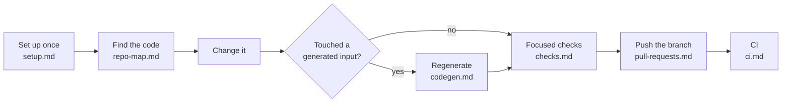

# Contributing to Agent Queue

How to get a development checkout of AQ working, change one piece of it, and
prove the change is good — without running the whole test suite.

If you are trying to *use* AQ rather than change it, start at the
[documentation home](../README.md) instead.

## Why this section exists

AQ is a background service with a lot of surface: a Python daemon, a REST and
WebSocket API, a React dashboard, two generated API clients, a PostgreSQL
schema under Alembic, and roughly fourteen thousand tests. Almost none of that
is relevant to any one change. These pages exist so that a first-time
contributor can answer one question quickly:

> I changed *this* file. What do I run?

The short answer is: the focused test file for the module you touched, `ruff`
on the files you edited, and — if you touched the API surface or the frontend
— one regeneration or build command. Everything else is somebody else's job,
usually [CI's](ci.md).

## Vocabulary

These pages use AQ's own words. The full list is in the
[glossary](../reference/glossary.md); the ones that matter here are:

* **Daemon** — the long-running `agent-queue` process that owns the database.
  A contributor's checkout normally does *not* run it; see
  [never migrate the operator's database](setup.md#never-migrate-the-operators-database).
* **Worktree slot** — an isolated Git worktree AQ hands to a worker session.
  If you are an agent reading this, you are probably in one.
* **Test slot** — one of a small number of box-wide `flock` slots that
  `aq test` takes before it starts pytest, so several contributors (or several
  agents) testing at once cannot saturate the machine. See
  [testing](testing.md#the-aq-test-wrapper).
* **Generated artefact** — a file in the repository that is written by a
  command and never by hand: `openapi.json`, `packages/aq-client/`, the
  TypeScript client, the playbook JSON schema, the CLI inventory. See
  [code generation](codegen.md).

## The contributor loop



The loop is deliberately small. A change that needs more than one regeneration
step, or that cannot be checked without the full suite, is usually a change
that wants splitting.

## The pages

| Page | Read it when |
|---|---|
| [Development setup](setup.md) | First checkout: Python, PostgreSQL, editable installs, Node, pre-commit. |
| [Repository map](repo-map.md) | You know what you want to change but not where it lives. |
| [Testing](testing.md) | Before you run anything. Test layout, markers, `aq test`, the PostgreSQL fixtures. |
| [Testing the installer](installer-testing.md) | You are changing `aq install`, or signing off a platform. What is faked, and what still needs a real machine. |
| [Code generation](codegen.md) | You changed the API surface, the playbook model, the CLI, or the frontend client. |
| [Local checks](checks.md) | You are about to push and want the shortest sufficient check list. |
| [Scripts](scripts.md) | You found a file in `scripts/` and want to know whether to trust it. |
| [Continuous integration](ci.md) | You want to know what CI runs, when, and what it does not run. |
| [Pull requests and delivery](pull-requests.md) | Your change is ready and you want it on `main`. |
| [Builds and releases](releases.md) | You are packaging, versioning, or building the dashboard. |
| [Documentation style](documentation-style.md) | You are writing or editing anything under `docs/`. |

## A first change, end to end

Assumes a completed [setup](setup.md) and a checkout on a branch of your own.

```bash
# 1. Change one backend module.
$EDITOR src/cli/test_runner.py

# 2. Lint just what you touched.
ruff check src/cli/test_runner.py

# 3. Run the focused test file for that module.
aq test tests/test_cli_test_runner.py
```

```text
aq test: slot 0 of 2, -n 3
$ .../python -m pytest -n 3 --dist loadfile -m 'not perf and not migration and not slow and not tmux and not integration' tests/test_cli_test_runner.py
```

Nothing else is required for a change of that shape: no migration, no
regeneration, no frontend build. [Local checks](checks.md) lists which kinds of
change *do* pull in an extra step, and [testing](testing.md) explains how to
find the focused test file when the name is not obvious.

## Common failures and recovery

| Symptom | Cause | What to do |
|---|---|---|
| `POSTGRES_TEST_DSN is not set` | The suite has no PostgreSQL to build throwaway databases in. | [Start the service and export the DSN](setup.md#postgresql-for-tests). |
| `aq test: waiting 12s for 1 of 2 test slot(s)` | The box is busy, not broken. | Wait. Exit code 75 means no slot came free; retry. |
| `aq test: no such test path: …` | A typo in a path, refused before a slot is taken. | Fix the path — nothing ran. |
| `schema behind code; ask the operator to upgrade` | You are inside a worktree slot and something tried to migrate the daemon's database. | Report it. Do not migrate. See [setup](setup.md#never-migrate-the-operators-database). |
| `stale artefact(s): …module-ownership.json` | The foundation-owned coverage manifest is behind the tree. Only `--check-artefacts` reports it. | Nothing, unless you own the overhaul's foundation/acceptance shard. See [the map](../documentation-map.md#who-runs-which-half). |

## Related pages

* [Documentation home](../README.md) — the reading order for everything else.
* [Glossary](../reference/glossary.md) — the vocabulary these pages assume.
* [Resource gating](../guides/resource-gating.md) — why `aq test` exists and
  what the three enforcement layers are.
* [Migrations](../guides/migrations.md) — the daemon-only path for schema
  changes, and the guard that stops a worker from taking it.
* [Documentation map](../documentation-map.md) — which page owns which subject.

## Source and tests

The tooling these pages describe lives in
[`src/cli/test_runner.py`](../../src/cli/test_runner.py),
[`src/resources/`](../../src/resources/), [`scripts/`](../../scripts/) and
[`.github/workflows/`](../../.github/workflows/). The module-by-module catalog
is [the contributing coverage shard](../reference/modules/contributing.md).

```bash
aq test tests/test_cli_test_runner.py tests/test_resource_semaphore.py
```
