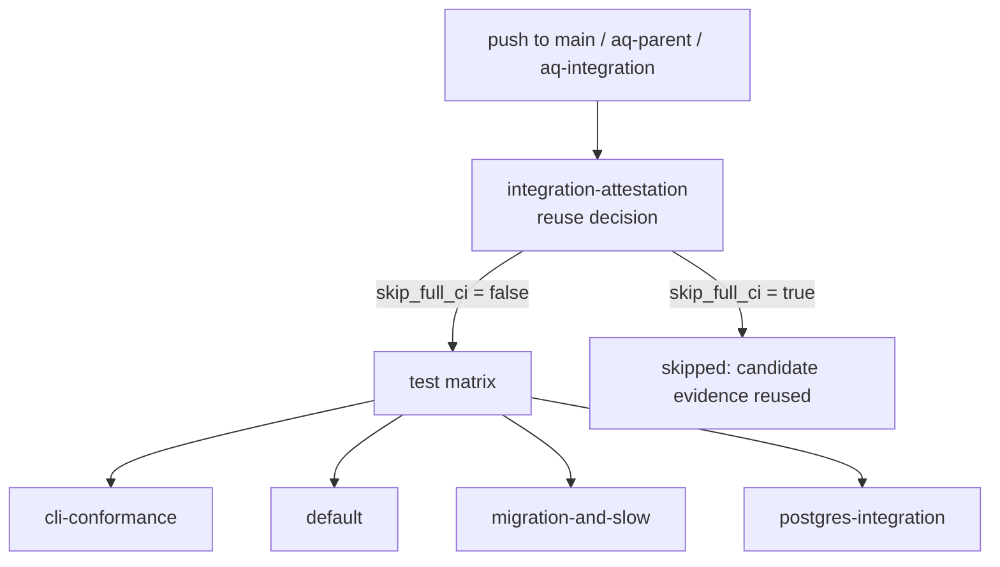

# Continuous integration

What GitHub Actions runs for Agent Queue, when it runs, and — just as
important — what it does not run.

## Why this page exists

AQ's CI is unusual in two ways that surprise people. First, the test workflow
has **no `pull_request` trigger**: it runs on pushes to `main` and to the
integration branches AQ itself creates, not on every PR. Second, `main`'s
concurrency group is keyed by *commit* rather than by ref, which is the opposite
of the usual advice — for a reason described below. Knowing both saves you from
waiting for a check that is never going to appear.

## Vocabulary

* **Suite arm** — one entry in the test job's matrix. Four run in parallel,
  each with its own pytest command.
* **Integration branch** — a branch AQ's integration service creates to assemble
  and test candidate work before it reaches `main`; its refs look like
  `aq/integration/p-<32 hex>/r-<32 hex>`.
* **Attestation** — the fail-closed decision about whether a `main` run may
  reuse an integration candidate's existing CI evidence instead of re-running
  everything.

## The workflows

One, in [`.github/workflows/`](../../.github/workflows/). There was a second,
`docs.yml`, which built a MkDocs site and deployed it to GitHub Pages; it was
retired — see [there is no documentation
build](#there-is-no-documentation-build).

| Workflow | Triggers | What it does |
|---|---|---|
| [`tests.yml`](../../.github/workflows/tests.yml) | Push to `main`, `aq/parent/**`, `aq/integration/**`, `aq/sound-current`; `workflow_dispatch` | The attestation decision, then a four-arm test matrix against a real PostgreSQL service. |

> **Note.** There is no `pull_request` trigger anywhere. A PR from an ordinary
> task branch gets no `Tests` check. Work reaches `main` through AQ's own
> integration path ([pull requests and delivery](pull-requests.md)), and that
> path pushes the branches the workflow does watch. The duplicate-PR
> suppression output in the attestation job is a remnant of the era when PRs
> did trigger it; it evaluates to `false` for every event that fires today.

## `tests.yml`



### The attestation job

`integration-attestation` runs first, on a checkout pinned to the exact event
SHA (with a `git rev-parse HEAD` assertion that it really is that revision, and
`persist-credentials: false`). For a push to `main` it reads the workflow-run
evidence for that SHA from the GitHub API — only runs whose head branch matches
the strict `aq/integration/p-<32 hex>/r-<32 hex>` pattern and whose head SHA is
identical — and hands it to
[`scripts/check-integration-attestation.py`](../../scripts/check-integration-attestation.py),
which decides, fail-closed, whether the full matrix can be skipped because the
identical revision has already been tested as an integration candidate. Any API
failure yields empty evidence, and empty evidence means "run everything".

### The four suite arms

| Arm | Command |
|---|---|
| `cli-conformance` | `aq test tests/test_cli_inventory.py tests/test_cli_conformance.py` |
| `default` | `pytest tests/ -n auto --dist loadfile` |
| `migration-and-slow` | `pytest tests/ -n auto --dist loadfile -m "migration or slow"` |
| `postgres-integration` | `pytest tests/ -n auto --dist loadfile -m "integration or perf"` |

`fail-fast: false`, so one red arm does not hide the others; the job times out
at 30 minutes.

The `default` arm inherits the marker deselects from `pyproject.toml`'s
`addopts`, which is why the other two arms exist: they select exactly what the
default one drops. The `cli-conformance` arm is separated so a CLI-surface
change fails visibly instead of inside fourteen thousand other results, and it
is the one arm that goes through the `aq test` wrapper.

Wall-clock budgets still skip in the `postgres-integration` arm: they need
`AQ_PERF_STRICT=1`, which CI does not set, because a hosted runner's load makes
them measure the runner rather than the code. Statement-count budgets, which
are deterministic, do run. See [testing](testing.md#latency-budgets).

### Environment

* A `postgres:18` service container, with `POSTGRES_TEST_DSN` pointed at it.
  [`tests/pg_dsn.py`](../../tests/pg_dsn.py) rewrites that DSN per xdist worker
  (`…_gw0`, `…_gw1`, …) and creates each worker's database on first use —
  sharing one database across concurrent workers would let one worker's reset
  truncate another's in-flight state.
* `AQ_REQUIRE_POSTGRES_TESTS=1`, a compatibility guard for helpers imported
  outside normal pytest startup.
* `GIT_AUTHOR_*` / `GIT_COMMITTER_*` identities, because the Git-integration
  tests create real commits and hosted runners ship with none.
* A separate step applies the whole Alembic chain to a scratch database
  (`ci_migration_check`) before the tests run, so a migration that only works
  against an already-populated database fails loudly. The SQLite half of this
  check went away with the backend — it was never a proxy for production, since
  SQLite accepted DDL PostgreSQL rejects outright.

### Why `main` is keyed by commit

```yaml
concurrency:
  group: tests-${{ github.ref }}-${{ github.ref == 'refs/heads/main' && github.sha || 'head' }}
  cancel-in-progress: ${{ github.ref != 'refs/heads/main' }}
```

With one group per ref, GitHub keeps at most one *pending* run, so a burst of
merges cancels every queued `main` run but the newest — and a merge commit can
end up never tested on `main` at all. That is not hypothetical: two PRs, each
green on its own stale base, put a red `main` together on 2026-09-03 (one
committed a generated file, the other changed how it is generated).

Keying `main`'s group by commit gives every merge commit its own run, so a red
`main` is attributed to the commit that caused it within one CI cycle and needs
no bisecting. Integration branches keep one group per ref, so a newer push
supersedes their obsolete checks.

The same incident is why generated artefacts and the change that causes them
belong in one commit — see [code generation](codegen.md#state-ownership).

## There is no documentation build

This documentation set is **GitHub-rendered Markdown with relative links**.
Nothing compiles it, nothing deploys it, and there is no documentation site.

It used to have one. `.github/workflows/docs.yml` built a MkDocs Material site
on every push to `main` touching `docs/**` and published it to GitHub Pages at
`electricjack.github.io/agent-queue/`. That site predated this documentation
set and was never migrated to it: by the time it was removed, **49 of the 77
pages listed in `mkdocs.yml`'s `nav:` block did not exist** — the entire
`mkdocstrings` `api/` tree plus `getting-started.md`, `architecture.md` and the
`git-sync-*.md` pages — so the deploy served a stale, partly-404 mirror of the
documentation on every merge.

Rather than maintain a second navigation over the same tree, the site was
retired. `mkdocs.yml`, `.github/workflows/docs.yml`, `scripts/generate-docs.sh`
and `pyproject.toml`'s `docs` extra were all deleted; the one navigation that
remains is [the documentation map](../documentation-map.md).

> **Operator step.** Deleting the workflow stops future deploys but does not
> remove what is already published. The `github-pages` environment and the
> Pages site itself are repository settings and have to be disabled by hand
> (Settings → Pages → *Unpublish site*, then Settings → Environments →
> `github-pages`).

Practical consequence for a documentation change: your links must resolve in
the GitHub file browser, from the directory of the file they are in. Nothing
else checks them, so run [`check-docs.py`](../../scripts/check-docs.py) over
the pages you edited. The one check that gates a push is the coverage
manifest:

```bash
python3 docs/plans/documentation-overhaul/refresh_inventory.py --check
```

## What CI does not do

* It does not run on pull requests.
* It does not lint. Ruff runs in [pre-commit](checks.md#lint) if you install
  the hooks, and nowhere else.
* It does not build or test the dashboard. `npm run lint`, `typecheck` and
  `vitest` are local-only ([checks](checks.md#frontend)).
* It does not run the [end-to-end kit](scripts.md#supported-end-to-end-kit).
* It does not publish anything. There is no release workflow and no
  documentation deploy — see [builds and releases](releases.md) and
  [above](#there-is-no-documentation-build).

## Inputs and outputs

| Input | Output |
|---|---|
| A push to a watched branch | Four check runs plus the attestation decision |
| Integration-candidate evidence for the identical SHA | Possibly a skipped matrix, decided fail-closed |
| `workflow_dispatch` | The same matrix, on demand, from the Actions tab |

## State ownership

CI owns nothing durable. Every database it creates lives in an ephemeral
service container, and no job writes back to the repository. The attestation
job holds only `actions: read`, `contents: read` and `checks: read`; the test
job's checkout uses the default token and pushes nothing.

## Common failures and recovery

| Symptom | Likely cause | Do |
|---|---|---|
| No `Tests` check on your PR | Expected — there is no `pull_request` trigger. | Use the local checks; delivery to `main` runs CI on the integration branch. |
| `default` arm red, others green | An ordinary regression. | Reproduce locally: `aq test <the failing file>`. |
| `migration-and-slow` red only | You touched schema or a migration. | Reproduce with `-m "migration or slow"` on those files. |
| `postgres-integration` red only | A statement-count budget moved, or an `integration`-marked test. | `aq test -m "integration or perf" <file>` on a quiet box. |
| `cli-conformance` red | The CLI inventory is stale. | `python scripts/generate-cli-command-inventory.py` |
| `main` red immediately after a merge | Two changes that are individually green and jointly broken. | The run is attributed to the exact merge commit; fix forward on `main`. |

## Related pages

* [Local checks](checks.md) — how to be reasonably sure before you push.
* [Testing](testing.md) — the markers the four arms slice by.
* [Code generation](codegen.md) — the drift guards CI enforces.
* [Pull requests and delivery](pull-requests.md) — how work actually reaches `main`.
* [Scripts](scripts.md#supported-ci-and-integration) — the attestation helper.

## Source and tests

[`.github/workflows/tests.yml`](../../.github/workflows/tests.yml),
[`scripts/check-integration-attestation.py`](../../scripts/check-integration-attestation.py),
[`.github/agent-queue-integration.example.json`](../../.github/agent-queue-integration.example.json).

```bash
aq test tests/test_integration_attestation.py tests/test_attestation_check_run_id.py tests/test_ci_trigger_policy.py
```
