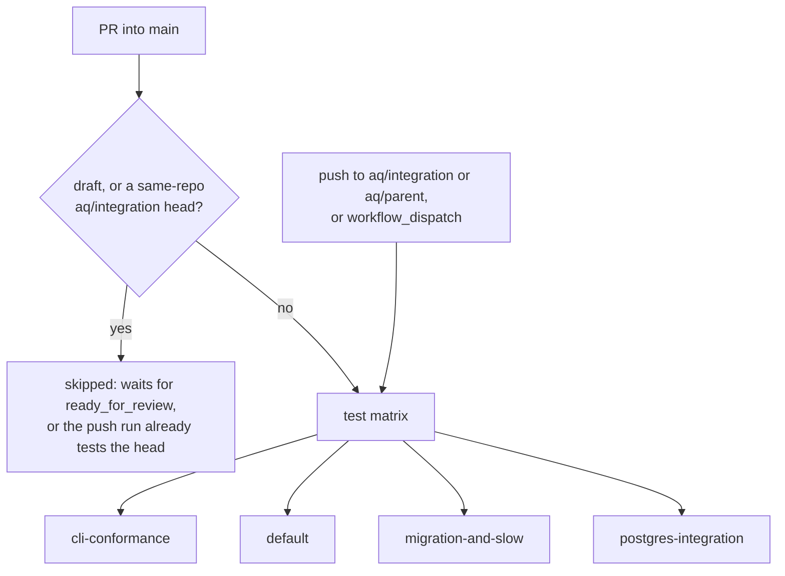

# Continuous integration

What GitHub Actions runs for Agent Queue, when it runs, and — just as
important — what it does not run.

## Why this page exists

AQ's CI runs the full suite **before** a change reaches `main`, never after.
The test workflow runs on pull requests into `main` and on pushes to the
integration branches AQ itself creates. A push to `main` does not start it, so
`main`'s own commits carry only the checks of the candidate or PR run that
tested them. Knowing that saves you from waiting for a run that is never going
to appear.

## Vocabulary

* **Suite arm** — one entry in the test job's matrix. Four run in parallel,
  each with its own pytest command.
* **Integration branch** — a branch AQ's integration service creates to assemble
  and test candidate work before it reaches `main`; its refs look like
  `aq/integration/p-<32 hex>/r-<32 hex>`. The train promotes the exact SHA
  tested there.
* **Parent snapshot ref** — an immutable
  `aq/parent/<task>/<operation hash>/<generation>/<sha>` ref that parent CI
  ([`src/integration/parent_ci.py`](../../src/integration/parent_ci.py))
  publishes so the workflow tests one parent generation.

## The workflows

Two, in [`.github/workflows/`](../../.github/workflows/). There was a third,
`docs.yml`, which built a MkDocs site and deployed it to GitHub Pages; it was
retired — see [there is no documentation
build](#there-is-no-documentation-build).

| Workflow | Triggers | What it does |
|---|---|---|
| [`tests.yml`](../../.github/workflows/tests.yml) | `pull_request` into `main` (opened, synchronize, reopened, ready_for_review); push to `aq/integration/**` and `aq/parent/**`; `workflow_dispatch` | A four-arm test matrix against a real PostgreSQL service. |
| [`macos-acceptance.yml`](../../.github/workflows/macos-acceptance.yml) | Push to `ci/macos-acceptance**`; `workflow_dispatch` | The native macOS install journey, recorded by a human rather than gating a merge. |

> **Note.** No workflow runs on a push to `main`. Everything that reaches
> `main` was tested first: by its PR's run, as the integration candidate the
> train promotes by exact SHA, or by the development publisher's pre-publish
> validation ([pull requests and delivery](pull-requests.md)). The per-commit
> `main` run this replaced repeated that work: 66 runs in the two days before
> 2026-09-24.

## `tests.yml`



### Which pull requests run

Every pull request into `main` runs the matrix, from a fork or a task branch
alike, with two exceptions decided by the job's `if:`:

* A **draft** runs nothing until it is marked ready for review; the
  `ready_for_review` event then starts the run.
* A **same-repository PR whose head is an `aq/integration/**` branch** skips its
  run, because the push to that branch already tested the same head SHA and
  those check runs appear on the PR. A fork's branch of the same name gets no
  push run here, so its PR still runs.

The job checks out the exact event SHA (the PR's merge with its base, for a
`pull_request` event) and asserts it with `git rev-parse HEAD`.

### The four suite arms

| Arm | Command |
|---|---|
| `cli-conformance` | `aq test tests/test_cli_inventory.py tests/test_cli_conformance.py` |
| `default` | `pytest tests/ -n auto --dist loadfile` |
| `migration-and-slow` | `pytest tests/ -n auto --dist loadfile -m "migration or slow"` |
| `postgres-integration` | `pytest tests/ -n auto --dist loadfile -m "integration or perf"` |

Every arm appends `--timeout=120 --durations=50 -rfE` to its command.
`pytest-timeout` (installed by the `dev` extra) limits each test to 120 seconds,
including fixture setup and teardown. A timeout names the failed test and dumps
thread stacks; `-rfE` keeps failed/error node IDs in the final summary, and
`--durations=50` reports the 50 slowest setup, call and teardown phases.

Known slow tests may use a bounded `@pytest.mark.timeout(seconds)` override.
The stateful CLI smoke has a 1,800-second limit covering its existing setup,
smoke subprocess and cleanup deadlines. This does not extend the job deadline.
See [pytest-timeout's documentation](https://github.com/pytest-dev/pytest-timeout)
for marker precedence and timeout behavior.

`fail-fast: false`, so one red arm does not hide the others; each job times out
at 10 minutes, including installation and migrations. These limits bound
failures and improve diagnostics. Profiling on 2026-09-26 measured
the default suite at about 21 minutes and the stateful CLI smoke at 11–16
minutes. Those workloads need further runtime or sharding work to finish within
the cap and reach the goal of less than five minutes per job.

The `default` arm inherits the marker deselects from `pyproject.toml`'s
`addopts`, which is why the other two arms exist: they select exactly what the
default one drops. The `cli-conformance` arm is separated so a CLI-surface
change fails visibly instead of inside fourteen thousand other results, and it
is the one arm that goes through the `aq test` wrapper.

Wall-clock budgets still skip in the `postgres-integration` arm: they need
`AQ_PERF_STRICT=1`, which CI does not set, because a hosted runner's load makes
them measure the runner rather than the code. Statement-count budgets, which
are deterministic, do run. See [testing](testing.md#latency-budgets).

### Environment

* A `postgres:18` service container, with `POSTGRES_TEST_DSN` pointed at it.
  [`tests/pg_dsn.py`](../../tests/pg_dsn.py) rewrites that DSN per xdist worker
  (`…_gw0`, `…_gw1`, …) and creates each worker's database on first use —
  sharing one database across concurrent workers would let one worker's reset
  truncate another's in-flight state.
* `AQ_REQUIRE_POSTGRES_TESTS=1`, a compatibility guard for helpers imported
  outside normal pytest startup.
* `GIT_AUTHOR_*` / `GIT_COMMITTER_*` identities, because the Git-integration
  tests create real commits and hosted runners ship with none.
* A separate step applies the whole Alembic chain to a scratch database
  (`ci_migration_check`) before the tests run, so a migration that only works
  against an already-populated database fails loudly. The SQLite half of this
  check went away with the backend — it was never a proxy for production, since
  SQLite accepted DDL PostgreSQL rejects outright.

### Concurrency

```yaml
concurrency:
  group: tests-${{ github.ref }}
  cancel-in-progress: true
```

One group per ref: `refs/pull/<n>/merge` for a PR, the branch for an
integration candidate. A newer push to the same PR or integration branch
cancels its obsolete run. Parent snapshot refs are named by SHA, so no two
share a group.

Until 2026-09-24 `main` was a trigger and its group was keyed by commit, so a
burst of merges could not cancel the run of the merge commit that broke it (two
PRs, each green on its own stale base, put a red `main` together on
2026-09-03). That class is now caught before `main`: in train mode the train
tests the assembled candidate and promotes that exact SHA, and `pr_merge`
refuses a PR whose head is behind its base
(`integration.merge_require_up_to_date`, on by default), so its PR run tested
the combination that lands.

The same incident is why generated artefacts and the change that causes them
belong in one commit — see [code generation](codegen.md#state-ownership).

## There is no documentation build

This documentation set is **GitHub-rendered Markdown with relative links**.
Nothing compiles it, nothing deploys it, and there is no documentation site.

It used to have one. `.github/workflows/docs.yml` built a MkDocs Material site
on every push to `main` touching `docs/**` and published it to GitHub Pages at
`electricjack.github.io/agent-queue/`. That site predated this documentation
set and was never migrated to it: by the time it was removed, **49 of the 77
pages listed in `mkdocs.yml`'s `nav:` block did not exist** — the entire
`mkdocstrings` `api/` tree plus `getting-started.md`, `architecture.md` and the
`git-sync-*.md` pages — so the deploy served a stale, partly-404 mirror of the
documentation on every merge.

Rather than maintain a second navigation over the same tree, the site was
retired. `mkdocs.yml`, `.github/workflows/docs.yml`, `scripts/generate-docs.sh`
and `pyproject.toml`'s `docs` extra were all deleted; the one navigation that
remains is [the documentation map](../documentation-map.md).

> **Operator step.** Deleting the workflow stops future deploys but does not
> remove what is already published. The `github-pages` environment and the
> Pages site itself are repository settings and have to be disabled by hand
> (Settings → Pages → *Unpublish site*, then Settings → Environments →
> `github-pages`).

Practical consequence for a documentation change: your links must resolve in
the GitHub file browser, from the directory of the file they are in. Nothing
else checks them, so run [`check-docs.py`](../../scripts/check-docs.py) over
the pages you edited. The one check that gates a push is the coverage
manifest:

```bash
python3 docs/plans/documentation-overhaul/refresh_inventory.py --check
```

## What CI does not do

* It does not run on a push to `main`, or on a push to a task branch that has
  no PR. Use `gh workflow run tests.yml --ref <branch>` for either.
* It does not lint. Ruff runs in [pre-commit](checks.md#lint) if you install
  the hooks, and nowhere else.
* It does not build or test the dashboard. `npm run lint`, `typecheck` and
  `vitest` are local-only ([checks](checks.md#frontend)). The dashboard
  *server*'s Python suites (`tests/test_dashboard_server_*.py`) do run, in the
  default arm like any other test file; they stage a small synthetic bundle
  rather than building the real one.
* It does not run the [end-to-end kit](scripts.md#supported-end-to-end-kit).
* It does not publish anything. There is no release workflow and no
  documentation deploy — see [builds and releases](releases.md) and
  [above](#there-is-no-documentation-build).

## Inputs and outputs

| Input | Output |
|---|---|
| A PR into `main` opened, updated, reopened or marked ready | Four check runs on the PR's merge with its base |
| A push to `aq/integration/**` or `aq/parent/**` | Four check runs on that exact SHA, which the integration service reads as candidate or parent evidence |
| A draft PR, or a same-repository PR from `aq/integration/**` | A skipped job; the push run covers the integration head |
| `workflow_dispatch` | The same matrix, on demand, from the Actions tab |

## State ownership

CI owns nothing durable. Every database it creates lives in an ephemeral
service container, and no job writes back to the repository. The workflow holds
only `contents: read`; the test job's checkout uses the default token and
pushes nothing.

## Common failures and recovery

| Symptom | Likely cause | Do |
|---|---|---|
| No `Tests` check on your PR | The PR is a draft, or it does not target `main`. | Mark it ready for review, or run `gh workflow run tests.yml --ref <branch>`. |
| No `Tests` run on a `main` commit | Expected — a push to `main` is not a trigger. A promoted candidate's commit shows its integration run's checks. | `gh workflow run tests.yml --ref main` if you need one. |
| `default` arm red, others green | An ordinary regression. | Reproduce locally: `aq test <the failing file>`. |
| `migration-and-slow` red only | You touched schema or a migration. | Reproduce with `-m "migration or slow"` on those files. |
| `postgres-integration` red only | A statement-count budget moved, or an `integration`-marked test. | `aq test -m "integration or perf" <file>` on a quiet box. |
| `cli-conformance` red | The CLI inventory is stale. | `python scripts/generate-cli-command-inventory.py` |
| `main` red after a change landed | Two changes that are individually green and jointly broken, or a change that reached `main` without a run. | Reproduce with `aq test` on the failing files, or dispatch a run on `main`; fix forward. |

## Related pages

* [Local checks](checks.md) — how to be reasonably sure before you push.
* [Testing](testing.md) — the markers the four arms slice by.
* [Code generation](codegen.md) — the drift guards CI enforces.
* [Pull requests and delivery](pull-requests.md) — how work actually reaches `main`.
* [CI at integration boundaries](../guides/integration-ci-boundaries.md) — the
  trigger policy and parent snapshot refs.

## Source and tests

[`.github/workflows/tests.yml`](../../.github/workflows/tests.yml),
[`src/integration/parent_ci.py`](../../src/integration/parent_ci.py),
[`.github/agent-queue-integration.example.json`](../../.github/agent-queue-integration.example.json).

```bash
aq test tests/test_ci_trigger_policy.py tests/test_agent_queue_train_policy.py tests/test_integration_attestation.py tests/test_attestation_check_run_id.py
```
