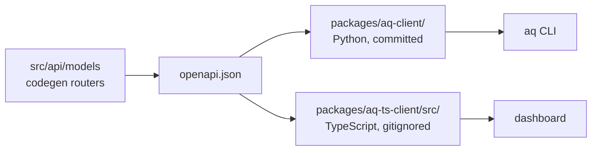

# Code generation

The files in this repository that are written by a command and never by hand,
what generates each one, and what fails if you edit it yourself.

## Why this page exists

Roughly 1,450 of AQ's tracked files are generated. They are committed — so a
fresh checkout builds without a code-generation step, and so a diff shows the
consequence of an interface change — but they are **not source**. Hand-editing
one produces a change that the next regeneration silently reverts, and several
of them have drift guards that will fail your build first.

This page is the list, in the order a change is most likely to reach them.

## Vocabulary

* **Drift guard** — a test that regenerates an artefact in memory and fails if
  the committed copy differs.
* **Pinned generator** — a code generator whose exact version is declared, so
  that the output is a function of the input rather than of the machine.
* **Resource family** — how generated code is documented: one entry per family
  naming the schema it comes from and the command that rebuilds it, never file
  by file.

## The artefacts

| Artefact | Generated from | Command | Committed? |
|---|---|---|---|
| [`openapi.json`](../../openapi.json) | The FastAPI app, built offline from the checkout | `./scripts/regenerate-api-client.sh --offline` | yes |
| [`packages/aq-client/`](../../packages/aq-client/) (1,442 files) | `openapi.json` + a pinned `openapi-python-client` | the same command | yes |
| `packages/aq-ts-client/src/` | `openapi.json` + `@hey-api/openapi-ts` | `./scripts/regenerate-ts-client.sh --from-file` | **no** — gitignored |
| [`src/playbook_v2_schema.json`](../../src/playbook_v2_schema.json) | The Playbook V2 Pydantic model | `python scripts/generate-playbook-schema.py` | yes |
| [`docs/reference/cli-command-inventory.json`](../reference/cli-command-inventory.json) | The live `aq` Click tree | `python scripts/generate-cli-command-inventory.py` | yes |
| [`docs/reference/playbook-commands/`](../reference/playbook-commands/README.md) (one page per registered command, plus the index) | The command contract registry — the generated block only | `python scripts/gen-command-docs.py` | yes |
| [`src/prompts/reviewed_playbooks/`](../../src/prompts/reviewed_playbooks/) | Shipped playbook markdown, through a human review step | `python scripts/rebuild-reviewed-playbook-artifacts.py` | yes |
| [`module-inventory.json`](../plans/documentation-overhaul/module-inventory.json), [`module-ownership.json`](../plans/documentation-overhaul/module-ownership.json) | `git ls-files` + ownership rules | `python3 docs/plans/documentation-overhaul/refresh_inventory.py` — **owning shard only**, see [below](#the-documentation-coverage-manifest) | yes |

Every one of them has a `--check` (or an equivalent test) that answers "is the
committed copy current?" without writing anything. The coverage manifest is the
one exception to "regenerate in the same commit as the input": its freshness
check is `--check-artefacts` and belongs to the shard that owns the file.

## The API surface



After **any** change to `src/api/models` or a codegen router:

```bash
./scripts/regenerate-api-client.sh --offline
./scripts/regenerate-ts-client.sh --from-file
```

Both scripts print what they did and where they wrote it. To check whether a
regeneration is needed at all — without writing anything — run the drift
guards:

```bash
aq test tests/test_api_client_contract.py
```

```text
======================== 9 passed, 8 warnings in 17.80s ========================
```

`--offline` is the canonical path: `create_app()` builds the whole route
surface from the command registry, so the spec is a pure function of the
checkout and cannot pick up another instance's state
([`src/api/spec.py`](../../src/api/spec.py)). The other two modes exist for
completeness — no argument fetches from a running daemon at
`AGENT_QUEUE_API_URL` (default `http://127.0.0.1:8081`), and `--from-file`
reuses the saved spec. Both render through the same writer so the committed
file stays indented and diffable; the daemon serves it minified, and writing
that straight to disk produces an undiffable single line the drift guard
rejects.

`tests/test_api_client_contract.py::test_committed_openapi_json_matches_the_live_app_surface`
fails when the committed spec drifts from what `create_app()` serves.

### The Python API client

`packages/aq-client/` is generated by **`openapi-python-client`, pinned to an
exact version** in two places that a test keeps in agreement: `GENERATOR_VERSION`
in [`scripts/regenerate-api-client.sh`](../../scripts/regenerate-api-client.sh)
and `openapi-python-client==…` in the `dev` extra of
[`pyproject.toml`](../../pyproject.toml). The script refuses to run against any
other version, because the whole tree — the generator's boilerplate `README.md`
included — is a function of the generator, so an unpinned generator makes
regeneration non-idempotent.

The generator's post-generation hooks are the *second* input. They are declared
explicitly in
[`scripts/openapi-python-client.yaml`](../../scripts/openapi-python-client.yaml)
and scoped to the Python package, because the default `ruff format .` reformats
the Python code blocks *inside* `README.md` on recent ruff and not at all when
ruff is absent — which once made the committed README a function of whichever
box last regenerated it. That same config also pins the package name: the
generator would otherwise derive `agent_q_api_client` from the spec's title and
rename the package `src/cli/client.py` imports.

Three guards, deliberately overlapping:

| Guard | Runs where | Catches |
|---|---|---|
| `test_generator_version_pin_agrees_between_the_script_and_the_dev_extra` | everywhere | The two pins drifting apart. |
| `test_generated_client_boilerplate_matches_what_the_pinned_generator_writes` | only where the pinned generator is installed | The committed boilerplate not being what the generator writes. Regenerates from an empty spec in about a second. |
| `test_generated_client_boilerplate_matches_the_recorded_digests` | everywhere | The same files, checked against [`scripts/aq-client-boilerplate.sha256`](../../scripts/aq-client-boilerplate.sha256) from the checkout alone. |

The third exists because the second *skips* where the generator is absent — and
a hand-edited `README.md` once landed with both the pin and that check already
in place.

> **Warning.** Never hand-edit a file under `packages/aq-client/`. Regenerate
> it. Ruff is configured to skip the whole tree
> (`extend-exclude` in `pyproject.toml`), and `.vibecop.yml` ignores it too,
> precisely because findings there cannot be fixed without changing the
> generator.

#### The script leaves the environment alone

Regenerating writes tracked files and nothing else. The script used to end with
an unconditional `pip install -e packages/aq-client`, and from a worktree slot
`pip` is the **shared** venv's: on 2026-09-20 an ordinary worker task that
regenerated the client rewrote `site-packages/agent_queue_api_client.pth` to
`…/.aq/worktrees/slot-1/packages/aq-client`, after which the daemon, the CLI
and every other slot's tests imported the client from a tree that is reset onto
another branch between tasks.

An editable install is a pointer at the source directory, so regenerating in
place already changes what is imported; the reinstall only ever mattered on a
box that had never installed the client. So:

* A plain run never calls `pip`. It ends by saying where
  `agent_queue_api_client` imports from — this checkout, another tree, or
  nowhere — and, outside a worker session, the command that would change that.
* `--install` opts in. It is refused in a worker session
  (`AQ_DB_SCOPE=worker`), and it refuses to **re-point** an install that
  currently resolves to a different tree — the case of a linked worktree that
  shares the main checkout's venv but carries no `AQ_DB_SCOPE`. Both refusals
  happen before anything is regenerated. A missing or dangling install is
  installed; one that already points here is refreshed.
* Detection and install use the same `python3` (`importlib` for one,
  `-m pip` for the other), so they cannot be about two different environments.

Nothing in a slot needs the reinstall: `tests/test_api_client_contract.py`
imports the client from the checkout's `packages/aq-client/`, not from the
installed copy, and `PYTHONPATH=packages/aq-client` runs anything else against
this tree. Guarded by
[`tests/test_regenerate_api_client_script.py`](../../tests/test_regenerate_api_client_script.py),
which drives a sandboxed copy of the script with stub tools.

### The TypeScript client

`packages/aq-ts-client/src/` is **gitignored** — generated on demand from the
committed `openapi.json`, so only the spec has to stay current.

```bash
npm ci
./scripts/regenerate-ts-client.sh --from-file
```

The workspace pins `@hey-api/openapi-ts` to **0.61.3**, its TypeScript peer to
**5.7.3**, and `@hey-api/client-fetch` to **0.6.0**. The script checks those
versions in this checkout's `node_modules` and runs the installed generator
directly. A missing or stale install fails with an `npm ci --prefix …` recovery
command; generation does not download tools or use an ancestor checkout or the
`npx` cache. This also keeps fresh worker slots on the tested toolchain on Node 24.

`dashboard/package.json` runs the same generation as a `pre` script before
`dev`, `build` and `typecheck`, so the usual frontend commands regenerate it
for you through the workspace's `generate` script. Run the script explicitly
when you want the error rather than the surprise — for instance,
[`scripts/e2e-dashboard.sh`](../../scripts/e2e-dashboard.sh) refuses to start
if the directory is missing and tells you exactly this command.

`packages/aq-ts-client/src/index.ts` is the one file in that directory that is
*not* generated; `.gitignore` negates it explicitly.

## The playbook JSON schema

[`src/playbooks/definition.py`](../../src/playbooks/definition.py) is the
single schema authority. The published JSON Schema is a projection of that
Pydantic model, and the model also loads and validates the artefact, so the two
cannot become independent interpretations.

```bash
python scripts/generate-playbook-schema.py            # write
python scripts/generate-playbook-schema.py --check    # exit 1 on drift, print a diff
```

Determinism comes from three deliberate choices in that script: `sort_keys=True`
(Pydantic's `$defs` order is not a safe on-disk contract), `mode="serialization"`
(the schema must describe what is *written*, which is what the canonical bytes
hash), and a fixed `ref_template`. It imports only the definition module — no
daemon, no database, no config.

## The CLI command inventory

[`docs/reference/cli-command-inventory.json`](../reference/cli-command-inventory.json)
is the maintained record of the `aq` surface: every leaf command with its
registration kind, owner, backend command, support status and parameters.

```bash
python scripts/generate-cli-command-inventory.py --check
```

```text
CLI inventory current: 328 leaf commands
```

Regenerate without `--check` when you add, rename or retire a command.
[`tests/test_cli_inventory.py`](../../tests/test_cli_inventory.py) is the
enforcing test, and CI runs it in its own suite arm
([CI](ci.md#the-four-suite-arms)) so a CLI change cannot be lost in the noise
of the default arm.

## The playbook command pages

[`docs/reference/playbook-commands/`](../reference/playbook-commands/README.md)
is half generated and half hand-written, page by page. Everything between
`<!-- aq:generated:start -->` and `<!-- aq:generated:end -->` comes from the
command contract registry — title, summary, parameter table, result fields,
outcomes, declared effects and the execution contract. Everything outside those
markers is prose a person wrote, and a regeneration never touches it.

```bash
python scripts/gen-command-docs.py --check
```

```text
command documentation current: 68 command pages
```

Regenerate without `--check` after any change to a contract in
[`src/commands/contracts/`](../../src/commands/contracts/) — a renamed
argument, a new outcome, a reworded `CommandPresentation`. Registering a new
command creates its page, stubbed with one `TODO` per hand-written section;
retiring one leaves an orphaned page the check reports rather than deletes, so
that the prose is retired deliberately.
[`tests/test_command_docs.py`](../../tests/test_command_docs.py) is the
enforcing test: it runs the same check, and additionally fails when a command
has no page, a page has no command, or a `CommandPresentation` has an empty
summary.

> **Warning.** A page whose markers have been removed is refused, not
> overwritten — the generator reports it and writes nothing, because the
> hand-written half is not recoverable from the registry.

## Reviewed playbook artefacts

`src/prompts/reviewed_playbooks/` holds compiled V2 bundles plus their digests.
They are a *recording of a human review*, not a build output: nothing in CI,
the daemon, or any release step runs the rebuild script. A person runs
[`scripts/rebuild-reviewed-playbook-artifacts.py`](../../scripts/rebuild-reviewed-playbook-artifacts.py),
reads the semantic diff, resolves every compiler question, and checks the
result in beside a hand-written `review.md`. The suites validate these fixtures
and never regenerate them.

## The documentation coverage manifest

Adding or removing any tracked file changes the manifest that assigns every
path to a documentation owner.

```bash
python3 docs/plans/documentation-overhaul/refresh_inventory.py --check
```

```text
ok — 3746 tracked paths assigned (791 production modules)
```

If it reports a path with no owner, add a rule to `RULES` in
[`refresh_inventory.py`](../plans/documentation-overhaul/refresh_inventory.py)
naming the owning shard. There is deliberately no catch-all rule: an unmatched
path is an error, not a default assignment.

This is the one generated artefact you do **not** regenerate alongside your
change. The two JSON files are owned by the documentation overhaul's
foundation/acceptance shard
([why](../documentation-map.md#who-runs-which-half)), which rewrites them on a
cadence and gates their freshness separately with `--check-artefacts`. Plain
`--check` notes the drift and exits 0.

## Inputs and outputs

| Change you made | What to regenerate |
|---|---|
| `src/api/models/*`, a codegen router | `openapi.json`, the Python client, the TS client |
| A `@click` command or a command contract | The CLI inventory, and the playbook command pages |
| `src/playbooks/definition.py` | The playbook JSON schema |
| Added or deleted a tracked file | Nothing — run `refresh_inventory.py --check`; the manifest is regenerated by its owning shard |
| Shipped playbook markdown | Nothing automatic — the reviewed artefacts are a human procedure |
| Anything under `packages/aq-client/` | Nothing. Revert it and change the input instead. |

## State ownership

Generated artefacts are owned by their generator. The commit that changes an
input and the commit that regenerates the output should be the same commit —
two green PRs on stale bases, one committing a generated file and one changing
how it is generated, is exactly how `main` went red on 2026-09-03 and why work
now reaches `main` only after CI has tested the combination ([CI](ci.md#concurrency)).

## Common failures and recovery

| Symptom | Cause | Recovery |
|---|---|---|
| `Error: openapi-python-client X is installed but packages/aq-client/ is generated by Y` | Wrong generator version. | `pip install 'openapi-python-client==Y'`. Deliberate upgrade? Bump `GENERATOR_VERSION` and commit the regenerated tree with it. |
| `Error: ruff is not installed, and the generator's post hooks format the generated Python with it.` | No ruff on `PATH`. | `pip install -e '.[dev]'`. The generator only *warns* and exits 0 without it, which would record unformatted output as canonical. |
| `Error: --install is refused in a worker session (AQ_DB_SCOPE=worker).` | A slot's `pip` is the environment the daemon and every other slot share. | Regenerate without `--install`; nothing in a slot needs it ([why](#the-script-leaves-the-environment-alone)). |
| `Error: --install would re-point this environment's agent-queue-api-client` | The installed client imports from another tree — typically a worktree sharing the main checkout's venv. | Usually nothing: regenerate without `--install`. To move the install deliberately, run the `python3 -m pip install -e …` line the error prints. |
| `import agent_queue_api_client` resolves into `.aq/worktrees/slot-N/` | A pre-2026-09-20 script ran in that slot and re-pointed the shared venv. | From the main checkout, outside a slot: `python3 -m pip install -e packages/aq-client`. |
| `test_committed_openapi_json_matches_the_live_app_surface` fails | You changed the API surface without regenerating. | `./scripts/regenerate-api-client.sh --offline`, then the TS client. |
| `test_generated_client_boilerplate_matches_the_recorded_digests` fails | Something under `packages/aq-client/` was hand-edited. | Regenerate; do not fix the file. |
| `CLI inventory stale` | New, renamed or removed command. | `python scripts/generate-cli-command-inventory.py` |
| `command documentation is stale` | A command contract changed, or a command was registered or retired. | `python scripts/gen-command-docs.py` — then write the new page's `TODO` sections, or retire the orphaned page. |
| `stale artefact(s): …module-ownership.json` from `--check-artefacts` | The foundation-owned manifest has fallen behind the tree. | `python3 docs/plans/documentation-overhaul/refresh_inventory.py`, if you own that shard. Plain `--check` does not fail on this. |
| `Failed to fetch spec — is the daemon running?` | You ran a regeneration script with no mode argument. | Use `--offline` (Python) or `--from-file` (TypeScript). |

## Related pages

* [Scripts](scripts.md) — every script in `scripts/`, including these.
* [Testing](testing.md#ratchets-and-drift-guards) — the guards that fail when
  an artefact is stale.
* [CI](ci.md) — where those guards run.
* [Setup](setup.md#node-and-the-dashboard) — the one generation step a fresh
  checkout needs.
* [Builds and releases](releases.md) — what is built, and what "shipping" means
  for AQ today.

## Source and tests

[`src/api/spec.py`](../../src/api/spec.py),
[`scripts/regenerate-api-client.sh`](../../scripts/regenerate-api-client.sh),
[`scripts/regenerate-ts-client.sh`](../../scripts/regenerate-ts-client.sh),
[`scripts/generate-playbook-schema.py`](../../scripts/generate-playbook-schema.py),
[`scripts/generate-cli-command-inventory.py`](../../scripts/generate-cli-command-inventory.py).

```bash
aq test tests/test_api_client_contract.py tests/test_cli_inventory.py tests/test_cli_client_generated.py
```
