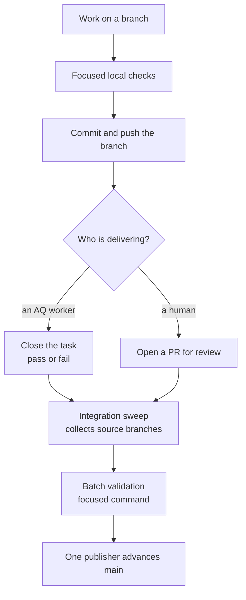

# Pull requests and delivery

How a finished change gets from your branch onto `main`.

## Why this page exists

AQ delivers its own changes. Most commits in this repository were written by an
AQ worker on a task branch, collected by AQ's integration service, validated,
and published as a batch. A human contributor's change joins that same pipeline
rather than bypassing it — so "open a PR and wait for the checks" is not how
this repository works, and waiting for a check that never arrives is the most
common way to lose an afternoon here.

This page describes the delivery path **as this repository configures it**.
Other AQ projects can configure it differently; the modes are named below so
you can tell which one you are looking at.

## Vocabulary

* **Task branch** — the branch a worker's worktree slot is created on, named
  after the task it belongs to (`aq/<task-id>`).
* **Integration** — the AQ service that collects finished source branches,
  validates them together, and advances `main`.
* **Batch** — one validated collection of candidate branches, published as a
  unit.
* **Development mode** — the delivery policy this repository uses: ordinary
  commits and merges, focused local validation, no intermediate verifier and no
  required PR.
* **Strict hierarchy / train** — the older, heavier workflow, still available
  for projects that need it. Optional; not what runs here.

## The path a change takes



The two things that never happen: nobody pushes `main` by hand, and nothing
merges because a PR check went green — there is no PR check
([CI](ci.md#the-workflows)).

## Before you push

1. Run the [local checks](checks.md) for what you changed.
2. Regenerate anything downstream of an interface you touched
   ([code generation](codegen.md)).
3. Write a commit message that says what changed and what was verified. The
   reviewer — human or agent — reads the diff and the message, in that order.
4. Push the branch. An unpushed branch is an unfinished change:

   ```bash
   git push -u origin HEAD
   ```

> **Warning.** Push to `origin`. A worktree slot may list more than one remote,
> and the first one is not always the canonical repository. Check with
> `git remote -v` before your first push from a fresh slot.

### If you are working in a worktree slot

AQ hands each worker an isolated worktree under `.aq/worktrees/`. Two rules
follow from that:

* **The Git stash stack is shared** with the main checkout and every other
  worktree. Never use bare `git stash` / `git stash pop` — another session's
  work can be popped into your tree. Prefer a temporary WIP commit; if you must
  stash, use `git stash push -u -m "<unique-tag>"`, capture the entry's SHA,
  and restore with `git stash apply <sha>`.
* **Never migrate the operator's database.** No `alembic upgrade`, no
  `alembic stamp`, no `aq start` from inside a slot. See
  [setup](setup.md#never-migrate-the-operators-database).

## Opening a pull request

A PR is how a human change gets *reviewed*. It is not how it gets *tested*, and
it is not what merges it.

```bash
gh pr create --base main --head "$(git branch --show-current)" \
  --title "fix(cli): …" --body "What changed, what was verified."
```

What to expect:

* **No `Tests` check appears.** [`tests.yml`](../../.github/workflows/tests.yml)
  has no `pull_request` trigger. Put the evidence in the PR body: the exact
  focused commands you ran and their results.
* **Do not merge your own PR.** In AQ's own workflow `pr_merge` is denied to
  workers outright; the same expectation applies to human contributors here.
* **Merging is not delivery.** Integration observes source branches and
  publishes batches; a merged PR whose commits are not yet on `main` is normal
  and temporary. Confirm with
  `git merge-base --is-ancestor <sha> origin/main` rather than by the PR's
  colour.

## How integration publishes

This repository is configured for **development mode**:

```bash
aq integration status agent-queue
```

In that mode workers push clean source branches and close with the checks they
actually ran. Ordinary commits and merges are accepted; no intermediate
verifier, PR, hosted-CI receipt chain or squash is required. Parent assembly
and `main` publication happen separately, on a sweep interval.

The guarantees that matter to a contributor:

* **One publisher per repository.** It validates the batch and advances `main`
  only if the previous head still matches; a competing update is retried
  against the current `main`.
* **A crash after push is reconciled by observing the remote**, not by
  guessing.
* **Conflicting members are parked**, not dropped, while independent work
  proceeds. `aq integration sweep <project> --retry` retries parked content
  under the current policy.
* **A failed integration creates an ordinary repair task** on its own branch,
  with a bounded retry budget rather than an indefinite loop.

The full operator-facing description, including validation policies
(`focused`, `advisory`, `none`), adoption of work an operator merged by hand,
and recovery after a stopped worker, is in
[development integration](../guides/development-integration.md).

> **Optional compatibility.** Strict hierarchy and train modes — the older
> workflow with parent verification and PR/CI receipts — remain available and
> are enabled per project. If you are reading a document that describes
> mandatory per-task reviewers, triage-task routing or Discord approvals, you
> are reading history, not this repository's configuration.

## Commit conventions

There is no enforced commit-message format and no lint on it. What the
repository actually contains, and what reviewers expect:

* A `type(scope): summary` first line — `fix(integration):`, `docs:`,
  `feat(cli):`.
* A body that says *what changed*, *what was verified*, and *what is still
  open*. Verification is the part reviewers rely on most, because CI will not
  have run on your branch.
* Generated artefacts committed in the **same** commit as the change that
  caused them ([code generation](codegen.md#state-ownership)).

## Inputs and outputs

| Input | Output |
|---|---|
| A pushed source branch | A candidate the integration sweep can collect |
| A closed task with its checks | The evidence the batch is validated against |
| A batch that validates | `main` advanced by one publisher |
| A batch that does not | Parked members plus an ordinary repair task |

## State ownership

* **You** own your branch and its commits until they are pushed.
* **Integration** owns candidate refs, the delivery journal, and `main`'s head.
  It is the only writer of `main`.
* **CI** owns nothing; it observes.

## Common failures and recovery

| Symptom | Cause | Recovery |
|---|---|---|
| Your PR has no checks | Expected — no `pull_request` trigger. | State your local evidence in the PR body. |
| A merged PR's commits are not on `main` | Merged into an integration or parent branch, not published yet. | `git merge-base --is-ancestor <sha> origin/main`; wait for the sweep. |
| `prepare_failed: branch not reserved` | A race, or a branch owned by another task. | Check `aq integration status`; retry the claim a few times before reporting. |
| Work parked after a failed batch | A conflict or a validation failure. | Do not re-push over it. `aq integration sweep <project> --retry` after the cause is fixed. |
| `main` red right after your change landed | Two individually green changes, jointly broken. | The CI run is attributed to the exact merge commit ([CI](ci.md#why-main-is-keyed-by-commit)); fix forward. |

## Related pages

* [Local checks](checks.md) — what to run before you push.
* [CI](ci.md) — what runs after, and on which branches.
* [Development integration](../guides/development-integration.md) — the
  delivery service in full, including recovery.
* [Code generation](codegen.md) — artefacts that must land in the same commit.
* [Builds and releases](releases.md) — what happens after `main`, which today
  is: nothing automatic.

## Source and tests

[`src/integration/`](../../src/integration/),
[`docs/guides/development-integration.md`](../guides/development-integration.md),
[`.github/workflows/tests.yml`](../../.github/workflows/tests.yml).

```bash
aq test tests/test_development_integration.py tests/test_integration_service.py
```
