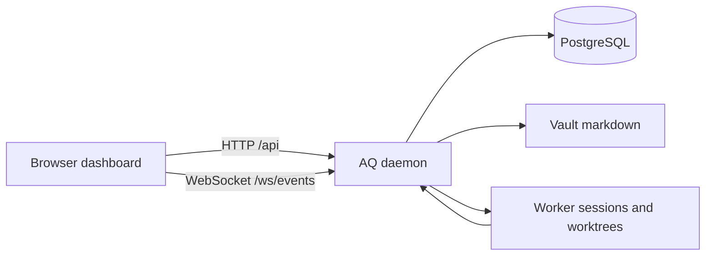

# Dashboard guide

The AQ dashboard is the browser workspace for seeing work move through a project and for operating the durable settings that shape that work. It is a React application: it shows data and invokes the daemon's API; it does not run workers or own your project data.

## Why it exists

AQ can run many tasks and workers without a browser, but a terminal is a poor place to compare a project graph, watch a worker, inspect a worktree change, and respond to a decision. The dashboard makes those connections visible while retaining the command line for automation. Its current navigation and route redirects live in [dashboard/src/App.tsx](../../dashboard/src/App.tsx); the persistent chrome is [dashboard/src/shell/AppShellV2.tsx](../../dashboard/src/shell/AppShellV2.tsx).

> **Current scope.** The shipped dashboard is a local Vite application, normally at `http://localhost:5173`, with a development proxy to the daemon. It is not a hosted control plane. A deployment can set `VITE_API_URL` and `VITE_WS_URL` to point the browser at another reachable daemon; that is an optional compatibility escape hatch implemented in [dashboard/src/api/client.ts](../../dashboard/src/api/client.ts) and [dashboard/src/ws/useEventStream.ts](../../dashboard/src/ws/useEventStream.ts). The exact available projects, profiles, playbooks, access control, and policy are configured local state, not dashboard defaults.

## Vocabulary

* A **project** is AQ's record of a repository and its related work; the left rail can create one and select its workspace.
* A **task** is a tracked piece of work. A **graph** shows task relationships; the **Tasks** view is the filterable list form. See the [glossary](../reference/glossary.md) for the durable meanings of these terms.
* A **worker** is an agent process. **Agent flock** is the dashboard's name for the global workers and pools shared across projects, not a per-project task list.
* A **worktree** is the isolated checkout a task uses. The dashboard can preview its files and diffs; it does not make that checkout the browser's state.
* A **playbook** is an event-driven workflow definition. AQ's current playbook UI is in Settings; historic review, triage, and Discord-control screens are not current default navigation.
* A **pane** is a contextual right-hand surface, separate from the **Activity drawer**. `[` toggles a pane, `]` toggles the drawer, and `Esc` closes the open right surface.

## A realistic tour

Assume the daemon is running, a project named `demo` exists, and a task has been created for it.

1. Open **Command Center** in the left rail. AQ redirects this to the remembered project (or its first project), then opens **Graph**. Select a task node to read its task details in the contextual surface. Use the **Tasks** tab when you need search, state, or ownership filters rather than relationship geometry.
2. In **Projects**, choose `demo`; its row gives you **Graph** and **Tasks**. The same project route also has **Overview**, **Sessions**, **Workspaces**, **Playbooks**, and **Config** deep links. Project state is loaded from the daemon, so a refresh is safe when another operator changes it.
3. Open **Agent flock** from the rail. Select a worker to see its terminal and session information. Shift-click up to four agents to tile their windows. Pools show their global/project allocation rather than pretending each pool belongs only to the selected project.
4. From a task, open **Task files** / **Worktree preview** to inspect file content and a diff associated with that task. Treat it as an inspection surface: make and commit repository changes in the worker's worktree, not in the browser.
5. Open **Settings** for **Playbooks**, **Profiles**, **Intelligence classes**, **Project roots**, **Messaging**, and **Config**. These are curation surfaces: changing one writes daemon-managed configuration, vault content, or database records, so use the validation/error feedback before retrying.
6. Open **Metrics** for live and historical fleet measurements. A temporarily disconnected browser does not erase those durable samples; it reconnects and refetches. The live provider-usage display can label unavailable data rather than inventing a value.

For the tour, the inputs are a running daemon plus an existing project/task; the outputs are a project-scoped graph/list, task and worktree detail, agent/pool status, configuration forms, and metric charts. Navigation is intentionally URL-backed: opening `/projects/demo/graph` or `/projects/demo/tasks` reaches the same project workspace, while old URLs redirect to the current surfaces in [dashboard/src/App.tsx](../../dashboard/src/App.tsx).



## Pages and what they are for

| Current label / route | Use it for | Main implementation |
|---|---|---|
| **Command Center** — `/projects/:projectId/graph`, `/tasks` | Visual task relationships or a filtered work list. Graph layout is server-produced; task selection opens detail. | [Graph.tsx](../../dashboard/src/pages/command-center/Graph.tsx), [Tasks.tsx](../../dashboard/src/pages/command-center/Tasks.tsx) |
| **Projects** in the left rail | Choose, organize, or add a project. Project-specific deep links retain their project scope. | [LeftRail.tsx](../../dashboard/src/shell/LeftRail.tsx), [ProjectTree.tsx](../../dashboard/src/shell/ProjectTree.tsx) |
| **Agent flock** — `/agents` | Inspect worker terminals, global agents, and worker pools; tile selected views. | [AgentWorkspace.tsx](../../dashboard/src/pages/agents/AgentWorkspace.tsx) |
| **Task files** — `/tasks/:taskId/files` | Preview a task's worktree files and changes. | [TaskFiles.tsx](../../dashboard/src/pages/TaskFiles.tsx), [TaskFilesPanel.tsx](../../dashboard/src/components/TaskFilesPanel.tsx) |
| **Playbooks** — `/settings/playbooks` | Inspect and curate the active V2 playbook definitions; open a playbook detail or graph view when linked from the list. | [Playbooks.tsx](../../dashboard/src/pages/system/Playbooks.tsx), [PlaybookDetail.tsx](../../dashboard/src/pages/PlaybookDetail.tsx) |
| **Metrics** — `/metrics` | Read fleet rate, capacity, and provider-usage charts. | [Metrics.tsx](../../dashboard/src/pages/metrics/Metrics.tsx) |
| **Settings** — `/settings/*` | Configure profiles, intelligence classes, project roots, messaging, and system config. | [SettingsLayout.tsx](../../dashboard/src/pages/settings/SettingsLayout.tsx), [SettingsSidebar.tsx](../../dashboard/src/components/nav/SettingsSidebar.tsx) |
| **Activity drawer** and contextual panes | See recent dashboard events/gates or task-, session-, file-, and playbook-specific tools without leaving the current route. | [ActivityDrawer.tsx](../../dashboard/src/shell/ActivityDrawer.tsx), [panes/registry.ts](../../dashboard/src/panes/registry.ts) |

## State ownership and live updates

The browser owns only presentation state: current URL, selected/expanded UI elements, pane state, its React Query cache, and small preferences such as the last project and WebSocket replay cursor in local storage. [dashboard/src/main.tsx](../../dashboard/src/main.tsx) creates the Query client; [dashboard/src/panes/store.tsx](../../dashboard/src/panes/store.tsx) owns contextual-pane state.

The daemon owns the authoritative data. API mutations and queries go through the generated TypeScript client configured by [dashboard/src/api/client.ts](../../dashboard/src/api/client.ts), usually wrapped by [dashboard/src/api/hooks.ts](../../dashboard/src/api/hooks.ts). PostgreSQL owns task, session, project, metric, and audit data; vault markdown owns authored configuration such as playbooks and profiles; worker sessions and worktrees own terminal processes and checked-out files. The dashboard never substitutes local UI state for a successful daemon write.

[dashboard/src/ws/EventStreamProvider.tsx](../../dashboard/src/ws/EventStreamProvider.tsx) keeps a bounded activity buffer while [dashboard/src/ws/useEventStream.ts](../../dashboard/src/ws/useEventStream.ts) maintains one reconnecting `/ws/events` connection and invalidates relevant cached queries. It stores a replay sequence and server epoch: after a daemon epoch changes, it clears an unusable cursor and reconnects. Metrics deliberately use a raw subscription so their one-second ticks do not churn every query cache.

## Common failures and recovery

| Symptom | Likely cause | Recovery |
|---|---|---|
| Page says it cannot load data, or requests reach the wrong service | Vite's default proxy target is not the daemon you intended. | Start/check the daemon, then check `AQ_API_TARGET` for development or `VITE_API_URL` for the optional remote target. [dashboard/vite.config.ts](../../dashboard/vite.config.ts) is the source of the proxy default. |
| The dashboard is missing or `localhost:5173` refuses connections | The local Vite process is not running, dependencies are absent, or its port is occupied. | From the repository root run `npm install`, then `npm -w dashboard run dev`; inspect `~/.agent-queue/dashboard.log` when the CLI launched it. [src/cli/daemon.py](../../src/cli/daemon.py) records the launcher behavior. |
| A newly changed screen looks stale | Browser assets/cache or a stale development server is serving an old bundle. | Reload first; stop and restart `npm -w dashboard run dev` if source changes still do not appear. For a production bundle, run a new `npm -w dashboard run build` and arrange for the web server to serve the resulting `dashboard/dist/` assets—Vite development output is not a production refresh mechanism. |
| Activity stops updating | The `/ws/events` connection is disconnected, often because the daemon was restarted or a proxy does not forward WebSockets. | Check browser network errors and daemon health; refresh after restoring the endpoint. The client reconnects with backoff and discards a stale replay cursor after an epoch change. |
| Terminal does not accept input or shows an error | The session is gone, the current actor lacks permission, or the terminal WebSocket cannot reach the daemon. | Re-open the agent/task session, confirm the daemon is reachable, and inspect the task/session state in AQ. Do not treat terminal output as a successful task close; the daemon's task record is authoritative. |
| A form save fails | Server validation or an optimistic assumption was rejected. | Read the displayed API error, correct the input, and retry. Refresh the route if another user changed the same record. Do not edit browser storage to repair server state. |

## For contributors

### Architecture and API boundary

The entry chain is [dashboard/src/main.tsx](../../dashboard/src/main.tsx) → [dashboard/src/App.tsx](../../dashboard/src/App.tsx) → [dashboard/src/shell/AppShellV2.tsx](../../dashboard/src/shell/AppShellV2.tsx). React Router owns routes; TanStack Query owns cached API data; the pane store and right-surface provider own transient contextual UI. Pages compose components and hooks, but backend calls belong in `dashboard/src/api/` through the generated `@aq/ts-client` export. The older [legacy-fetch.ts](../../dashboard/src/api/legacy-fetch.ts) exists only for endpoints absent from the generated client; new typed endpoint work should extend the API/code-generation boundary rather than add direct `fetch`.

Vite serves the development app on port 5173 and proxies `/api`, `/health`, `/ready`, and `/ws` to `AQ_API_TARGET`, which defaults to `http://127.0.0.1:8081` ([dashboard/vite.config.ts](../../dashboard/vite.config.ts)). `npm -w dashboard run dev` runs the Vite development server. `npm -w dashboard run build` runs TypeScript build mode and produces `dashboard/dist/`; a production host must serve those static assets and route API/WebSocket traffic to the daemon. The CLI's optional local-dashboard launcher runs the development command, so it is a source-checkout convenience rather than a production asset server.

The dashboard package's `predev`, `prebuild`, and `pretypecheck` hooks regenerate the TypeScript API client. After changing a codegen API surface, use the repository's offline generation workflow documented in [Code generation](../contributing/codegen.md), then typecheck. Do not hand-edit generated client output.

### Page and component families

* `pages/command-center/` renders project graph/list workspaces, including the server-backed layout-v2 canvas and live graph refresh.
* `pages/agents/` renders the global flock, workers, terminals, and pool configuration. `components/InteractiveTerminal.tsx` and `api/useTerminalInput.ts` are its input boundary.
* `pages/project/` provides project overview/configuration/workspace/onboarding surfaces; `pages/settings/` and `pages/system/` are settings curation routes and legacy-compatible page implementations.
* `pages/metrics/` turns durable metric queries plus a raw event feed into chart data; `pages/playbook-graph-v2/` renders the semantic playbook graph and run overlays.
* `components/` contains shared task, modal, markdown, terminal, profile, navigation, and workspace controls. `shell/` is global navigation, keyboard shortcuts, palette, activity drawer, and right surface.
* `panes/` registers contextual, lazy-compatible views; every pane has a manifest and arguments/state owned by the pane store. `ws/` owns the shared event and terminal sockets, not individual pages.
* [src/editor/](../../src/editor/) is an assigned backend utility for a separate voxel-level editor model and brush operations. It has no current import from `dashboard/src`; the catalog keeps that boundary explicit instead of implying it ships in the Vite bundle.

The exhaustive source-to-family map, including nested helpers and focused Vitest locations, is the [dashboard module catalog](../reference/modules/dashboard.md).

### Focused checks

The following commands are the dashboard's local checks; run them from the repository root after dependencies and the generated client are available.

```bash
npm -w dashboard run lint
npm -w dashboard run typecheck
npm -w dashboard run test
```

Use a focused Vitest file while iterating, for example `npm -w dashboard run test -- src/pages/metrics/__tests__/Metrics.test.tsx`, then run the relevant family suite once before delivery. The catalog names co-located tests for each family. See [Local checks](../contributing/checks.md) for the maintained check matrix and [dashboard/CLAUDE.md](../../dashboard/CLAUDE.md) for the React/Vitest isolation and worker-cap conventions.

## Related pages

* [First task](../tutorials/first-task.md) — create the project and task that make the tour concrete.
* [Project onboarding](project-onboarding.md) — creates and recovers the durable project/workspace state behind the project screens.
* [Task state machine](task-state-machine.md) — explains task state before using Command Center filters.
* [Playbooks V2](../concepts/playbooks.md) — explains what the Settings Playbooks surface configures.
* [Escalations and the hourly digest](escalations.md) — distinguishes the current Messaging/Inbox flow from retired Discord controls.

## Source and tests

Primary sources: [dashboard/src/App.tsx](../../dashboard/src/App.tsx), [dashboard/src/api/client.ts](../../dashboard/src/api/client.ts), [dashboard/src/ws/useEventStream.ts](../../dashboard/src/ws/useEventStream.ts), [dashboard/vite.config.ts](../../dashboard/vite.config.ts), [dashboard/package.json](../../dashboard/package.json), and [src/cli/daemon.py](../../src/cli/daemon.py).

Focused frontend tests include [dashboard/src/App.navigation.test.tsx](../../dashboard/src/App.navigation.test.tsx), [dashboard/src/shell/LeftRail.addProject.test.tsx](../../dashboard/src/shell/LeftRail.addProject.test.tsx), [dashboard/src/ws/__tests__/useEventStream.wire.test.tsx](../../dashboard/src/ws/__tests__/useEventStream.wire.test.tsx), [dashboard/src/pages/metrics/__tests__/Metrics.test.tsx](../../dashboard/src/pages/metrics/__tests__/Metrics.test.tsx), and the co-located suites listed in the [module catalog](../reference/modules/dashboard.md).
