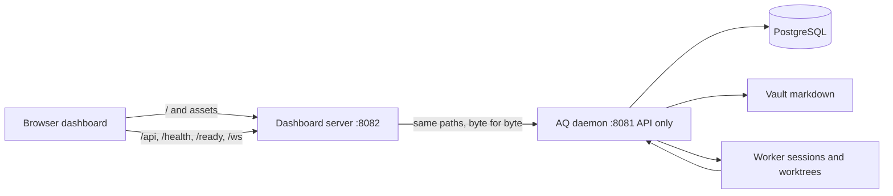

# Dashboard guide

The AQ dashboard is the browser workspace for seeing work move through a project and for operating the durable settings that shape that work. It is a React application served by the **dashboard server**, a small local process beside the daemon: it shows data and invokes the daemon's API; it does not run workers or own your project data.

## Why it exists

AQ can run many tasks and workers without a browser, but a terminal is a poor place to compare a project graph, watch a worker, inspect a worktree change, and respond to a decision. The dashboard makes those connections visible while retaining the command line for automation. Its current navigation and route redirects live in [dashboard/src/App.tsx](../../dashboard/src/App.tsx); the persistent chrome is [dashboard/src/shell/AppShellV2.tsx](../../dashboard/src/shell/AppShellV2.tsx).

> **Current scope.** Ships enabled: an installed AQ serves the built dashboard from the dashboard server at `http://127.0.0.1:8082/` ([src/dashboard_server/](../../src/dashboard_server/)). The daemon on port 8081 is **API only** — it serves no dashboard (its only HTML is FastAPI's interactive API reference at `/docs` and `/redoc`, and the plan viewer at `/plans/<task_id>`), and its old `/dashboard` path now answers a JSON pointer to the dashboard server ([src/api/app.py](../../src/api/app.py)). A source checkout with no built bundle runs the Vite dev server on `http://localhost:5173` instead, which proxies the same paths. Neither is a hosted control plane: both listen on loopback by default. `VITE_API_URL` and `VITE_WS_URL` remain an optional compatibility escape hatch for a development build that must reach another daemon directly ([dashboard/src/api/client.ts](../../dashboard/src/api/client.ts), [dashboard/src/ws/useEventStream.ts](../../dashboard/src/ws/useEventStream.ts)); the release bundle is built with both unset, so it only ever talks to its own origin. The exact available projects, profiles, playbooks, access control, and policy are configured local state, not dashboard defaults.

## Vocabulary

* The **daemon** is the long-running `agent-queue` process that owns tasks, sessions and the database. It exposes an HTTP API (`/api`, `/health`, `/ready`, `/ws`, `/mcp`) on `mcp_server.port`, 8081 by default, and serves no dashboard. See [architecture](../concepts/architecture.md#two-processes-the-daemon-and-the-dashboard-server).
* The **dashboard server** is the separate process that serves the verified dashboard bundle and forwards the daemon's API paths to it, so the browser talks to a single origin. `aq start` and `aq stop` manage it alongside the daemon; `aq dashboard status` reports it.
* A **project** is AQ's record of a repository and its related work; the left rail can create one and select its workspace.
* A **task** is a tracked piece of work. A **graph** shows task relationships; the **Tasks** view is the filterable list form. See the [glossary](../reference/glossary.md) for the durable meanings of these terms.
* A **worker** is an agent process. **Agent flock** is the dashboard's name for the global workers and pools shared across projects, not a per-project task list.
* A **worktree** is the isolated checkout a task uses. The dashboard can preview its files and diffs; it does not make that checkout the browser's state.
* A **playbook** is an event-driven workflow definition. AQ's current playbook UI is in Settings; historic review, triage, and Discord-control screens are not current default navigation.
* A **pane** is a contextual right-hand surface, separate from the **Activity drawer**. `[` toggles a pane, `]` toggles the drawer, and `Esc` closes the open right surface.

## Opening the dashboard

`aq install` builds the dashboard, starts the dashboard server and opens `http://127.0.0.1:8082/` in your browser once, at the end of an interactive install. After that, `aq start` starts the daemon and then the dashboard server, `aq stop` stops both, and `aq restart` restarts both ([src/cli/daemon.py](../../src/cli/daemon.py)). To see where it is and whether it is up — this works with the daemon stopped:

```bash
aq dashboard status
```

```text
Dashboard server: running at http://127.0.0.1:8082/ (PID 7132)
  bundle 0.1.0 (42 files); proxying http://127.0.0.1:8081 (daemon answering)
  log: ~/.agent-queue/dashboard-server.log
```

`aq status` prints the same fact as its *Dashboard* line, and `aq --json status` carries it as a `dashboard_server` object whose `state` is one of `running`, `stopped`, `disabled`, `no_bundle`, `stale_pid`, `port_conflict`, `unresponsive` or `misconfigured` ([src/dashboard_server/process.py](../../src/dashboard_server/process.py)). `aq dashboard start`, `stop` and `restart` manage it on its own; `aq dashboard serve` runs it in the foreground with logs on stderr. The managed process writes `~/.agent-queue/dashboard-server.pid` and `~/.agent-queue/dashboard-server.log`.

Nothing restarts a crashed dashboard server by itself. `aq status` and `aq doctor` (`dashboard.server.running`, `dashboard.server.bundle`, `dashboard.server.port`, `dashboard.server.exposure`) report it, and `aq start` or `aq dashboard start` brings it back ([src/doctor/dashboard_server_checks.py](../../src/doctor/dashboard_server_checks.py)). It stays up when only the daemon is down, so the page still loads — but today it only shows *Preferences unavailable* and *Loading…* until the daemon answers again, rather than saying the daemon is unreachable.

Its host and port are the `dashboard.server` settings in `~/.agent-queue/config.yaml`; a changed value takes effect at `aq dashboard restart`, and the daemon needs no restart ([configuration reference](../reference/configuration.md#dashboard-server-settings)).

### Reaching it from another machine

The dashboard server listens on `127.0.0.1` by default, so nothing is reachable from another machine. The recommended way in from elsewhere is to keep that and forward the port over SSH:

```bash
ssh -L 8082:127.0.0.1:8082 <aq-host>
```

Then open `http://localhost:8082/` on your own machine. The browser's origin is then a loopback one, so everything — interactive terminals included — works with no configuration.

> **Warning.** Setting `dashboard.server.host` to a LAN address or `0.0.0.0` hands the operator console to that network. There is no login: a request without a bearer token runs with local-operator scope unless `api_auth.require_session_token` is on, so anyone who can connect to the port can create and delete tasks, type into agent sessions, read transcripts, panes and workspace files, and read (redacted) and write configuration. The Host and Origin checks stop *other websites' scripts*; they do not stop a person on that network with `curl`.

When the server is bound to a non-loopback address:

| | From another machine |
|---|---|
| **Reachable** | The static dashboard, `/health`, `/ready`, `/ws/events` and every `/api/**` route with local-operator scope. From a browser, only under an allowed `Host` and `Origin`: the address itself, the configured `dashboard.server.host`, or a name listed in `api_auth.trusted_dashboard_origins`. Any other `Host` gets `421 misdirected_host`; any other `Origin` gets `403 origin_not_allowed`. |
| **Not reachable** | Interactive terminals and any request carrying a bearer token (`403 loopback_only` — the daemon cannot see the real peer behind the proxy, so the dashboard server enforces its loopback-only rules for it); `/mcp`, `/docs`, `/redoc`, `/openapi.json` and `/plans/*`; port 8081 itself, which stays on `mcp_server.host`; PostgreSQL; any file not listed in the bundle manifest. |

With `api_auth.require_session_token: true`, a LAN browser gets `401` on everything except the health paths, since it holds no token and the dashboard server refuses remote bearer tokens. `aq doctor --check dashboard.server.exposure` warns while a non-loopback bind is configured. The gates are in [src/dashboard_server/edge.py](../../src/dashboard_server/edge.py); the reasoning is in the [design record](../specs/dashboard-server.md) §3.

## A realistic tour

Assume the daemon and dashboard server are running (`aq start`), the dashboard is open at `http://127.0.0.1:8082/`, a project named `demo` exists, and a task has been created for it.

1. Open **Command Center** in the left rail. AQ redirects this to the remembered project (or its first project), then opens **Graph**. Select a task node to read its task details in the contextual surface. Use the **Tasks** tab when you need search, state, or ownership filters rather than relationship geometry.
2. In **Projects**, choose `demo`; its row gives you **Graph** and **Tasks**. The same project route also has **Overview**, **Sessions**, **Workspaces**, **Playbooks**, and **Config** deep links. Project state is loaded from the daemon, so a refresh is safe when another operator changes it.
3. Open **Agent flock** from the rail. Select a worker to see its terminal and session information. Shift-click up to four agents to tile their windows. Pools show their global/project allocation rather than pretending each pool belongs only to the selected project.
4. From a task, open **Task files** / **Worktree preview** to inspect file content and a diff associated with that task. Treat it as an inspection surface: make and commit repository changes in the worker's worktree, not in the browser.
5. Open **Settings** for **Playbooks**, **Profiles**, **Intelligence classes**, **Project roots**, **Messaging**, and **Config**. These are curation surfaces: changing one writes daemon-managed configuration, vault content, or database records, so use the validation/error feedback before retrying.
6. Open **Metrics** for live and historical fleet measurements. A temporarily disconnected browser does not erase those durable samples; it reconnects and refetches. The live provider-usage display can label unavailable data rather than inventing a value.

For the tour, the inputs are a running daemon plus an existing project/task; the outputs are a project-scoped graph/list, task and worktree detail, agent/pool status, configuration forms, and metric charts. Navigation is intentionally URL-backed: opening `/projects/demo/graph` or `/projects/demo/tasks` reaches the same project workspace, while old URLs redirect to the current surfaces in [dashboard/src/App.tsx](../../dashboard/src/App.tsx).



## Pages and what they are for

| Current label / route | Use it for | Main implementation |
|---|---|---|
| **Command Center** — `/projects/:projectId/graph`, `/tasks` | Visual task relationships or a filtered work list. Graph layout is server-produced; task selection opens detail. | [Graph.tsx](../../dashboard/src/pages/command-center/Graph.tsx), [Tasks.tsx](../../dashboard/src/pages/command-center/Tasks.tsx) |
| **Projects** in the left rail | Choose, organize, or add a project. Project-specific deep links retain their project scope. | [LeftRail.tsx](../../dashboard/src/shell/LeftRail.tsx), [ProjectTree.tsx](../../dashboard/src/shell/ProjectTree.tsx) |
| **Agent flock** — `/agents` | Inspect worker terminals, global agents, and worker pools; tile selected views. | [AgentWorkspace.tsx](../../dashboard/src/pages/agents/AgentWorkspace.tsx) |
| **Task files** — `/tasks/:taskId/files` | Preview a task's worktree files and changes. | [TaskFiles.tsx](../../dashboard/src/pages/TaskFiles.tsx), [TaskFilesPanel.tsx](../../dashboard/src/components/TaskFilesPanel.tsx) |
| **Playbooks** — `/settings/playbooks` | Inspect and curate the active V2 playbook definitions; open a playbook detail or graph view when linked from the list. | [Playbooks.tsx](../../dashboard/src/pages/system/Playbooks.tsx), [PlaybookDetail.tsx](../../dashboard/src/pages/PlaybookDetail.tsx) |
| **Metrics** — `/metrics` | Read fleet rate, capacity, and provider-usage charts. Each provider's card starts with its availability: a state pill, the reason, since when, the expected recovery, any operator override, the held and re-routed counts, and *Disable for…* / *Recheck* / *Clear override*. | [Metrics.tsx](../../dashboard/src/pages/metrics/Metrics.tsx), [ProviderAvailabilityHeader.tsx](../../dashboard/src/pages/metrics/ProviderAvailabilityHeader.tsx) |
| **Provider banner** — every page | Shown while any provider is unavailable (out of usage, logged out, failing or disabled), with what the outage moved and held and a link to that provider's card. | [ProviderAvailabilityBanner.tsx](../../dashboard/src/shell/ProviderAvailabilityBanner.tsx) |
| **Settings** — `/settings/*` | Configure profiles, intelligence classes, project roots, messaging, and system config. | [SettingsLayout.tsx](../../dashboard/src/pages/settings/SettingsLayout.tsx), [SettingsSidebar.tsx](../../dashboard/src/components/nav/SettingsSidebar.tsx) |
| **Activity drawer** and contextual panes | See recent dashboard events/gates or task-, session-, file-, and playbook-specific tools without leaving the current route. | [ActivityDrawer.tsx](../../dashboard/src/shell/ActivityDrawer.tsx), [panes/registry.ts](../../dashboard/src/panes/registry.ts) |

## State ownership and live updates

The daemon is authoritative for all dashboard feature state that should survive a reload or appear on another browser. The dashboard uses `DashboardStateProvider` / `useDashboardDocumentState` to load a typed document, write it through the API, and replace cached values only with newer server revisions. There is no browser-storage fallback or import: stale keys from older dashboard versions are ignored.

| Ownership | Use it for | Current examples | Rule |
|---|---|---|---|
| Shared workspace | An operator's organization that every user should see | `nav_organization`: folders, assignments, project order | One workspace document; events refresh every dashboard. |
| Per-user roaming | A preference that follows the authenticated person across browsers and machines | `shell_preferences`, `command_center_preferences`, per-project command-center view, playbook graph view | The server derives the owner from authentication; only that user's dashboards receive the document. |
| Device-local transport | Recoverable connection bookkeeping that has no product meaning elsewhere | WebSocket replay cursor and epoch; console-stream identity guard | `src/deviceLocal.ts` is the only browser-persistence boundary. Absence means reconnect/refetch, never a preference reset. |
| Ephemeral | Current interaction, route, draft, cache, or mounted component state | URL navigation, selection, open drawer, React Query cache, drag preview | Keep it in the URL or memory; discard it on reload and do not synchronize it. |

API mutations and queries go through the generated TypeScript client configured by [dashboard/src/api/client.ts](../../dashboard/src/api/client.ts), usually wrapped by [dashboard/src/api/hooks.ts](../../dashboard/src/api/hooks.ts). PostgreSQL owns task, session, project, metric, audit, and dashboard-state data; vault markdown owns authored configuration such as playbooks and profiles; worker sessions and worktrees own terminal processes and checked-out files. The dashboard never substitutes local UI state for a successful daemon write.

[dashboard/src/ws/EventStreamProvider.tsx](../../dashboard/src/ws/EventStreamProvider.tsx) keeps a bounded activity buffer while [dashboard/src/ws/useEventStream.ts](../../dashboard/src/ws/useEventStream.ts) maintains one reconnecting `/ws/events` connection and invalidates relevant cached queries. It stores a replay sequence and server epoch: after a daemon epoch changes, it clears an unusable cursor and reconnects. Metrics deliberately use a raw subscription so their one-second ticks do not churn every query cache.

### Adding dashboard state

Classify a field before writing code. If it must roam, add it to the dashboard-state registry and its typed server/client document; choose workspace versus user ownership, and project subject versus global scope. Keep independent concurrency units in separate namespaces. Add the default, validation, generated API union, event handling, and a two-context test that proves load, live propagation, reload/reconnect, reset, and the relevant user/project isolation. If it is only transport recovery, add a narrowly justified `DEVICE_LOCAL_KEYS` entry and its storage-guard documentation; ordinary remembered UI choices do not qualify. URL-addressable navigation belongs in the route, and drafts, selections, animations, and caches remain ephemeral. The detailed registry and add-a-namespace checklist are in the [dashboard-state contract](../superpowers/specs/2026-09-10-dashboard-state-contract-design.md).

## Common failures and recovery

| Symptom | Likely cause | Recovery |
|---|---|---|
| `http://127.0.0.1:8082/` refuses connections | The dashboard server is not running: it crashed, `aq start --no-dashboard-server` skipped it, or it could not start. | `aq dashboard status` names the state and the fix; `aq dashboard start` starts it. Startup problems are in `~/.agent-queue/dashboard-server.log`. |
| `aq dashboard status` says `port conflict` | Another program answers on the dashboard server's port. The port is never auto-incremented, so the URL stays predictable. | Free the port, or set `dashboard.server.port` and run `aq dashboard restart`. |
| `aq dashboard status` says `no bundle` | No built dashboard is installed — typically a contributor checkout. | `aq install --restart-from dashboard.build` builds one; in a checkout you develop in, run `npm -w dashboard run dev` instead. |
| The page loads but stays on *Loading…* and the header says *Preferences unavailable* | The dashboard server is up and the daemon is not: proxied requests answer `503` `daemon_unreachable` (`aq dashboard status` says `the daemon is not answering it`). | `aq status`, then start the daemon. The page recovers by itself once the daemon answers. |
| After a daemon crash, `aq start` says `Daemon is already running (PID …)` but port 8081 does not answer | A [known issue](../release-notes.md#known-issues) (`smart-meadow.7`): with no daemon PID file, `aq start` mistakes the running dashboard server for the daemon. | Run `aq restart`, which stops the dashboard server first and then starts both. Do not use `aq stop --no-dashboard-server` while the daemon is down — it stops the dashboard server instead. |
| Opening `http://127.0.0.1:8081/dashboard/` shows JSON with `dashboard_not_served_here` | An old bookmark: the daemon used to serve the dashboard there and is API only now. | Open the `dashboard_url` the JSON names (`http://127.0.0.1:8082/` by default) and update the bookmark. |
| A LAN or DNS name gets `421 misdirected_host` or `403 origin_not_allowed` | The dashboard server answers only for loopback names, its configured host, and the origins in `api_auth.trusted_dashboard_origins`. | Prefer `ssh -L` ([reaching it from another machine](#reaching-it-from-another-machine)); otherwise add the exact origin to `api_auth.trusted_dashboard_origins` and run `aq dashboard restart`. |
| Page says it cannot load data in a source checkout | Vite's proxy target is not the daemon you intended. | Start/check the daemon, then check `AQ_API_TARGET` for development or `VITE_API_URL` for the optional remote target. [dashboard/vite.config.ts](../../dashboard/vite.config.ts) is the source of the proxy default. |
| `localhost:5173` refuses connections in a source checkout | The Vite dev server is not running, dependencies are absent, or its port is occupied. | From the repository root run `npm install`, then `npm -w dashboard run dev`; inspect `~/.agent-queue/dashboard.log` when `aq start` launched it. [src/cli/daemon.py](../../src/cli/daemon.py) records the launcher behavior. |
| A newly changed screen looks stale | Browser cache, a dashboard server still serving the previous build, or a stale development server. | Reload first. `aq dashboard status` says `serving an older build` after a rebuild the server has not picked up; run `aq dashboard restart` (`aq update` does this for you). In a source checkout, restart `npm -w dashboard run dev`. |
| Activity stops updating | The `/ws/events` connection is disconnected, often because the daemon was restarted or a proxy does not forward WebSockets. | Check browser network errors and daemon health; refresh after restoring the endpoint. The client reconnects with backoff and discards a stale replay cursor after an epoch change. |
| Terminal does not accept input or shows an error | The session is gone, the current actor lacks permission, the terminal WebSocket cannot reach the daemon, or the browser is on another machine (terminals are loopback-only, `403 loopback_only`). | Re-open the agent/task session, confirm the daemon is reachable, and inspect the task/session state in AQ. From another machine, use `ssh -L`. Do not treat terminal output as a successful task close; the daemon's task record is authoritative. |
| A banner says a provider is unavailable, or a task shows *Held by provider* | AQ stopped launching against that provider. Queued work on it is being moved to the same class elsewhere, or held (a pin, a single-provider class such as `astra-*`, or no capacity yet). A task's detail shows its provider intent and any "re-routed from … · undo". The Tasks tab's *Held by provider* filter lists what is waiting. | Follow [a provider ran out of usage](provider-outage.md). Every state shown is the daemon's own; refreshing will not change it, but `aq provider recheck --provider <p>` or the card's *Recheck* will. |
| A form save fails | Server validation or an optimistic assumption was rejected. | Read the displayed API error, correct the input, and retry. Refresh the route if another user changed the same record. Do not edit browser storage to repair server state. |

## For contributors

### Architecture and API boundary

The entry chain is [dashboard/src/main.tsx](../../dashboard/src/main.tsx) → [dashboard/src/App.tsx](../../dashboard/src/App.tsx) → [dashboard/src/shell/AppShellV2.tsx](../../dashboard/src/shell/AppShellV2.tsx). React Router owns routes; TanStack Query owns cached API data; the pane store and right-surface provider own transient contextual UI. Pages compose components and hooks, but backend calls belong in `dashboard/src/api/` through the generated `@aq/ts-client` export. The older [legacy-fetch.ts](../../dashboard/src/api/legacy-fetch.ts) exists only for endpoints absent from the generated client; new typed endpoint work should extend the API/code-generation boundary rather than add direct `fetch`.

The browser always talks to one origin, and two processes can be that origin:

* **Development.** Vite serves the app on port 5173 and proxies `/api`, `/health`, `/ready`, and `/ws` to `AQ_API_TARGET`, which defaults to `http://127.0.0.1:8081` ([dashboard/vite.config.ts](../../dashboard/vite.config.ts)). `npm -w dashboard run dev` runs it. In a source checkout with no built bundle, `aq start` offers to launch it (`--no-dashboard` skips the offer); that launcher is a convenience, not an asset server.
* **Installed.** [`scripts/build_release_artifact.py`](../../scripts/build_release_artifact.py) builds the app with Vite `base: "/"` and every `VITE_*_URL` unset, and stages it with a SHA-256 manifest (`"base": "/"`) in `src/dashboard_assets/dist/`. The dashboard server ([src/dashboard_server/](../../src/dashboard_server/)) verifies that manifest at startup and fails closed — a missing, altered or daemon-mount-era bundle exits instead of serving — then serves only manifest-listed files with SPA fallback and relays the same four path prefixes to the daemon: request and response bytes unchanged, SSE streamed chunk by chunk, WebSocket frames and subprotocols (the terminal's `aq-terminal-v1`) relayed one to one. The daemon's other paths (`/mcp`, `/docs`, `/redoc`, `/openapi.json`, `/plans`, `/dashboard`) answer `404` there, never the SPA's `index.html`.

The daemon registers no static files at all; [tests/test_api_dashboard_pointer.py](../../tests/test_api_dashboard_pointer.py) pins that. The dashboard server imports only `src.config` from AQ — never the API, orchestrator, database or command layers ([tests/test_dashboard_server_app.py](../../tests/test_dashboard_server_app.py) checks it from a subprocess) — and needs no secret, so `aq dashboard start` launches it with database URLs and provider keys stripped from its environment.

The dashboard package's `predev`, `prebuild`, and `pretypecheck` hooks regenerate the TypeScript API client. After changing a codegen API surface, use the repository's offline generation workflow documented in [Code generation](../contributing/codegen.md), then typecheck. Do not hand-edit generated client output.

### Page and component families

* `pages/command-center/` renders project graph/list workspaces, including the server-backed layout-v2 canvas and live graph refresh.
* `pages/agents/` renders the global flock, workers, terminals, and pool configuration. `components/InteractiveTerminal.tsx` and `api/useTerminalInput.ts` are its input boundary.
* `pages/project/` provides project overview/configuration/workspace/onboarding surfaces; `pages/settings/` and `pages/system/` are settings curation routes and legacy-compatible page implementations.
* `pages/metrics/` turns durable metric queries plus a raw event feed into chart data; `pages/playbook-graph-v2/` renders the semantic playbook graph and run overlays.
* `components/` contains shared task, modal, markdown, terminal, profile, navigation, and workspace controls. `shell/` is global navigation, keyboard shortcuts, palette, activity drawer, and right surface.
* `panes/` registers contextual, lazy-compatible views; every pane has a manifest and arguments/state owned by the pane store. `ws/` owns the shared event and terminal sockets, not individual pages.
* [src/editor/](../../src/editor/) is an assigned backend utility for a separate voxel-level editor model and brush operations. It has no current import from `dashboard/src`; the catalog keeps that boundary explicit instead of implying it ships in the Vite bundle.

The exhaustive source-to-family map, including nested helpers and focused Vitest locations, is the [dashboard module catalog](../reference/modules/dashboard.md).

### Focused checks

The following commands are the dashboard's local checks; run them from the repository root after dependencies and the generated client are available.

```bash
npm -w dashboard run lint
npm -w dashboard run typecheck
npm -w dashboard run test
```

Use a focused Vitest file while iterating, for example `npm -w dashboard run test -- src/pages/metrics/__tests__/Metrics.test.tsx`, then run the relevant family suite once before delivery. The catalog names co-located tests for each family. See [Local checks](../contributing/checks.md) for the maintained check matrix and [dashboard/CLAUDE.md](../../dashboard/CLAUDE.md) for the React/Vitest isolation and worker-cap conventions.

## Related pages

* [First task](../tutorials/first-task.md) — create the project and task that make the tour concrete.
* [Project onboarding](project-onboarding.md) — creates and recovers the durable project/workspace state behind the project screens.
* [Task state machine](task-state-machine.md) — explains task state before using Command Center filters.
* [Playbooks V2](../concepts/playbooks.md) — explains what the Settings Playbooks surface configures.
* [Escalations and the hourly digest](escalations.md) — distinguishes the current Messaging/Inbox flow from retired Discord controls.

## Source and tests

Primary sources: [dashboard/src/App.tsx](../../dashboard/src/App.tsx), [dashboard/src/api/client.ts](../../dashboard/src/api/client.ts), [dashboard/src/ws/useEventStream.ts](../../dashboard/src/ws/useEventStream.ts), [dashboard/vite.config.ts](../../dashboard/vite.config.ts), [dashboard/package.json](../../dashboard/package.json), [src/dashboard_server/](../../src/dashboard_server/), [src/cli/dashboard.py](../../src/cli/dashboard.py), and [src/cli/daemon.py](../../src/cli/daemon.py).

The dashboard server and the daemon's pointer are covered by:

```bash
aq test tests/test_dashboard_server_app.py tests/test_dashboard_server_bundle.py \
        tests/test_dashboard_server_edge.py tests/test_dashboard_server_proxy.py \
        tests/test_cli_dashboard_server.py tests/test_doctor_dashboard_server.py \
        tests/test_api_dashboard_pointer.py
```

Focused frontend tests include [dashboard/src/App.navigation.test.tsx](../../dashboard/src/App.navigation.test.tsx), [dashboard/src/shell/LeftRail.addProject.test.tsx](../../dashboard/src/shell/LeftRail.addProject.test.tsx), [dashboard/src/ws/__tests__/useEventStream.wire.test.tsx](../../dashboard/src/ws/__tests__/useEventStream.wire.test.tsx), [dashboard/src/pages/metrics/__tests__/Metrics.test.tsx](../../dashboard/src/pages/metrics/__tests__/Metrics.test.tsx), and the co-located suites listed in the [module catalog](../reference/modules/dashboard.md).
