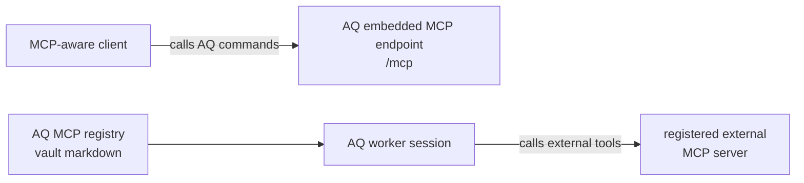

# Plugins, MCP, and extensions

Agent Queue (AQ) can be extended in two different ways: a **plugin** adds
capabilities to the daemon, while an **MCP server** lets an agent use a set of
tools. This guide explains both directions, including the easily confused
case where AQ itself is the MCP server.

## Why this exists

An installation often needs a capability that should not become core AQ: a
repository-specific scanner, a connection to a company service, or optional
semantic memory. Plugins provide the daemon-side extension point. MCP lets AQ
publish its own commands to MCP-aware clients and lets a worker use a separate
MCP tool provider.

## Vocabulary

* A **plugin** is an installable Python package that subclasses `Plugin` and
  registers capabilities through a `PluginContext`.
* An **internal plugin** ships in this repository and receives the daemon's
  internal service interfaces. An **external plugin** is installed by an
  operator and has a deliberately smaller service allowlist.
* An **MCP server registry entry** is a named, system- or project-scoped
  definition of an external MCP server. A profile refers to the name; it does
  not embed a command line or secret.
* The **tool catalog** is AQ's in-memory snapshot of a registered MCP
  server's `tools/list` response. It is discovery data, not an authorization
  grant.

See the [glossary](../reference/glossary.md) for general AQ terms and
[profiles and classes](../reference/profiles-and-classes.md) for profile
format and scope.

## Two MCP directions

The word “MCP” describes a protocol, not which side owns the tool. These two
flows are independent:



1. **AQ exposes MCP.** The daemon runs a streamable-HTTP server at `/mcp` on
   its API host and port. An editor or MCP client connects to it to call AQ
   commands such as task and project operations. This is implemented by
   [src/embedded_mcp.py](../../src/embedded_mcp.py) and
   [src/mcp_registration.py](../../src/mcp_registration.py).
2. **A worker consumes external MCP.** An operator registers a stdio or HTTP
   MCP server, then names it in a profile. At task launch the selected harness
   receives that server configuration and can call its tools. AQ does not
   proxy those calls through its own `/mcp` endpoint.

Do not solve an external-tool problem by adding a command to AQ's embedded
MCP endpoint, and do not add `agent-queue` to a registry file merely to expose
AQ to an editor. The daemon supplies the synthetic `agent-queue` entry itself
when embedded-MCP task injection is enabled.

## A realistic setup: give a profile an external tool server

Assume the daemon is running, a project named `demo` exists, and `npx
@modelcontextprotocol/server-filesystem /tmp/aq-demo` is a tool server you
trust. The following operator action creates a project-scoped entry and
probes it:

```bash
aq mcp create-server --name demo-files --project-id demo --transport stdio \
  --description "Read-only demo files" --command npx \
  --args '["@modelcontextprotocol/server-filesystem", "/tmp/aq-demo"]'
aq mcp list-tool-catalog --project-id demo --server-names demo-files
```

The create command writes
`~/.agent-queue/vault/projects/demo/mcp-servers/demo-files.md`; the watcher
updates the in-memory registry and the probe produces a catalog entry. Exact
tool names depend on the external server. Confirm the command shape on the
installed AQ version before changing state:

```bash
aq mcp create-server --help
```

```text
Usage: aq mcp create-server [OPTIONS]
  --name TEXT               [required]
  --transport [stdio|http]  [required]
  --project-id TEXT         Omit for system scope.
  --command TEXT
  --args ARRAY
  --env OBJECT
  --url TEXT
  --headers OBJECT
```

That output was captured from the current CLI. The command has no dry-run, so
use a throwaway project while learning and remove the entry with `aq mcp
delete-server --name demo-files --project-id demo` when finished.

Finally, put only the registry name in the profile's `## MCP Servers` block:

```text
- demo-files
```

The output to expect is a session configuration containing the resolved stdio
or HTTP definition. The profile is the selection point; the registry file is
the connection-definition owner. A project entry with the same name shadows a
system entry, so use project scope for credentials or tools that differ by
project.

> **Warning.** `env` and `headers` are stored in vault markdown. Treat a
> registry entry as configuration with the same secret-handling requirements
> as other vault configuration. Do not put access tokens in a command line,
> commit them to a project repository, or paste them into task descriptions.

## Inputs and outputs

| Action | Inputs | Output / effect |
|---|---|---|
| Register an external server | Name, `stdio` command and arguments *or* HTTP URL and headers; optional project scope | Vault markdown entry, then a memory-resident registry entry |
| Probe a server | Registry name and scope | Tool snapshot or an error, with a timestamp, in the in-memory catalog |
| Select a server for a worker | A profile's list of registry names | Resolved MCP configuration passed to the task harness |
| Publish AQ through MCP | Running daemon and `mcp_server` configuration | Streamable-HTTP endpoint at `http://HOST:PORT/mcp` |
| Install an external plugin | Git URL and valid plugin package | Clone/install record, loaded plugin, and its registered capabilities |

For the external-server commands, use `aq mcp list-servers`, `aq mcp
get-server`, and `aq mcp list-tool-catalog` to inspect state without changing
it. `aq mcp probe-server` refreshes a stale catalog after the external server
changes.

## Configure AQ's own MCP endpoint

The shipped `mcp_server` defaults are `enabled: true`, host `127.0.0.1`, port
`8081`, and `inject_into_tasks: true` in
[src/config.py](../../src/config.py). Therefore a default local daemon serves
AQ's streamable-HTTP endpoint at `http://127.0.0.1:8081/mcp` and can inject a
synthetic `agent-queue` server into task contexts.

This repository's actual deployment policy may change `host`, `port`,
`excluded_commands`, or task injection in `~/.agent-queue/config.yaml`; those
are configured local policy, not a promise that every deployment is publicly
reachable. Keep the default loopback host unless an operator deliberately
places authentication and network controls in front of a wider bind.

AQ derives tools from its command definitions, typed command contracts,
plugin-provided definitions, and command-handler discovery. The effective
exclusions are the union of code defaults, `mcp_server.excluded_commands`, and
`AGENT_QUEUE_MCP_EXCLUDED`; every remaining call still goes through normal
command authorization. In particular, MCP publication does not bypass a
session token's scope or a profile's capability policy. The detailed command
surface is in [agent-facing tools](../reference/cli/agent-tools.md#mcp).

> **Optional compatibility, off by default.** Old profile blocks that embed
> MCP configuration are migrated once into registry markdown by
> [src/profiles/mcp_inline_migration.py](../../src/profiles/mcp_inline_migration.py).
> New profiles must use names. The proposed `/mcp-task` narrow endpoint is not
> served; its configuration substrate is not a shipped endpoint.

## Install and operate plugins

External plugins are operator-installed code, not task-local packages. AQ
clones an installation under its data directory, installs a package with
`pyproject.toml` editable mode when possible (falling back to legacy
`requirements.txt`), records lifecycle state, and loads the plugin. Use the
current CLI to inspect a plugin before or after changing it:

```bash
aq plugin install https://example.invalid/acme/aq-demo-plugin.git
aq plugin list
aq plugin info aq-demo-plugin
aq plugin config aq-demo-plugin enabled=true
```

`install` intentionally has no sample public URL here: a plugin URL is a
trust decision, and `example.invalid` is not executable. The live command
surface supports `list`, `info`, `config`, `disable`, `enable`, `reload`,
`update`, `prompts`, and `remove`; run `aq plugin --help` for the version you
operate. `remove` deletes the installed plugin record and data, so disable it
first when you only need a reversible stop.

External plugins run with `TrustLevel.EXTERNAL`. They can obtain only the
`config` and `vault_watcher` services through `PluginContext.get_service`.
Internal plugins have `TrustLevel.INTERNAL` and receive the other daemon
service facades. Declared `NETWORK`, `FILESYSTEM`, `DATABASE`, and `SHELL`
permissions are metadata; they are not an operating-system sandbox. Review
plugin code and its dependency chain before installation.

### Shipped and external plugin status

| Kind | Current status | What it provides |
|---|---|---|
| `aq-files` internal plugin | Shipped and loaded at daemon startup | Workspace file commands and `files` tool category |
| `aq-git` internal plugin | Shipped and loaded at daemon startup | Git and integration commands and `git` tool category |
| `aq-notes` internal plugin | Shipped and loaded at daemon startup | Project note commands and `notes` tool category |
| `aq-vibecop` internal plugin | Shipped and loaded at daemon startup | Optional local VibeCop static-analysis commands; reports how to install VibeCop when absent |
| `aq-memory` external plugin | Optional; not bundled with AQ | Semantic memory service and its `memory_*` commands/tools when installed and not paused by local feature policy |
| Third-party plugin | Optional; chosen and installed by an operator | Any capabilities registered through the public plugin API |

The `aq memory` CLI group can be visible even when `aq-memory` is absent
because its tool shape is declared by the core surface. It is not proof that a
memory backend is installed; inspect `aq plugin list` and the command result.
The former in-tree memory manager is removed. Do not revive it or direct users
to an old `src/memory.py` API.

## Build a minimal plugin

The preferred plugin format is a normal Python package with an
`aq.plugins` entry point. This minimal extension adds a command and an MCP/tool
definition; it does not reach into AQ internals:

```toml
# pyproject.toml
[project]
name = "aq-hello-example"
version = "0.1.0"
dependencies = ["agent-queue"]

[project.entry-points."aq.plugins"]
hello-example = "aq_hello.plugin:HelloPlugin"
```

```python
# aq_hello/plugin.py
from src.plugins import Plugin, PluginContext


class HelloPlugin(Plugin):
    async def initialize(self, ctx: PluginContext) -> None:
        ctx.register_command("hello", self.hello)
        ctx.register_tool(
            {
                "name": "hello",
                "description": "Return a greeting from the example plugin.",
                "input_schema": {"type": "object", "properties": {}},
            },
            category="hello-example",
        )

    async def shutdown(self, ctx: PluginContext) -> None:
        pass

    async def hello(self, args: dict) -> dict:
        return {"success": True, "message": "hello from the plugin"}
```

The entry-point name is the plugin name AQ loads. `register_command` makes
both `hello` and `hello-example.hello` available to command dispatch;
`register_tool` adds its JSON schema to tool discovery and, when AQ's embedded
MCP server starts, to the MCP registration pass. A plugin may also register
event types, services it provides, doctor checks, cron-decorated methods, a
Click CLI group, and prompt templates. It must clean up background work in
`shutdown`.

Use the public `PluginContext` rather than importing an orchestrator,
database, or command handler. The legacy `plugin.yaml` format remains an
optional compatibility path and logs a migration warning; new plugins should
use `pyproject.toml` and `aq.plugins`. Legacy hook-execution history is
removed: `aq plugin logs` explicitly reports that it no longer exists.

## State ownership

| State | Owner | Location |
|---|---|---|
| External plugin source and per-instance directories | Plugin registry | `~/.agent-queue/plugins/<name>/` and `~/.agent-queue/plugin-data/<name>/` |
| Plugin lifecycle row, configuration, and plugin data | Plugin registry/database layer | AQ database |
| Plugin commands, tools, event types, cron jobs, and services | Loaded plugin registry | Daemon memory; rebuilt on load/restart |
| External MCP definition | MCP registry and vault watcher | `vault/[projects/<id>/]mcp-servers/<name>.md` |
| External MCP tool catalog | MCP catalog/probe service | Daemon memory; refreshed at startup, watcher changes, or explicit probe |
| AQ embedded endpoint configuration | Operator configuration | `~/.agent-queue/config.yaml`, `mcp_server` section |
| `aq://` references in playbooks | Playbook compiler | Rewritten to approved config-rooted filesystem paths; not an MCP registry |

`aq://` has five read-only authorities: `prompts`, `vault`, `logs`, `tasks`,
and `attachments`. It rejects `..` path segments and has no workspace
authority. It is a compile-time portable resource reference, not a URI for
calling an MCP server.

## Common failures and recovery

| Symptom | Diagnose | Recovery |
|---|---|---|
| External tool is absent from a worker | `aq mcp get-server --name NAME` and inspect the profile's MCP names | Add the correct registry name to the profile; check project scope and name shadowing |
| Catalog says a server has no tools or an error | `aq mcp probe-server --name NAME` | Verify the executable/URL and its credentials, then re-probe. A probe times out after 10 seconds rather than blocking the daemon indefinitely. |
| A tool works through `aq` but not AQ's `/mcp` | Inspect `mcp_server.excluded_commands` and `AGENT_QUEUE_MCP_EXCLUDED` | Remove only a deliberate exclusion; command authorization still applies afterward. |
| Plugin is `ERROR` or fails to load | `aq plugin info NAME` and daemon logs | Fix package metadata/entry point or dependency installation; then `aq plugin reload NAME` or enable it again. |
| Plugin cannot access a service | Review its trust level and use `PluginContext` | External plugins only receive the public service allowlist. Redesign the extension boundary instead of importing a private daemon object. |
| `aq memory` has no backend | `aq plugin list` and the command response | Install and configure the external `aq-memory` plugin if local policy permits; do not expect a bundled memory implementation. |
| An `aq://` playbook reference is rejected | Read the compiler error | Use one of the five supported authorities and a path under its root; remove traversal segments. |

## Related pages

* [Agent-facing tools](../reference/cli/agent-tools.md) explains the shared
  command/tool/MCP surface and task capability filtering.
* [CLI command reference](../reference/cli/commands.md#aq-mcp) lists every
  `aq mcp` and plugin-management command.
* [Profiles and classes](../reference/profiles-and-classes.md) shows how a
  profile selects an MCP registry name.
* [Module catalog: plugins and MCP](../reference/modules/plugins.md) maps the
  implementation files to this guide.

## Source and tests

The implementation starts in [src/plugins/base.py](../../src/plugins/base.py),
[src/plugins/registry.py](../../src/plugins/registry.py), and
[src/plugins/loader.py](../../src/plugins/loader.py). MCP endpoint and
registration code lives in [src/embedded_mcp.py](../../src/embedded_mcp.py),
[src/mcp_registration.py](../../src/mcp_registration.py), and
[src/profiles/mcp_registry.py](../../src/profiles/mcp_registry.py). Portable
resource references are implemented by [src/aq_uri.py](../../src/aq_uri.py).

Focused coverage is in `tests/test_plugins.py`, `tests/test_cli_plugins.py`,
`tests/test_embedded_mcp.py`, `tests/test_mcp_registry.py`,
`tests/test_mcp_probe.py`, `tests/test_mcp_catalog.py`,
`tests/test_mcp_inline_migration.py`, and `tests/test_aq_uri.py`.
