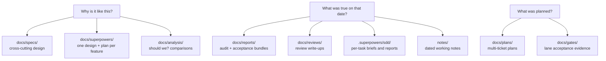

# Historical material

AQ keeps its own paper trail. Roughly four hundred files in this repository are
design specs, feature plans, audit evidence, review write-ups and working notes
that describe what was *intended* or what was *observed on a date* — not what the
code does now.

They are kept deliberately. A spec explains why the command handler is the only
write path; a plan explains why a feature shipped in the order it did; an audit
bundle is the only account of what a subsystem's guards actually enforced on the
day someone checked. Deleting that to make the documentation tidier would lose
the reasoning and keep only the conclusions.

They are also clearly separated, because a stale page that looks like current
instructions is worse than no page. Every historical file carries a banner naming
its genre and saying it is not current documentation, every historical directory
has an index, and every file has a row in
[the disposition ledger](disposition-ledger.md).

> **If you are new here, you are in the wrong place.** Start at
> [the documentation home](../README.md), then
> [Install](../tutorials/install.md) and [Your first task](../tutorials/first-task.md).
> Come back when you want to know *why* something is the way it is.

## The five dispositions

Every documentation file in the repository has exactly one:

| Disposition | Meaning |
|---|---|
| `current` | Accurate against the code on `main`. |
| `update` | Broadly right; a specific wrong claim was corrected or a missing scope was stated. |
| `redirect` | Superseded. The old path now holds a stub naming the replacement. |
| `archive` | Describes something that no longer exists. Kept behind a **Retired** banner so links resolve; delisted from navigation. |
| `historical` | Design history or audit evidence, preserved as the record. |

[The ledger](disposition-ledger.md) has the per-file table and the counts.

## What is preserved, and what each tree is for



| Tree | Genre | Index |
|---|---|---|
| [`docs/specs/`](../specs/README.md) | The cross-cutting design of the system: principles, playbooks, memory, coordination, the work graph, the surface, trust and ops. | [design index](../specs/design/README.md) |
| [`docs/superpowers/`](../superpowers/README.md) | One dated design, plan or evidence set per feature. The densest "why" in the repository. | [specs](../superpowers/specs/README.md), [plans](../superpowers/plans/README.md), [evidence](../superpowers/reports/README.md) |
| [`docs/analysis/`](../analysis/README.md) | Comparative and point-in-time assessments that argued for a change. | [analysis index](../analysis/README.md) |
| [`docs/reports/`](../reports/README.md) | Audit and acceptance bundles. Immutable. | [reports index](../reports/README.md) |
| [`docs/reviews/`](../reviews/README.md) | Individual review write-ups. Immutable. | [reviews index](../reviews/README.md) |
| [`docs/gates/`](../gates/README.md) | Lane acceptance evidence from the framework overhaul. Immutable. | [gates index](../gates/README.md) |
| [`docs/plans/`](../plans/README.md) | Multi-ticket plans, including [this overhaul](../plans/documentation-overhaul/README.md). Proposed work. | [plans index](../plans/README.md) |
| [`docs/default_rules/`](../default_rules/README.md), [`docs/example_playbooks/`](../example_playbooks/README.md) | Authoring samples nothing installs, written for the V1 runtime. | their READMEs |
| [`notes/`](../../notes/README.md) | An operator's and an agent's dated working notes. | [notes index](../../notes/README.md) |
| [`reports/`](../../reports/README.md) | Two root-level reports predating `docs/reports/`. Immutable. | [index](../../reports/README.md) |
| [`.superpowers/sdd/`](../../.superpowers/README.md) | Per-task briefs, reports and reviews for two features built task-by-task. Immutable. | [index](../../.superpowers/README.md) |

"Immutable" means the file bodies are evidence of what was observed and were not
edited: those trees got an index beside them and nothing else. One exception is
recorded in [the ledger](disposition-ledger.md) — 549 source links in one audit
bundle pointed at nothing and were repaired.

## Reading a historical page without being misled

1. **Check the banner.** Every historical page has one at the top, naming its
   genre and its date.
2. **A `Status:` line is not a shipping date.** "Draft", "approved direction" and
   a date are all common in `docs/specs/`. None of them mean the code matches.
3. **Paths are as-of the file's date.** Several named subsystems no longer exist:
   the in-process Supervisor, the V1 playbook compiler and runner, the Telegram
   adapter, the `acpx` runtime, in-process agent runtimes of any kind.
4. **Where a spec and a concept page disagree, the concept page wins.** Pages
   under [`docs/concepts/`](../concepts/README.md) were written against current
   source; specs were not.
5. **A checklist in a plan is not work to do.**

## Retired guidance, and what replaced it

These claims appear in historical pages and were, at some point, in current ones.
None of them is true now.

| You may read | The current answer |
|---|---|
| Every completed task gets an automatic reviewer, and a final reviewer merges the branch. | The shipped default pipeline creates no reviewers. A review stage is something a project can configure. [Playbooks V2](../concepts/playbooks.md) |
| An unrouted task becomes a triage task. | The routing playbook chooses a class and profile directly. Triage is an optional shape. [Agents and routing](../concepts/agents-and-routing.md) |
| Work is squashed, opened as a pull request, and gated on hosted CI. | Those are the optional strict modes. The default here is batched development delivery. [Integration](../concepts/integration.md) |
| Playbooks are compiled and run by the V1 runtime. | V1 was deleted on 2026-09-04. [Playbooks V2](../concepts/playbooks.md) |
| Discord has slash commands, task controls and gate buttons, and a bot token is required. | Discord is notification-only, and `messaging_platform: none` is supported. [Messaging](../concepts/messaging.md) |
| State is SQLite-backed. | PostgreSQL is the only backend. [Database reference](../reference/database/README.md) |
| You add an agent backend by implementing a runtime with `start()` / `stop()`. | You author a harness file. [Sessions](../concepts/sessions.md), [harness reference](../reference/harnesses.md) |

## Related pages

* [Disposition ledger](disposition-ledger.md) — every file, its disposition, and the reason.
* [The documentation map](../documentation-map.md) — the current tree and who owns each page.
* [Known inaccuracies](../plans/documentation-overhaul/known-inaccuracies.md) — contradictions recorded with evidence.
* [Final coverage and disposition report](../plans/documentation-overhaul/final-coverage-report.md) — final navigation and coverage verification.
* [Documentation style](../contributing/documentation-style.md) — the rules that keep a retired claim from coming back.

## Checking this material

```bash
python3 docs/history/check_dispositions.py
```

Fails if a documentation file has no disposition row, a row points at a path that
no longer exists, a disposition is not one of the five, or a page that should
carry a banner does not.
