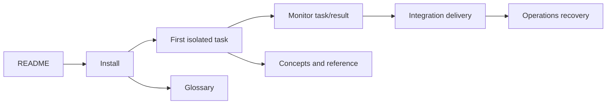

# Final coverage and documentation disposition report

This report records the final assembly check for the documentation-overhaul
plan. It is evidence about the repository snapshot checked by the commands
below, not a replacement for the current [documentation home](../../README.md).

## What is covered

The generated [ownership manifest](module-ownership.json) assigns every
tracked path to exactly one shard, component page, category, and documented
reason. Production paths require a named, relative source link in their
subject’s [module catalog](../../reference/modules/README.md). Private helpers
remain individual rows; generated resources are covered at resource-family
level, naming the generator and authoritative schema.

| Path family | Disposition | Authoritative current entry point |
| --- | --- | --- |
| `src/` and `dashboard/` production modules | Catalogued one path at a time. | [Module catalog](../../reference/modules/README.md) and its subject shard. |
| Generated API clients and `openapi.json` | Covered by resource family, never hand-edited. | [API reference](../../reference/api/README.md). |
| Shipped vault, profile, prime, and playbook Markdown | Documented as runtime content. | [Configuration and vault](../../concepts/configuration-and-vault.md), [routing](../../concepts/agents-and-routing.md), [playbooks](../../concepts/playbooks.md). |
| Supporting scripts, CI, packaging, and the license | Covered by purpose rather than per-symbol catalog rows. | [Contributing](../../contributing/README.md). |
| Tests and fixtures | Covered as layout and marker policy. | [Testing](../../contributing/testing.md). |
| Existing plans, specs, reports, reviews, and analysis | Historical or proposed; never operating defaults. | [Historical material](../../history/README.md). |

## Navigation and newcomer path

The GitHub [repository README](../../../README.md) points to the documentation
home. From there, a newcomer follows:



The walkthrough uses a disposable project root and repository: install AQ,
onboard with `aq project onboard --source-mode init`, create one task, watch
it with `aq task get`, read `aq task get-result`, then follow the project’s
integration policy. It does not promise that a closed task is already on
`main`; delivery is a separate durable process. The full commands, expected
outputs, ownership boundaries, and recovery table are in
[First task](../../tutorials/first-task.md). The honest limitation is that a
worker still needs a locally configured, authenticated harness and available
capacity; no tutorial can supply those credentials.

## Local verification record

Run from the repository root after refreshing the manifest:

```bash
python3 docs/plans/documentation-overhaul/refresh_inventory.py --check
python3 docs/plans/documentation-overhaul/refresh_inventory.py --check-artefacts
python3 scripts/check-docs.py README.md docs/README.md docs/reference/README.md docs/history/README.md docs/reference/modules/README.md
python3 scripts/check-docs.py --module-coverage all
aq test tests/test_documentation_checks.py
```

These checks intentionally avoid a full application suite. The first two prove
inventory ownership and artifact freshness; the next two prove GitHub-relative
navigation and every production catalog row; the focused test protects the
checker’s link and coverage contracts.

## Remaining limitations

The focused acceptance checks above pass. A broader `python3
scripts/check-docs.py --all` scan on this snapshot still reports 563 existing
link or anchor failures: 549 are in the dated
`docs/reports/integration-safeguards-2026-09-09/SOURCE-INDEX.md`, and the
remainder are preserved specs or pre-existing current-page links. This report
does not silently waive them: the [known-inaccuracies ledger](known-inaccuracies.md)
and [historical index](../../history/README.md) make their status visible while
the final navigation avoids presenting historical pages as current
instructions.
