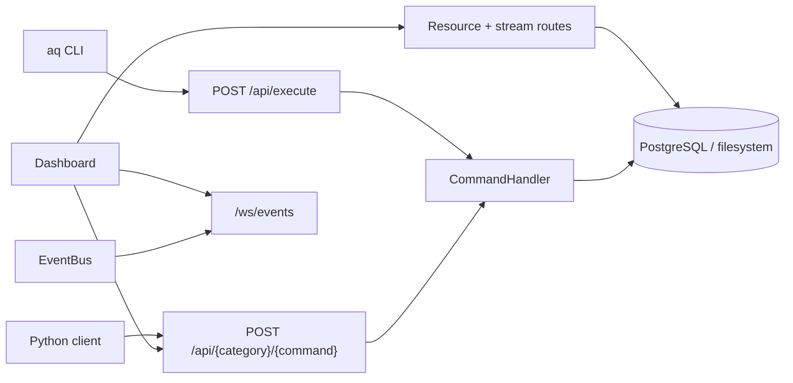
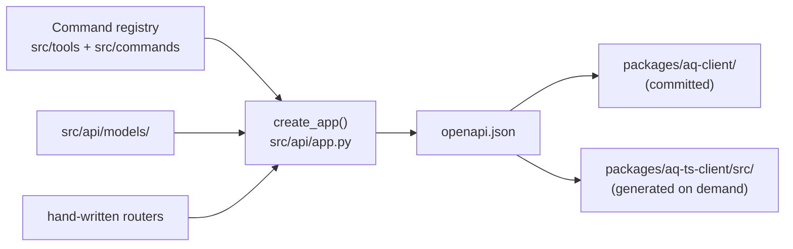

# HTTP API

The AQ daemon serves one local HTTP API. Everything that is not the daemon
itself — the `aq` command line, the web dashboard, an MCP client, an agent
running inside a worker session — reaches AQ through it.

This page is the entry point for that surface: what it is, how to reach it,
what the three families of routes are, and where the schema everything else is
generated from comes from. The neighbouring pages go deeper:

| Page | Covers |
|---|---|
| [Requests, authentication, scope and errors](conventions.md) | Bearer tokens, what a session token may call, the two error envelopes, limits and paging. |
| [Streaming: WebSocket events, SSE and terminals](events.md) | `/ws/events`, the SSE session/pane/stream endpoints, and the terminal WebSocket. |
| [Response models](models.md) | The Pydantic models the routes answer with, and the schema names they become. |
| [Python client](python-client.md) | The generated, typed `agent_queue_api_client` package. |
| [TypeScript client](typescript-client.md) | The generated `@aq/ts-client` package and how the dashboard uses it. |
| [Module catalog: API](../modules/api.md) | Every module in `src/api/`, the two client packages, and what covers them. |

## Why it exists

AQ keeps all of its state in one PostgreSQL database owned by one daemon
process. Rather than let four surfaces write that state four ways, every
state change goes through a single in-process entry point — the
[`CommandHandler`](../../../src/commands/handler.py) — and the HTTP API is the
only way to reach it from outside the daemon. The CLI is an HTTP client. The
dashboard is an HTTP client. An agent's `aq task close` is an HTTP request.
That is why the API's shape mirrors the command surface so directly: most
endpoints *are* commands.

## Vocabulary

* **Command** — a named operation with a JSON input schema and a JSON result,
  such as `task_show` or `create_task`. See the
  [glossary](../glossary.md) and the CLI reference for the full surface.
* **Typed route** — the auto-generated `POST /api/{category}/{command}`
  endpoint for one command, with a declared request and response schema.
* **Scope** — the identity the daemon attaches to a request: trusted local
  (no token) or a session token bound to one session, task and project. See
  [conventions](conventions.md).
* **Session** — a running agent (a coding-agent CLI inside a terminal). Its
  token is what lets it call back into AQ.

## Where it listens

The API is served by the same uvicorn process that serves the embedded MCP
server, on the `mcp_server` host and port — `127.0.0.1:8081` by default
([`src/config.py`](../../../src/config.py), `McpServerConfig`). It binds
loopback by default and has no TLS: it is a local service, not a public one.

Clients resolve the base URL in this order
([`src/cli/client.py`](../../../src/cli/client.py)):

1. `AQ_API_URL` — set automatically inside every agent session.
2. `AGENT_QUEUE_API_URL` — legacy alias, still honoured.
3. `mcp_server.host` / `mcp_server.port` from `~/.agent-queue/config.yaml`.
4. `http://127.0.0.1:8081`.

Three things share that port: this API under `/api` (plus `/health`, `/ready`,
`/plans/{task_id}`, `/docs`, `/redoc`, `/openapi.json`), the WebSocket
endpoints under `/ws`, and the MCP streamable-HTTP server mounted beneath
`/mcp` ([`src/embedded_mcp.py`](../../../src/embedded_mcp.py)).

## A realistic example

> Assumes a running daemon on `127.0.0.1:8081`. The transcripts below were
> captured from the daemon's application surface running against a throwaway
> database with a throwaway project called `demo`; ids like `quick-harbor` are
> generated per task, so yours will differ.

Create a project, create a task in it, and read the task back:

```bash
curl -s http://127.0.0.1:8081/api/project/create \
  -H 'Content-Type: application/json' \
  -d '{"project_id": "demo", "name": "demo", "repo_path": "/tmp/demo-repo"}'
```

```text
{"created":"demo","name":"demo","default_profile_id":null}
```

```bash
curl -s http://127.0.0.1:8081/api/task/create \
  -H 'Content-Type: application/json' \
  -d '{"project_id": "demo", "title": "Add a health endpoint",
       "description": "Return 200 from /healthz."}'
```

```text
{
  "created": "quick-harbor",
  "title": "Add a health endpoint",
  "project_id": "demo",
  "integration_mode": null,
  "task_type": null,
  "profile_id": null,
  "intelligence_class": null,
  "preferred_workspace_id": null,
  "attachments": null,
  "skip_verification": false,
  "warning": null,
  "success": true,
  "task_id": "quick-harbor",
  "gate_id": null,
  "status": "READY",
  "reason": null,
  "depends_on": []
}
```

```bash
curl -s http://127.0.0.1:8081/api/task/show \
  -H 'Content-Type: application/json' \
  -d '{"task_id": "quick-harbor"}'
```

```text
{
  "id": "quick-harbor",
  "project_id": "demo",
  "title": "Add a health endpoint",
  "description": "Return 200 from /healthz.",
  "status": "READY",
  "priority": 100,
  "assigned_agent": null,
  …
  "effective_integration_mode": "pull_request",
  "integration_mode_source": "default",
  "is_blocked": false,
  "depends_on": [],
  "blocks": [],
  "created_at": 1788984712.3304589,
  …
}
```

Clean up by deleting the throwaway project (`POST /api/project/delete`), or
just drop the throwaway database.

## The three families of routes



### 1. Generated command routes

Every command that has a category and is not excluded becomes
`POST /api/{category}/{command-name}`, with underscores in the command name
becoming hyphens in the path: `task_show` → `POST /api/task/show`,
`graph_layout_rebuild` → `POST /api/graph/layout-rebuild`. The route's
`operationId` is the command name itself, which is what makes the generated
clients readable. Generation happens at startup in
[`src/api/codegen.py`](../../../src/api/codegen.py); the request model is built
from the command's JSON input schema and the response model is looked up in
[`src/api/models/`](../../../src/api/models/) (see [models](models.md)).

Four commands are deliberately unreachable over HTTP (`API_EXCLUDED` in
`src/api/codegen.py`): `load_tools` and `reply_to_user` are internal,
`message_send` is served by its own route below, and `run_command` — which
would run a string through a shell on the daemon host — is refused by both
command surfaces.

Counts by category, from the committed schema:

| Category | Routes | Category | Routes |
|---|---|---|---|
| `task` | 51 | `mcp` | 7 |
| `system` | 39 | `message` | 7 |
| `project` | 28 | `notes` | 7 |
| `playbook` | 27 | `escalation` | 6 |
| `agent` | 23 | `pool` | 4 |
| `git` | 21 | `formula` | 3 |
| `files` | 11 | `digest` | 2 |
| `plugin` | 11 | `graph` | 2 |
| | | `memory` | 2 |
| | | `discord` | 1 |

The `sessions` tag (3 operations) and the 33 untagged operations in that
schema are **not** generated command routes — they are the hand-written routes
below.

Regenerate that count rather than trusting it:

```bash
python3 -c "import json,collections; s=json.load(open('openapi.json')); \
c=collections.Counter(t for p in s['paths'].values() for o in p.values() for t in o.get('tags',['(untagged)'])); \
print(sorted(c.items()))"
```

### 2. Hand-written resource and stream routes

Routes whose shape is not a command: a path parameter, a file body, an
aggregate read, or a stream. They carry no category tag, and appear in the
generated Python client under `api/default/`.

| Route | Purpose | Module |
|---|---|---|
| `POST /api/execute` | Run any non-excluded command in a stable envelope — the CLI's transport. | [`execute.py`](../../../src/api/execute.py) |
| `GET /api/tools` | The tool definitions this caller could actually dispatch. | [`execute.py`](../../../src/api/execute.py) |
| `GET /api/health`, `GET /health`, `GET /ready` | Liveness and readiness. | [`health.py`](../../../src/api/health.py) |
| `GET /plans/{task_id}` | Render a task's stored plan as HTML. | [`health.py`](../../../src/api/health.py) |
| `POST /api/messages/send`, `POST /api/sessions/{name}/message`, `GET /api/sessions/{name}/messages` | Send to and poll a named session's conversation. | [`messages.py`](../../../src/api/messages.py) |
| `GET /api/projects/{project_id}/graph` | The whole task graph of one project in a single read. | [`graph.py`](../../../src/api/graph.py) |
| `GET/POST /api/projects/{project_id}/graph/{extent,tiles,list,node,locate,tidy,jobs}` | Viewport-bounded spatial layout. | [`graph_layout.py`](../../../src/api/graph_layout.py) |
| `GET /api/metrics/series` | Fleet metrics history for the Metrics tab. | [`metrics.py`](../../../src/api/metrics.py) |
| `GET /api/providers/usage` | Each provider's own quota, as the provider reports it. | [`providers.py`](../../../src/api/providers.py) |
| `GET /api/proposals/{proposal_id}` | A proposed task graph, for the ghost overlay. | [`routers/proposals.py`](../../../src/api/routers/proposals.py) |
| `GET /api/tasks/{task_id}/files`, `GET /api/tasks/{task_id}/file` | Browse and read files in a task's worktree. | [`task_files.py`](../../../src/api/task_files.py) |
| `POST/GET/DELETE /api/tasks/{task_id}/attachments…` | Image attachments on a task. | [`task_attachments.py`](../../../src/api/task_attachments.py) |
| `GET /api/tasks/{task_id}/sessions` | Execution history of a task, archived tasks included. | [`task_sessions.py`](../../../src/api/task_sessions.py) |
| `GET /api/workspaces/{workspace_id}/browse`, `GET /api/workspaces/{workspace_id}/file` | Browse and read files in a workspace. | [`workspace_files.py`](../../../src/api/workspace_files.py) |
| `POST /api/streams`, `GET /api/streams/{id}`, `/subscribe`, `/tail`, `POST /api/streams/{id}/kill` | Run a command and watch its output in the console pane. | [`streams.py`](../../../src/api/streams.py) |

Both file-reading routes go through one helper,
[`file_serving.py`](../../../src/api/file_serving.py), which caps reads at
512 KB (413 above that), refuses absolute paths, `..` traversal and symlink
escapes (403), and answers 404 for anything that is not a readable regular
file.

### 3. Streaming

`GET /ws/events` (the fleet event stream), `GET /ws/terminal/{session_id}`
(raw terminal attach), and three server-sent-event endpoints
(`/api/sessions/{id}/stream`, `/api/sessions/{id}/pane`,
`/api/streams/{id}/subscribe`). These do not appear in `openapi.json` —
OpenAPI describes request/response operations, not sockets — so no client is
generated for them and both the dashboard and this documentation describe them
by hand. See [streaming](events.md).

## Browsing the surface live

FastAPI's own documentation is mounted on the same port:

```bash
curl -s -o /dev/null -w '%{http_code}\n' http://127.0.0.1:8081/docs
```

```text
200
```

`/docs` (Swagger UI) and `/redoc` render the same schema the daemon serves at
`/openapi.json`. None of the three require a token.

## Source of truth, and how it is generated

[`openapi.json`](../../../openapi.json) at the repository root is a **committed
build artifact**, not a hand-written contract. Both generated clients are a
function of it, and it is a function of the checkout:



[`src/api/spec.py`](../../../src/api/spec.py) builds the spec offline from a
throwaway app — no daemon, no database — so regenerating needs only a
checkout:

```bash
./scripts/regenerate-api-client.sh --offline   # openapi.json + Python client
./scripts/regenerate-ts-client.sh --from-file  # TypeScript client from that file
```

Run both after **any** change to `src/api/models/` or a codegen router, and
commit `openapi.json` and `packages/aq-client/` with the change.
`tests/test_api_client_contract.py` fails when the committed spec drifts from
what `create_app()` serves, and when the generated client no longer matches the
spec in either direction. Version pinning and compatibility are covered on the
[Python client](python-client.md) page.

## State ownership

The API owns almost no state of its own. It is a transport in front of state
other components own:

| State | Written by | Lives in |
|---|---|---|
| Tasks, projects, sessions, gates, messages | `CommandHandler` via the command's implementation | PostgreSQL |
| Session API tokens | [`src/api/auth.py`](../../../src/api/auth.py) (`SessionTokenStore`) — minted at session start, revoked at session close | `api_tokens` table, plus a per-process cache |
| Per-request identity (`request.state.scope`) | [`src/api/middleware.py`](../../../src/api/middleware.py) | Memory, for one request |
| Console streams started via `POST /api/streams` | [`src/api/streams.py`](../../../src/api/streams.py) | Memory, evicted after `streams.retention_seconds` |
| WebSocket client registry and per-client queues | [`src/api/websocket.py`](../../../src/api/websocket.py) | Memory, dropped on disconnect |
| The published schema | `create_app()` | `openapi.json`, committed |

Nothing in `src/api/` writes to the database except through a command.

## Common failures and recovery

| Symptom | What it means | What to do |
|---|---|---|
| `curl: (7) Failed to connect to 127.0.0.1 port 8081` | The daemon is not running, or `mcp_server.enabled` is false. | Check with `aq status`; ask the operator to start the daemon. Workers must not start it themselves. |
| `403 {"ok": false, "error": "out of scope: list_tasks"}` | A session token called a command outside the agent surface. | Expected. See [conventions](conventions.md#what-a-session-token-may-call); use a surface the token has, or ask an operator to run it. |
| `401 {"ok": false, "error": "invalid or expired token"}` | The token was revoked (session closed) or has passed `api_auth.token_ttl_hours`. | A live session gets a fresh token at launch; a dead session's token is not renewable. |
| `403 Command 'run_command' is not available over the API` | An `API_EXCLUDED` command was attempted through `/api/execute`. | There is no HTTP path to these; this is deliberate. |
| `422 {"error": "…"}` from a typed route | The command ran and returned an error. | The message is the command's own; the same call over `/api/execute` returns it as `{"ok": false, "error": …}` with a `details` object. |
| `422 {"detail": [{"loc": ["body", "title"], …}]}` | Request-body validation failed before the command ran. | Fix the body; `loc` names the field. |
| `500` from `/api/metrics/series?step=1m` | Known defect: a rolled-up sample's `agents.total` is fractional and the response model types it as an integer. | Tracked as a repository task; `step=1s` is unaffected. |
| `400 {"error": "invalid task id"}` from `/plans/{task_id}` | The plan viewer's id pattern rejects the `.` in a hierarchical task id. | Known defect, tracked as a repository task. |

## Related pages

* [Requests, authentication, scope and errors](conventions.md) — read this
  before writing any client.
* [Streaming](events.md) — the part of the surface OpenAPI cannot describe.
* [Module catalog: API](../modules/api.md) — every module behind these routes.
* [Glossary](../glossary.md) — the vocabulary used above.
* [Documentation style](../../contributing/documentation-style.md) — the rules
  these pages are written to.

## Source and tests

Implementation: [`src/api/`](../../../src/api/). Focused tests:

```bash
aq test tests/test_api_client_contract.py tests/test_api_execute_contract.py \
        tests/test_api_scope.py tests/test_api_auth.py
```
