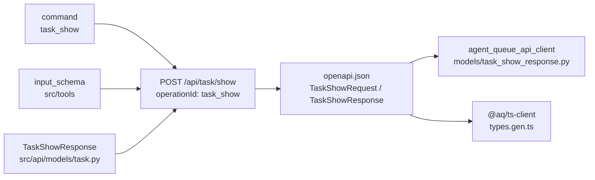

# Response models

Every typed route on the [HTTP API](README.md) declares what it answers with.
Those declarations live in [`src/api/models/`](../../../src/api/models/) as
Pydantic models, they become the schemas in
[`openapi.json`](../../../openapi.json), and both generated clients are built
from them. This page says how a command, a model, a schema and a client class
line up, and which module owns which family.

## The chain from a command to a client class



The naming is mechanical, which is what makes the generated clients navigable:

| Thing | Name |
|---|---|
| Command | `task_show` |
| Path | `POST /api/task/show` (category, then the command with `_` → `-`) |
| `operationId` | `task_show` |
| Request schema | `TaskShowRequest` — generated from the command's JSON input schema by [`_make_input_model`](../../../src/api/codegen.py) |
| Response schema | `TaskShowResponse` — a hand-written model in `src/api/models/` |
| Error schema | `TaskShowResponse422` |
| Python client | `agent_queue_api_client.api.task.task_show`, models `TaskShowRequest` / `TaskShowResponse` |
| Nested objects | `TaskShowResponseContextItem`, `TaskShowResponseParentType0`, … — the generator names anonymous sub-objects after their parent |

A command has a response model when
[`get_all_response_models()`](../../../src/api/models/__init__.py) finds one
for its name. The registry is the union of the `RESPONSE_MODELS` dict each
category module exports.
[`tests/test_response_model_registry.py`](../../../tests/test_response_model_registry.py)
fails when a newly categorized command has no model, because the generated
TypeScript client would type that call's result as `unknown` and the dashboard
would silently lose it. A short, explicitly listed set of commands is exempt
because they return an unstructured dictionary on purpose.

## What is in each module

The count columns are from the modules at the commit this page was written
against; regenerate rather than trusting them
(`grep -c '^class ' src/api/models/*.py`).

| Module | Family | Models | Registered commands |
|---|---|---|---|
| [`task.py`](../../../src/api/models/task.py) | Tasks, comments, gates, dependencies, claims, batches | 78 | 55 |
| [`playbook_v2.py`](../../../src/api/models/playbook_v2.py) | The V2 semantic-graph surface: definitions, proposals, validation, runs | 66 | 14 |
| [`playbook.py`](../../../src/api/models/playbook.py) | Playbook listing, health, artefacts, run history | 36 | 14 |
| [`system.py`](../../../src/api/models/system.py) | Config, schema, logs, events, costs, doctor, integration control | 35 | 24 |
| [`agent.py`](../../../src/api/models/agent.py) | Agents, profiles, sessions-as-agents, questions, pools | 33 | 28 |
| [`git.py`](../../../src/api/models/git.py) | Status, diff, log, branch, push, PR, merge | 24 | 22 |
| [`project.py`](../../../src/api/models/project.py) | Projects, workspaces, workspace kinds, constraints | 20 | 18 |
| [`graph_layout.py`](../../../src/api/models/graph_layout.py) | Requests *and* responses for the spatial layout routes | 19 | 0 (used directly by hand-written routes) |
| [`metrics.py`](../../../src/api/models/metrics.py) | One fleet metrics sample and a series of them | 14 | 0 (used directly by `GET /api/metrics/series`) |
| [`files.py`](../../../src/api/models/files.py) | Read, write, edit, glob, grep, notes | 13 | 11 |
| [`memory.py`](../../../src/api/models/memory.py) | Semantic memory search, save, profiles | 13 | 11 |
| [`plugin.py`](../../../src/api/models/plugin.py) | Plugin list, install, enable, config | 12 | 11 |
| [`project_onboarding.py`](../../../src/api/models/project_onboarding.py) | Root browsing, GitHub discovery, the onboarding saga | 12 | 7 |
| [`session.py`](../../../src/api/models/session.py) | Session listing, logs, input, lifecycle | 12 | 11 |
| [`escalation.py`](../../../src/api/models/escalation.py) | Human escalations and their replies | 11 | 6 |
| [`mcp.py`](../../../src/api/models/mcp.py) | MCP server registry and tool catalog | 8 | 7 |
| [`digest.py`](../../../src/api/models/digest.py) | Digest preview and schedule health | 7 | 2 |
| [`gate.py`](../../../src/api/models/gate.py) | Human and routing gates | 6 | 4 |
| [`graph.py`](../../../src/api/models/graph.py) | The aggregate project-graph read | 6 | 2 |
| [`message.py`](../../../src/api/models/message.py) | Inbox, send, reply, threads | 5 | 4 |
| [`__init__.py`](../../../src/api/models/__init__.py) | `ErrorResponse`, `TaskRef`, `TaskBrief`, and the registry | 3 | — |
| [`provider.py`](../../../src/api/models/provider.py) | Provider quota as each provider reports it | 2 | 0 (used directly by `GET /api/providers/usage`) |
| [`discord.py`](../../../src/api/models/discord.py) | Channel housekeeping | 1 | 1 |

Four modules register nothing: their models belong to hand-written routes
rather than to a command, so they reach the schema through the route's
`response_model` instead of through the registry.

## Conventions inside the models

* **Optional with a neutral default.** A sample or a listing is often
  deliberately partial — a host with no `/proc/meminfo`, a tier that has not
  rolled up yet — and a strict model would turn an honest gap into a `500`.
  The metrics models state this rule explicitly and follow it field by field.
* **Errors are separate schemas.** Every generated route declares a `422`
  alongside its success model, so the generated clients can parse a failure
  rather than throw. `escalation_*` and `digest_*` routes declare
  `EscalationErrorResponse`, which keeps the structured payload;
  `edit_intelligence_class` additionally declares a `409` conflict model.
* **Absent versus null.** Responses serialize `None` as `null` by default. One
  command opts out — `playbook_graph_view` is serialized with
  `exclude_none`, because its compiled node details model "not set" as an
  absent key, and rendering them as `null` would fill the dashboard's node
  inspector with empty rows.
* **Inheritance is visible in the client.** `TaskShowResponse` extends
  `TaskDetail`; the generator flattens that into one class with every field,
  so the client class is bigger than the model file suggests.

## Changing a model

1. Edit the model in `src/api/models/`.
2. Regenerate the artifacts, from the repository root:

   ```bash
   ./scripts/regenerate-api-client.sh --offline
   ./scripts/regenerate-ts-client.sh --from-file
   ```

3. Commit `openapi.json` and `packages/aq-client/` with the source change.

Skipping step 2 is caught rather than shipped:
`tests/test_api_client_contract.py::test_committed_openapi_json_matches_the_live_app_surface`
compares the committed spec with the one `create_app()` serves. Never hand-edit
anything under `packages/aq-client/` — see the
[Python client](python-client.md) page for why that tree is a pure function of
the spec and a pinned generator.

## State ownership

These models describe state; they own none of it. A response model is a
projection of rows the command read, built per request and discarded. The one
artifact this page's material persists into is `openapi.json`, which is
committed and regenerated, never edited.

## Common failures and recovery

| Symptom | Cause | Recovery |
|---|---|---|
| `test_committed_openapi_json_matches_the_live_app_surface` fails | A model or route changed without regenerating. | Run both regeneration scripts and commit the artifacts. |
| A new command's result is `unknown` in TypeScript | No response model registered for it. | Add a model and put it in that module's `RESPONSE_MODELS`; `tests/test_response_model_registry.py` is the guard. |
| `500` with a pydantic `ValidationError` in the daemon log | A response model is stricter than the data it projects — an `int` field receiving a rolled-up average, for example. | Widen the field to match reality, regenerate, and add a case with the real shape. |
| A field you added is missing from the client | The client was not regenerated, or the installed client is an older copy than the checkout. | Regenerate, then `pip install -e packages/aq-client`. |

## Related pages

* [HTTP API overview](README.md) — where these models are served from.
* [Python client](python-client.md) — how the schemas become typed calls.
* [TypeScript client](typescript-client.md) — the same, for the dashboard.
* [Module catalog: API](../modules/api.md) — one row per model module.

## Source and tests

[`src/api/models/`](../../../src/api/models/),
[`src/api/codegen.py`](../../../src/api/codegen.py).

```bash
aq test tests/test_response_model_registry.py tests/test_api_codegen_input_models.py \
        tests/test_playbook_v2_api_dtos.py tests/test_api_client_contract.py
```
