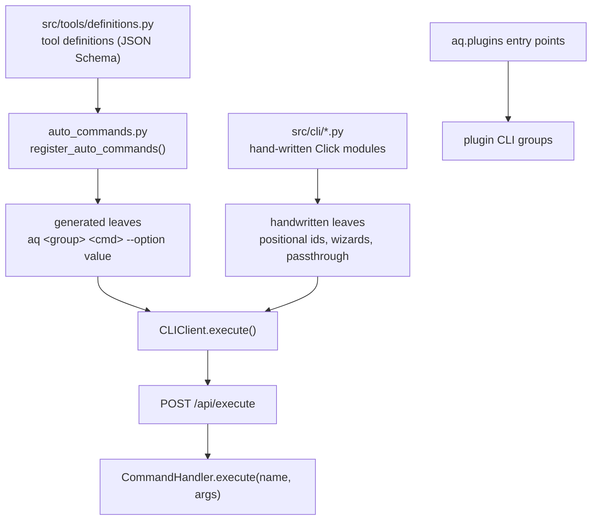

# The `aq` command line

`aq` is the command line for the Agent Queue daemon. It is the surface both
humans and AI worker agents use: the same binary, the same commands, the same
results — what differs is only *who is allowed to run what*.

This page is the contract every `aq` command obeys: how the surface is
assembled, how output is shaped, what the exit codes mean, and which authority
a caller has. The other pages in this directory go deeper:

| Page | Covers |
|---|---|
| [Command groups](commands.md) | Every group and every leaf command, with the daemon command behind it. |
| [`aq prime` and the session hooks](prime.md) | The startup document a worker receives, its sections, its per-project override, and the harness hooks. |
| [Agent-facing tools](agent-tools.md) | The tool definitions, the MCP surface, and the shipped agent skills. |
| [Command contracts](contracts.md) | The typed, fingerprinted contracts playbooks execute commands through. |
| [`aq install`](install.md) | The daemon-free installer: flags, JSON payload, exit codes and the resume record. |

> **Prerequisite for every example on this page.** The daemon is running on
> loopback and the shell has no `AQ_API_TOKEN` set — that is an operator
> shell. Outputs shown were captured from a real install; the numbers in them
> are from that machine, not constants.

## Vocabulary

* **Daemon** — the long-running Agent Queue process. `aq` is a client; it
  holds no state of its own.
* **Command** — a named operation the daemon can perform, such as
  `task_close`. Commands have snake_case names.
* **Leaf command** — one `aq …` invocation, such as `aq task close`. A leaf
  usually maps to exactly one daemon command.
* **Scope / principal** — the identity a request runs as. The three that
  matter here are the loopback operator, an agent session token, and an
  elevated supervisor token. See [Authority](#authority-who-may-run-what).
* Anything else is in the [glossary](../glossary.md).

## Quick reference

Nothing below needs a flag you have not seen yet; every one of these commands
is explained in [Command groups](commands.md).

**Look around**

```bash
aq status                       # system overview (also the default with no arguments)
aq --help                       # the command groups
aq task --help                  # one group's commands
aq schema                       # every enum value — never guess a status or outcome
aq doctor                       # health checks for this install
```

**Work with tasks** (operator shell)

```bash
aq task list --project agent-queue
aq task show <task-id>
aq task explain --task-id <task-id>   # why this task is not running
aq project ready --project-id <project-id>
```

**The worker loop** (inside an agent session; see [worker workflow](#worker-versus-operator))

```bash
aq task claim --next --wait 60
aq prime
aq task set <task-id> --note "what I found"
aq task close <task-id> --outcome pass --summary "what changed and how it was verified"
aq session drain-ack
```

**When something is stuck**

```bash
aq task explain --task-id <task-id>  # ordered reasons a task is not running
aq doctor                            # every health check, with fix hints
aq session list                      # what is actually running
aq session logs <session-id>         # a worker's recorded output
aq project workspace-doctor --project-id <project-id>
aq integration status <project-id>   # delivery train state
```

## How the surface is assembled

`aq` has three kinds of leaf command, and the difference is visible in the
[machine-readable inventory](#the-command-inventory) as the `registration`
field.



* **Generated.** [`src/cli/auto_commands.py`](../../../src/cli/auto_commands.py)
  walks the tool definitions in
  [`src/tools/definitions.py`](../../../src/tools/definitions.py) and builds
  one Click command per definition, grouped by the tool's category. Every
  schema property becomes a `--kebab-case` option; there are no positional
  arguments. `git_commit` becomes `aq git commit`, `memory_search` becomes
  `aq memory search` — the category prefix is stripped from the leaf name.
* **Hand-written.** A leaf that needs a positional id, an interactive wizard,
  a passthrough argv, or hook-safe error handling is written by hand in one of
  the modules listed in the [module catalog](../modules/cli.md). Hand-written
  modules are imported *before* generation runs, so their names win over any
  generated command of the same name; the list of names they claim is
  `HANDCRAFTED_COVERAGE` in `auto_commands.py`.
* **Plugin extensions.** An installed package that advertises an `aq.plugins`
  entry point may mount its own group. It can never shadow a core group: a
  name collision is logged and skipped
  ([`src/cli/app.py`](../../../src/cli/app.py), `_load_plugin_cli_groups`). A
  plugin whose entry point raises still gets a discoverable group that
  explains the failure instead of vanishing.

Generation is *offline*: the tool definitions are a plain data structure, so
`aq --help` and `aq <group> --help` work with the daemon down. Only execution
needs the daemon.

### Transport

Every command is a client call. The default path is
`POST /api/execute` with `{"command": name, "args": {...}}`, handled by
[`CLIClient.execute`](../../../src/cli/client.py). A few commands use a
bespoke route because the shape demands it — message send, session messages,
`aq stream`, `GET /api/tools`, `GET /api/health` — and `aq plugin` reads the
database directly for filesystem-heavy operations. The generated
`agent_queue_api_client` package is the *dashboard's* client, not the CLI's
transport.

The base URL resolves in this order:

1. `--api-url` (a [global option](#global-options), valid at any position)
2. `AQ_API_URL`
3. `AGENT_QUEUE_API_URL` (legacy alias, kept indefinitely)
4. `mcp_server.host` / `mcp_server.port` from `~/.agent-queue/config.yaml`
5. `http://127.0.0.1:8081`

Two commands never need the daemon at all: `aq schema` renders a pure
code-owned catalog, and `aq logs` reads the JSONL log file from disk.

## Global options

`--json`, `--brief` and `--api-url` are **global**: they may appear before the
group, between a group and its subcommand, or after the leaf command and its
arguments, and every position means the same thing. All four of these are the
same invocation:

```bash
aq --json task list
aq task --json list
aq task list --json
aq task list --brief --json
```

Repeating a flag is allowed and idempotent. This works because
[`install_global_options`](../../../src/cli/global_options.py) copies the
options onto every command in the tree after registration.

Two deliberate exclusions:

* **Passthrough commands** — `aq test` and `aq stream start` forward their
  trailing argv to a child program, so `aq test tests/x.py --json` hands
  `--json` to pytest. Use the prefix form (`aq --json test …`) there.
* **Commands that declare their own option of the same name** — `aq doctor`,
  `aq logs` and `aq system config get` each have a local `--json` that keeps
  its local meaning.

Everything after a `--` separator is Click's end-of-options boundary and is
never consumed.

The root group also carries `--help-all`, which prints the complete help for
every command recursively. It is the cheapest way to hand the whole surface to
a model or to `grep`.

## Output contract

### The JSON envelope

Every command run with `--json` prints exactly **one** JSON object on stdout:

```bash
aq message inbox --json
```

```text
{"schema_version": 1, "data": [], "pagination": {"returned": 0, "total": 0, "truncated": false}}
```

* `schema_version` is an integer, bumped only on a breaking *envelope*
  change. A command's payload growing a field is additive and does not bump
  it.
* `data` is the payload: an object for singular commands, an array for lists.
* `pagination` appears **only when `data` is an array**: `returned` is the
  item count in this response, `total` is the matching count server-side, and
  `truncated` is `returned < total`.
* Human diagnostics and deprecation warnings go to stderr, so stdout stays
  exactly one parseable document.

The envelope is applied by the CLI on top of the unchanged
`{"success": bool, …}` dicts the daemon returns; neither the command payloads
nor the `/api/execute` wire format change. It is built in
[`src/cli/envelope.py`](../../../src/cli/envelope.py).

### Errors

An error is the same envelope with `error` in place of `data`:

```bash
aq task list --json
```

```text
{"schema_version": 1, "error": {"code": "out_of_scope", "message": "out of scope: list_tasks"}, "data": null}
```

(The example above was run inside a worker session, whose token may not list a
project's queue. From an operator shell the same command returns tasks.)

An error carrying structured findings — `aq task create --graph` reports every
failing validation rule at once — adds them under `error.details`, and human
mode prints them one per line rather than only the summary count.

### Exit codes

| Code | Meaning | Error code in the envelope |
|---|---|---|
| `0` | Success. Also every `paused` no-op, so an agent loop does not fail spuriously on a paused subsystem. | — |
| `1` | The command ran and failed. | `command_error` |
| `2` | Usage error, including Click parsing. | `usage_error` |
| `3` | The daemon could not be reached. | `daemon_unreachable` |
| `4` | Authentication or scope denied. | `out_of_scope` |

`aq inbox --inject` always exits `0` regardless of what happened — it runs on
the agent's prompt path and must never block it. `aq subagent event
--hook-json` is silent and exits `0` for the same reason. `aq test` exits with
pytest's own status, plus `75` (`EX_TEMPFAIL`) when no test slot came free,
which is retryable and not a test failure.

The mapping lives in `_handle_errors`
([`src/cli/app.py`](../../../src/cli/app.py)) and the exception classes in
[`src/cli/exceptions.py`](../../../src/cli/exceptions.py). Verified live:

A misspelled subcommand — `nosuchcmd` under `aq task`, say — is a usage error:

```text
{"schema_version": 1, "error": {"code": "usage_error", "message": "No such command 'nosuchcmd'."}, "data": null}
exit=2
```

An unreachable daemon is exit `3`:

```bash
aq --json --api-url http://127.0.0.1:9 status; echo "exit=$?"
```

```text
{"schema_version": 1, "error": {"code": "daemon_unreachable", "message": "Cannot connect to agent-queue daemon at http://127.0.0.1:9. Is it running? Start with 'agent-queue' or check your config."}, "data": null}
exit=3
```

> **One error deserves a second look.** `command_error` with the message *"No
> complete command response was received"* is not a failure — it means the
> HTTP response was lost after the request left. The write may have landed.
> Check the current state before retrying; the CLI deliberately refuses to
> replay it (`CommandResponseError`).

### `--brief`

`--brief` trims each entity to a fixed projection so a list stays cheap to
read. Projections are defined centrally in `BRIEF_PROJECTIONS`
([`src/cli/envelope.py`](../../../src/cli/envelope.py)), never per command,
and they compose with `--json` and with human table output:

```bash
aq task show <task-id> --brief --json
```

```text
{"schema_version": 1, "data": {"id": "solid-grove.12", "title": "Document the full AQ CLI, command layer, contracts and agent-facing tools", "status": "IN_PROGRESS", "priority": 60, "project_id": "agent-queue", "assigned_agent": "agent-5231de48bbb5"}}
```

Entities with a projection today: `task`, `task_created`, `session`, `gate`,
`message`, `workspace`, `agent`, `project`, `pool`, `integration`. An entity
with no projection passes through unchanged. The `workspace` projection
deliberately renames the internal `workspace_path` and
`locked_by_agent_id`/`locked_by_task_id` columns to the stable public `path`
and `locked_by`.

### Creation receipts

`aq task create` is a write whose only durable output is the new id. Read it
from **`data.created`** (`data.task_id` is an alias that ships alongside it):

```bash
new_id=$(aq --json task create -p demo -t "Add a health endpoint" -d "…" | jq -r .data.created)
```

Never scrape the human line: a client that fails to parse stdout *after* the
task is persisted retries into a duplicate task. Cancelling the interactive
wizard is also one document — `{"cancelled": true, "created": null}` at exit
`0` — so a consumer can tell "nothing was created" from an empty stream.

`aq task create --graph` / `--from-spec` return the graph report
(`parent_id`, `nodes[]`, `warnings[]`) and take no brief projection.

### Structured and null-clearing options

A generated option's type comes from its JSON Schema property, and two shapes
need special handling
([`src/cli/auto_commands.py`](../../../src/cli/auto_commands.py)):

* **`object` / `array` properties are parsed as JSON**, not passed through as
  text. `aq system update-config --section swarm --data '{"enabled": true}'`
  sends a mapping. An array option also accepts a bare comma-separated list,
  because that is what people type: `--waiter-task-ids a,b` equals
  `'["a","b"]'`.
* **A nullable property accepts the literal `null` to clear the field.** A
  schema type of `["integer", "null"]` means "an integer, or an explicit null
  that removes the value". Omitting the option means *leave unchanged*;
  passing `null` means *set to nothing*. Without this there was no way to take
  a pool's numeric cap back to unbounded from the CLI. Nullable enum options
  spell `null` out in their `--help` choice list.

Both are the same distinction: `None` means "not given" and is dropped;
`null` is a value and is sent.

### Commands that are not one JSON document

| Kind | Commands | Behaviour under `--json` |
|---|---|---|
| Streaming protocols | `aq logs`, `aq prime --hook-json` | JSON Lines until the read or follow ends; the harness hook envelope, respectively. |
| Interactive | `aq chat` (without `--once`), `aq task select`, `aq system config edit` | Refused with a `usage_error` envelope and exit `2` rather than prompting. |
| Local operator workflows | `aq start`, `aq stop`, `aq restart`, `aq db …`, `aq vault …` | Refused with a `usage_error` envelope **before any side effect**: these own multi-step process and migration progress plus interactive safeguards. |
| Process passthrough | `aq test`, `aq stream start` | The child process's stdout, stderr and exit status are passed through unchanged. |

Third-party plugin groups are an extension boundary: their structured-output
behaviour is defined by the plugin, not by this contract.

### Long-running commands

The client's default read timeout is 30 seconds. Commands that legitimately
run longer carry their own timeout in `_COMMAND_TIMEOUTS`
([`src/cli/client.py`](../../../src/cli/client.py)):

| Command | Read timeout | Why |
|---|---|---|
| `task_claim`, `task_close` | 180 s | Both long-poll for the next claim; `--wait` is clamped server-side by `swarm.claim_wait_max`. |
| `integration_adopt` | 180 s | Repository work against a remote. |
| `integration_flush`, `integration_development_sweep` | 1800 s | Builds and publishes a batch, including validation. |

`aq test` is not on this list because it is not an HTTP call — it execs pytest
locally and waits as long as pytest does.

### Compatibility window

`AQ_JSON_LEGACY=1` restores the pre-envelope raw payload for one release and
writes one deprecation warning to stderr. For a generated list command that is
the original backend wrapper (for example `{"projects": [...]}`), even though
the versioned contract exposes the logical list at `data`. The variable never
changes human output and is ignored by the streaming exceptions above.

## Authority: who may run what

The same binary gives different callers different authority. Nothing about
this is a CLI-side check — the daemon decides, so an agent cannot widen its
own reach by editing arguments.

| Caller | How it is recognised | May run |
|---|---|---|
| **Local operator** | A loopback request with no `Authorization` header. | Everything. |
| **Agent session** | `AQ_API_TOKEN` — a per-session bearer token bound to `(session_id, task_id, project_id)`. | The agent command set, plus narrow verified carve-outs. Task-addressed arguments are pinned to the token's own scope. |
| **Elevated supervisor** | A session token marked elevated for one project. | Any command, still pinned to its project. |
| **Global admin** | An elevated token with no project scope (the `supervisor-global` session, loopback-restricted). | Any command in any project. |

Two independent gates run on every command, and a command must pass both:

1. **Request scope** ([`src/api/scope.py`](../../../src/api/scope.py)) —
   answers "may this token touch this task, this project, this session". It
   also *injects* the token's own `task_id` / `project_id` / `session_id` when
   the caller omitted them, which is why a worker inside a session rarely
   needs those flags. A mismatch is refused, never silently rewritten.
2. **Capability policy**
   ([`src/commands/authorization.py`](../../../src/commands/authorization.py))
   — answers "does this profile's `## Capabilities` block allow this command".
   The same predicate decides what is *published* to a caller and what is
   *runnable* by it, so a name an agent can see is a name it can run.
   Enforcement has three modes (`security.capability_enforcement`): `off`,
   `audit` (the shipped default — an authored policy is enforced, a
   legacy-adapted or unresolved one only warns) and `enforce`.

A denial says only the command name (`capability denied: <name>` or `out of
scope: <name>`); the profile, namespace and policy fingerprint go to the
daemon log, not to the agent.

### Worker versus operator

This is the practical shape of the table above.

**A worker** runs inside a session that already carries `AQ_API_URL`,
`AQ_API_TOKEN`, `AQ_TASK_ID` and `AQ_SESSION_ID`. It never passes a task id it
had to look up, and it never needs `--project`. Its loop is:

```bash
aq task claim --next --wait 60
aq prime
aq task set <task-id> --note "…"
aq task heartbeat
aq task close <task-id> --outcome pass --summary "…" --claim-next --wait 60
aq session drain-ack
```

`aq task close` takes the task id positionally *and optionally*: omit it and
the daemon closes whichever task the calling session holds, which is what a
pool worker wants because its task changes with every claim. The mutating
worker commands are claim-fenced: `--claim-epoch` defaults to the epoch in
`<work_dir>/.aq/claim.json`, falling back to `$AQ_CLAIM_EPOCH`
([`src/cli/claim_epoch.py`](../../../src/cli/claim_epoch.py)), so a stale
session cannot write over a task that has since been reclaimed.

Commands outside a worker's authority answer `out of scope: <command>` at exit
`4`. That is a durable answer, not a transient one — retrying it wastes a
turn.

**An operator** runs on the daemon host with no token and therefore no
restrictions. Operator-only work includes daemon lifecycle (`aq start|stop|
restart`), migrations (`aq db upgrade` — see
[migrations](../../guides/migrations.md)), `aq vault …`, project onboarding,
global agent settings, direct terminal input (`aq system session-input`) and
every `aq integration` control verb.

## Environment variables

`aq` reads these; the daemon sets the session ones at launch
([`src/sessions/env.py`](../../../src/sessions/env.py)).

| Variable | Read by | Effect |
|---|---|---|
| `AQ_API_URL` | client | Daemon base URL (canonical). |
| `AGENT_QUEUE_API_URL` | client | Legacy alias for the above. |
| `AQ_API_TOKEN` | client | Sent as `Authorization: Bearer …` on every request. |
| `AQ_TASK_ID` | `aq prime`, `aq handoff` | Default task id inside a session. |
| `AQ_SESSION_ID` | `aq handoff`, `aq subagent event`, claim-file matching | Default session id. |
| `AQ_CLAIM_EPOCH` | claim-fenced mutators | Fallback when `.aq/claim.json` is absent. |
| `AQ_JSON_LEGACY` | `--json` output | `1` restores the pre-envelope payload for one release. |
| `AQ_STARTUP_PROMPT_DELIVERED` | `aq prime` | `1` suppresses a hook-mode body that was already delivered. |
| `AQ_SUBAGENT_HOOK_DEBUG` | `aq subagent event` | Any value prints the swallowed delivery error to stderr. |
| `AQ_TEST_SLOTS`, `AQ_TEST_WORKERS` | `aq test` | Session-derived caps; they win over the config file. |
| `POSTGRES_TEST_DSN` | `aq test` | Required; `aq test` refuses before taking a slot when it is unset. |
| `AQ_THEME` | Rich output | Selects the terminal theme. |
| `AGENT_QUEUE_MCP_EXCLUDED` | MCP registration | Comma-separated extra command exclusions. |

Inside a worktree slot the daemon also exports `AQ_DB_SCOPE=worker` plus
sentinel values for `AQ_DATABASE_URL` / `AGENT_QUEUE_DB`. Those are a guard,
not a configuration: they make the direct-database CLI paths refuse to migrate
the operator's database from inside a worker. Leave them alone.

## Recovery commands

| Symptom | Command | What it tells you |
|---|---|---|
| A task never starts | `aq task explain --task-id <task-id>` | The ordered list of reasons it is not running. |
| Nothing in the project starts | `aq project ready --project-id <id>` | The ready frontier, plus every withheld task and why. |
| The install feels wrong | `aq doctor` | One row per health check with severity and whether it is fixable; `aq doctor --fix` applies the safe repairs. |
| A worker looks stuck | `aq session list`, `aq session show <id>`, `aq session peek <id>`, `aq session logs <id>` | State, last activity, the visible pane, the recorded transcript. |
| A worktree slot is orphaned | `aq project workspace-doctor --project-id <id>`, `aq project workspace-reap` | Inventory findings, then explicit reaping. |
| Delivery is not progressing | `aq integration status <project-id>` | Rollout, readiness, active work and cleanup for the train. |
| Pools are not starting workers | `aq pool status` | One row per profile with supply, demand and bounds, and per-project placement. |
| A daemon-side error you cannot see | `aq logs -F --grep <term>` | Tails the JSONL log directly from disk; needs no daemon. |
| The schema is behind the code | `aq db current` | The stamped revision and this checkout's head. Read-only and always safe. |

## Obsolete aliases and removed spellings

Three spellings are **supported aliases**, kept because they are baked into
hooks, skills and shells. They are not deprecated:

| Alias | Canonical | Note |
|---|---|---|
| `aq inbox` | `aq message inbox` | Deliberately hook-safe: it exits `0` with no output when there is nothing to say, a recipient cannot be resolved, or the daemon is down. |
| `aq reply` | `aq message reply` | — |
| `aq task details` | `aq task show` | — |

One command is **deprecated**: `aq plugin logs` reports that plugin hook
execution history no longer exists and points at `aq playbook list-runs`.

Several generated `aq git` leaves are alias spellings of another leaf and say
so in their own help: `checkout-branch`, `commit-changes`, `create-branch`,
`merge-branch` and `push-branch`.

Six spellings from the 2026-09-08 audit no longer exist. They are kept in the
inventory's `historical_commands` ledger so their removal cannot be mistaken
for a gap. Written without the `aq` prefix, because they no longer parse:

| Removed | Replacement |
|---|---|
| `task ask-human` | Report a blocker with `aq message send`; answer an existing question through `aq question`. |
| `task tree` | `aq task get-tree` |
| `task result` | `aq task get-result` |
| `task dep add` | `aq task add-dependency` |
| `task dep remove` | `aq task remove-dependency` |
| `task input-response` | `aq system provide-input` for legacy `WAITING_INPUT` tasks; otherwise `aq question`. |

> **Not a command surface.** Discord carries notifications only — an activity
> digest and one thread per escalation. There are no AQ slash commands, task
> controls or gate buttons. Anything that says otherwise is describing a
> retired design.

## The command inventory

[`docs/reference/cli-command-inventory.json`](../cli-command-inventory.json)
is the maintained machine-readable inventory. It is generated from the live
Click tree, so it follows the source rather than a frozen audit baseline, and
it records per leaf: registration kind, owner (core, in-tree plugin, external
plugin), backend command, alias and deprecation status, a compact parameter
contract, evidence level and one conservative acceptance status.

```bash
python scripts/generate-cli-command-inventory.py --check
```

```text
CLI inventory current: 328 leaf commands
```

The prose in [Command groups](commands.md) is derived from the same tree and
answers a different question — *what is this group for* — so read the JSON when
you need a leaf's exact parameters, and the group page when you need to find
the leaf. The counts in that artifact are the authority; regenerate rather than
quoting a number from any page.

## Related pages

* [Command groups](commands.md) — the group-by-group reference this page is
  the contract for.
* [`aq prime` and the session hooks](prime.md) — what a worker is told at
  startup, and by which command.
* [Agent-facing tools](agent-tools.md) — the same commands as tool
  definitions, and the MCP surface that publishes them.
* [Command contracts](contracts.md) — the typed layer playbooks call commands
  through.
* [`aq install`](install.md) — the one command that runs before a daemon
  exists, and the exit codes a script branches on.
* [Module catalog: CLI](../modules/cli.md) — every module behind this surface.
* [Resource gating](../../guides/resource-gating.md) — why `aq test` exists and
  what the slot semaphore protects.
* [Migrations](../../guides/migrations.md) — why `aq db upgrade` is
  operator-only.

## Source and tests

Surface entry point [`src/cli/app.py`](../../../src/cli/app.py); generation
[`src/cli/auto_commands.py`](../../../src/cli/auto_commands.py); output
contract [`src/cli/envelope.py`](../../../src/cli/envelope.py); option grammar
[`src/cli/global_options.py`](../../../src/cli/global_options.py); transport
[`src/cli/client.py`](../../../src/cli/client.py); authority
[`src/api/scope.py`](../../../src/api/scope.py) and
[`src/commands/authorization.py`](../../../src/commands/authorization.py). The
design this implements is
[`docs/specs/design/aq-surface.md`](../../specs/design/aq-surface.md) §4 and
§7.

```bash
aq test tests/test_cli.py tests/test_cli_envelope.py tests/test_cli_global_options.py \
        tests/test_cli_conformance.py tests/test_cli_inventory.py tests/test_guidance_docs.py
```
