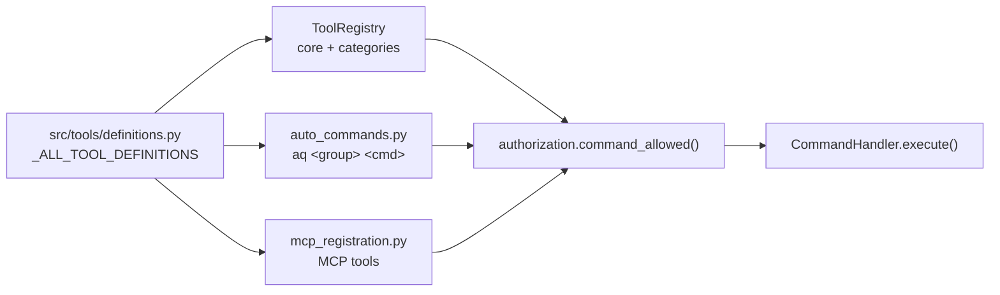

# Agent-facing tools

An AI agent can reach Agent Queue two ways: by shelling out to `aq`, or by
calling a **tool** — a JSON Schema description of one command, handed to a
model so it can call it natively. Both paths end in the same place:
`CommandHandler.execute(name, args)`. The tool layer is a *presentation* of
the command surface, not a second surface.

This page covers where tool definitions come from, how they are grouped and
discovered, what filters them, how MCP publishes them, and the agent skills
that ship alongside. For the CLI itself see [the CLI contract](README.md).

> **AQ is CLI-first, on purpose.** The shipped tool guidance tells a worker to
> prefer `aq …` for anything exploratory, because a command line costs one or
> two thousand tokens of learned usage while a large tool schema costs tens of
> thousands. Native tools are for the handful of calls made mid-turn where a
> tool call genuinely beats a subprocess.

## Where tool definitions come from

[`src/tools/definitions.py`](../../../src/tools/definitions.py) holds
`_ALL_TOOL_DEFINITIONS`: a list of plain dicts, each `{"name",
"description", "input_schema"}`, where `name` is a `CommandHandler` command.
It is a pure data structure with no heavy imports, which is what lets the CLI
generate its command tree with the daemon down.

Three things read that list, and they must agree:



A command with no definition here is still dispatchable — the MCP layer
discovers `_cmd_*` methods and synthesises a schema for them — but it will
carry a generic docstring-derived schema rather than an authored one.

## Categories, core tools, and on-demand loading

[`ToolRegistry`](../../../src/tools/registry.py) splits the definitions in
two. A tool listed in `_TOOL_CATEGORIES` belongs to a named category; a tool
listed nowhere is **core** and is always loaded. Core is deliberately tiny —
fewer than a dozen tools, including `find_applicable_tool` and `load_tools` —
because the whole point is to keep a conversation's opening context small.

The current categories, with the CLI group each becomes:

| Category | CLI group | What it covers |
|---|---|---|
| `task` | `aq task` | Task lifecycle, approval, dependencies, archives, results. |
| `project` | `aq project` | Project CRUD, workspaces, project metadata. |
| `agent` | `aq agent` | Agents, profiles, profile import/export. |
| `playbook` | `aq playbook` | Compilation, runs, human-in-the-loop review and resume. |
| `system` | `aq system` | Token usage, logs, events, config, diagnostics, prompts. |
| `git` | `aq git` | Branch, commit, push, PR, merge, remote URL. |
| `files` | `aq file` | Read, write, edit, glob, grep. |
| `notes` | `aq note` | Project notes and promotion to specs. |
| `memory` | `aq memory` | Semantic memory search and save. |
| `message` | `aq message` | The inter-agent and user message queue. |
| `escalation` | `aq escalation` | Durable human escalations. |
| `digest` | `aq digest` | The hourly activity digest. |
| `discord` | `aq discord` | Shared-channel housekeeping. |
| `mcp` | `aq mcp` | The MCP server registry and tool catalog. |
| `pool` | `aq pool` | Worker pool sizing. |
| `formula` | `aq formula` | Reusable task-graph templates. |
| `graph` | `aq graph` | Server-side spatial task-graph layout. |
| `plugin` | `aq plugin` | Plugin lifecycle. |

Two commands drive discovery:

* **`load_tools`** injects one category's definitions into the active tool set
  for subsequent turns. Loading is purely an attention optimisation —
  execution flows through `CommandHandler.execute` whether a tool is "loaded"
  or not. It is excluded from the CLI and from MCP: it is a
  supervisor-internal meta-tool.
* **`find_applicable_tool`** (`aq system find-applicable-tool`) searches tools
  by describing what you want to do. It is backed by
  [`ToolIndex`](../../../src/tools/tool_index.py), an in-memory cosine-
  similarity index over tool names and descriptions, rebuilt at startup and
  never persisted. If the embedding provider is unavailable the index simply
  stays empty and search returns nothing — semantic tool search is an
  optional convenience, not a dependency.

## What an agent is actually shown

`load_tools` does not hand back everything in a category. Two filters run
first, and both exist so that **a name that is published is a name that can be
run**:

1. **Dispatchability** — a definition with no backing `_cmd_*` method and no
   plugin command is dropped, with a reason. Advertising `memory_search` with
   the `aq-memory` plugin uninstalled would produce a confusing "unknown
   command" on the next turn, so the command reports that the plugin is not
   installed instead.
2. **Capability** — names the caller's policy could not dispatch are dropped
   *silently*. Discovery uses the same `command_allowed` predicate the
   dispatch gate uses
   ([`src/commands/authorization.py`](../../../src/commands/authorization.py)),
   so the two cannot drift. Which commands a caller cannot reach is operator
   information, not agent information; it goes to the daemon log.

## MCP

The daemon embeds a streamable-HTTP MCP server on the same host and port as
its API (`mcp_server.host` / `mcp_server.port`, default `127.0.0.1:8081`),
mounted at `/mcp`.

**What it publishes.** Every authored tool definition, plus every discovered
`CommandHandler` command and plugin command, minus the *effective exclusions*:
`DEFAULT_EXCLUDED_COMMANDS` ∪ `mcp_server.excluded_commands` from the config
file ∪ the comma-separated `AGENT_QUEUE_MCP_EXCLUDED` environment variable
([`src/mcp_registration.py`](../../../src/mcp_registration.py)). The shipped
defaults exclude `shutdown`, `restart_daemon`, `update_and_restart`,
`run_command`, `load_tools`, `session_token` (a credential minter is never
something an MCP client should reach) and `subagent_event` (harness telemetry
an LLM has no reason to hand-write).

**How a session gets it.** When `mcp_server.inject_into_tasks` is true — the
default when the server is enabled — the registry exposes a synthetic
`agent-queue` entry pointing at `/mcp`, and a profile that names it under
`## MCP Servers` gets it in its session. Publication is coarse; the real
narrowing happens at call time, where the token's scope and the profile's
capability policy both apply.

> **Proposed, not implemented.** The aq-surface design describes a second
> mount at `/mcp-task` exposing a small task-scope allowlist. The
> configuration substrate exists (`mcp_server.task_scope.enabled`,
> `allowlist_extra`) but nothing reads it: `enabled` defaults to false and the
> endpoint is not served. Do not describe it as a shipped surface. The
> allowlist's *intent* — a small set of mid-turn calls — is what the shipped
> tool guidance names today.

## `aq schema` — the enum catalog

Agents guess magic strings. `aq schema` exists so they do not have to. It
prints a pure, code-owned catalog built by
[`src/surface_schema.py`](../../../src/surface_schema.py) with no database and
no daemon:

```bash
aq schema --json
```

```text
{"schema_version": 1, "data": {"schema_version": 1, "enums": {"task_status": ["DEFINED", "READY", "ASSIGNED", …
```

It carries `task_status`, `task_type`, `dependency_type`, `gate_type`,
`gate_status`, `hierarchy_error`, `claim_result`, `claim_phase`, `lifecycle`,
`session_state`, `agent_state` and `outcome`. The values are owned by the
subsystems that define them; `aq schema` is a projection with its own
`schema_version`. The same catalog is available as the `get_schema` command,
so REST and MCP callers get it too.

Read a value from here rather than from any page, including this one — a
documented enum is a snapshot, `aq schema` is the truth.

## Harness tool names

[`src/known_tools.py`](../../../src/known_tools.py) is a different register
entirely: it names the tools the *harness* provides (`Read`, `Write`, `Edit`,
`Bash`, `Glob`, `Grep`, `WebSearch`, `WebFetch`, `Agent`, `Skill`, …), which
is the vocabulary a profile's harness-tool allowlist is written in. Validation
is deliberately soft — `validate_tool_names` returns unrecognised names as
warnings, not errors, so a custom MCP-provided tool still works.

The module also parses a profile's `install:` manifest (`npm`, `pip`,
`commands`), which is what `aq agent check-profile` validates and `aq agent
install-profile` acts on.

## Shipped agent skills

Five skills ship in [`src/skills/`](../../../src/skills/) and are installed
into a harness's skill directory at session start. They are the agent-facing
documentation of this surface — short, task-shaped, and loaded on demand:

| Skill | Covers |
|---|---|
| `aq-cli` | Orientation: how to find any command and get detail on it. |
| `aq-tasks` | The task lifecycle from a worker's seat, and `aq task explain`. |
| `aq-comms` | Messages, the inbox, and reporting a blocker to a human. |
| `aq-workspaces-and-git` | The assigned worktree, its branch, committing, pushing, opening a PR. |
| `aq-playbooks-and-gates` | Inspecting a paused run and resolving a human gate. |

Installation is **write-if-absent** (`ensure_default_aq_skills`): editing a
skill in this repository does **not** update an already-installed copy. The
`skills.installed_drift` doctor check reports the divergence.

Every `aq …` invocation inside these files is machine-checked against the live
Click tree by `tests/test_guidance_docs.py`, along with the prime templates and
the pages in this directory — a subcommand that no longer exists, a positional
id passed to a generated command, or an option the command does not take all
fail that test.

> **Two shipped skills carry stale claims** recorded as entries 8 and 9 in the
> [known-inaccuracies ledger](../../plans/documentation-overhaul/known-inaccuracies.md):
> `aq-playbooks-and-gates` describes per-task reviewer and final-reviewer
> creation as part of the shipped default pipeline, and `aq-comms` describes a
> `UserPromptSubmit` inbox hook that was removed on 2026-08-27. Fixing shipped
> prompt text changes agent behaviour, so it is a code change rather than a
> documentation one.

## State ownership

| State | Written by | Where it lives |
|---|---|---|
| Tool definitions | Source, at edit time | [`src/tools/definitions.py`](../../../src/tools/definitions.py) |
| Category assignment | Source | `_TOOL_CATEGORIES`, `_CLI_CATEGORY_OVERRIDES` in the same module |
| The semantic tool index | Daemon startup | Memory only; rebuilt every start |
| Which categories a conversation has loaded | The supervisor's tool-use loop | Conversation state, not the registry |
| MCP exclusions | Code, config file, environment | `DEFAULT_EXCLUDED_COMMANDS`, `mcp_server.excluded_commands`, `AGENT_QUEUE_MCP_EXCLUDED` |
| MCP server registry entries | `aq mcp …` | `vault/[projects/<pid>/]mcp-servers/*.md` |
| Installed agent skills | `ensure_default_aq_skills`, write-if-absent | The harness's skill directory |

## Common failures and recovery

| Symptom | Diagnose with | What it means |
|---|---|---|
| A tool the agent calls answers "unknown command" | `aq system find-applicable-tool --description "<what you wanted>"` | The definition exists but nothing backs it — most often an uninstalled plugin. |
| A tool is missing from an agent's list | `aq agent get-profile --profile-id <id>` | The profile's `## Capabilities` block does not allow it; discovery drops it silently by design. |
| A command works from the CLI but not over MCP | `aq system get-config --section mcp_server` | It is in the effective exclusion set. |
| `find_applicable_tool` returns nothing at all | daemon log at startup | The embedding provider was unavailable, so the index never built. Search degrades to empty rather than failing. |
| An installed skill disagrees with this repository | `aq doctor` (`skills.installed_drift`) | Skill installation is write-if-absent; the installed copy is older. |
| An enum value is rejected | `aq schema` | Read the value from the catalog rather than a document. |

## Related pages

* [The CLI contract](README.md) — the surface these tools mirror.
* [Command groups](commands.md) — the same commands as CLI leaves.
* [Command contracts](contracts.md) — the typed layer playbooks use, which is
  stricter than a tool definition.
* [`aq prime` and the session hooks](prime.md) — the tool-guidance section a
  worker actually reads.
* [Module catalog: CLI](../modules/cli.md).

## Source and tests

Definitions [`src/tools/definitions.py`](../../../src/tools/definitions.py);
registry [`src/tools/registry.py`](../../../src/tools/registry.py); semantic
index [`src/tools/tool_index.py`](../../../src/tools/tool_index.py); discovery
commands [`src/commands/tool_commands.py`](../../../src/commands/tool_commands.py);
harness tool names [`src/known_tools.py`](../../../src/known_tools.py); enum
catalog [`src/surface_schema.py`](../../../src/surface_schema.py); MCP
registration [`src/mcp_registration.py`](../../../src/mcp_registration.py).

```bash
aq test tests/test_tool_registry.py tests/test_tool_index.py tests/test_known_tools.py \
        tests/test_surface_commands.py tests/test_session_tool_allowlist.py \
        tests/test_command_capability_authorization.py tests/test_guidance_docs.py
```
