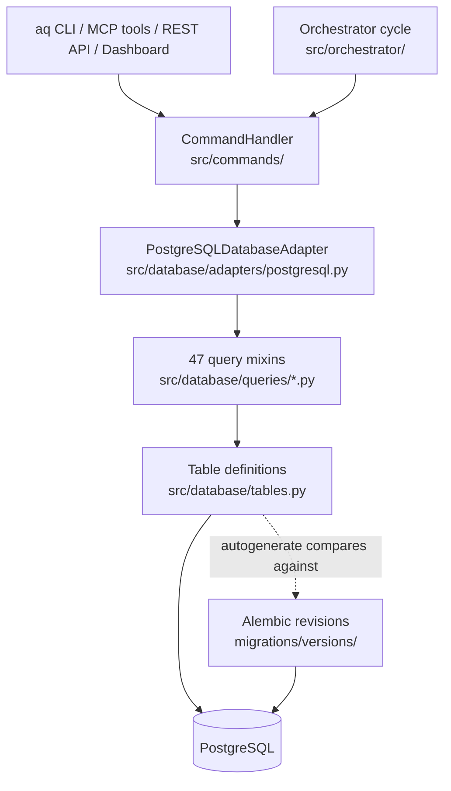
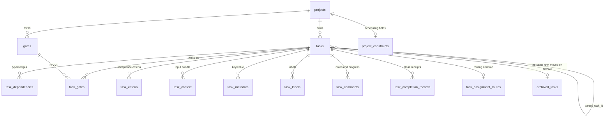
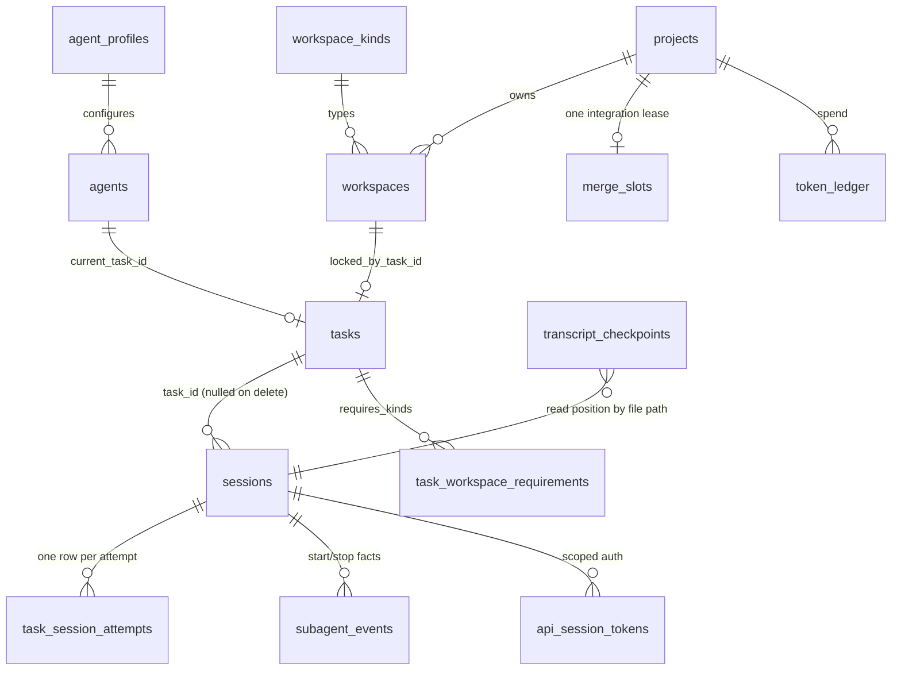
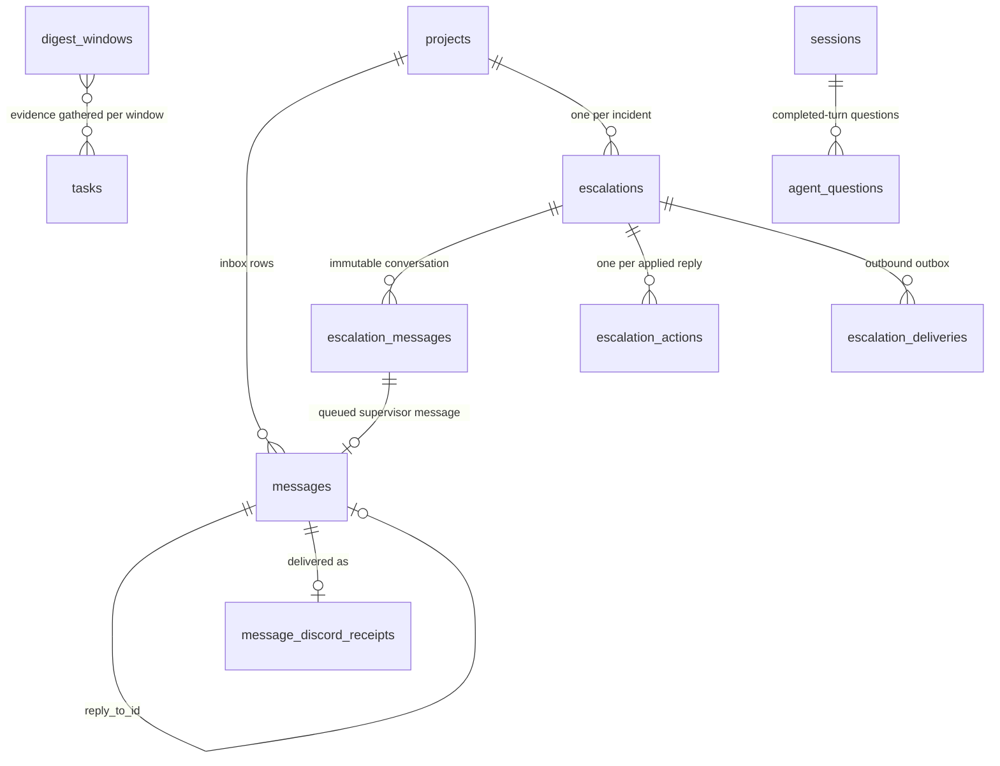
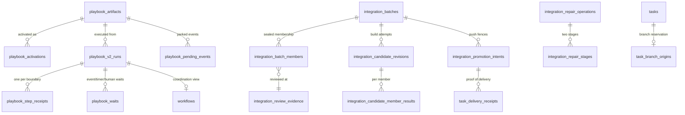

# The database

Everything Agent Queue knows that survives a restart lives in one PostgreSQL
database. This page explains what is in it, how code reaches it, and which
command is allowed to change each kind of state.

You do not need to read SQL to use AQ. You need this page when you are asking
"where did that come from?", "who wrote that row?", or "why did the daemon
refuse to start?".

| Page | Covers |
|---|---|
| This page | Concepts, layering, transactions, the entity diagrams, write ownership. |
| [Table families](tables.md) | Every one of the 98 tables, grouped, with its purpose and its invariants. |
| [Query modules](queries.md) | The 49 query modules — the only code that issues SQL. |
| [Migrations](migrations.md) | Alembic, who may run it, worker databases vs. the operator's, backup and restore. |
| [Data lifecycle](data-lifecycle.md) | Close, archive, delete, what is retained and what refuses to delete. |
| [Module catalog](../modules/database.md) | One row per source file in this subsystem. |

## Vocabulary

* **Backend** — the database server. PostgreSQL is the only one. There is no
  SQLite backend and no file-based mode; a non-PostgreSQL `database.url` is a
  startup error, not a fallback.
* **Adapter** — the single Python object every part of the daemon calls to read
  or write. There is exactly one:
  [`PostgreSQLDatabaseAdapter`](../../../src/database/adapters/postgresql.py).
* **Query module** — one file under
  [`src/database/queries/`](../../../src/database/queries/) owning the reads and
  writes for one subject, mixed into the adapter. See [Query modules](queries.md).
* **Table definition** — a SQLAlchemy Core `Table` in
  [`src/database/tables.py`](../../../src/database/tables.py). That file is the
  schema's source of truth; migrations follow it, never the other way round.
* **Revision** — one Alembic migration file under
  [`migrations/versions/`](../../../migrations/versions/). The database records
  which revision it is at in a table called `alembic_version`; that is being
  *stamped*.
* **Projection** — a column whose value is *computed* from other rows and never
  authored by a caller. `tasks.is_blocked` is the important one.
* **Soft reference** — a column that holds another row's id as plain text, with
  no foreign key. History uses these deliberately, so an audit row survives the
  thing it describes being deleted.

Anything else is in the [glossary](../glossary.md).

## What the database is for

AQ is a daemon that runs coding agents. Almost everything interesting about it
is a *fact that must survive a crash*: which task a worker holds, how far a
playbook got, what a human was asked, which commit was reviewed. The database
is where those facts live. Three properties follow from that and explain most
of the design you will see:

**One writer decides, not many.** Every state change goes through the command
layer ([`src/commands/`](../../../src/commands/)), which calls one query method,
which runs one transaction. Two daemons, or a daemon and a restart, racing on
the same row lose the race explicitly — with a conditional `UPDATE` that matches
zero rows — rather than silently interleaving.

**Evidence is append-only; progress is mutable.** A receipt, a review verdict, a
completion record and a delivered message are written once and never edited.
The mutable state is small and normalised next to them. In the integration
tables this is enforced by the database itself: 29 PL/pgSQL functions and 50
triggers reject `UPDATE` and `DELETE` on evidence rows (see
[Table families → Integration](tables.md#integration-and-delivery)).

**History outlives its subject.** Session rows, token ledger rows, completion
records, comments and escalations use soft references so they stay readable
after the task, agent or session they mention is deleted. This is why the
schema has fewer foreign keys than you might expect.

## How code reaches the database



The adapter is built by multiple inheritance: it lists 47 query mixins as base
classes, so `db.get_task(...)` and `db.record_provider_usage(...)` are both
methods on the same object even though they live in different files. Two of the
49 modules — `proposal_queries.py` and `triage_queries.py` — are module-level
functions taking the adapter as an argument instead, so tests can call them
without building an adapter subclass. The
protocol every mixin is expected to satisfy is written out in
[`src/database/base.py`](../../../src/database/base.py) as `DatabaseBackend`,
which is what type checkers see.

`db.initialize()` does three things and nothing else: create the async engine,
bring the schema to this checkout's head *if it is allowed to*
([Migrations](migrations.md)), and run a handful of idempotent startup data
normalisations in [`engine.py`](../../../src/database/engine.py) (resolve
relative workspace paths, drop two long-dead tables, copy a legacy `repos` row
into its project's columns).

### Transactions

Most query methods open their own short transaction. Anything that reads a
guard condition and then acts on it must not: the read and the write have to be
one unit. Those methods take a `conn` argument and the caller opens the
transaction with `db.immediate()`
([`transaction_queries.py`](../../../src/database/queries/transaction_queries.py)):

```python
async with db.immediate() as conn:
    if await db.open_children(task_id, conn=conn):
        raise Refused("hierarchy.open_children")
    await db.delete_task(task_id, cascade=True, conn=conn)
```

On PostgreSQL `immediate()` is exactly `engine.begin()` — read-committed with
row locks taken as needed. A method that takes `conn` never commits; the block
does, and post-commit notifications (settled containers, ready-frontier
entries) are fired by the caller *after* the commit, never inside it.

### Timestamps, JSON and enums

* Timestamps are `Float` epoch seconds written by Python, never by a database
  `now()` default. One clock, and no dialect-specific DDL.
* `JSON` columns hold frozen evidence and snapshots — things read back whole.
  Anything queried or compared is a real column.
* Enum-like columns are `Text` with a named `CheckConstraint`. Run `aq schema`
  to see the accepted values rather than guessing them.

## The entity diagrams

Four diagrams cover the schema's shape. Each names only the columns that carry
a relationship; [Table families](tables.md) has the rest.

### Work: projects, tasks and the graph



`tasks.parent_task_id` is a *cache*. The truth is a `parent-child` row in
`task_dependencies`, and only
[`hierarchy_queries.set_parent`](../../../src/database/queries/hierarchy_queries.py)
writes both, in one transaction. `tasks.is_blocked` is likewise a projection:
it is true exactly when some blocking edge out of the task is unsatisfied or
some gate attached to it is unresolved, and it is recomputed inside every
transaction that could change it
([`blocked_state.py`](../../../src/database/queries/blocked_state.py)).

### Execution: who is running what, and where



A **claim** is not a table. It is the `claims`, `claim_phase`, `last_claim_epoch`
and `session_key` columns on `sessions` plus `tasks.claim_epoch`, taken together
in one transaction by
[`claim_queries.py`](../../../src/database/queries/claim_queries.py). The
`.aq/claim.json` file in a worker's workspace is a copy for the worker's own
use, never the source of truth.

### Talking to humans



The current Discord integration is **notification-only**: one activity digest
and one thread per human decision. Older documentation describing Discord
control commands, per-task channels or a slash-command mirror describes software
that has been deleted.

### Integration and playbooks



The integration family is 38 of the 98 tables. It is a control plane for
getting reviewed work onto a branch exactly once, and its shape is dominated by
that: fence tokens, idempotency keys, pre-write markers and immutable evidence.
[Table families → Integration](tables.md#integration-and-delivery) walks it.

## Who owns each write

Nothing writes to the database except through a command or an orchestrator
cascade step. This is the map from durable state to its owner; the command names
are daemon commands, and the [CLI reference](../cli/commands.md) says which
`aq …` invocation reaches each one.

| Durable state | Tables | Written by |
|---|---|---|
| Task identity and status | `tasks`, `task_criteria`, `task_context`, `task_metadata`, `task_labels` | `create_task`, `task_set`, `task_close`, `pause_task` / `resume_task`, `delete_task` — [`task_commands.py`](../../../src/commands/task_commands.py) |
| Task graph shape | `task_dependencies`, `tasks.parent_task_id`, `tasks.is_blocked` | `add_dependency` / `remove_dependency`, `reparent_task`, and every mutation that recomputes the projection — [`graph_commands.py`](../../../src/commands/graph_commands.py) |
| Gates | `gates`, `task_gates` | `gate_resolve`, playbook `human` steps — [`gate_commands.py`](../../../src/commands/gate_commands.py) |
| Comments and progress notes | `task_comments` | `task_comment` — [`task_comment_commands.py`](../../../src/commands/task_comment_commands.py) |
| Close receipts | `task_completion_records` | `task_close` only. Append-only. |
| Claims | `sessions.claims`/`claim_phase`, `tasks.claim_epoch` | `task_claim`, `task_handoff` — [`claim_commands.py`](../../../src/commands/claim_commands.py) |
| Session rows and attempts | `sessions`, `task_session_attempts` | the session reconciler ([`src/sessions/reconciler.py`](../../../src/sessions/reconciler.py)) and `session_*` commands |
| Subagent facts | `subagent_events` | `aq subagent event --hook-json`, from the harness's own hooks. Append-only. |
| Token spend | `token_ledger` | the transcript watcher ([`src/sessions/transcripts/watcher.py`](../../../src/sessions/transcripts/watcher.py)) |
| Workspaces and locks | `workspaces`, `workspace_kinds`, `task_workspace_requirements`, `merge_slots` | the orchestrator's workspace acquisition ([`src/orchestrator/workspace.py`](../../../src/orchestrator/workspace.py)) and `workspace_*` commands |
| Messages | `messages`, `message_discord_receipts` | `message_send`, `message_reply`, and the delivery engine ([`src/messages/delivery.py`](../../../src/messages/delivery.py)) |
| Escalations | `escalations`, `escalation_messages`, `escalation_actions`, `escalation_deliveries` | `escalation_*` commands and `EscalationDeliveryService` — [`src/escalations/`](../../../src/escalations/) |
| Digest windows | `digest_windows` | `DigestScheduleService` ([`src/digest/dispatch.py`](../../../src/digest/dispatch.py)); `digest_preview` writes nothing |
| Playbook runs | `playbook_v2_runs`, `playbook_step_receipts`, `playbook_waits`, `playbook_pending_events` | the V2 engine ([`src/playbooks/engine.py`](../../../src/playbooks/engine.py)) |
| Playbook artifacts | `playbook_artifacts`, `playbook_activations` | `playbook_v2_import`, `playbook_activate` — [`playbook_v2_commands.py`](../../../src/commands/playbook_v2_commands.py) |
| Integration control plane | the 38 `integration_*` and delivery tables | the integration services under [`src/integration/`](../../../src/integration/), reached through `integration_*` commands |
| Metrics and quota | `metrics_samples`, `provider_usage_snapshots` | `MetricsSampler` ([`src/metrics/sampler.py`](../../../src/metrics/sampler.py)) and the provider probe |
| Archive | `archived_tasks` | `archive_task`, and the orchestrator's retention sweep |
| Layout | `task_layouts`, `task_layout_cells`, `project_layout_meta`, `layout_dirty`, `layout_jobs` | the layout driver ([`src/task_graph/layout/driver.py`](../../../src/task_graph/layout/driver.py)) |

Two rules follow, and both matter more than they look:

> **Never write SQL against a running install.** Not `UPDATE tasks SET status
> = …`, not `DELETE FROM sessions`. Every table above has invariants the
> command layer maintains — projections recomputed in the same transaction,
> claims fenced by epoch, gates expired when their last waiter goes. A direct
> statement satisfies none of them, and several tables have triggers that will
> reject it outright. Use the command; if no command does what you need, that
> is a bug worth filing.

> **Read freely.** `aq task show`, `aq session logs`, `aq status`, the
> dashboard and a read-only `psql` session are all fine. A worker session does
> not get a database connection at all — its `AQ_DATABASE_URL` and
> `AGENT_QUEUE_DB` are sentinels the CLI refuses — so it reads through the
> daemon's API like every other client.

## A worked example: one task, end to end

A task is created, claimed, worked and closed. These are the rows that change.

```bash
aq task create --project agent-queue --title "Fix the flaky claim test" \
    --description "…" --requires-kind project-repo
```

1. `tasks` gains one row, `status='DEFINED'`, `is_blocked` computed;
   `task_workspace_requirements` gains one row for `project-repo`; a routing
   `gates` row and its `task_gates` link are inserted in the *same* transaction,
   so the task is never briefly visible as unrouted.

```bash
aq task claim --next --wait 60        # run by a pool worker
```

2. The session slot is taken first, with a conditional `UPDATE` on `sessions`
   that only matches a session with no claim phase; then the task, in the same
   transaction: `sessions.claims` names it, `tasks.claim_epoch` is incremented
   and `tasks.status` moves to `IN_PROGRESS`, and the workspace row for the
   acquired kind gets `locked_by_task_id`. `sessions.claim_phase` walks
   `claiming` → `preparing` → `active` as the workspace is prepared. A second
   worker's conditional `UPDATE` matches zero rows and it is answered
   `claim_conflict`, or `no_ready_work` when nothing else is ready — `aq schema`
   lists every claim result.

3. While the agent works, `task_session_attempts` carries the durable snapshot
   of *this* attempt (model, harness, profile, work dir), the transcript watcher
   appends `token_ledger` rows and advances `transcript_checkpoints`, and any
   `aq task comment` lands in `task_comments`.

```bash
aq task close --outcome pass --summary "…" --test "aq test tests/test_claim_commands.py"
```

4. The close appends a `task_completion_records` row (never updated
   afterwards), transitions `tasks.status` to `COMPLETED`, releases the claim
   and the workspace lock, and recomputes `is_blocked` — in the same
   transaction as the transition — for everything that was waiting on this
   task. The post-commit hooks then emit `task.completed`, which is what
   playbook waits and the digest see.

5. Later, `aq task archive --task-id <id>` (or the retention sweep) moves the row from `tasks`
   to `archived_tasks`, keeping its comments and completion records — see
   [Data lifecycle](data-lifecycle.md).

At no point did anything edit a row that had already been written as evidence.

## Common failures and what they mean

| What you see | What it means | What to do |
|---|---|---|
| `schema behind code; ask the operator to upgrade` | You are pointed at the daemon's database, your checkout is newer, and your process is not allowed to migrate it. | Ask the operator to run `aq db upgrade` outside a worktree slot. [Migrations](migrations.md#who-may-migrate-what). |
| `Alembic preflight failed: alembic_version references unknown revision(s)` | The database is stamped with a revision this checkout does not contain — usually an unmerged branch's. | `aq doctor --check db.alembic_orphan` names the branch and file; `--fix` runs that revision's own `downgrade()`. |
| `database.url must be a PostgreSQL DSN` | `database.url` in `~/.agent-queue/config.yaml` is empty or misspelled. There is no fallback backend. | Fix the DSN. To carry a pre-PostgreSQL database across, `aq db import-sqlite <path>`. |
| `hierarchy.branch_discard_required` | You asked to delete a subtree that owns a branch already pushed to the remote. | Re-run with `--branches keep` or `--branches delete`. [Data lifecycle](data-lifecycle.md#deleting-a-task-that-owns-a-branch). |
| `hierarchy.open_children` | The task has children that are not terminal. | Close or move the children; `aq task reparent` moves one you filed. |
| A `ForeignKeyViolationError` naming an `integration_*` table on delete | The task is referenced by integration control-plane rows protected by `RESTRICT`. | Expected, not a bug. [Data lifecycle](data-lifecycle.md#what-refuses-to-delete). |

## Contributor internals

### Changing the schema

The schema is defined in [`tables.py`](../../../src/database/tables.py) and
migrations follow it. The full procedure, the autogenerate traps (named check
constraints, bare `server_default` values, idempotent revisions) and the review
checklist are on the [Migrations](migrations.md#adding-a-revision) page.

### The schema cache key

[`schema_key.py`](../../../src/database/schema_key.py) hashes every file that
decides what a fully migrated schema looks like — `tables.py`,
`hierarchy_migration.py`, `migrations/env.py`, `migrations/integration_guards.py`
and every revision file, by path *and* content. The test substrate uses that key
to name a PostgreSQL template database it clones with `CREATE DATABASE …
TEMPLATE`, which is why a fresh test database costs milliseconds instead of a
full Alembic replay. Change any of those files and the next test run builds a
new template automatically.

### Focused tests

```bash
aq test tests/test_database.py tests/test_database_engine.py
aq test tests/test_migration_guard.py tests/test_migration_single_head.py
aq test tests/test_archive.py tests/test_hierarchy_archive_delete.py
aq test tests/test_sqlite_removal.py          # the ratchet that keeps one backend
```

`tests/test_database_postgresql.py` and the `migration` marker need a real
server: export `POSTGRES_TEST_DSN` first, and pass `-m migration` (or
`--aq-all-markers`) because `aq test` deselects that marker by default.

## Related pages

* [Table families](tables.md) · [Query modules](queries.md) ·
  [Migrations](migrations.md) · [Data lifecycle](data-lifecycle.md)
* [Module catalog — database](../modules/database.md)
* [The `aq` command line](../cli/README.md) — the surface every write goes through
* [Migration policy guide](../../guides/migrations.md) — who may migrate what, and the incident behind it
* `docs/concepts/tasks.md` — **planned** (`tasks` ticket): the task lifecycle in prose
* `docs/concepts/architecture.md` — **planned** (`architecture` ticket): where the database sits in the daemon
