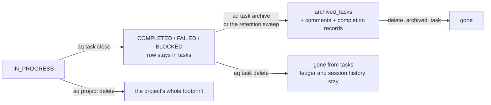

# Data lifecycle

What happens to a row when work ends: closing, archiving, deleting, and what is
deliberately kept forever. This page is the answer to "where did my task go?"
and to "why won't this delete?".

The short version: **closing keeps everything, archiving keeps the record but
drops the working state, deleting removes the task but keeps the evidence that
it cost something.** Nothing here ever requires you to write SQL.

## The four endings



| Ending | Command | What survives |
|---|---|---|
| **Close** | `aq task close --outcome pass\|fail` | Everything. The task row stays, with an appended `task_completion_records` receipt. |
| **Archive** | `aq task archive --task-id <id>`, or the orchestrator's retention sweep | The task's identity and 35 of its 39 columns, plus its comments and completion records. Its edges, criteria, context, metadata, labels, tools and per-attempt results are removed. |
| **Delete** | `aq task delete --task-id <id> [--cascade] [--branches keep\|delete]` | Token ledger rows, session rows (with `task_id` nulled), events, and any delivery receipts naming the task. |
| **Project delete** | `aq project delete` | Nothing project-scoped. This is the bulk escape hatch. |

## Closing

`task_close` appends one row to `task_completion_records` — outcome, work
outcome, failure class, the tests and commands actually run, the branch and
commits, the PR, the summary and the declared deliverables — and transitions
`tasks.status`. The receipt is **never updated afterwards**. A task that is
reopened and closed again gets a second row; `get_task_completions` returns the
whole history, oldest first.

Closing also releases the claim and the workspace lock, and recomputes
`tasks.is_blocked` for everything that was waiting on the task, in the same
transaction as the transition. The `task.completed` / `task.failed` event is
emitted after that transaction commits, which is what playbook waits and the
digest see.

A close is refused while the task has open children (`hierarchy.open_children`).
Move a child you filed with `aq task reparent`, or close it.

## Archiving

Archiving moves a *whole terminal subtree* out of the active view, deepest task
first and the root last, so the subtree moves together. It is one transaction.

It refuses when:

* any task in the subtree is not terminal (`COMPLETED`, `FAILED` or `BLOCKED`) —
  `non_terminal_root`, or a listed open descendant;
* any session in the subtree is still live — `live_descendants`. A task can be
  terminal while its worker is still draining, so this check is separate;
* an active integration repair operation owns a task in the subtree —
  `integration_owned`.

What the archived row keeps: everything in `tasks` except `claim_epoch`,
`deliverables`, `discord_thread_id`, `filed_count` and `next_child_ordinal` —
the columns that only mean something for a task that can still run — plus an
`archived_at` timestamp. The blocked-state projection is carried across
deliberately.

What is kept **beside** it: `task_comments` and `task_completion_records`, both
of which reference the task by a plain text id rather than a foreign key
precisely so they can span the active and archived worlds.

What is dropped: the same foreign-key cleanup a delete does — dependencies,
criteria, context, metadata, labels, tools, per-attempt `task_results` and
layout rows. `sessions.task_id` is nulled rather than deleted, so the session
history survives, and `agents.current_task_id` is cleared.

Archiving never touches the remote. A task whose branch was materialised keeps
that branch; the origin row is simply retired, which is what lets the task leave
the queue at all.

### The retention sweep

The orchestrator archives old terminal subtrees on a schedule
(`archive_old_terminal_tasks`). It selects only **subtree roots**: terminal,
older than the cutoff, no parent, and with no non-terminal direct child.
Children come along via the root's own subtree archive rather than being
selected individually, and a root whose *grandchild* is still open is caught by
`archive_task`'s own check, logged and skipped. A project's reusable routing
task (`triage` / `triage-open`) is excluded, so it keeps one identity and its
run history.

### Reading and removing archived tasks

```bash
aq task list-archived            # browse the archive
aq task archive-settings         # the retention sweep's thresholds
```

`delete_archived_task` is the only permanent removal, and there is deliberately
no bulk version of it on the operator surface.

## Deleting

`delete_task` removes a task outright. With `--cascade` it removes the whole
subtree; without it, a task that has children is refused.

Everything happens in one transaction: dependents are snapshotted while the
edges still exist, the subtree is removed deepest-first, the former container is
settled, and the blocked-state projection is recomputed for everything that was
waiting.

Per task, the delete:

| Rows | What happens | Why |
|---|---|---|
| `task_results`, `task_completion_records`, `task_criteria`, `task_context`, `task_metadata`, `task_labels`, `task_tools`, `task_dependencies` (both directions), layout rows | deleted | They describe a task that no longer exists. |
| `task_comments` | deleted (kept when this is an archive) | The parent `DELETE` waits for any in-flight comment's lock first, so a concurrently committed append cannot be missed. |
| `task_gates` | deleted, and any gate left with **no** waiters is marked `expired` | Without this the `NO ACTION` foreign key simply refuses the delete; force-removing the rows instead would strand the gate `open` forever — which for a human gate means live Approve/Deny buttons for a task that no longer exists. |
| `sessions.task_id` | set to `NULL` | A session row is the historical record of an agent run — how long it lived, what it cost — and that stays true after the task is gone. |
| `task_workspace_requirements` | deleted | They describe a claim on resources that means nothing without the task. |
| `workspaces.locked_by_task_id` / `locked_by_agent_id` / `locked_at` | cleared | Releasing the lock, rather than leaving it pointing at a task that no longer exists. |
| `token_ledger` | **kept** | The tokens were really spent against the project's budget. Dropping them would understate cost. `aq project delete` remains the bulk escape hatch. |
| `task_branch_origins` | left alone, except for a discard intent | Origins carry no foreign key to `tasks`, so a retired origin already outlives its task. |

### Deleting a task that owns a branch

In a hierarchy or train project, deleting a subtree that holds a **materialised**
`task_branch_origins` row is refused with `hierarchy.branch_discard_required`
until you say what should happen to the branch. The refusal names the branches,
so a surface can ask.

```bash
aq task delete --task-id <id> --cascade --branches keep     # leave the branch alone
aq task delete --task-id <id> --cascade --branches delete   # also remove the remote branch
```

`delete` marks the retired origin `pending`; the ref is removed asynchronously by
[`src/integration/branch_discard.py`](../../../src/integration/branch_discard.py),
with a compare-and-swap on the head it observed. It refuses a live branch owner
and the default branch, and parks anything ambiguous for
`aq doctor --check integration.branch_discards`. Archive always keeps the branch.

## What refuses to delete

These are working guards, not bugs.

| Refusal | Cause | What to do |
|---|---|---|
| `hierarchy.open_children` | The task has non-terminal children and you did not pass `--cascade`. | Close the children, `aq task reparent` one you filed, or cascade. |
| `live_descendants` | A session in the subtree is still running. | Let it drain, or stop it, then retry. |
| `integration_owned` | An active repair operation owns a task in the subtree. | Let the operation finish or be cancelled. |
| `hierarchy.branch_discard_required` | A materialised branch origin in the subtree. | Re-run with `--branches keep` or `--branches delete`. |
| A paused task | A worker cannot close or resume a `PAUSED` task. | The operator resumes it; a worker should push its work and report. |
| `ForeignKeyViolationError` naming an `integration_*` table | The task is referenced by integration control-plane rows with a **named `RESTRICT`** foreign key: `integration_parent_episodes.parent_task_id`, `integration_parent_verifications.parent_task_id`, `integration_repair_operations.verifier_task_id`, or `integration_candidate_resolutions.repair_task_id`. | Expected. The control plane's identity may not dangle; the task cannot be deleted while it is part of a live integration episode. |

### A known limitation

The delete path's foreign-key cleanup is a **hand-maintained list**. The source
says so plainly: *"Remaining FK holders. Without these the delete fails outright
with a `ForeignKeyViolationError` naming one table at a time, so each is only
discovered by hitting it."*

Practically:

* A new table that references `tasks.id` without either a `CASCADE`/`SET NULL`
  clause or an entry in `_delete_one` will make deletes fail once rows exist in
  it. `tests/test_missing_fk_migration.py` and the delete tests are where this
  is caught.
* The RESTRICT-protected integration tables are deliberately *not* cleaned up
  here. There is no supported way to delete a task that a live integration
  episode references, and there should not be — the alternative is a control
  plane that points at nothing.
* If you hit an FK violation naming a table not in the tables above, that is a
  genuine bug worth filing, naming the table from the error.

## What is kept, and for how long

| Data | Retention | Notes |
|---|---|---|
| `task_completion_records` | forever | Append-only. Survives archive; deleted only with the task (and kept when archiving). |
| `task_comments` | forever | Soft-referenced, so they span active and archived tasks. |
| `token_ledger` | forever | Survives task deletion by design. Removed only by `aq project delete`. |
| `events` | forever | The audit log. |
| `sessions`, `task_session_attempts` | forever | Session history outlives its task; `task_id` is nulled, provenance columns are soft refs. |
| `subagent_events` | forever | Append-only facts, deduplicated by a deterministic id. |
| `metrics_samples` | tiered | Defaults: 1 hour of per-second samples, 30 days of minutes, a year of hours. Each tier is pruned against its own horizon (`metrics:` in config). |
| `provider_usage_snapshots` | forever | Append-only; duplicate readings bump `last_seen_at` instead of inserting. |
| `escalations` and their messages, actions and deliveries | forever | An escalation reaches a terminal state; it is not deleted. |
| `digest_windows` | forever | Silent windows are persisted as durably as sent ones — that is what stops a restart re-evaluating them. |
| `playbook_step_receipts`, `playbook_artifacts`, `playbook_pending_events` | configurable | `playbooks.v2_receipt_retention_days` (90), `v2_artifact_retention_days` (90), `v2_pending_event_retention_days` (7), swept hourly. |
| `project_onboarding_requests` | configurable | `onboarding_request_retention_days` (30). |
| Integration evidence tables | forever | Protected by triggers that reject `UPDATE` and `DELETE`. |

## Rules

> **Never `DELETE` or `UPDATE` rows by hand on a running install.** The command
> layer maintains invariants no single statement can: projections recomputed in
> the same transaction, gates expired when their last waiter goes, claims
> fenced by epoch, workspace locks released, post-commit events emitted. And
> 31 integration tables have triggers that will reject the statement anyway. If
> no command does what you need, that is a bug worth filing — with the table
> and the goal.

> **Reading is always fine.** `aq task show`, `aq task list-archived`,
> `aq session logs`, the dashboard, and a read-only `psql` session.

> **Take a backup before anything irreversible.** See
> [Backup and restore](migrations.md#backup-and-restore).

## Focused tests

```bash
aq test tests/test_archive.py tests/test_hierarchy_archive_delete.py
aq test tests/test_hierarchy_settlement.py tests/test_missing_fk_migration.py
aq test tests/test_task_comments.py
```

## Related pages

* [The database](README.md) · [Table families](tables.md) ·
  [Query modules](queries.md) · [Migrations](migrations.md)
* `docs/concepts/tasks.md` — **planned** (`tasks` ticket): the task lifecycle in prose
* `docs/concepts/integration.md` — **planned** (`integration` ticket): branches, batches and delivery
