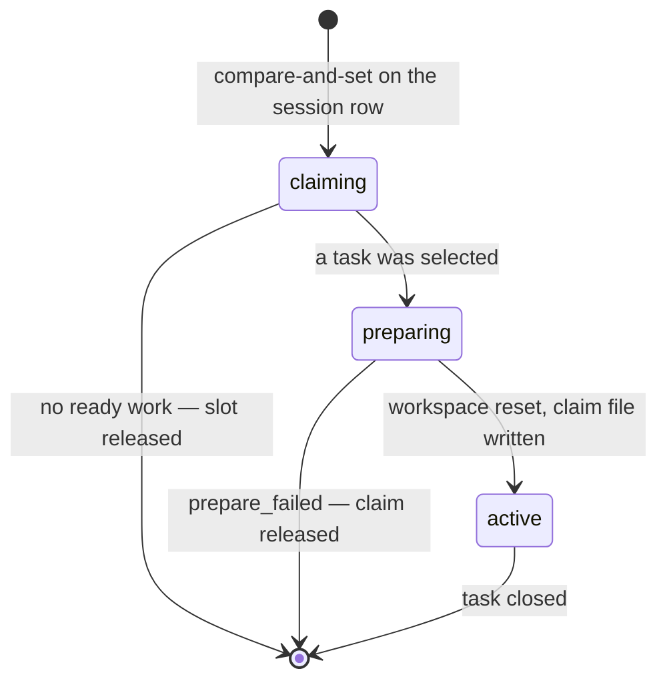

# Terminals and claims

Two subjects that share a page because they are the two things a worker session
is *addressed by*: the terminal you can watch and type into, and the claim that
proves which task the worker is allowed to touch.

This is reference material. For the concepts, read
[Sessions](../concepts/sessions.md).

## Part 1 — Terminals

### Three ways to look at a session

They are different mechanisms with different costs, and they are not
interchangeable.

| Surface | Transport | What you get | Cost |
|---|---|---|---|
| **Transcript stream** | SSE, `GET /api/sessions/{id}/stream` | the harness's normalized conversation, replayed then tailed | one file tail per connection |
| **Live pane** | SSE, `GET /api/sessions/{id}/pane` | a full `capture-pane` screen, redrawn on each frame | one poll loop per *watched session*, shared across viewers |
| **Interactive terminal** | WebSocket, `/ws/terminal/{id}` | raw terminal bytes, and typing | one disposable attach client per connection |

Read-only inspection from the command line uses the first two:

```bash
aq session peek <session-id> -n 60      # one screen, now
aq session logs <session-id> -n 40      # normalized transcript entries
```

`aq session logs` labels its `source` as `transcript` or `peek`, so you always
know which layer the bytes came from. A silent switch between them is how an
operator debugs the wrong thing.

### The live pane

A naive live view polls once per viewer, which turns N viewers into N `tmux`
subprocesses per tick. The
[`PaneBroadcaster`](../../src/sessions/pane_broadcaster.py) owns the poll loop
**per session** instead, and subscribers attach to it: cost is
`O(watched sessions)`, never `O(sessions × viewers)`. Nothing polls while
nobody is watching.

| Setting | Default | Effect |
|---|---|---|
| `sessions.pane_stream_interval_seconds` | `1.0` | how often a watched session is captured |
| `sessions.pane_stream_max_sessions` | `12` | how many sessions may be watched at once; over the cap a subscription is refused rather than degrading everyone |
| `sessions.pane_stream_lines` | `60` | lines captured per frame |

Each frame is a *whole screen*, not a delta, so the client replaces rather than
appends ([`usePaneStream.ts`](../../dashboard/src/ws/usePaneStream.ts)):

```text
{source:"pane", type:"screen",  screen, seq, ts}
{source:"pane", type:"stopped", seq, ts}
{source:"pane", type:"error",   message, seq, ts}
```

Colour comes from tmux's own `capture-pane -e` (SGR sequences only) and is
rendered directly — tmux has already done the terminal emulation, so
[`LivePaneConsole`](../../dashboard/src/components/LivePaneConsole.tsx) needs no
emulator and keeps no scrollback.

### The interactive terminal

The dashboard's attachable terminal is an xterm.js view over a WebSocket
([`InteractiveTerminal.tsx`](../../dashboard/src/components/InteractiveTerminal.tsx),
[`terminalSocket.ts`](../../dashboard/src/ws/terminalSocket.ts)) served by
[`src/api/terminal_stream.py`](../../src/api/terminal_stream.py). The route
never launches an agent; it owns only a disposable `tmux attach` client, and
closing the tab never stops the agent's pane
([`src/sessions/terminal_pty.py`](../../src/sessions/terminal_pty.py)).

It is gated hard, because it is the one surface that types into a live agent:

| Gate | Rule |
|---|---|
| Provider | `tmux` only — the row's `provider` must be `tmux` and the session must be live |
| Network | loopback clients only (`127.0.0.1`, `::1`) |
| Origin | same-origin loopback, or an origin listed in `api_auth.trusted_dashboard_origins`. A custom domain must be configured explicitly even behind a local proxy, because a matching attacker-controlled `Host`/`Origin` can be DNS-rebound onto loopback |
| Credentials | `Authorization: Bearer` **or** an `aq-bearer.<token>` subprotocol, never both, and never in the URL — URL credentials leak into access logs |
| Authorization | local scope, or a global-admin session token (elevated, no project, no task) |
| Concurrency | 16 concurrent terminal connections |
| Frames | 64 KiB per input frame, 128 KiB of queued input |

The connection also pins a **generation**: session instance token, agent, and —
for non-pool sessions — the task and its claim epoch. That identity is
re-checked after the attach completes and periodically thereafter, so a
reconnect can never land on a successor session that happens to share a name. A
pool worker may claim a new task in the same process, so its generation
deliberately excludes the task; a task session cannot follow a later claim.

Nothing about the input path is recorded: no command dispatch, no replay, no
input logging. Errors that cross the boundary are fixed, constant strings —
never terminal bytes and never tmux's stderr.

Starting a terminal for an agent that has no live session is a separate,
explicit act, and requires global admin:

```bash
aq agent start-terminal --agent-id <agent-id>
```

### Typing into a session from elsewhere

Two commands write into a live session, and they mean different things:

| Command | What it does | Fails with |
|---|---|---|
| `aq session nudge <id> "<text>"` | types the text **and submits it** | `not_submitted` when Enter could not be confirmed |
| `session_input` (dashboard terminal keystrokes) | types literal text or one named key, **without submitting** | a fixed error string; never auto-retried |

`session_input` accepts either `text` or one key from a closed set of terminal
key names (`Enter`, `Escape`, arrows, `C-c`, `C-u`, …) — never a tmux command,
never a raw control character, and at most 64 KiB per paste
([`validate_terminal_input`](../../src/sessions/provider.py)). It requires
global admin, and a failed send is not retried, because a retried keystroke is
not idempotent.

`nudge` is what the daemon itself uses. Its failure mode has a dedicated type
([`NotSubmitted`](../../src/sessions/provider.py)) carrying `composer_dirty`,
which is the difference between "retry later" and "a human has to press Enter":
text left in a composer blocks every later nudge. See
[the stuck-composer recovery](../guides/session-troubleshooting.md#a-session-that-stopped-responding-to-nudges).

A third result exists for "no input was sent at all" — the composer is busy,
holds a human's draft, or cannot be inspected
([`NudgeDeferred`](../../src/sessions/provider.py)). It is explicitly *not* a
failed response and does not consume a stall or restart attempt.

### Dashboard panes

Separately from terminals, the dashboard has a pane-view system: named views
that can be pushed into a viewer's layout. The server keeps a mirror of that
registry ([`src/panes/registry.py`](../../src/panes/registry.py)) so it knows
which view ids exist and which may be pushed by an agent. It is kept in sync
with `dashboard/src/panes/<view>/manifest.ts` by hand, and
`tests/test_pane_registry_parity.py` fails when the two lists diverge.

The pane view relevant to this page is `session-peek`; the terminal views above
are components rather than pane views.

### Observation cost

Every question the reconciler asks — is this running, is the process alive,
what is live — would naively be one `tmux` and one `ps` subprocess *per session
per question*. [`TmuxStateCache`](../../src/sessions/state_cache.py) answers all
of them for one tick from **one** `list-panes -a` plus **one** `ps`, refreshed
when older than `sessions.state_cache_ttl_seconds` (2 s).

Its failure semantics are the load-bearing part:

* `ps` failing returns `None`, and callers answer "alive" — never "everything
  died".
* tmux reporting no server raises
  [`TmuxUnavailable`](../../src/sessions/state_cache.py) carrying the
  last-known-good snapshot, so callers defer instead of reaping. A *fresh*
  daemon that has never seen a server gets an empty result instead: there is
  nothing to defer over.

## Part 2 — Claims

### What a claim is

A claim is a pool worker's exclusive hold on one task. It has two halves that
must agree:

| Half | Where | Written by |
|---|---|---|
| The authoritative epoch | `tasks.claim_epoch` (plus `sessions.task_id`, `sessions.last_claim_epoch`) | the claim transaction, in the database |
| The worker's proof | `<work_dir>/.aq/claim.json` | [`write_claim_file`](../../src/claim_file.py) |

```bash
cat .aq/claim.json
```

```text
{"task_id": "solid-grove.8", "claim_epoch": 1, "session_id": "6a13cf70-6d7c-4762-b081-70d8bb04d311", "claimed_at": 1788983165.856642}
```

The CLI reads that file automatically: `aq task heartbeat`, `aq task set`,
`aq task close` and `aq handoff` all pick the epoch up from it, so a worker
passes `--claim-epoch` explicitly only to override it.

### The claim file module

[`src/claim_file.py`](../../src/claim_file.py) is deliberately a **leaf**: it
imports nothing but the standard library. Both the command layer
(`src/commands/claim_commands.py`) and the reconciler
(`src/sessions/reconciler.py`) need these helpers, and importing either from
the other closes an import cycle through the whole `CommandHandler` mixin
graph. Import the helpers from here, never from the command module, and do not
add project imports to it.

| Function | Behaviour |
|---|---|
| `write_claim_file(work_dir, payload)` | writes `.aq/claim.json` atomically (temp file plus `os.replace`) |
| `read_claim_file(work_dir)` | returns the object, or `None` when missing, unreadable or not a JSON object — never raises |
| `remove_claim_file(work_dir)` | unconditional removal; tolerates absence |
| `remove_claim_file_if_matches(work_dir, task_id, claim_epoch)` | removes it **only** when it still names this claim |

That last one exists because cleanup is not instantaneous: a pool worker can
claim again between a terminal close and its delayed cleanup, and an
unconditional removal would erase the successor's fence.

### Epoch fencing

Claiming a task bumps `tasks.claim_epoch`. Every task-mutating command a
session sends carries the epoch it believes it holds, and
[`_assert_session_owns`](../../src/commands/claim_commands.py) compares:

| Situation | Result |
|---|---|
| No session in scope (local or elevated caller) | not fenced |
| `sessions.task_id` is not this task | `out_of_scope` |
| Epoch given and mismatched | `stale_claim` |
| Epoch absent, pool session | `stale_claim` — a pool session must read it from `.aq/claim.json` |
| Epoch absent, task session | accepted (optional compatibility for push-launched sessions) |

A push launch joins the same fence by carrying `AQ_CLAIM_EPOCH` in the
session's environment ([`src/sessions/env.py`](../../src/sessions/env.py)).

### Claim phases

A pool session moves through phases recorded on its own row
(`sessions.claim_phase`, `sessions.claim_phase_at`):



* **`claiming`** is a compare-and-set on the session row itself, so two
  concurrent claims cannot both win. It also enforces the session's claim
  budget: a session at its cap gets `session_exhausted`, and a session whose
  `desired_state` is no longer `running` gets `drain_requested`.
* **`preparing`** covers work that happens outside the claim transaction —
  resetting the worktree slot, writing the claim file. Because that is outside
  the transaction, it is re-verified against the database before it is
  believed ([`claim_preparation_is_current`](../../src/database/queries/claim_queries.py)).
* A session that never leaves `claiming` or `preparing` for
  `swarm.prepare_timeout` with no live preparation request is released by the reconciler, so a crash
  mid-preparation cannot hold a task forever.

### Claim result codes

Returned by `aq task claim` ([`ClaimResult`](../../src/models.py)):

| Code | Meaning |
|---|---|
| `claimed` | the task is yours; `.aq/claim.json` has been written |
| `no_ready_work` | nothing matches this profile right now |
| `claim_conflict` | another session won the race |
| `claim_in_progress` | this session is already mid-claim |
| `prepare_failed` | a task was selected but its workspace could not be prepared |
| `not_admissible` | the project is inactive, paused, or out of budget |
| `session_exhausted` | this session has spent its claim budget |
| `drain_requested` | the daemon wants this worker to stop claiming |
| `stale_claim` | the epoch you presented is not current |
| `out_of_scope` | this task is not yours to touch |

### Preparation failure metadata

When preparation fails, the failure is recorded rather than merely logged, so
the next reader can act on it:

| Key | Written when | Cleared when |
|---|---|---|
| `needs_attention: slot_reset_failed` | the worktree slot could not be reset | preparation next succeeds |
| `slot_reset_failure` | same — carries reason, attempt, workspace, session, timestamp, and whether the retry is automatic or manual | same |
| `claim_prepare_backoff_until` / `_attempts` | any failed preparation | same |
| `needs_attention: integration_prepare_failed` | the branch fence, not the filesystem, blocked preparation | same |
| `manual_pause_checkpoint` | a task was explicitly paused | preparation next succeeds |

All of them are cleared together by one delete
([`clear_claim_preparation_metadata`](../../src/database/queries/claim_queries.py)),
because they all become stale at the same moment. The first two failures leave
the task `READY` with an exponential backoff; the third moves it to `BLOCKED`
with a manual retry. Recovery is in the
[troubleshooting guide](../guides/session-troubleshooting.md).

> **Note.** These live in task metadata rather than task columns on purpose:
> this is operational claim state, not lifecycle state, and it therefore needs
> no schema migration to change.

## Environment and isolation

Every session's child environment is built explicitly rather than inherited
([`build_session_env`](../../src/sessions/env.py)). Layering, outermost first:

1. the daemon environment, **scrubbed**
   ([`scrub_env`](../../src/env_scrub.py));
2. the database-isolation block;
3. the harness's own `env` map;
4. the nine `AQ_*` identity markers;
5. `extra_env` — for example `AQ_CLAIM_EPOCH` on a push launch, or the
   `GIT_AUTHOR_*` / `GIT_COMMITTER_*` identity a pool worker commits under.

Everything from layer 2 inward is *explicit* as far as the scrub is concerned:
naming a key in a harness file is operator intent and outranks a denylist
guess.

### The nine identity markers

`AQ_SESSION_ID`, `AQ_TASK_ID`, `AQ_PROJECT_ID`, `AQ_PROFILE`,
`AQ_DAEMON_EPOCH`, `AQ_INSTANCE_TOKEN`, `AQ_WORK_DIR`, `AQ_API_URL`,
`AQ_API_TOKEN` ([`AQ_MARKER_KEYS`](../../src/sessions/env.py)).

They are the identity and liveness substrate, not decoration:

* adoption finds AQ's processes by scanning for `AQ_SESSION_ID` in
  `/proc/<pid>/environ` — never PID files, never session names, because names
  get reused and PIDs get recycled;
* kills are fenced on `AQ_INSTANCE_TOKEN`, re-read from the live process
  immediately before the signal, together with the kernel's process start time
  ([`kill_tree`](../../src/sessions/proctable.py));
* the `aq` CLI inside a session reaches its daemon through `AQ_API_URL` and
  `AQ_API_TOKEN`, with the token scoped to that task, session and project;
* `aq prime` and `aq handoff` fall back to `AQ_TASK_ID` and `AQ_SESSION_ID`, so
  the names are load-bearing rather than cosmetic.

`AQ_TASK_ID` is *omitted* rather than set empty for a session with no task: an
empty value would make `aq prime` resolve the empty task id instead of falling
through to its "no task in scope" branch.

### Database isolation

Every session also carries
([`session_db_isolation`](../../src/sessions/env.py)):

```text
AQ_DB_SCOPE=worker
AQ_DATABASE_URL=aq-worker-no-direct-db://
AGENT_QUEUE_DB=aq-worker-no-direct-db://
```

Two independent halves, because either alone has a hole. `AQ_DB_SCOPE=worker`
makes the migration guard refuse a migration against the production URL from
anything the session launches — pytest, a stray `alembic upgrade`, even an
`aq start` inside the slot. The two URL overrides mean the ordinary case never
reaches the guard at all, and the sentinel is refused *with an explanation*
rather than answering from an empty database. See
[migrations](../guides/migrations.md).

### What the scrub removes

[`scrub_env`](../../src/env_scrub.py) drops a variable when its normalized name
contains `TOKEN`, `API_KEY`, `APIKEY`, `SECRET`, `PASSWORD`, `PASSPHRASE`,
`CREDENTIAL`, `PRIVATE`, `AUTH`, `DSN`, `WEBHOOK`, `NETRC` (and more), when it
matches a regex such as a trailing `_KEY` or `_PAT`, or when its *value* is a
credential-bearing URI. Exemptions are explicit: known false positives of the
`AUTH` pattern, the credentials an agent CLI needs in order to authenticate at
all, and operator-listed names or globs in `security.env_allowlist`.

A separate set is stripped **regardless** of the kill switch: the variables
that would make a nested agent CLI think it is already inside a session. An
explicit entry for one of those still wins, because naming a key in a harness
file is deliberate.

> **Warning.** The denylist is best-effort, not complete. It is a reasonable
> default, not a guarantee that no secret reaches an agent. Treat
> `security.env_allowlist` as the place you make deliberate exceptions, and do
> not rely on the pattern list to catch a name you invented.

One doctor check covers the worst failure mode — a daemon started from inside
an agent's own terminal, which inherits that harness's control variables:

```bash
aq doctor --check sessions.env_markers
```

`security.env_scrub_enabled: false` degrades the scrub to the always-strip set
only. It is the kill switch, not a tuning knob.

## Related pages

* [Sessions](../concepts/sessions.md) — the concepts behind both halves of
  this page.
* [Harness reference](harnesses.md) — the input behaviour and transcript
  locations these surfaces depend on.
* [Session troubleshooting](../guides/session-troubleshooting.md) — the
  recovery procedures referenced above.
* [Worker pools](../guides/worker-pools.md) — why a pool session exists and
  when it is asked to drain.
* [Module catalog: sessions](modules/sessions.md) — one row per module.

## Source and tests

Implementation: [`src/claim_file.py`](../../src/claim_file.py),
[`src/env_scrub.py`](../../src/env_scrub.py),
[`src/panes/registry.py`](../../src/panes/registry.py),
[`src/sessions/pane_broadcaster.py`](../../src/sessions/pane_broadcaster.py),
[`src/sessions/terminal_pty.py`](../../src/sessions/terminal_pty.py),
[`src/sessions/state_cache.py`](../../src/sessions/state_cache.py),
[`src/sessions/proctable.py`](../../src/sessions/proctable.py),
[`src/sessions/env.py`](../../src/sessions/env.py).

```bash
aq test tests/test_terminal_stream.py tests/test_terminal_pty.py tests/test_pane_broadcaster.py tests/test_env_scrub.py tests/test_claim_commands.py
```
