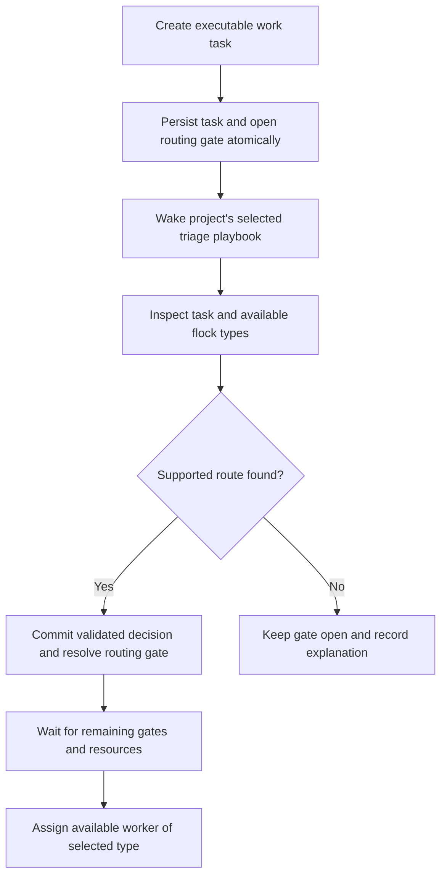

# Mandatory triage through a shared playbook

> **Superseded — do not implement.** This design expanded routing into a universal
> admission gate, a dedicated triage execution type, and a push-only scheduling
> migration. The approved replacement keeps routing at the assignment boundary and
> is documented in
> `docs/superpowers/specs/2026-08-31-playbook-intelligence-routing-design.md`.

Date: 2026-08-31

Status: Product direction approved in conversation; implementation design recorded here. No runtime changes are included in this document.

Source baseline: `agent-queue2`, commit `f3fe7a9b7840be83e8c319ef5b92ac5e50a24660`.

## 1. Outcome and agreed requirements

Every executable work task must be inspected by a triage playbook before an ordinary worker can execute it. Triage chooses an execution type represented in the configured agent flock. The scheduler assigns an available instance of that type without deciding the task's intelligence requirements again.

AQ ships one system default triage playbook, installs it automatically, and uses it for every project without creating per-project copies. A project may explicitly select a custom playbook instead. The custom playbook replaces the default for that project; the two never compete for the same task. Runs remain project-scoped even when they share a definition.

The playbook owns inspection instructions and selection policy. Core code owns admission, authorization, validation, atomic completion, and recovery. Editing or disabling a playbook cannot authorize an untriaged task to execute.

The broader simplification retains push scheduling as the eventual single work-assignment path. Pool claiming is retired after existing sessions drain. No in-flight task is interrupted by migration.

## 2. Global constraints

- Python 3.12+; use existing async SQLAlchemy and session-provider infrastructure.
- Support SQLite and PostgreSQL, including transaction races and migrations.
- No new third-party dependency, workflow engine, or triage-specific task-status enum.
- All externally requested state changes pass through CommandHandler and its authenticated request scope.
- Every tables.py schema change has an Alembic migration and a reviewed downgrade policy.
- Do not weaken explicit user requirements, project isolation, human approvals, dependency gates, or workspace locking.
- Do not overwrite user-edited vault files or project playbooks during installation or upgrade.
- Do not stop existing sessions or rewrite their execution configuration during rollout.

## 3. What exists, and what must change

| Existing component | Reuse | Change |
| --- | --- | --- |
| `src/database/queries/task_queries.py::create_task` | Task and routing gate already support a shared transaction | Gate ordinary work unconditionally, including callers that provide a profile |
| `src/task_graph/creator.py::write_plan` | Atomic graph creation | Use the same admission rule for executable nodes |
| `src/playbooks/routing.py` | Scope-aware policy inspection | Remove playbook graph inspection from deciding whether work needs triage |
| `src/prompts/default_playbooks/default-pipeline.md` | Other task lifecycle rules | Remove triage-task creation and direct routing of worker-filed tasks |
| `src/commands/task_commands.py::_cmd_task_route` | Public route-completion entry point | Validate a flock type and a live triage run; commit decision and gate resolution together |
| `src/orchestrator/triage.py` | Persisted-backlog reconciliation | Coordinate playbook runs instead of reusable `triage-open` tasks |
| `src/playbooks/runner.py` | Graph traversal, pinned graph, trace, budgets, persisted runs | Connect harness nodes to existing session providers; authorize triage by persisted run ownership |
| `src/playbooks/manager.py` | Registry and project scope | Add an explicit triage selector; current role shadowing only applies to pipeline playbooks |
| `src/vault.py::ensure_default_playbooks` | Idempotent installation | Install a source/compiled default pair so first-run triage does not require a compiler task |
| `src/scheduler.py` | Project ordering and capacity checks | Match recorded execution types and order equivalent workers explicitly |

The current triage profile asks the agent to call `list_profiles`, which lists registered definitions, not the execution configurations represented by actual workers. Current profiled tasks, suppressed creation events, and worker-filed root tasks can avoid inspection. These exemptions are removed for ordinary work.

## 4. One admission flow

All creation surfaces use this rule: CLI, REST, MCP, dashboard, task graphs, formulas, proposals, agent-filed work, follow-ups, and review tasks. A profile/class supplied at creation expresses requested constraints; it does not constitute completed triage. Parent containers that never execute do not require triage. If a container becomes executable, admission applies before it can run.

The database assignment transaction rejects work without a current, valid triage decision even if a caller accidentally omits a gate. The blocked-state projection includes missing or outdated triage decisions, so READY alone never means dispatchable. Existing non-routing gates remain independent requirements.

The triage playbook runs directly and does not create a normal task to triage itself. Compilation of custom playbooks may still require a narrowly authorized internal compiler job. Its bootstrap admission is server-issued, tied to the compiler operation and fixed control profile, and unavailable through public `ensure_task`, caller-supplied role names, or event-suppression flags. Ordinary review/spec-ingestion work is not automatically exempt.

## 5. Execution types are derived from the flock

Reuse profile and intelligence-class definitions; do not add a second editable profile registry. Introduce a pure execution-type projection over existing worker definitions. One entry represents one fully resolved combination:

- Effective capability profile ID, including project override scope.
- Harness and provider.
- Intelligence class, model, and reasoning effort.

The stable type key is the SHA-256 digest of canonical JSON containing those fields. A readable display name accompanies it. Workers with identical effective configurations share an entry. Conflicting per-agent overrides produce distinct entries, preserving their saved behavior without silently rewriting agents or copying profile files.

The projection uses the same class/model resolution as SessionSpecBuilder, without any target-task defaults. An incomplete or invalid worker configuration produces a diagnostic, not an invented candidate. Include configured enabled workers that are currently busy or occupied by an interactive session: these affect availability, not whether a type exists. Exclude supervisors, deleted, disabled, and retired workers. Never manufacture the cross-product of all profiles and classes.

`triage_options` returns project-scoped type entries, represented worker IDs, idle counts, and configuration diagnostics. It is the source for both triage choices and scheduler matching. It does not expose secrets or permit agent/profile modification. The triage executor itself is marked as control infrastructure and excluded from ordinary work candidates.

At completion, the chosen type must still have at least one eligible configured member, even if none is idle. Explicit requested profile/provider/model/class constraints must be satisfied. If the last member disappears after triage, the route remains pinned and waits with `route_unavailable`; the scheduler never substitutes another type. Retriage is an explicit operation or follows a material task edit.

## 6. Persisted decision and atomic completion

Add `tasks.routing_revision` (integer, starting at 1), `tasks.routing_request` (JSON text preserving structured caller constraints), and `tasks.routing_decision_id` (nullable reference). A nullable server-only `control_origin` records the narrowly authorized compiler bootstrap operation; public creation/edit APIs cannot set it. Preserve these fields on archived tasks. Add `task_routing_decisions` with:

| Field | Meaning |
| --- | --- |
| `id`, `project_id`, `task_id`, `routing_revision` | Identity and task version being approved |
| `playbook_run_id`, `playbook_id`, `playbook_version` | Verified source of the inspection |
| `execution_type_key`, `execution_snapshot` | Exact selected configuration; JSON snapshot is audit data |
| `profile_id`, `intelligence_class` | Explicit resulting route, also mirrored onto the task |
| `reason`, `decided_at` | Explanation and timestamp |

Require uniqueness on `(task_id, routing_revision)`. Keep decisions as audit records through archival; delete/archive behavior must not leave broken references or lose the selected configuration. A decision row is evidence of successful triage, not another mutable workflow state.

`task_route(task_id, execution_type_key, expected_revision, reason)` is the only ordinary completion operation. Run/session identity is derived from authentication, never trusted from these arguments. In one transaction it:

1. Locks the verified live triage run, then task, following the shared lock order.
2. Checks project ownership, current revision, absence of active work execution, and an open routing gate.
3. Resolves the current catalog entry and checks structured caller constraints from `routing_request`. The playbook is responsible for interpreting additional requirements expressed in prose; the server does not pretend to prove arbitrary natural-language compliance.
4. Writes the immutable decision and the task's explicit route/reference.
5. Resolves that task's open routing gates and recomputes the blocked projection.
6. Commits, then emits task/gate events.

Retrying the same revision and same decision returns the recorded result; attempting a different decision for an already completed revision returns a conflict. A crash before commit leaves the gate open; a crash after commit cannot cause a duplicate decision. A model response saying it is finished is not evidence of routing.

Public edits to title, description, acceptance criteria, attached specification/context, workspace requirements, or requested execution constraints increment the routing revision, clear the current decision reference, and reopen a routing gate atomically. Priority, comments, display metadata, and runtime bookkeeping do not invalidate triage. Old decisions remain auditable. Edits to running task requirements follow the existing stop-before-reroute rule. Explicit user constraints remain separate from the triage-selected values in the decision snapshot, so a later retriage does not accidentally treat the old choice as a user command.

## 7. Shared playbook and project selection

Ship `src/prompts/default_playbooks/default-triage.md` and a validated bundled `default-triage.compiled.json`. Install source at `vault/system/playbooks/default-triage.md` and the compiled artifact through CompiledPlaybookStore. Verify source hash and compiled graph validation in CI. Do not depend on an LLM compiler to bootstrap triage.

The definition has `role: triage`, system scope, and a small scoped execution profile. Add nullable `projects.triage_playbook_id`; null means the system default. An explicit override must belong to that project, be a valid triage playbook, and be enabled when selected. Disabled/missing/invalid explicitly selected overrides block new runs visibly; do not silently fall back to system policy. Clearing the override restores the default. Do not change unrelated pipeline shadowing semantics.

Both system and project triage definitions have the same enforced completion contract. Their prose may change inspection depth, risk criteria, context gathering, and type-selection policy. Neither can broaden the authorized tool set or bypass admission. Triage prompts live only in the playbook; the triage profile supplies execution configuration and permissions.

A run pins the compiled graph/version at creation. Successful edits become active for subsequent runs. While recompilation is pending, keep the last validated compiled version and show that the source has pending changes. If there is no valid version, keep work blocked. Installation never replaces customized source. Bundled default updates are installed automatically only when the installed copy still matches the previously shipped version; otherwise preserve the user's copy and surface the available update.

## 8. Tracked runs and session execution

Use PlaybookRunner and its existing run graph, trace, token accounting, and lifecycle events. Add explicit `project_id` and `role` ownership to playbook run records and enforce at most one running/paused triage run per project with a partial unique index. The invariant applies to scheduled, manual, resumed, and project-override runs alike. Admission-created gates plus a reconciliation query are the durable work signal; an event is only a wakeup optimization.

Run startup reserves the durable run slot before launching a session. Persist session-to-playbook ownership (`playbook_run_id`, `playbook_node_id`) and use the existing instance-token/session-state checks to prevent stale processes from routing. Resume or failure recovery reconciles any linked live session before it frees the run slot. Unknown provider liveness is not proof of death.

A PlaybookNodeSessionExecutor connects harness-backed nodes to existing SessionSpecBuilder and SessionProvider infrastructure. The current RuntimeRegistry path has no in-tree implementation and must not be revived for this feature. The default triage uses the configured harness and credentials, not an additional direct-API provider that the user must set up. Other unrelated direct-LLM playbooks retain their current supported behavior.

The default graph obtains pending work, inspects a bounded batch, calls `task_route` for supported decisions, records unresolved explanations, and completes. The coordinator checks for arrivals at completion and starts the next run when needed. Empty queues do not consume an agent or LLM tokens. Unsupported tasks are not repeatedly retriaged on every scheduler tick: retry after relevant input/catalog/policy changes or an explicit retry. Transient process/provider failures use existing bounded backoff.

Authorization is tied to the persisted active project/run/session triple. Allowed operations are project task/context reads, `triage_options`, `task_route`, and a narrow unresolved-result operation. Triage cannot create agents, change classes/profiles, resolve human gates, cross project boundaries, claim work, or impersonate the supervisor. Repository/context inspection is read-only and must not require an exclusive writable project workspace, preventing capacity deadlocks.

## 9. Initialization and scheduling simplification

Fresh initialization installs the default source/graph, permission profile, and control execution configuration. Resolve triage execution through the user's configured working harness/provider. Provision control infrastructure once during setup, separately from demand-based creation of ordinary agents. Give its durable identity the server-managed `triage` role; ordinary worker reservation continues to require `worker`. The session executor reserves that control identity only for a verified playbook run. Missing executable, credentials, valid worker types, or disabled sessions are explicit setup diagnostics; never pretend triage can run without a usable environment. No new cloud account, token purchase, or provider authorization is implied.

Once triaged, work is assigned only to a member of its recorded type. Sort eligible workers by `(last_assigned_at or 0, id)` and stamp `last_assigned_at` only after a successful reservation. Keep project fair share, budgets, dependency/human gates, workspace requirements, and concurrency limits. Remove advisory affinity waiting from ordinary type-matched selection; task workspace requirements remain hard constraints. Do not infer a new route from project defaults or resize the ordinary roster automatically.

During migration, all remaining assignment and claim entry points enforce current triage decisions. Stop starting new pool sessions, drain existing pool sessions after their current task, and route subsequent work through push scheduling. Preserve claim history and fenced completion of active old claims. Old claim commands return an explicit retired-path response once draining is complete; they never become a covert bypass. Data/schema cleanup of historic pool records is not part of this change.

## 10. Upgrade, visibility, and acceptance

Deploy schema/backfill and enforcement before enabling the new coordinator. Backfill gates for pending executable tasks without verified current decisions, even when they already have `profile_id`. Preserve their requested constraints. Do not invent decision records for legacy work. Running work finishes unchanged; a later retry/reopen is admitted through triage. Keep old triage-task reports for history, stop creating new `triage-open` tasks, and let already running old triage sessions drain without granting new completion authority.

Remove obsolete routing nodes from the bundled default pipeline. Preserve user-authored pipeline source; obsolete routing commands can no longer complete triage outside verified run scope and report a migration diagnostic. Installation reports custom files needing manual cleanup instead of silently rewriting them.

Task details and `explain_task` show: awaiting triage, triage running (run link), triage failed, policy unavailable, no supported type, selected type unavailable, waiting for a matching idle worker, or ordinary dependency/resource blocks. Expose decision rationale/version and the selected source playbook. Project settings show 'System default' or the explicit custom selection. System/project playbook views display the real triage runs.

Acceptance requires:

- All ingress paths block untriaged work, including pre-profiled and worker-filed tasks.
- A fresh configured installation triages its first task without manually creating a playbook or compiler task.
- One shared default works for multiple projects; an override affects only its project and produces exactly one run.
- Editing playbook context changes subsequent triage runs without changing scheduler code.
- Catalog choices come from enabled configured workers; busy members remain selectable; incompatible overrides are distinct.
- Concurrent creation, triage completion, task edits, assignment, session exit, and daemon recovery cannot bypass or duplicate triage.
- Failed, disabled, stale, or malicious triage runs cannot release a task.
- A decision never weakens explicit user execution requirements.
- Existing active tasks/claims complete, but new work eventually has one push-assignment path.
- SQLite and PostgreSQL tests, generated API contract checks, dashboard tests, and fake-provider end-to-end coverage pass.

## 11. Delivery boundaries

Implement the mandatory triage contract and shared playbook as one integrated feature. Land additive schema/catalog pieces first, then guarded completion and all ingress changes, then run/bootstrap integration. Switch ordinary scheduling only after those pieces are verified together. Pool draining and removal of the obsolete triage-task coordinator are the final cutover steps, not separate permanent modes.

Do not expand this work into a new generic workflow engine, a new profile marketplace, a dashboard redesign, or deletion of historical run/claim data. The implementation plan is `docs/superpowers/plans/2026-08-31-mandatory-triage-playbook.md`.
