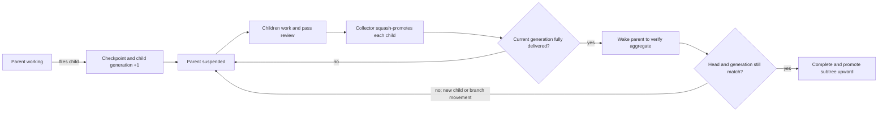

# Hierarchical Delivery and Integration Trains

**Status:** Revised after adversarial review, pending written approval
**Date:** 2026-09-04
**Scope:** Task-branch delivery, recursive child consolidation, root integration, and CI policy

## 1. Context

Agent Queue can have hundreds of agents finish work concurrently. Requiring every pull
request to rebase onto the latest `main`, rerun the full suite, and merge one at a time turns
`main` into a global serialization point. It also spends most CI capacity retesting individual
branches instead of testing the combination that will ship.

PR #397 addressed a real failure mode: two pull requests passed separately against different
base revisions, merged back to back, and produced a combination that failed on `main`. Its
proposed stale-base gate and uncancellable post-merge runs make that failure visible, but its
one-PR-at-a-time direction does not scale to a large fleet.

This design preserves the important invariant—full CI must pass on the exact tree promoted to
`main`—while changing the unit of integration from an individual worker PR to a recursive task
subtree and, at the project root, a periodically sealed integration train.

## 2. Goals

1. Let leaf and sibling tasks execute concurrently without racing on a shared branch.
2. Merge child work into its immediate parent before the parent can complete.
3. Wake the parent once per child generation after that generation is fully delivered so it can
   test and repair the aggregate.
4. Repeat the same protocol recursively at every task depth.
5. Periodically promote every eligible root PR through one integration operation per project.
6. Run full CI on the exact candidate tree before an atomic fast-forward of `main`.
7. Avoid a redundant post-promotion CI run on the identical `main` tree.
8. Express cadence, routing, waits, retry budgets, and escalation policy in playbooks.
9. Keep Git mutations deterministic, exact-OID fenced, idempotent, auditable, and restart-safe.
10. Roll forward on aggregate failures rather than bisecting or ejecting batch members.

## 3. Non-goals

- Automatically identify or remove the pull request that caused an aggregate failure.
- Start a second root integration while one is active for the same project.
- Preserve every leaf task commit in `main` history.
- Run the entire repository suite after every child-to-parent promotion.
- Add a post-merge audit run after an already-tested candidate reaches `main`.
- Hardcode a model or provider for integration repair.
- Use GitHub's merged flag as the authoritative proof that work was delivered.

## 4. Terms

**Task branch**
: The branch owned by one task. A parent task retains ownership of its branch while suspended.

**Promotion**
: Exact-SHA application of one reviewed task tree to its target as a single squash commit.

**Delivery receipt**
: Durable proof that a reviewed source tree was promoted to a specific target transition.

**Parent checkpoint**
: The parent branch SHA and child generation from which a child was created.

**Root candidate**
: A fully reviewed root task whose entire descendant tree has been consolidated and verified.

**Integration sweep**
: A periodic playbook activation that snapshots the eligible root frontier.

**Integration batch**
: An immutable manifest containing every root candidate eligible when a non-empty sweep is sealed,
  including a sweep containing one candidate.

**Repair surface**
: The ephemeral integration branch created for every non-empty root sweep.

## 5. Invariants

The implementation must enforce these in core commands, not rely on prompt compliance:

1. A child starts from the exact recorded parent checkpoint.
2. A reviewed source ref cannot move between review and promotion. Candidate construction reads
   the pinned ref but never rewrites it.
3. Only one promotion mutates a given parent branch at a time.
4. A parent cannot complete while any child is unresolved or lacks a required delivery receipt.
5. Filing a child atomically increments the parent's child generation.
6. Parent verification is valid only for the recorded branch SHA and child generation.
7. Every eligible root candidate at sweep snapshot time belongs to that sweep.
8. Batch membership never changes after sealing.
9. Only one root integration lease is active per project; every batch names one designated target
   repository.
10. Every non-empty root sweep constructs its candidate on a new ephemeral integration branch
    descending from the recorded `main` base, including a sweep containing one PR.
11. `main` advances only from the expected base SHA to the exact full-CI-tested candidate SHA.
12. Integration repair rolls forward on the sealed candidate; it never bisects or removes work.
13. Retried commands cannot duplicate a promotion or change a sealed manifest.

## 6. Recursive task lifecycle

### 6.1 Normal leaf completion

A leaf task works on its own branch, records its verification, opens a PR, and completes the
normal review flow. Review pins the source head and tree SHAs. The task becomes eligible for
promotion to its immediate parent, or for the root integration queue if it has no parent.

Under the hierarchical-delivery project flag, every code-producing child receives its own branch.
This retires the legacy plan-subtask behavior that reuses `parent.branch_name` and serializes
siblings on one worktree. Projects outside the flag retain the legacy behavior during rollout.

### 6.2 Filing a child

When a running task files a child under itself, Agent Queue atomically:

1. Requires the parent's current work to be committed and pushed.
2. Records the parent branch HEAD as the child base checkpoint.
3. Increments the parent's child generation.
4. Creates the child with that checkpoint as its branch start point and PR target.
5. Attaches a durable delivery wait to the parent.

Children added later repeat this operation. A child may itself file grandchildren, producing the
same lifecycle recursively.

An atomic `task_batch_commit` that adds several children advances the parent generation once for
the transaction, and every child in that transaction records the same generation. A later filing
advances it again. The generation is an integration epoch, not a child count.

#### Branchless parents

An epic or plan container may never have run an agent and therefore have no branch. Its effective
checkpoint is inherited from the nearest branch-bearing ancestor; if none exists, it is the
project's designated integration repository and default-branch HEAD. Its children still receive
isolated branches from that effective checkpoint, and their receipts target the branchless parent
as the structural owner while naming the effective Git target explicitly.

A branchless parent's verification behavior is playbook policy with three typed choices:

- `skip` when the subtree is proven code-less;
- `declared` to run checks declared on the parent; or
- `verifier` to spawn a verification task on the effective branch.

The shipped hierarchical-delivery playbook uses `verifier` for a branchless parent with delivered
code and `skip` only for a proven code-less subtree.

### 6.3 Suspending the parent

A parent may continue its own work after filing a child, but it cannot close while children are
unresolved. When it requests completion with open child delivery waits, Agent Queue turns the
request into a checkpoint rather than a terminal close:

- commit and push the parent's work;
- record the current branch SHA and generation;
- release the workspace;
- persist the reason for suspension; and
- block the task behind all current child delivery waits.

The task remains the owner of its branch. Child workers never write directly to that branch.

Current `settle_containers` auto-completion is suppressed for a task with an integration
checkpoint. Settlement becomes the wake evaluator: terminal children alone do not complete the
parent; settlement emits `task.integration_ready` only after the current generation has the
required delivery receipts and dispositions. The resumed parent or configured branchless-parent
verifier must still record aggregate verification and pass guarded completion.

### 6.4 Direct-to-parent collection

Reviewed siblings remain isolated until promotion. A per-parent collector serializes mutations
to the parent branch while collectors for different parents may run concurrently.

For each child, the collector:

1. Pins the reviewed source head and current target head.
2. Applies the child's accepted diff as one squash commit on the parent branch.
3. On a conflict, records the failed clean-apply attempt and hands the parent branch to a repair
   task that records an explicit conflict-resolution receipt.
4. Pushes with an exact expected-target lease.
5. Writes a delivery receipt containing both sides of the transition.
6. Applies the playbook's branch-retention policy after the receipt is durable. The shipped policy
   deletes successfully delivered child branches immediately and retains failed work for the
   configured forensic window. A deletion failure records `cleanup_pending` and retries
   independently.

“Accepted diff” has two explicit proof shapes. A clean promotion is the conflict-free three-way
application of the reviewed head relative to its recorded parent checkpoint onto the expected
target; the receipt records all three input SHAs and the generated result. It does not claim that a
rebased tree equals the old tree SHA. If the three-way application conflicts, exact-diff language
no longer applies: the repair task produces a resolution receipt naming those inputs, the resolved
tree, and every repair commit. Review policy may require that resolution receipt to receive an
additional review before the parent wakes.

The collector does not rerun the full repository suite after each sibling. Review-time focused
tests protect the child; the resumed parent verifies the aggregate.

### 6.5 Waking and verifying the parent

The parent wakes only when every child in the current generation is successfully delivered, is
a verified no-op, or has an explicit accepted abandonment disposition. The playbook input
`on_failed_child` supports `block` or `ask`; the shipped default is `block`, while `ask` creates a
human disposition gate. No policy silently accepts failed work.

`aq prime` gives the resumed parent a structured delivery summary:

- previous checkpoint and current branch SHAs;
- current child generation;
- child task and PR identifiers;
- promoted squash commits;
- conflict or repair commits; and
- required aggregate verification.

The parent runs its declared aggregate tests, fixes integration defects directly on its branch,
and records the verified branch SHA and generation. If it files another child, the generation
advances and the suspend/collect/wake cycle repeats.

### 6.6 Guarded parent completion

The final close is one transaction. It refuses when:

- an unresolved child exists;
- a successful child lacks a delivery receipt;
- the child generation differs from the verified generation;
- the branch HEAD differs from the verified HEAD; or
- the required review or verification evidence is absent.

After guarded completion and review, the entire parent subtree is represented by one squash
commit when promoted to its parent. Therefore each parent branch temporarily shows one commit
per direct child, but `main` ultimately shows one commit per root subtree. Detailed descendant
lineage remains in delivery receipts and PR/task records.

### 6.7 Compression and attribution

Squash compression at both child-to-parent and root-to-`main` boundaries is an approved project
invariant, not a playbook option. Preserving every task commit would defeat the chosen bounded
history shape. Generated squash messages must retain the source task and PR, all distinct author
and co-author identities, Agent Queue session references, and the delivery receipt id. Repair
commits remain separate because they describe integration work that was not part of any one
reviewed subtree. Operational diagnosis uses receipts and PRs rather than post-hoc bisection of the
compressed `main` history.

## 7. Root integration train

### 7.1 Scheduling

The root integration playbook runs on a configurable per-project interval and may also receive a
manual flush event. The system default is 300 seconds, with project override support. The existing
global, boot-relative `TimerService` cannot provide this guarantee. A durable project scheduler
stores each project's next-due time, survives restart without firing spuriously on boot, and emits
project-scoped `integration.sweep_due` events.

Before candidate discovery, it attempts to acquire the project integration lease. If an
integration is already active, the sweep does not start. The due event uses a stable
project-and-due-window dedup key, so missed intervals coalesce as playbook activations rather than
state on the current batch. Releasing the active lease emits one `integration.sweep_due` event
when a deduplicated due activation remains pending. The next run takes a fresh eligibility
snapshot.

There is no batch-size cap. A snapshot contains every eligible root PR at that instant.

This is a deliberate throughput policy: the system does not build batch N+1 on candidate N's
head, cap membership, or eject a member. One sealed roll-forward integration owns the project
until promotion or explicit human abort. Those alternatives improve throughput under a poisoned
batch but contradict the required single-integration and all-eligible-frontier semantics.

### 7.2 Eligibility

A root task is eligible only when:

- it has no structural parent;
- its recursive child generation is fully delivered and verified;
- its own guarded completion and review succeeded;
- its reviewed head is still current;
- it is not already represented by a delivery receipt to `main`;
- it is not held by a human or another gate; and
- its project uses pull-request integration.

The eligibility query and lease acquisition must form one fenced operation so two playbook runs
cannot snapshot the same frontier.

### 7.3 Zero candidates

Record a no-op sweep and release the lease.

### 7.4 Every non-empty sweep: ephemeral integration branch

One and many candidates use the same construction and promotion path. For every non-empty sweep,
Agent Queue:

1. Records the current `main` SHA.
2. Creates `integration/<batch-id>` from that exact base.
3. Writes an immutable manifest of every candidate PR, reviewed head, and tree SHA.
4. Applies one squash commit per root subtree in deterministic manifest order.
5. Opens one integration PR to `main` as the human-visible review and audit surface.
6. Resolves conflicts and aggregate defects with explicit repair commits.
7. Runs full CI on the final candidate head.
8. Atomically fast-forwards `main` from the recorded base to that exact tested head.
9. Records one delivery receipt per root candidate and marks the integration PR delivered.
10. Closes the included root PRs with a comment naming the batch and final `main` SHA.
11. Deletes local and remote integration branches plus eligible root branches.
12. Releases the project lease.

For a batch of one, steps 3–4 contain one manifest member and one squash commit. The extra
short-lived branch avoids force-rewriting the reviewed root branch, preserves GitHub approvals and
reopen history, and eliminates a second fencing protocol.

The integration PR is not merged with GitHub-generated squash, rebase, or merge semantics. The
exact-OID fast-forward is the merge. Because the tested head becomes an ancestor of `main`, the
PR is expected to be recognized as merged; if the forge does not recognize it, Agent Queue closes
it with the delivery receipt as authoritative evidence.

Root member PRs are not ancestors of `main` after squash compression. The forge will normally show
them as closed rather than merged. Agent Queue comments with the integration PR, delivery receipt,
reviewed SHA, generated squash SHA, and final `main` SHA so operators can distinguish delivered
work from rejected work.

### 7.5 Concurrent movement of `main`

The per-project lease excludes Agent Queue integrations, not external human writes. If `main`
moves before promotion, the expected-base update fails. The playbook input `on_main_moved` chooses
`rebuild` or `wait`; the shipped default rebuilds the same sealed integration on the new base,
invalidates prior CI evidence, and requires full CI again. `wait` preserves the branch and asks a
human to reconcile the external movement. Membership never changes automatically.

## 8. CI policy

CI is tiered by integration boundary:

| Boundary | Required verification |
|---|---|
| Task or child PR | Focused tests, lint, and task-declared checks |
| Child promotion | Exact reviewed SHA, clean application or resolved conflict, push lease |
| Parent wake | Parent-declared aggregate tests on the fully collected generation |
| Root integration candidate | Full required project CI once on the exact final integration head |
| `main` after promotion | No additional audit run for the identical tested tree |

Promotion records the successful check suite or workflow run IDs and verifies they belong to the
candidate SHA. A forge check attached to a different SHA is never reusable. The `main` push
workflow remains as a break-glass safety net, but its first lightweight job checks for Agent Queue's
green attestation on the tip SHA. Normal guarded promotions skip all full-CI jobs because the exact
tree was already tested; an unattested emergency or bypass push runs full CI. Thus normal promotion
does not create the redundant audit run prohibited by this design, while hotfixes remain observable.

Infrastructure failures may be retried without a code change when a deterministic classifier
identifies them as infrastructure failures. All other red runs enter repair.

## 9. Roll-forward repair and escalation

Batch membership is never changed after sealing. Agent Queue does not bisect, guess a culprit,
remove a PR, or create a replacement batch in response to aggregate CI failure.

### 9.1 Primary integration repair

One integration task owns the repair surface exclusively. Its agent:

- resolves merge conflicts;
- regenerates shared artifacts;
- diagnoses combined-tree failures;
- makes roll-forward repair commits;
- uses focused local tests while iterating; and
- launches full CI only after focused checks pass.

The primary stage has configurable wall-clock and full-CI-attempt limits. Focused local tests do
not consume a full-CI attempt. A conclusively classified infrastructure retry does not consume a
code-repair attempt.

Repair is event-driven rather than an in-run loop. Candidate push ends the current activation. A
core exact-SHA check poller records the first conclusive check result and emits
`integration.ci_completed`; that event starts the next playbook activation, which either promotes,
creates the next repair task, or advances the repair ladder. A cancelled or superseded run is
inconclusive and consumes no attempt. Counters live in durable repair-stage rows, so playbook or
daemon restart cannot reset a budget.

### 9.2 One higher-intelligence debug escalation

When either primary limit is exhausted, the playbook performs exactly one debug escalation:

1. Stop the primary task and release its workspace.
2. Create a debug task on the same branch and exact head.
3. Route it to a configurable higher intelligence class or profile, such as the project's Fable
   mapping, without hardcoding a provider or model.
4. Give it a fresh context plus a structured failure dossier: manifest, branch SHA, repair commits,
   failed checks, logs, hypotheses, and commands already attempted.
5. Continue roll-forward repair under its own configurable time and CI-attempt limits.

The persistence model supports an ordered repair ladder, while the shipped playbook declares
exactly two stages: primary and one higher-intelligence debug escalation. This keeps escalation
policy declarative without changing the approved one-escalation behavior.

### 9.3 Human escalation

If the debug budget is exhausted, the integration enters a human-blocked state. The branch,
manifest, lease, repair history, and evidence remain intact. No later sweep starts for that
project. A human may repair and resume or explicitly abort; the system does not silently discard
or bypass the work.

## 10. Playbook and core boundary

### 10.1 Playbook-owned policy

The **hierarchical delivery playbook** reacts to child creation, task completion, review completion,
delivery completion, disposition, and parent wake events. It creates waits, selects promotable
children, invokes promotion, routes failures, and wakes parents.

The **root integration train playbook** reacts to its schedule, manual flush, due-sweep, CI,
repair, and human-resume events. It chooses the zero or unified non-empty path, creates repair
tasks, applies budgets, escalates intelligence, reacts to CI evidence, promotes, and cleans up.

Playbook inputs own:

- interval and manual-trigger policy;
- required check set or full-CI command;
- primary repair duration and CI-attempt limit;
- debug repair duration and CI-attempt limit;
- debug intelligence class/profile;
- infrastructure retry policy;
- `on_main_moved` (`rebuild` or `wait`), with shipped default `rebuild`;
- `on_failed_child` (`block` or `ask`), with shipped default `block`;
- successful and failed branch retention; and
- integration branch naming and cleanup retry policy.

### 10.2 Core primitives

Core Agent Queue exposes the following typed playbook-callable contracts. Registration in the
command-contract allowlist is part of the feature, and playbook edges route only on these named
outcomes:

| Contract | Mechanism | Named outcomes |
|---|---|---|
| `integration_schedule_due` | Persist and advance per-project due time, emitting one scoped deduplicated event | `due`, `not_due`, `coalesced`, `disabled` |
| `integration_file_children` | Atomically create one or many children from a checkpoint and advance generation once | `filed`, `stale_parent`, `invalid` |
| `integration_checkpoint_parent` | Record HEAD and generation, suspend parent, and create delivery waits | `checkpointed`, `already_waiting`, `dirty`, `stale` |
| `integration_delivery_readiness` | Query recursive receipts and disposition blockers | `ready`, `waiting`, `failed`, `invariant_error` |
| `integration_parent_verify` | Record aggregate verification for exact generation and HEAD | `verified`, `stale_generation`, `stale_head`, `invalid_evidence` |
| `integration_complete_parent` | Guarded final close | `completed`, `waiting`, `stale_verification`, `invariant_error` |
| `delivery_promote` | Acquire parent collector lease, apply pinned source to expected target, push, and receipt | `promoted`, `already_promoted`, `conflict`, `source_moved`, `target_moved` |
| `delivery_receipts` | Query receipts by source and repository-qualified target | `found`, `not_found` |
| `integration_seal` | Acquire project lease and atomically snapshot every eligible root | `sealed`, `empty`, `busy` |
| `integration_build_candidate` | Create/reconcile integration ref and apply ordered manifest | `built`, `already_built`, `conflict`, `source_moved`, `base_moved` |
| `integration_ci_evidence` | Poll checks for an exact SHA, attach a conclusive result, and emit completion | `green`, `red`, `pending`, `inconclusive`, `unavailable` |
| `integration_record_repair` | Advance the configured repair stage and its durable budgets | `continue`, `escalate`, `human_required`, `budget_exhausted` |
| `integration_promote_main` | Expected-base fast-forward with exact-SHA green attestation | `promoted`, `already_promoted`, `base_moved`, `ci_missing`, `non_fast_forward` |
| `integration_release` | Reconcile cleanup, release lease, and emit a deduplicated due event when needed | `released`, `cleanup_pending`, `not_owner`, `invariant_error` |

Domain identity, not playbook activation identity, defines mutation idempotency. A child promotion
key is `(source_task_id, reviewed_head_sha, target_repository, target_branch)`, and root operations
key from the sealed batch id and repository. The playbook run and node activation are recorded only
as provenance. The expected-old-SHA push lease remains the mutation guard; receipt uniqueness is
the durable audit and replay guard.

The CI evidence contract is also the sole authority for attempt accounting. An attempt is consumed
only when it records a conclusive result for the exact candidate SHA. Launch requests, cancelled
runs, and superseded runs are not attempts.

## 11. Durable state

Correctness-critical state uses six normalized database records. Playbook node results may cache
or project these values, but they are not the source of truth for generation, delivery, membership,
or lease decisions.

### 11.1 Parent integration checkpoint

`task_integration_checkpoints`, keyed by `task_id`, stores:

- parent task and branch;
- child generation;
- checkpoint branch SHA;
- verified generation and branch SHA;
- state: working, awaiting children, integration ready, or verifying; and
- last transition and playbook activation identifiers; and
- parent-collector owner and fencing token while delivery mutates the branch.

### 11.2 Delivery receipt

`task_delivery_receipts`, keyed by a generated receipt id and uniquely constrained by idempotency
key, stores:

- source task and optional structural target task, with a null structural target representing a
  root delivery;
- repository-qualified target identity, including workspace kind or canonical remote and branch;
- source PR, reviewed head SHA, and reviewed tree SHA;
- target branch and before SHA;
- promoted squash commit and target after SHA;
- review and verification evidence;
- optional root batch identity; and
- idempotency key.

The receipt, not forge PR state, is Agent Queue's authoritative proof of delivery.

### 11.3 Root integration batch

`integration_batches`, keyed by batch id with a partial unique constraint on active `project_id`,
stores:

- project, trigger, and timestamps;
- locked `main` base SHA;
- immutable batch-level state;
- integration branch and PR;
- current configured repair-stage ordinal;
- tested candidate SHA and CI evidence;
- final `main` SHA or human abort reason; and
- cleanup state.

`integration_batch_members`, keyed by `(batch_id, ordinal)` and unique on `(batch_id, task_id)`,
stores the immutable ordered candidate manifest: task, PR, reviewed head and tree, generated squash
commit, and final receipt. Membership rows may be inserted only in the same transaction that seals
the batch; sealed batches reject later inserts, updates, or deletes.

### 11.4 Repair stages

`integration_repair_stages`, keyed by `(batch_id, ordinal)`, stores:

- configured intelligence class and optional profile;
- repair task id and exact starting branch SHA;
- wall-clock and conclusive-CI-attempt budgets;
- consumed time and attempts;
- structured handoff dossier; and
- terminal outcome.

The shipped playbook writes two rows, primary then higher-intelligence debug. The normalized shape
lets a project-owned playbook change classes or budgets without a schema change; the default still
permits exactly one automated escalation before a human gate.

### 11.5 Project integration schedule

`project_integration_schedules`, keyed by `project_id`, stores:

- effective interval and enabled state;
- next due time and last emitted due window;
- the stable dedup key for a coalesced due activation; and
- the last completed sweep time.

Updating the interval recomputes the next due time deterministically. Daemon boot reads this row; it
does not invent a boot-relative tick or emit duplicate elapsed windows.

### 11.6 Integration lease

`project_integration_leases`, keyed by `project_id`, stores:

- project, designated integration repository, and integration identity;
- owner activation and fencing token;
- heartbeat and expiry information.

The project key deliberately serializes root integration across all repositories attached to that
project, matching the approved per-project policy. Batch members and receipts still name the
designated repository explicitly, so a workspace-kind ref can never satisfy delivery to another
remote accidentally.

Lease expiry or cancellation of the owning playbook run permits reconciliation, not release or
blind acquisition. Batch state outlives any run. A new activation first compares recorded and
actual refs and either resumes the same integration or escalates an invariant violation. Before a
debug task starts, the primary task must release its workspace; the debug task receives explicit
slot affinity to that branch or starts only after the prior checkout is detached.

## 12. Events, gates, and operator controls

New events should describe facts rather than prescribe routing:

- `task.child_added`
- `task.parent_checkpointed`
- `delivery.ready`
- `delivery.applied`
- `task.integration_ready`
- `task.integration_verified`
- `integration.sweep_due`
- `integration.sealed`
- `integration.ci_completed`
- `integration.repair_exhausted`
- `integration.human_blocked`
- `integration.promoted`
- `integration.cleanup_pending`

The v2 engine's actual wait kinds—`event`, `human`, `task`, and `timer`—remain the playbook
substrate. `ci-run` and `pr-merged` are legacy gate types, not v2 in-run waits. The exact-SHA core
poller persists check evidence and emits `integration.ci_completed`; a later event-triggered
activation continues the integration. A delivery wait resolves from a delivery receipt rather
than a forge merged flag.

Operator surfaces must provide:

- integration status and current stage;
- the sealed manifest and exact SHAs;
- recursive parent/child delivery status;
- repair tasks, attempts, and CI history;
- reasons a task, parent, or project cannot advance;
- manual flush, resume, retry-cleanup, and explicit abort controls.

Only a human may abort a human-blocked integration. Abort releases the lease and retains the batch
record; it never rewrites `main`.

## 13. Failure and restart behavior

| Failure | Required behavior |
|---|---|
| Source head changed after review | Refuse promotion and require review of the new head |
| Parent target moved | Retry against the new target under the same child receipt attempt |
| New child filed during parent verification | Increment generation; guarded close refuses and parent waits again |
| Conflict applying child | The clean-apply proof is unavailable; repair on the parent branch and write a conflict-resolution receipt naming the pinned source, base, resolved tree, and repair commits |
| Aggregate test failure | Roll forward on the current repair surface |
| Primary budget exhausted | Escalate once to configured higher intelligence |
| Debug budget exhausted | Preserve branch and lease; create human gate |
| `main` moved during root CI | Apply `on_main_moved`: rebuild and rerun full CI, or preserve and wait for a human |
| Daemon restart | Resume durable playbook node after reconciling exact refs |
| Push succeeded before DB receipt | Reconcile target SHA and write the missing idempotent receipt |
| Owning playbook run cancelled | Retain batch and lease; reconcile from batch events in a new run |
| Primary workspace still attached at debug escalation | Detach/release it or preserve slot affinity before starting the debug task |
| Cleanup failed after `main` promotion | Mark cleanup pending; shipping remains successful and cleanup retries |

Promotion ordering is fixed: validate and prepare, push with the expected-old-SHA lease, then write
the receipt. The reverse receipt-before-push state is unreachable by contract.

## 14. Security and authority

- Worker profiles lack the playbook command authority to promote to parent branches or `main`.
  Forge ACLs do not prevent every worker credential from pushing a dynamic parent ref, so foreign
  parent movement is detected by the expected-target lease and causes promotion and parent close
  to refuse. Prevention is guaranteed for `main` by branch protection.
- Reviewer authority pins the accepted source SHA; integration authority may only consume pinned
  sources and write to its assigned repair surface.
- Only the root integration command may update `main`, using an expected-old-SHA lease and a
  required green-CI attestation for the exact new SHA.
- Branch protection must permit the Agent Queue integration identity to perform this guarded
  fast-forward while continuing to reject arbitrary direct pushes.
- Force flags cannot waive source identity, ancestry, expected-base, or tested-SHA invariants.
- Human abort and resume actions are audited.

## 15. Compatibility and rollout

1. Land persistence and read-only status surfaces with no behavior change.
2. Add exact-SHA child promotion and guarded parent completion behind a project flag.
3. Ship the hierarchical delivery playbook disabled by default; exercise restart and recursive
   child scenarios on a test project.
4. Enable hierarchy delivery for one project and retire that project's legacy `pr-merged` child
   gates after an explicit migration waiver. Historical merges did not pin reviewed heads, so
   trustworthy delivery receipts cannot be backfilled.
5. Add root integration primitives and ship the train playbook in observation mode.
6. Enable one-member integration batches, then multi-member batches through the same path.
7. Disable redundant full-CI runs on `main` only after exact tested-tree promotion is enforced.
8. Close or supersede PR #397; selectively retain its CI classification and base-comparison code
   where useful to candidate attestation.

Projects may continue using the current one-PR-at-a-time pipeline until explicitly migrated.

## 16. Verification plan

The implementation plan must include focused suites for:

- SQLite and PostgreSQL generation increments, leases, receipts, and partial uniqueness;
- dynamic children filed before, during, and after parent verification;
- recursive grandchildren and accepted no-op/abandonment dispositions;
- concurrent sibling delivery to one parent and parallel delivery to different parents;
- exact reviewed-head and expected-target rejection;
- recursive squash history and receipt lineage;
- zero-, one-, and many-candidate sweeps through the same ephemeral-branch path;
- all-eligible snapshot atomicity and immutable manifests;
- coalesced ticks while integration is active;
- exact-tree single-root and multi-root candidate fast-forward;
- external movement of `main` during CI;
- no redundant post-promotion full-CI run;
- focused repair, full-CI attempt accounting, infrastructure retries, and both budget limits;
- one fresh-context higher-intelligence handoff with a complete failure dossier;
- human escalation without lease release;
- crash recovery at every durable wait and between push/receipt steps;
- cleanup-pending recovery; and
- authorization failures for worker, reviewer, integrator, and human-only operations.

An end-to-end test should create a three-level task tree, dynamically add a child while its parent
is verifying, promote every level, seal multiple roots, inject an aggregate failure, roll forward
through the debug escalation path, and prove that `main` advances once to the exact tested SHA
without running the redundant post-promotion full-CI jobs.

## 17. Acceptance criteria

The design is implemented when:

1. Dynamically filed children always branch from and return to their immediate parent.
2. A parent wakes only after its current child generation is fully delivered.
3. Parent completion is impossible against stale generation or branch verification.
4. Task history compresses to one commit per boundary and one root-subtree commit on `main`, plus
   separately attributable integration repair commits.
5. Each periodic sweep includes every eligible root PR and never overlaps another integration for
   the same project.
6. Every non-empty sweep uses a deleted-after-promotion ephemeral integration branch, including a
   sweep with one candidate.
7. Aggregate failures roll forward without bisection or membership changes.
8. Repair escalates once to a configurable higher intelligence class before human escalation.
9. Both repair stages enforce configurable duration and full-CI-attempt limits.
10. `main` advances only to the exact full-CI-tested candidate via expected-base fast-forward.
11. The attestation guard skips redundant full-CI jobs after promotion while still testing an
    unattested break-glass push.
12. Playbooks own orchestration policy and core commands own only fenced, idempotent mechanisms.
13. Operators can explain, observe, flush, resume, clean up, and explicitly abort integrations.

## 18. Adversarial review disposition

The [companion adversarial review](2026-09-04-hierarchical-integration-trains-review.md) is
incorporated as follows:

- A1–A7 are adopted: branchless parents, settlement suppression, isolated child branches,
  exact-SHA CI polling, durable project scheduling, typed callable contracts, and event-driven
  repair re-entry are explicit requirements.
- B1 is adopted: every non-empty sweep uses one ephemeral integration branch, including a batch
  of one.
- B2 is intentionally not adopted as a policy toggle. Recursive squash compression was an explicit
  design decision; §6.7 adds attribution and explains why receipts replace main-history bisection.
- B3 is adopted at the persistence boundary: repair stages are normalized and playbook-declared,
  while the shipped policy retains exactly one higher-intelligence escalation before a human.
- B4's cap, ejection, and overlapping-train recommendations are intentionally not adopted. The
  approved policy includes every eligible root, seals membership, rolls forward, and permits one
  integration per project.
- B5–B6 are adopted: due work coalesces through events, and failure disposition plus branch
  retention are playbook inputs with safe shipped defaults.
- C1–C7 are adopted: domain idempotency, clean-apply versus resolution receipts, conclusive CI
  accounting, accurate worker-push language, attested-main skipping, repository-qualified
  receipts, and cancellation/workspace recovery are specified.
- All section D consistency corrections are incorporated.
