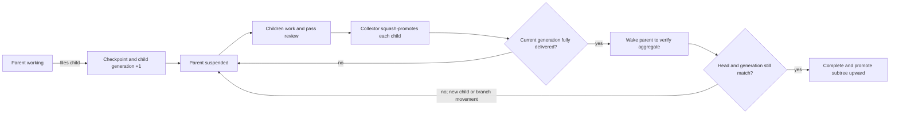

# Hierarchical Delivery and Integration Trains

**Status:** Approved design, pending written review
**Date:** 2026-09-04
**Scope:** Task-branch delivery, recursive child consolidation, root integration, and CI policy

## 1. Context

Agent Queue can have hundreds of agents finish work concurrently. Requiring every pull
request to rebase onto the latest `main`, rerun the full suite, and merge one at a time turns
`main` into a global serialization point. It also spends most CI capacity retesting individual
branches instead of testing the combination that will ship.

PR #397 addressed a real failure mode: two pull requests passed separately against different
base revisions, merged back to back, and produced a combination that failed on `main`. Its
proposed stale-base gate and uncancellable post-merge runs make that failure visible, but its
one-PR-at-a-time direction does not scale to a large fleet.

This design preserves the important invariant—full CI must pass on the exact tree promoted to
`main`—while changing the unit of integration from an individual worker PR to a recursive task
subtree and, at the project root, a periodically sealed integration train.

## 2. Goals

1. Let leaf and sibling tasks execute concurrently without racing on a shared branch.
2. Merge child work into its immediate parent before the parent can complete.
3. Wake the parent exactly once after its current child set is fully delivered so it can test
   and repair the aggregate.
4. Repeat the same protocol recursively at every task depth.
5. Periodically promote every eligible root PR through one integration operation per project.
6. Run full CI on the exact candidate tree before an atomic fast-forward of `main`.
7. Avoid a redundant post-promotion CI run on the identical `main` tree.
8. Express cadence, routing, waits, retry budgets, and escalation policy in playbooks.
9. Keep Git mutations deterministic, exact-OID fenced, idempotent, auditable, and restart-safe.
10. Roll forward on aggregate failures rather than bisecting or ejecting batch members.

## 3. Non-goals

- Automatically identify or remove the pull request that caused an aggregate failure.
- Start a second root integration while one is active for the same project.
- Preserve every leaf task commit in `main` history.
- Run the entire repository suite after every child-to-parent promotion.
- Add a post-merge audit run after an already-tested candidate reaches `main`.
- Hardcode a model or provider for integration repair.
- Use GitHub's merged flag as the authoritative proof that work was delivered.

## 4. Terms

**Task branch**
: The branch owned by one task. A parent task retains ownership of its branch while suspended.

**Promotion**
: Exact-SHA application of one reviewed task tree to its target as a single squash commit.

**Delivery receipt**
: Durable proof that a reviewed source tree was promoted to a specific target transition.

**Parent checkpoint**
: The parent branch SHA and child generation from which a child was created.

**Root candidate**
: A fully reviewed root task whose entire descendant tree has been consolidated and verified.

**Integration sweep**
: A periodic playbook activation that snapshots the eligible root frontier.

**Integration batch**
: An immutable manifest containing every root candidate eligible when a multi-candidate sweep
  is sealed.

**Repair surface**
: The direct root branch for a one-candidate sweep or the ephemeral integration branch for a
  multi-candidate sweep.

## 5. Invariants

The implementation must enforce these in core commands, not rely on prompt compliance:

1. A child starts from the exact recorded parent checkpoint.
2. A reviewed source ref cannot move externally between review and promotion. The root promotion
   command may replace that ref with its generated candidate only after proving it still points at
   the pinned reviewed head and that the candidate represents the same reviewed tree change.
3. Only one promotion mutates a given parent branch at a time.
4. A parent cannot complete while any child is unresolved or lacks a required delivery receipt.
5. Filing a child atomically increments the parent's child generation.
6. Parent verification is valid only for the recorded branch SHA and child generation.
7. Every eligible root candidate at sweep snapshot time belongs to that sweep.
8. Batch membership never changes after sealing.
9. Only one root integration lease is active per project repository.
10. The candidate promoted to `main` descends from the recorded `main` base.
11. `main` advances only from the expected base SHA to the exact full-CI-tested candidate SHA.
12. Integration repair rolls forward on the sealed candidate; it never bisects or removes work.
13. Retried commands cannot duplicate a promotion or change a sealed manifest.

## 6. Recursive task lifecycle

### 6.1 Normal leaf completion

A leaf task works on its own branch, records its verification, opens a PR, and completes the
normal review flow. Review pins the source head and tree SHAs. The task becomes eligible for
promotion to its immediate parent, or for the root integration queue if it has no parent.

### 6.2 Filing a child

When a running task files a child under itself, Agent Queue atomically:

1. Requires the parent's current work to be committed and pushed.
2. Records the parent branch HEAD as the child base checkpoint.
3. Increments the parent's child generation.
4. Creates the child with that checkpoint as its branch start point and PR target.
5. Attaches a durable delivery wait to the parent.

Children added later repeat this operation. A child may itself file grandchildren, producing the
same lifecycle recursively.

### 6.3 Suspending the parent

A parent may continue its own work after filing a child, but it cannot close while children are
unresolved. When it requests completion with open child delivery waits, Agent Queue turns the
request into a checkpoint rather than a terminal close:

- commit and push the parent's work;
- record the current branch SHA and generation;
- release the workspace;
- persist the reason for suspension; and
- block the task behind all current child delivery waits.

The task remains the owner of its branch. Child workers never write directly to that branch.

### 6.4 Direct-to-parent collection

Reviewed siblings remain isolated until promotion. A per-parent collector serializes mutations
to the parent branch while collectors for different parents may run concurrently.

For each child, the collector:

1. Pins the reviewed source head and current target head.
2. Applies the child's accepted diff as one squash commit on the parent branch.
3. Resolves conflicts on the parent repair surface when necessary.
4. Pushes with an exact expected-target lease.
5. Writes a delivery receipt containing both sides of the transition.
6. Deletes the child branch after the receipt is durable. A deletion failure records
   `cleanup_pending` and retries independently.

The collector does not rerun the full repository suite after each sibling. Review-time focused
tests protect the child; the resumed parent verifies the aggregate.

### 6.5 Waking and verifying the parent

The parent wakes only when every child in the current generation is successfully delivered, is
a verified no-op, or has an explicit accepted abandonment disposition. Failed children block.

`aq prime` gives the resumed parent a structured delivery summary:

- previous checkpoint and current branch SHAs;
- current child generation;
- child task and PR identifiers;
- promoted squash commits;
- conflict or repair commits; and
- required aggregate verification.

The parent runs its declared aggregate tests, fixes integration defects directly on its branch,
and records the verified branch SHA and generation. If it files another child, the generation
advances and the suspend/collect/wake cycle repeats.

### 6.6 Guarded parent completion

The final close is one transaction. It refuses when:

- an unresolved child exists;
- a successful child lacks a delivery receipt;
- the child generation differs from the verified generation;
- the branch HEAD differs from the verified HEAD; or
- the required review or verification evidence is absent.

After guarded completion and review, the entire parent subtree is represented by one squash
commit when promoted to its parent. Therefore each parent branch temporarily shows one commit
per direct child, but `main` ultimately shows one commit per root subtree. Detailed descendant
lineage remains in delivery receipts and PR/task records.

## 7. Root integration train

### 7.1 Scheduling

The root integration playbook runs on a configurable per-project interval and may also receive a
manual flush event. The system default is 300 seconds, with project override support.

Before candidate discovery, it attempts to acquire the project integration lease. If a direct
integration or batch is already active, the sweep does not start. A missed interval sets one
coalesced `sweep_pending` flag; additional ticks do not queue more sweeps. Releasing the active
lease immediately runs one pending sweep against a fresh eligibility snapshot.

There is no batch-size cap. A snapshot contains every eligible root PR at that instant.

### 7.2 Eligibility

A root task is eligible only when:

- it has no structural parent;
- its recursive child generation is fully delivered and verified;
- its own guarded completion and review succeeded;
- its reviewed head is still current;
- it is not already represented by a delivery receipt to `main`;
- it is not held by a human or another gate; and
- its project uses pull-request integration.

The eligibility query and lease acquisition must form one fenced operation so two playbook runs
cannot snapshot the same frontier.

### 7.3 Zero candidates

Record a no-op sweep and release the lease.

### 7.4 One candidate: direct promotion

A single root PR does not need a separately named integration branch. Agent Queue:

1. Records the current `main` SHA as the promotion base.
2. Reconstructs the reviewed root diff as one squash commit on that base.
3. Updates the root PR branch to that candidate with an exact source-branch lease.
4. Runs full CI on the candidate head.
5. Allows roll-forward repair commits on the same branch when needed.
6. Atomically fast-forwards `main` from the recorded base to the exact tested head.
7. Records the root delivery receipt and closes the PR as delivered.
8. Deletes the root branch and releases the lease.

Reconstructing the root PR branch is allowed only after sealing eligibility. The command first
proves that the ref still equals the original reviewed head, then replaces it with the generated
candidate using an exact expected-old-SHA lease. The original reviewed head and tree remain in the
receipt. Before repair commits are allowed, the generated candidate must contain exactly the
reviewed root diff applied to the locked `main` base. The generated candidate then becomes the
fenced repair surface; unrelated external movement still invalidates the operation.

### 7.5 Multiple candidates: ephemeral integration branch

For two or more candidates, Agent Queue:

1. Records the current `main` SHA.
2. Creates `integration/<batch-id>` from that exact base.
3. Writes an immutable manifest of every candidate PR, reviewed head, and tree SHA.
4. Applies one squash commit per root subtree in deterministic manifest order.
5. Opens one integration PR to `main` as the human-visible review and audit surface.
6. Resolves conflicts and aggregate defects with explicit repair commits.
7. Runs full CI on the final candidate head.
8. Atomically fast-forwards `main` from the recorded base to that exact tested head.
9. Records one delivery receipt per root candidate and marks the integration PR delivered.
10. Closes the included root PRs with a comment naming the batch and final `main` SHA.
11. Deletes local and remote integration branches plus eligible root branches.
12. Releases the project lease.

The integration PR is not merged with GitHub-generated squash, rebase, or merge semantics. The
exact-OID fast-forward is the merge. Because the tested head becomes an ancestor of `main`, the
PR is expected to be recognized as merged; if the forge does not recognize it, Agent Queue closes
it with the delivery receipt as authoritative evidence.

### 7.6 Concurrent movement of `main`

The per-project lease excludes Agent Queue integrations, not external human writes. If `main`
moves before promotion, the expected-base update fails. The same sealed integration is rebuilt
on the new base, its prior CI evidence is invalidated, and full CI must pass again. Membership
does not change.

## 8. CI policy

CI is tiered by integration boundary:

| Boundary | Required verification |
|---|---|
| Task or child PR | Focused tests, lint, and task-declared checks |
| Child promotion | Exact reviewed SHA, clean application or resolved conflict, push lease |
| Parent wake | Parent-declared aggregate tests on the fully collected generation |
| Root direct candidate | Full required project CI on the exact candidate head |
| Root integration batch | Full required project CI once on the exact final batch head |
| `main` after promotion | No additional audit run for the identical tested tree |

The workflow must not start a redundant full run solely because the candidate ref becomes
`main`. Promotion records the successful check suite or workflow run IDs and verifies they belong
to the candidate SHA. A forge check attached to a different SHA is never reusable. Once guarded
promotion is enabled, the full-CI workflow excludes `push` events for `main`; branch protection
rejects every unguarded direct write, so candidate CI is the sole required pre-promotion run.

Infrastructure failures may be retried without a code change when a deterministic classifier
identifies them as infrastructure failures. All other red runs enter repair.

## 9. Roll-forward repair and escalation

Batch membership is never changed after sealing. Agent Queue does not bisect, guess a culprit,
remove a PR, or create a replacement batch in response to aggregate CI failure.

### 9.1 Primary integration repair

One integration task owns the repair surface exclusively. Its agent:

- resolves merge conflicts;
- regenerates shared artifacts;
- diagnoses combined-tree failures;
- makes roll-forward repair commits;
- uses focused local tests while iterating; and
- launches full CI only after focused checks pass.

The primary stage has configurable wall-clock and full-CI-attempt limits. Focused local tests do
not consume a full-CI attempt. A conclusively classified infrastructure retry does not consume a
code-repair attempt.

### 9.2 One higher-intelligence debug escalation

When either primary limit is exhausted, the playbook performs exactly one debug escalation:

1. Stop the primary task and release its workspace.
2. Create a debug task on the same branch and exact head.
3. Route it to a configurable higher intelligence class or profile, such as the project's Fable
   mapping, without hardcoding a provider or model.
4. Give it a fresh context plus a structured failure dossier: manifest, branch SHA, repair commits,
   failed checks, logs, hypotheses, and commands already attempted.
5. Continue roll-forward repair under its own configurable time and CI-attempt limits.

There is at most one higher-intelligence escalation per integration.

### 9.3 Human escalation

If the debug budget is exhausted, the integration enters a human-blocked state. The branch,
manifest, lease, repair history, and evidence remain intact. No later sweep starts for that
project. A human may repair and resume or explicitly abort; the system does not silently discard
or bypass the work.

## 10. Playbook and core boundary

### 10.1 Playbook-owned policy

The **hierarchical delivery playbook** reacts to child creation, task completion, review completion,
delivery completion, disposition, and parent wake events. It creates waits, selects promotable
children, invokes promotion, routes failures, and wakes parents.

The **root integration train playbook** reacts to its schedule, manual flush, pending-sweep, CI,
repair, and human-resume events. It chooses the zero/one/many path, creates repair tasks, applies
budgets, escalates intelligence, waits for CI, promotes, and cleans up.

Playbook inputs own:

- interval and manual-trigger policy;
- required check set or full-CI command;
- primary repair duration and CI-attempt limit;
- debug repair duration and CI-attempt limit;
- debug intelligence class/profile;
- infrastructure retry policy; and
- integration branch naming and cleanup retry policy.

### 10.2 Core primitives

Core Agent Queue commands provide only deterministic mechanisms:

- atomically file a child from a parent checkpoint and increment generation;
- checkpoint/suspend a parent and create delivery waits;
- query recursive delivery readiness with reasons;
- pin a reviewed source head and tree;
- acquire, heartbeat, and release a parent collector lease;
- squash-promote an exact source tree with an expected target SHA;
- record and query delivery receipts;
- record aggregate verification for an exact generation and branch SHA;
- guarded parent completion;
- acquire and fence the per-project root integration lease;
- atomically snapshot and seal all eligible root candidates;
- create/reconcile/delete integration refs;
- attach and validate CI evidence for an exact SHA;
- exact-base fast-forward promotion to `main`;
- record repair stages and budgets; and
- reconcile interrupted operations after restart.

Every mutation accepts an idempotency key derived from the playbook run and node activation.

## 11. Durable state

Correctness-critical state uses four normalized database records. Playbook node results may cache
or project these values, but they are not the source of truth for generation, delivery, membership,
or lease decisions.

### 11.1 Parent integration checkpoint

`task_integration_checkpoints`, keyed by `task_id`, stores:

- parent task and branch;
- child generation;
- checkpoint branch SHA;
- verified generation and branch SHA;
- state: working, awaiting children, integration ready, or verifying; and
- last transition and playbook activation identifiers.

### 11.2 Delivery receipt

`task_delivery_receipts`, keyed by a generated receipt id and uniquely constrained by idempotency
key, stores:

- source and target tasks, with a null target task representing project `main`;
- source PR, reviewed head SHA, and reviewed tree SHA;
- target branch and before SHA;
- promoted squash commit and target after SHA;
- review and verification evidence;
- optional root batch identity; and
- idempotency key.

The receipt, not forge PR state, is Agent Queue's authoritative proof of delivery.

### 11.3 Root integration batch

`integration_batches`, keyed by batch id with a partial unique constraint on active `project_id`,
stores:

- project, trigger, and timestamps;
- locked `main` base SHA;
- immutable batch-level state;
- direct source branch or integration branch and PR;
- primary and debug repair tasks and attempts;
- tested candidate SHA and CI evidence;
- final `main` SHA, cleanup state, or human abort reason; and
- coalesced pending-sweep state.

`integration_batch_members`, keyed by `(batch_id, ordinal)` and unique on `(batch_id, task_id)`,
stores the immutable ordered candidate manifest: task, PR, reviewed head and tree, generated squash
commit, and final receipt. Membership rows may be inserted only in the same transaction that seals
the batch; sealed batches reject later inserts, updates, or deletes.

### 11.4 Integration lease

`project_integration_leases`, keyed by `project_id`, stores:

- project and integration identity;
- owner activation and fencing token;
- heartbeat and expiry information; and
- direct or batch mode.

Lease expiry permits reconciliation, not blind acquisition. Recovery first compares recorded and
actual refs and either resumes the same integration or escalates an invariant violation.

## 12. Events, gates, and operator controls

New events should describe facts rather than prescribe routing:

- `task.child_added`
- `task.parent_checkpointed`
- `delivery.ready`
- `delivery.applied`
- `task.integration_ready`
- `task.integration_verified`
- `integration.sweep_due`
- `integration.sealed`
- `integration.ci_completed`
- `integration.repair_exhausted`
- `integration.human_blocked`
- `integration.promoted`
- `integration.cleanup_pending`

Existing `task`, `timer`, `human`, `event`, and `ci-run` waits remain the playbook substrate. A
delivery wait must resolve from a delivery receipt rather than a forge merged flag.

Operator surfaces must provide:

- integration status and current stage;
- the sealed manifest and exact SHAs;
- recursive parent/child delivery status;
- repair tasks, attempts, and CI history;
- reasons a task, parent, or project cannot advance;
- manual flush, resume, retry-cleanup, and explicit abort controls.

Only a human may abort a human-blocked integration. Abort releases the lease and retains the batch
record; it never rewrites `main`.

## 13. Failure and restart behavior

| Failure | Required behavior |
|---|---|
| Source head changed after review | Refuse promotion and require review of the new head |
| Parent target moved | Retry against the new target under the same child receipt attempt |
| New child filed during parent verification | Increment generation; guarded close refuses and parent waits again |
| Conflict applying child | Repair on the parent branch, preserving the sealed child source |
| Aggregate test failure | Roll forward on the current repair surface |
| Primary budget exhausted | Escalate once to configured higher intelligence |
| Debug budget exhausted | Preserve branch and lease; create human gate |
| `main` moved during root CI | Rebuild sealed candidate on new base and rerun full CI |
| Daemon restart | Resume durable playbook node after reconciling exact refs |
| Push succeeded before DB receipt | Reconcile target SHA and write the missing idempotent receipt |
| Receipt committed before observable push | Verify ref; retry push or mark invariant violation |
| Cleanup failed after `main` promotion | Mark cleanup pending; shipping remains successful and cleanup retries |

## 14. Security and authority

- Worker profiles cannot promote to parent branches or `main` directly.
- Reviewer authority pins the accepted source SHA; integration authority may only consume pinned
  sources and write to its assigned repair surface.
- Only the root integration command may update `main`, using an expected-old-SHA lease and a
  required green-CI attestation for the exact new SHA.
- Branch protection must permit the Agent Queue integration identity to perform this guarded
  fast-forward while continuing to reject arbitrary direct pushes.
- Force flags cannot waive source identity, ancestry, expected-base, or tested-SHA invariants.
- Human abort and resume actions are audited.

## 15. Compatibility and rollout

1. Land persistence and read-only status surfaces with no behavior change.
2. Add exact-SHA child promotion and guarded parent completion behind a project flag.
3. Ship the hierarchical delivery playbook disabled by default; exercise restart and recursive
   child scenarios on a test project.
4. Enable hierarchy delivery for one project and retire that project's legacy `pr-merged` child
   gates after receipts are backfilled or explicitly waived.
5. Add root integration primitives and ship the train playbook in observation mode.
6. Enable direct single-root promotion, then multi-root batches.
7. Disable redundant full-CI runs on `main` only after exact tested-tree promotion is enforced.
8. Close or supersede PR #397; selectively retain its CI classification and base-comparison code
   where useful to candidate attestation.

Projects may continue using the current one-PR-at-a-time pipeline until explicitly migrated.

## 16. Verification plan

The implementation plan must include focused suites for:

- SQLite and PostgreSQL generation increments, leases, receipts, and partial uniqueness;
- dynamic children filed before, during, and after parent verification;
- recursive grandchildren and accepted no-op/abandonment dispositions;
- concurrent sibling delivery to one parent and parallel delivery to different parents;
- exact reviewed-head and expected-target rejection;
- recursive squash history and receipt lineage;
- zero-, one-, and many-candidate sweeps;
- all-eligible snapshot atomicity and immutable manifests;
- coalesced ticks while integration is active;
- exact-tree direct promotion and multi-root fast-forward;
- external movement of `main` during CI;
- no redundant post-promotion full-CI run;
- focused repair, full-CI attempt accounting, infrastructure retries, and both budget limits;
- one fresh-context higher-intelligence handoff with a complete failure dossier;
- human escalation without lease release;
- crash recovery at every durable wait and between push/receipt steps;
- cleanup-pending recovery; and
- authorization failures for worker, reviewer, integrator, and human-only operations.

An end-to-end test should create a three-level task tree, dynamically add a child while its parent
is verifying, promote every level, seal multiple roots, inject an aggregate failure, roll forward
through the debug escalation path, and prove that `main` advances once to the exact tested SHA
without launching a post-merge audit run.

## 17. Acceptance criteria

The design is implemented when:

1. Dynamically filed children always branch from and return to their immediate parent.
2. A parent wakes only after its current child generation is fully delivered.
3. Parent completion is impossible against stale generation or branch verification.
4. Task history compresses to one commit per boundary and one root-subtree commit on `main`.
5. Each periodic sweep includes every eligible root PR and never overlaps another integration for
   the same project.
6. One candidate uses the direct path; multiple candidates use a deleted-after-promotion ephemeral
   integration branch.
7. Aggregate failures roll forward without bisection or membership changes.
8. Repair escalates once to a configurable higher intelligence class before human escalation.
9. Both repair stages enforce configurable duration and full-CI-attempt limits.
10. `main` advances only to the exact full-CI-tested candidate via expected-base fast-forward.
11. No redundant full-CI audit run starts after promotion.
12. Playbooks own orchestration policy and core commands own only fenced, idempotent mechanisms.
13. Operators can explain, observe, flush, resume, clean up, and explicitly abort integrations.
