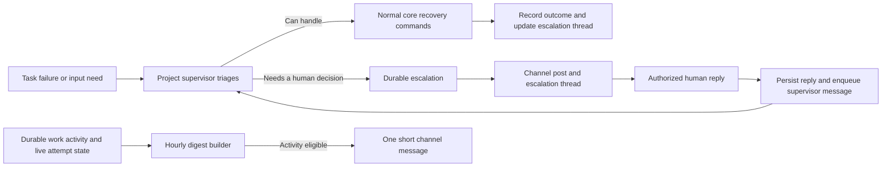

# Discord simplification implementation spec

<!-- aq:historical -->
> **Historical design record.** This spec describes one feature as it was
> designed, not as the code stands today. Start at [the documentation
> home](../../README.md) for current behaviour; see [historical
> material](../../history/README.md).

## 1. Decisions and scope

Approved product behavior:

1. One configured Discord channel per installation. Selected projects share that channel; every item identifies its project. No automatic channel-per-project creation.
2. Routine work appears in a short hourly digest. Default interval: 60 minutes. If nothing happened and nothing is actively executing, send nothing. Unchanged queued, paused, dependency-blocked or human-waiting work alone does not produce a digest.
3. Human intervention is immediate: one channel post and one thread per escalation. Human replies return to the owning project supervisor; the supervisor decides and performs recovery through normal commands.
4. The dashboard owns task browsing, controls, gates, terminal/log inspection and general supervisor chat. Discord has no operational slash commands, execution streaming, arbitrary mention handling or general chatbot mode.
5. No mentions in routine digests. Mentions are explicit and bounded for escalation posts; follow-ups stay in their thread.
6. Disabling Discord never prevents task scheduling, supervisor triage, reply persistence through another supported surface, or dashboard access to pending escalations.

This spec supersedes the retained Discord features in `docs/specs/design/messaging-rework.md` M4 and sections 4.1–4.5: execution threads, direct worker replies, gate buttons, general channel chat and six slash commands are removed from the target surface. It does not require completing that older design's separate-process/package extraction. Implement a transport-neutral command/event boundary in the existing adapter; moving process boundaries is separate work. Telegram and new external transports are out of scope.

## 2. Current behavior and removal inventory

The current implementation is in `src/discord/`, not an installed `packages/aq-discord/` package. Relevant existing seams:

- `src/discord/slash_commands.py`: six read-only commands; the historical 122-command mirror is already removed.
- `src/discord/bot.py`: general-channel and mention routing, per-task output threads, direct task-thread reopen/injection/description mutation, channel provisioning.
- `src/discord/notification_handler.py`: broad immediate lifecycle subscriptions, transcript streaming, gate views, worker question notifications and supervisor-message delivery.
- `src/discord/notifications.py`, `gate_view.py`, `agent_questions.py`: task controls, playbook/gate actions, question replies, delivery receipts and restart restoration.
- `src/sessions/questions.py`: active-claim question identity, answer acceptance and direct terminal delivery. A blocked/closed task may have no active claim, so these records cannot simply serve as durable escalation records.
- `src/prompts/default_playbooks/blocked-task-escalation.md`: already routes terminal BLOCKED failures to the project supervisor. Dependency blockedness is deliberately a different event.
- Dashboard task views, `SessionDetail.tsx`, `system/Gates.tsx`, playbook views and chat already provide many replacements. Verify actual capability before retiring each corresponding Discord control.

| Surface | Disposition | Replacement |
|---|---|---|
| `/status`, `/tasks`, `/explain`, `/gates` | Unregister bot-owned commands | Dashboard overview, task/explanation and gate views |
| `/peek`, `/attach` | Unregister | Dashboard session transcript/terminal and documented CLI access |
| Retry/skip/stop/reopen/approval task buttons | Remove direct execution | Dashboard commands or supervisor-mediated escalation |
| Gate and playbook resume controls | Remove direct Discord execution | Dashboard controls; supervisor may execute an exact human-authorized action through core commands |
| Per-execution task threads and streamed agent output | Stop producing | Dashboard live session and recorded attempts |
| Task-thread reply → worker input, task description or reopen | Remove | Recognized escalation reply → durable message → supervisor |
| General channel chat, arbitrary mentions and DMs as commands | Ignore for work routing | Dashboard supervisor chat |
| Per-project channel creation and task-thread cleanup | Retire from normal operation | Explicit single-channel configuration and escalation-thread lifecycle |
| Immediate task/PR/budget/playbook informational posts | Aggregate | Hourly selected-category digest |
| Rate guard, permission checks, retry/backoff and receipts | Preserve and adapt | Shared reliable transport delivery |

Keep underlying notification/domain events where the dashboard, plugins or other consumers use them. Removing a Discord consumer does not authorize deleting shared domain capabilities. Historical channels, posts and threads are not deleted automatically.

## 3. Architecture and ownership



The core owns escalation state, authorization, incident correlation, task recovery and digest eligibility. Discord owns presentation and transport identities only. All incoming mutations use named CommandHandler commands and typed API contracts; the adapter must not call database task mutations or terminal providers directly. Reuse the existing message delivery engine, supervisor addressing (`supervisor-<project_id>`) and platform-neutral notification port where suitable.

No live user reply is ever sent directly to a worker by this feature. The supervisor may subsequently send guarded worker input or recover a task after checking its current ownership and state. A reply does not itself clear a gate, reset a retry budget or authorize an unrelated operation.

## 4. Durable escalation model

Add a transport-neutral escalation model rather than stretching the active-session question lifecycle. Physical table names may follow existing conventions, but migrations must preserve these contracts:

- Escalation identity: stable ID, project/task IDs, source kind and source identity (attempt ID, question ID, gate/operation ID), incident deduplication key, logical supervisor owner, summary, investigation performed, explicit decision requested, optional bounded choices, severity, revision, timestamps and terminal outcome/evidence.
- Conversation state: `needs_human`, `reply_received`, `resolving`, `resolved`, `cancelled`, `stale`. Initial supervisor triage lives in the existing supervisor message flow; creation occurs when human input is required.
- Message history: immutable inbound/outbound entries, escalation ID, verified actor, text, source message ID, received sequence/time and supervisor message ID. Uniqueness on transport + external message ID makes replay idempotent.
- Delivery state is separate: pending/sending/sent/retry/unknown, attempt count, next attempt, lease owner/expiry, channel/root/thread IDs and last confirmed receipt. Durable ownership survives daemon and supervisor restarts.
- Digest state: destination/config generation, window boundaries, activity cursor, due time, claimed lease, output hash/payload, send status and confirmed external receipt. A shared notification outbox may hold these if it supplies the same uniqueness, recovery and priority properties.

A unique source-incident key returns the same escalation for repeated events from the same attempt/question/operation. A genuinely new failed attempt can create a new incident. Do not deduplicate solely by task ID or text, which would hide later blockers. Source references must remain usable if the task archives; keep a bounded identifying snapshot without storing raw transcripts or credentials in Discord payloads.

State changes use revision checks/CAS. `reply_received` means persisted, not resolved. `resolving` means a supervisor has taken ownership. `resolved` requires recorded action/outcome or an explicit no-action decision. Another human reply can move an open resolving conversation back to `reply_received`; it must not be lost behind an in-flight supervisor turn. Replies to terminal/stale incidents do not reopen work. Acknowledge the closed state and link to the dashboard without creating a new task implicitly.

## 5. Commands, identity and events

Introduce typed core commands (names are part of this spec):

| Command | Caller and purpose |
|---|---|
| `escalation_create` | Owning supervisor/trusted core source; idempotent creation with incident identity |
| `escalation_list`, `escalation_get` | Scoped dashboard/CLI/adapter reads, including pending delivery and history |
| `escalation_reply` | Verified human via dashboard or trusted external adapter; append and enqueue supervisor notice atomically |
| `escalation_update` | Owning supervisor; CAS status/summary/outcome changes, including terminal resolution |
| `escalation_apply_reply` | Owning supervisor; consume a specific verified human reply as evidence for a guarded question/gate/recovery action |

Register input/output schemas, CLI discovery and errors consistently; regenerate OpenAPI and Python/TS clients whenever required by the repository workflow. Do not hand-edit generated files.

Adapter identity must be established by trusted server context plus the existing configured Discord user allowlist and channel/thread binding. Do not accept a body field such as `human=true`, actor ID, project ID or arbitrary thread ID as authority. Service principals cannot use this API to impersonate supervisors or resolve arbitrary gates. Human dashboard replies and Discord replies share the same persistence/forwarding semantics for escalations.

For human-required questions/gates, `escalation_apply_reply` binds escalation ID, reply ID, expected revision and an explicitly typed target/action to the original human evidence. The core validates that binding and calls the existing action-specific service with the verified human provenance while retaining the supervisor as the executor. It must not falsely classify supervisor-authored text as a human answer, bypass action-specific scope/fences, or reject a legitimate relayed answer solely because the executor is the supervisor. Record an action idempotency key and outcome so duplicate processing cannot repeat a recovery. Ambiguous replies remain open for clarification.

Publish versioned events for escalation creation, reply receipt, updates and delivery status. Replayed events are hints to reconcile authoritative state, not permission to blindly repeat external sends. Append reply and enqueue the supervisor message in one transaction/outbox operation. Logical ownership is by project supervisor, not an ephemeral process PID; wake/recreate the appropriate supervisor using the existing delivery machinery.

## 6. Supervisor triage and recovery

Extend the blocked-task playbook and supervisor instructions to:

1. Receive terminal BLOCKED failures, exhausted recovery attempts and qualified input/decision needs. Do not escalate ordinary dependency waiting, retrying tasks or unchanged queue state as human incidents.
2. Inspect task explanation, attempt logs, current integration owner, prior attempts and existing escalation. Resolve factual questions locally where authorized.
3. Create an escalation only when a human decision is needed. Include a short explanation of what was tried, the precise question, and task/dashboard links. Preserve human-required classification: the supervisor cannot turn a required human decision into self-approval.
4. On a persisted reply, reload task/claim/operation/gate identity and process only new conversation entries. Apply the user's actual decision through scoped commands; request clarification for ambiguity.
5. Recover using the mechanism owning the work. Integration repair/verification stays with its existing operation and budget. For a dead worker, do not nudge a reused/stale session; recover or schedule a new attempt through normal lifecycle rules.
6. Record the action, evidence and outcome; resolve only once that action succeeded or a deliberate keep-blocked/cancel decision is recorded. A failed recovery leaves the escalation open with a follow-up in the same thread.

Bridge worker questions into this flow without deleting their claim fences or factual-question handling. An escalated active-worker question gains a link to the durable escalation. Discord's old `question_answer` modal must no longer deliver directly; any subsequent worker answer delivery is supervisor-mediated and respects the original human-author requirement.

If the supervisor is unavailable, persist the incident/replies and show the delivery problem in the dashboard. Retry through the existing supervisor delivery mechanism. Do not silently fall back to direct task mutation or lose human input. A bounded watchdog may publish one trusted operational escalation after a configurable supervisor-delivery timeout (default 15 minutes), deduplicated by supervisor incident; it may report unavailability but not reinterpret worker requests as approved actions.

## 7. Single-channel escalation UX and delivery

Initial channel post: project, task title/ID, concise blocker, exact decision needed, configured mention, dashboard link and escalation ID. Create one dedicated thread for follow-ups and replies. The thread contains further context rather than flooding the channel. Only correlated supervisor messages are relayed back; unrelated supervisor chat stays in the dashboard.

On reply acceptance: acknowledge receipt once and show that the supervisor is reviewing it. On resolution: post the action/outcome in the thread and edit the original root to a resolved state. Archive the thread after the resolution update succeeds; durable mappings/tombstones still prevent late replies from reopening work. Thread recovery after restart uses stored IDs rather than task-thread heuristics.

Routine gateway reconnects, duplicate events and multiple workers must not create duplicate threads/posts. Use durable leases, uniqueness and confirmed receipts. External sends cannot be transactionally exactly-once with the database: on an ambiguous timeout/crash after send, reconcile using stored operation markers and available message history before retrying. If ownership cannot be established, mark delivery unknown/attention-needed instead of blindly reposting or claiming exactly-once behavior. Deleted roots/threads require an explicit recorded replacement generation, at most one pending replacement at a time, and must not reopen resolved incidents.

Retain bounded retries/backoff and the existing rate guard. Escalations take priority over digests, but never bypass rate limits. Discord failure must not block the EventBus or scheduler. Missing channel/permissions is an actionable delivery fault visible in dashboard health, not a reason to create a new channel silently.

## 8. Hourly digest semantics

Evaluate every configured interval; default 60 minutes. Persist UTC window boundaries/cursors and use an injectable clock. One installation-wide digest combines included projects; no per-task or per-project message fan-out.

Eligibility:

| Activity since the last evaluated window | Send? |
|---|---|
| Work completed, started, or made meaningful recorded progress in selected categories | Yes |
| At least one task is genuinely executing in a live current attempt | Yes; concise active count if no new highlight |
| Only unchanged ready/queued, paused, dependency-waiting or human-waiting work | No |
| Only an IN_PROGRESS container/epic with no live execution | No |
| No work/activity | No |
| All selected activity filtered out | No |

Use durable attempt/lifecycle/completion records and explicit meaningful progress (e.g. recorded progress note, test/PR milestone). Do not treat heartbeat, updated_at churn, layout updates, periodic metrics or repeated notifications as work. `list_recent_task_activity` is a useful source but its broad updated_at/attempt-overlap definition alone is not an eligibility predicate. Active means a current, live assigned attempt; a stale session or an unanswered input wait is not healthy execution. Existing stall handling investigates stalled workers; the digest must not invent progress from elapsed time.

Content: completion count, active count, up to three useful highlights grouped by project, optional count/link for already-open escalations, and a dashboard link. Plain language, no raw logs/stack traces. Target <=1,200 characters and one Discord message; truncate highlights and show aggregate overflow counts/link rather than splitting into multiple posts. Preserve the most informative completions/progress first. No LLM call is required to build a digest.

Never repost identical highlight text as new progress. A long-running healthy task can produce a short active-count digest in a later window even without a milestone. If it is merely waiting, silence. Open escalations do not alone trigger a digest or another mention. Digests never mention users/roles, including user-authored strings that resemble mentions.

At a normal boundary, transactionally reserve a window/output key before delivery. Re-evaluation and restart cannot create another normal digest for that window. Persist suppressed windows too so idle periods are not rescanned indefinitely. Events arriving after a cutoff are included in the next eligible window using an ingestion cursor and stable event identity, without double-counting lifecycle notifications for one completion.

On restart or prolonged outage, coalesce missed windows into at most one labeled catch-up digest covering a bounded recent horizon (default 24 hours); never dump one message per missed hour. Older activity is available in the dashboard. A configuration change starts a new schedule generation at the change time; it does not replay old windows or unsent historical summaries into a newly selected channel. Pending escalations retain their durable delivery identity and follow an explicit destination-rebind procedure.

## 9. Configuration and dashboard

Add validated settings to the existing config schema/editor and expose a dashboard messaging settings panel. Preserve bot credentials and rate-guard configuration. Proposed field organization:

```yaml
discord:
  channel_id: "<configured channel id>"
  authorized_users: []
  digest:
    enabled: true
    interval_minutes: 60
    project_ids: []  # empty = all projects visible to this configured destination
    categories: [work, vcs, budget, system]
    catchup_hours: 24
  escalation:
    enabled: true
    mention_user_ids: []
    mention_role_ids: []
    reminder_minutes: 0  # disabled by default; reminders stay in the thread
    supervisor_delivery_timeout_minutes: 15
```

Validate IDs and project membership, interval 15–1440 minutes and catch-up horizon 1–168 hours. These bounds are implementation defaults; changing them requires aligned schema/help/tests. Keep digest and escalation enablement independent. Explicitly warn in settings when external escalation is disabled; core/dashboard escalation handling remains available. Never allow a project filter to leak another project's details; define selected destination visibility before querying/rendering.

Dashboard requirements: settings validation, dry preview of a digest with reason for suppression, next scheduled evaluation, pending/unknown/failed delivery health, and a scoped escalation list/detail with conversation, supervisor ownership, status and task links. Human replies use `escalation_reply`. Existing dashboard task/gate controls remain separate explicit actions; closing a task elsewhere causes reconciliation of relevant stale escalations rather than an implicit Discord action.

Use named commands and generated API clients for new dashboard capabilities, including digest preview/status if needed; no dashboard-only business logic. Preview does not send messages or advance delivery cursors. Configuration test actions, if offered, must be explicit and limited to the configured destination.

## 10. Migration and cutover

Ship behind a temporary explicit legacy/simplified mode during development. The modes are mutually exclusive for delivery and inbound routing: never run old immediate notifications/direct replies alongside the new digest/escalation consumer. The final documented default is simplified mode; remove the temporary legacy mode after acceptance/migration support is complete.

Migration reads existing configuration and inventories pending question/gate messages and task threads. Reuse the configured global channel when unambiguous; resolve legacy names to IDs using the current adapter. Multiple conflicting destinations require an explicit settings selection, not arbitrary choice. Preserve authorization lists. Stop auto-provisioning project channels and the separate agent-questions channel.

Before disabling old callbacks, migrate actionable pending external conversations to core escalation identities (preserving source question/gate identity and verified human-required state). Record old message/thread mappings for redirect or adopt an appropriate existing thread; do not post duplicate human requests. Restore/reconcile persistent views so pre-cutover buttons cannot still mutate tasks. Closed or unrelated historical threads stay read-only/inert for work routing. Already accepted answers remain accepted and are not delivered twice.

Unregister only this bot's retired slash commands during sync. Do not wipe unrelated guild commands or delete historical channels/messages. Remove execution-thread subscriptions and direct mutation paths once replacement coverage is verified. Retain shared events/commands used elsewhere. Audit `src/commands/discord_commands.py`, transport callbacks, notifications/builders, config loading and tests for obsolete coupling; retire task-thread-specific housekeeping with compatibility guidance where needed.

Update messaging design/spec references, module docs, setup guidance and installed-skill source/distribution instructions. No current Discord content is deleted by rollout. Operator rollout must show pending escalation migration status and delivery health; rollback must not reactivate old direct-action views over already-migrated conversations.

## 11. Verification and acceptance

Required automated coverage:

- Durable escalation deduplication, CAS transitions, duplicate/multiple replies, supervisor restart/takeover and atomic reply-to-supervisor enqueue.
- Source identity/authorization, cross-project and spoofed actor refusal, stale claims, resolved/archived task replies and preserved human-required decisions.
- Discord root/thread create/reconcile, duplicate event delivery, ambiguous send, partial root/thread failure, deleted/archived threads, rate limiting and gateway restart. Fakes/sink destinations only.
- Clock-controlled digest tests: idle, queued-only, blocked-only, container-only, healthy long-running task, completed-with-no-active-work, real milestones, heartbeat-only noise, project filters, truncation, interval changes, catch-up and deduplicated sends.
- Full flow: blocked attempt → supervisor triage → escalation → Discord thread → authorized reply → supervisor recovery → recorded resolution/root edit. Cover supervisor absent and recovery failure.
- Negative behavior: channel chatter, mentions, old task-thread replies, retired buttons and slash commands cannot reopen/edit tasks, resolve gates or nudge workers.
- Dashboard settings, suppression preview, pending-delivery visibility, conversation reply and functional replacement checks for every removed Discord operation.
- Migration of pending legacy conversations and already-accepted answers, with no double delivery or lost replies.

Use focused `aq test` with existing caps/markers. Likely existing files include test_blocked_task_escalation.py, test_agent_questions.py, test_discord_agent_questions.py, test_discord_bot_routing.py, test_discord_supervisor_routing.py, test_discord_notifications_interactions.py, test_discord_gate_view.py, test_notifications.py, test_null_messaging_boot.py and messaging-port tests. Add focused new digest/escalation suites as necessary, plus dashboard tests and the generated-client contract checks when their surface changes. Never use the operator database or real user messages for tests. Generate schema migrations for schema changes; only the operator/daemon applies operator database upgrades.

Acceptance requires one-channel behavior, the eligibility table above, an uninterrupted supervisor-owned reply loop, reliable restart/outage behavior, zero surviving direct Discord task mutations, verified dashboard replacements, and an updated removal inventory. Record exact tests/revision and any remaining limitation. Merely having passing help/dispatch tests is not acceptance.

## 12. Delivery plan

The embedded graph is the executable work breakdown. Dependencies gate consumers on stable schemas/contracts and gate legacy removal on replacement readiness. Each child has scoped acceptance criteria and a spec reference. Final acceptance depends on resilience tests and migration/operations documentation. The repository copy at `docs/superpowers/specs/2026-09-08-discord-simplification-implementation.md` is published and canonical. The project vault keeps a byte-identical mirror at `vault/projects/agent-queue/specs/discord-simplification-implementation.md` so a worker can read the spec without a checkout; any change must update both copies in the same pass.


```aq-graph
{
  "version": 1,
  "parent": {
    "title": "Epic: Simplify Discord to hourly activity digests and escalation threads",
    "description": "Implement the user-approved Discord model: one configured shared channel, short hourly digests only for completed/progressed/active work, silence for idle or unchanged waiting work, and immediate escalation threads. Every human reply returns to the project supervisor, which performs guarded recovery and records resolution. Dashboard owns browsing, controls, logs and general chat. Implementation spec: {spec}. The 12 children cover durable state/contracts, supervisor integration, dashboard/config, outbound/inbound Discord, digest data/scheduling, legacy migration/removal, failure testing, docs and final acceptance. Preserve auth, rate limits, ownership and human provenance; no real external messaging or operator migrations as test side effects.",
    "priority": 60,
    "labels": [
      "epic",
      "discord-simplification"
    ]
  },
  "defaults": {
    "intelligence_class": "standard-medium"
  },
  "nodes": [
    {
      "key": "state",
      "title": "Add durable escalation, reply, delivery and digest state",
      "description": "Implement \u00a73, \u00a74 of the approved Discord simplification implementation spec. Source: {spec}.\n\nImplement the transport-neutral persistence/service foundations. Existing active-session questions cannot represent closed/blocked-task escalations. Preserve reusable message/outbox machinery and add only the schema needed for incident keys, CAS revisions, immutable verified replies, delivery leases/receipts, and digest windows/cursors.\n\nApproved product contract: one shared configured channel; hourly activity-only digests with no routine mentions; immediate escalation threads; every reply goes through the owning supervisor; no direct Discord task mutation, log streaming or general chatbot. Keep core scheduling independent of Discord. Use focused aq test/appropriate dashboard checks, preserve scope and operator DB guards, and regenerate API clients for model/router changes. Record exact validation evidence.",
      "acceptance": [
        "Schema migrations and queries implement the identities, state transitions and separate delivery status in \u00a74.",
        "Repeated source incidents/replayed external replies are idempotent; distinct failed attempts remain distinct.",
        "Reply acceptance and supervisor delivery enqueue have an atomic persistence seam; concurrent transitions cannot overwrite unseen replies.",
        "Tests cover terminal/archive cases, duplicate inserts, lease recovery and rollback in disposable PostgreSQL; no operator migrations."
      ],
      "needs": [],
      "priority": 45,
      "task_type": "feature",
      "intelligence_class": "deep-high",
      "labels": [
        "discord-simplification",
        "single-channel",
        "implementation-spec-2026-09-08"
      ],
      "context": [
        {
          "type": "spec_ref",
          "path": "{spec}",
          "section": "3. Architecture and ownership"
        },
        {
          "type": "spec_ref",
          "path": "{spec}",
          "section": "4. Durable escalation model"
        }
      ]
    },
    {
      "key": "commands",
      "title": "Expose scoped escalation commands, human-evidence application and typed APIs",
      "description": "Implement \u00a75 of the approved Discord simplification implementation spec. Source: {spec}.\n\nAdd escalation_create/list/get/reply/update/apply_reply with authenticated principal checks. Human evidence is a durable reply reference, never caller-asserted human=true. Apply exact action-specific recovery/question/gate services with their existing budgets/fences; record action idempotency. Register typed schemas/events, CLI surface and generated clients.\n\nApproved product contract: one shared configured channel; hourly activity-only digests with no routine mentions; immediate escalation threads; every reply goes through the owning supervisor; no direct Discord task mutation, log streaming or general chatbot. Keep core scheduling independent of Discord. Use focused aq test/appropriate dashboard checks, preserve scope and operator DB guards, and regenerate API clients for model/router changes. Record exact validation evidence.",
      "acceptance": [
        "All six commands and versioned events are registered and documented with stable success/error contracts.",
        "Cross-project, stale-revision and spoofed actor/reply/action combinations fail without mutation.",
        "A legitimate supervisor relay of a required-human answer is accepted only through verified bound human evidence; supervisor-authored text cannot masquerade as it.",
        "Generated OpenAPI/Python/TS clients are regenerated by repository scripts and contract tests pass; replies enqueue supervisor notices atomically."
      ],
      "needs": [
        "state"
      ],
      "priority": 50,
      "task_type": "feature",
      "intelligence_class": "deep-high",
      "labels": [
        "discord-simplification",
        "single-channel",
        "implementation-spec-2026-09-08"
      ],
      "context": [
        {
          "type": "spec_ref",
          "path": "{spec}",
          "section": "5. Commands, identity and events"
        }
      ]
    },
    {
      "key": "supervisor",
      "title": "Route blocked work and worker questions through supervisor-owned escalations",
      "description": "Implement \u00a76 of the approved Discord simplification implementation spec. Source: {spec}.\n\nExtend the blocked-task escalation playbook and supervisor instructions/services. Supervisor investigates first and creates a human escalation only for a real decision need. Bridge active worker questions without losing claim identity or human-required classification. All received human replies return to the supervisor before any worker/gate/recovery action.\n\nApproved product contract: one shared configured channel; hourly activity-only digests with no routine mentions; immediate escalation threads; every reply goes through the owning supervisor; no direct Discord task mutation, log streaming or general chatbot. Keep core scheduling independent of Discord. Use focused aq test/appropriate dashboard checks, preserve scope and operator DB guards, and regenerate API clients for model/router changes. Record exact validation evidence.",
      "acceptance": [
        "Ordinary dependency waits and active retry legs do not produce human escalations; duplicate terminal events reuse the incident.",
        "End-to-end core tests cover supervisor triage, human evidence application, successful recovery, keep-blocked decisions and failed recovery remaining open.",
        "Unavailable/restarted supervisors receive durable backlog through logical project ownership; stale sessions are never nudged.",
        "Integration-owned operations keep existing ownership and retry budgets; watchdog unavailability notices are bounded/deduplicated and cannot approve work."
      ],
      "needs": [
        "commands"
      ],
      "priority": 55,
      "task_type": "feature",
      "intelligence_class": "deep-high",
      "labels": [
        "discord-simplification",
        "single-channel",
        "implementation-spec-2026-09-08"
      ],
      "context": [
        {
          "type": "spec_ref",
          "path": "{spec}",
          "section": "6. Supervisor triage and recovery"
        }
      ]
    },
    {
      "key": "dashboard",
      "title": "Add Discord settings, escalation inbox and digest preview/status",
      "description": "Implement \u00a79 of the approved Discord simplification implementation spec. Source: {spec}.\n\nImplement validated single-channel settings in the shared config schema/editor and dashboard. Add scoped escalation list/detail/reply and delivery-health visibility. Implement digest preview/status as named commands and generated API clients, with preview using the shared eligibility/rendering contract and no send/cursor side effects.\n\nApproved product contract: one shared configured channel; hourly activity-only digests with no routine mentions; immediate escalation threads; every reply goes through the owning supervisor; no direct Discord task mutation, log streaming or general chatbot. Keep core scheduling independent of Discord. Use focused aq test/appropriate dashboard checks, preserve scope and operator DB guards, and regenerate API clients for model/router changes. Record exact validation evidence.",
      "acceptance": [
        "Settings expose independent digest/escalation enablement, default 60-minute cadence, project/category selection, mention policy and bounded catch-up/reminder values.",
        "Dashboard shows conversation, supervisor, task links, pending/unknown delivery, next evaluation and suppression reasons; reply uses the same core command as Discord.",
        "Config changes create explicit schedule/destination generations; invalid IDs/projects/intervals produce actionable errors.",
        "Component/API tests cover settings, scoped reads/replies and preview; replacement capability checklist identifies anything still needed before Discord controls can be removed."
      ],
      "needs": [
        "commands",
        "digest-data"
      ],
      "priority": 65,
      "task_type": "feature",
      "intelligence_class": "standard-medium",
      "labels": [
        "discord-simplification",
        "single-channel",
        "implementation-spec-2026-09-08"
      ],
      "context": [
        {
          "type": "spec_ref",
          "path": "{spec}",
          "section": "9. Configuration and dashboard"
        }
      ]
    },
    {
      "key": "discord-send",
      "title": "Deliver and reconcile one escalation post/thread per incident",
      "description": "Implement \u00a77 of the approved Discord simplification implementation spec. Source: {spec}.\n\nReplace bespoke action notifications with a thin Discord escalation renderer over durable core state. Root post identifies project/task/decision and links to dashboard; follow-ups stay in a single mapped thread. Retain configured authorization, rate guard, retries, receipt tracking and restart restoration. No transport-owned task mutations.\n\nApproved product contract: one shared configured channel; hourly activity-only digests with no routine mentions; immediate escalation threads; every reply goes through the owning supervisor; no direct Discord task mutation, log streaming or general chatbot. Keep core scheduling independent of Discord. Use focused aq test/appropriate dashboard checks, preserve scope and operator DB guards, and regenerate API clients for model/router changes. Record exact validation evidence.",
      "acceptance": [
        "Repeated events and concurrent senders create one normal root/thread; durable IDs survive restart.",
        "Partial/ambiguous sends, rate limits, missing permissions and deleted/archived threads produce bounded reconciliation with visible status, not blind reposts.",
        "Resolution edits the root and posts the action/outcome in-thread before archival; stale mappings remain safe.",
        "Only configured initial-escalation mentions are allowed; incoming/user-authored markup cannot cause arbitrary pings. Tests use fake Discord/sink destinations."
      ],
      "needs": [
        "commands",
        "dashboard"
      ],
      "priority": 60,
      "task_type": "feature",
      "intelligence_class": "standard-medium",
      "labels": [
        "discord-simplification",
        "single-channel",
        "implementation-spec-2026-09-08"
      ],
      "context": [
        {
          "type": "spec_ref",
          "path": "{spec}",
          "section": "7. Single-channel escalation UX and delivery"
        }
      ]
    },
    {
      "key": "discord-reply",
      "title": "Correlate escalation-thread replies and return them only to supervisors",
      "description": "Implement \u00a75, \u00a77 of the approved Discord simplification implementation spec. Source: {spec}.\n\nRecognize only authorized human messages bound to a known escalation thread in the configured channel. Persist exact actor/message identity through escalation_reply and acknowledge once. Route correlated supervisor follow-ups back to that thread. Do not resolve gates, reopen tasks, append descriptions or send terminal input directly.\n\nApproved product contract: one shared configured channel; hourly activity-only digests with no routine mentions; immediate escalation threads; every reply goes through the owning supervisor; no direct Discord task mutation, log streaming or general chatbot. Keep core scheduling independent of Discord. Use focused aq test/appropriate dashboard checks, preserve scope and operator DB guards, and regenerate API clients for model/router changes. Record exact validation evidence.",
      "acceptance": [
        "Duplicate deliveries/multiple human replies remain ordered and idempotent; each accepted reply wakes or queues the owning supervisor.",
        "Channel chatter, arbitrary mentions/DMs, unknown threads, spoofed identities and bot loops never create work.",
        "Late replies to resolved/cancelled/stale incidents cannot reopen work and receive appropriate closed-state guidance.",
        "Restart, changed channel, stale task claim and missing supervisor cases are tested; direct Discord-to-worker/task calls are absent from this path."
      ],
      "needs": [
        "supervisor",
        "discord-send"
      ],
      "priority": 60,
      "task_type": "feature",
      "intelligence_class": "standard-medium",
      "labels": [
        "discord-simplification",
        "single-channel",
        "implementation-spec-2026-09-08"
      ],
      "context": [
        {
          "type": "spec_ref",
          "path": "{spec}",
          "section": "5. Commands, identity and events"
        },
        {
          "type": "spec_ref",
          "path": "{spec}",
          "section": "7. Single-channel escalation UX and delivery"
        }
      ]
    },
    {
      "key": "digest-data",
      "title": "Build deterministic activity eligibility and concise multi-project digests",
      "description": "Implement \u00a78 of the approved Discord simplification implementation spec. Source: {spec}.\n\nImplement a pure, clock-controlled digest query/aggregation/rendering layer over durable work facts and live current attempts. Existing recent-activity updated_at churn is insufficient. Follow the full eligibility table: completed/progressed work or genuine active execution sends; idle/queued/blocked/waiting/container-only work stays silent.\n\nApproved product contract: one shared configured channel; hourly activity-only digests with no routine mentions; immediate escalation threads; every reply goes through the owning supervisor; no direct Discord task mutation, log streaming or general chatbot. Keep core scheduling independent of Discord. Use focused aq test/appropriate dashboard checks, preserve scope and operator DB guards, and regenerate API clients for model/router changes. Record exact validation evidence.",
      "acceptance": [
        "Tests cover every \u00a78 eligibility row, including healthy long-running active-count updates, completed-with-no-active-work and heartbeat/layout/metrics noise.",
        "One combined message <=1,200 characters preserves useful highlights/counts and dashboard link, with no routine mentions, raw transcripts or fabricated progress.",
        "Deduplicate completion/progress facts, avoid repeating highlights, apply project/category visibility before rendering and retain late-arriving events for the next window.",
        "Aggregation has no Discord I/O or required LLM call and is shared by preview and delivery."
      ],
      "needs": [
        "state"
      ],
      "priority": 55,
      "task_type": "feature",
      "intelligence_class": "standard-medium",
      "labels": [
        "discord-simplification",
        "single-channel",
        "implementation-spec-2026-09-08"
      ],
      "context": [
        {
          "type": "spec_ref",
          "path": "{spec}",
          "section": "8. Hourly digest semantics"
        }
      ]
    },
    {
      "key": "digest-worker",
      "title": "Schedule durable hourly digests with silent idle windows and bounded catch-up",
      "description": "Implement \u00a77, \u00a78, \u00a79 of the approved Discord simplification implementation spec. Source: {spec}.\n\nImplement the digest scheduler/worker over the persisted windows and shared aggregation layer. Default hourly cadence, one message per eligible window, silence on suppressed windows. Discord retry/backpressure must not block scheduling; escalation deliveries have priority. Clock/config generation rules must make restarts predictable.\n\nApproved product contract: one shared configured channel; hourly activity-only digests with no routine mentions; immediate escalation threads; every reply goes through the owning supervisor; no direct Discord task mutation, log streaming or general chatbot. Keep core scheduling independent of Discord. Use focused aq test/appropriate dashboard checks, preserve scope and operator DB guards, and regenerate API clients for model/router changes. Record exact validation evidence.",
      "acceptance": [
        "Durably reserve output keys/leases and persist both sent and suppressed windows; concurrent evaluation/restart does not duplicate normal sends.",
        "Long outage produces at most one labeled bounded catch-up message, not hourly backlog spam.",
        "Interval/filter/destination changes follow \u00a78/\u00a79 schedule generations without replay into a new channel.",
        "Fake-clock/outbox tests cover cancellation, unknown-send reconciliation, filtering, lost acknowledgements and escalation priority without violating rate limits."
      ],
      "needs": [
        "digest-data",
        "discord-send"
      ],
      "priority": 70,
      "task_type": "feature",
      "intelligence_class": "standard-medium",
      "labels": [
        "discord-simplification",
        "single-channel",
        "implementation-spec-2026-09-08"
      ],
      "context": [
        {
          "type": "spec_ref",
          "path": "{spec}",
          "section": "7. Single-channel escalation UX and delivery"
        },
        {
          "type": "spec_ref",
          "path": "{spec}",
          "section": "8. Hourly digest semantics"
        },
        {
          "type": "spec_ref",
          "path": "{spec}",
          "section": "9. Configuration and dashboard"
        }
      ]
    },
    {
      "key": "remove-legacy",
      "title": "Migrate pending conversations and remove Discord control/chat/streaming surfaces",
      "description": "Implement \u00a72, \u00a710 of the approved Discord simplification implementation spec. Source: {spec}.\n\nCut over atomically between mutually exclusive legacy and simplified modes. Migrate pending question/gate conversations to escalation identities, retaining human provenance and accepted-answer state. Remove all six slash commands, direct task/gate/playbook buttons, worker/task-thread reply mutation, general chat/mentions, execution streams and auto project-channel creation. Audit housekeeping/config/transport callbacks; preserve shared events and historical Discord content.\n\nApproved product contract: one shared configured channel; hourly activity-only digests with no routine mentions; immediate escalation threads; every reply goes through the owning supervisor; no direct Discord task mutation, log streaming or general chatbot. Keep core scheduling independent of Discord. Use focused aq test/appropriate dashboard checks, preserve scope and operator DB guards, and regenerate API clients for model/router changes. Record exact validation evidence.",
      "acceptance": [
        "Every \u00a72 inventory item is removed or explicitly retained for a shared consumer, with a verified dashboard/core replacement.",
        "Pending human conversations survive cutover once; old persistent views cannot retain direct mutation power and accepted answers are not delivered twice.",
        "Only bot-owned retired slash commands are unregistered; historical channels/posts/threads and unrelated guild commands are untouched.",
        "Tests cover mutually exclusive routing, legacy-config mapping/conflicts, old-thread replies/buttons, restart during migration and rollback without reviving direct actions."
      ],
      "needs": [
        "supervisor",
        "dashboard",
        "discord-reply",
        "digest-worker"
      ],
      "priority": 80,
      "task_type": "refactor",
      "intelligence_class": "deep-high",
      "labels": [
        "discord-simplification",
        "single-channel",
        "implementation-spec-2026-09-08"
      ],
      "context": [
        {
          "type": "spec_ref",
          "path": "{spec}",
          "section": "2. Current behavior and removal inventory"
        },
        {
          "type": "spec_ref",
          "path": "{spec}",
          "section": "10. Migration and cutover"
        }
      ]
    },
    {
      "key": "resilience",
      "title": "Verify the full Discord escalation and digest lifecycle under failures",
      "description": "Implement \u00a711 of the approved Discord simplification implementation spec. Source: {spec}.\n\nBuild integration tests with disposable PostgreSQL, fake Discord and fake supervisor/provider endpoints. Exercise the complete blocked-work to human thread reply to supervisor recovery flow and hourly digest lifecycle, plus negative coverage proving retired interactions cannot mutate work.\n\nApproved product contract: one shared configured channel; hourly activity-only digests with no routine mentions; immediate escalation threads; every reply goes through the owning supervisor; no direct Discord task mutation, log streaming or general chatbot. Keep core scheduling independent of Discord. Use focused aq test/appropriate dashboard checks, preserve scope and operator DB guards, and regenerate API clients for model/router changes. Record exact validation evidence.",
      "acceptance": [
        "Full lifecycle passes across daemon/supervisor restart, duplicate events/replies, partial root/thread creation, outages/rate limits, closed tasks and failed recovery.",
        "Time-controlled digest scenarios cover silence, live progress, long-running active count, late events, window restart/config changes and bounded catch-up.",
        "Core scheduling and dashboard escalation access work with Discord disabled/unavailable.",
        "Focused backend/dashboard/generated-client checks and migration scenarios have exact recorded commands/results; no real external messages or operator database mutations."
      ],
      "needs": [
        "remove-legacy"
      ],
      "priority": 85,
      "task_type": "test",
      "intelligence_class": "deep-high",
      "labels": [
        "discord-simplification",
        "single-channel",
        "implementation-spec-2026-09-08"
      ],
      "context": [
        {
          "type": "spec_ref",
          "path": "{spec}",
          "section": "11. Verification and acceptance"
        }
      ]
    },
    {
      "key": "operations-docs",
      "title": "Publish Discord simplification migration, settings and operator documentation",
      "description": "Implement \u00a710, \u00a712 of the approved Discord simplification implementation spec. Source: {spec}.\n\nUpdate superseded messaging design/spec sections, module docs, setup and maintained skill sources. Document one-channel UX, cadence/silence, supervisor-owned replies, dashboard replacements, known delivery ambiguity, migration preview and rollback behavior. Reconcile the old out-of-process plan without requiring an unrelated extraction.\n\nApproved product contract: one shared configured channel; hourly activity-only digests with no routine mentions; immediate escalation threads; every reply goes through the owning supervisor; no direct Discord task mutation, log streaming or general chatbot. Keep core scheduling independent of Discord. Use focused aq test/appropriate dashboard checks, preserve scope and operator DB guards, and regenerate API clients for model/router changes. Record exact validation evidence.",
      "acceptance": [
        "Every obsolete command/control/thread behavior has current replacement guidance.",
        "Operator instructions cover channel selection conflicts, pending-conversation migration, authorization/mention settings, digest preview, health and safe rollout/rollback.",
        "Repository spec and vault mirror remain synchronized, with maintained source/install instructions for relevant skills.",
        "Documentation examples parse against the current command/schema surface; no destructive cleanup or live message send is required merely to validate docs."
      ],
      "needs": [
        "remove-legacy"
      ],
      "priority": 90,
      "task_type": "docs",
      "intelligence_class": "standard-medium",
      "labels": [
        "discord-simplification",
        "single-channel",
        "implementation-spec-2026-09-08"
      ],
      "context": [
        {
          "type": "spec_ref",
          "path": "{spec}",
          "section": "10. Migration and cutover"
        },
        {
          "type": "spec_ref",
          "path": "{spec}",
          "section": "12. Delivery plan"
        }
      ]
    },
    {
      "key": "acceptance",
      "title": "Accept the simplified Discord experience and reconcile the removal inventory",
      "description": "Implement \u00a71, \u00a711, \u00a712 of the approved Discord simplification implementation spec. Source: {spec}.\n\nFinal epic gate: verify the agreed one-channel experience against the implementation and all acceptance evidence. This is an evidence-based product acceptance task, not only a review of help/dispatch. Record final revision, test commands, migration status and remaining explicit limitations in an acceptance report.\n\nApproved product contract: one shared configured channel; hourly activity-only digests with no routine mentions; immediate escalation threads; every reply goes through the owning supervisor; no direct Discord task mutation, log streaming or general chatbot. Keep core scheduling independent of Discord. Use focused aq test/appropriate dashboard checks, preserve scope and operator DB guards, and regenerate API clients for model/router changes. Record exact validation evidence.",
      "acceptance": [
        "One channel receives concise hourly digests only for eligible activity, no idle/waiting spam, no routine mentions, and immediate escalation threads.",
        "Replies reach the owning supervisor and recover through guarded services; no direct Discord task/worker/gate mutation or general chatbot survives.",
        "Dashboard replacements and pending-conversation migration are verified; outages/restarts do not lose replies or duplicate normal posts.",
        "All child deliverables and \u00a72 removal rows are reconciled with passing automated evidence and a documented operator rollout; unresolved blockers prevent acceptance."
      ],
      "needs": [
        "resilience",
        "operations-docs"
      ],
      "priority": 100,
      "task_type": "test",
      "intelligence_class": "deep-high",
      "labels": [
        "discord-simplification",
        "single-channel",
        "implementation-spec-2026-09-08"
      ],
      "context": [
        {
          "type": "spec_ref",
          "path": "{spec}",
          "section": "1. Decisions and scope"
        },
        {
          "type": "spec_ref",
          "path": "{spec}",
          "section": "11. Verification and acceptance"
        },
        {
          "type": "spec_ref",
          "path": "{spec}",
          "section": "12. Delivery plan"
        }
      ]
    }
  ]
}
```

## 13. Created AQ work items

Epic: `noble-ridge`. Created through `aq task create --from-spec`; all 12 parent relationships and 19 blocking dependencies verified against the live daemon.

| Task | Deliverable | Depends on |
| --- | --- | --- |
| `noble-ridge.1` | Add durable escalation, reply, delivery and digest state | — |
| `noble-ridge.2` | Expose scoped escalation commands, human-evidence application and typed APIs | `noble-ridge.1` |
| `noble-ridge.3` | Route blocked work and worker questions through supervisor-owned escalations | `noble-ridge.2` |
| `noble-ridge.4` | Add Discord settings, escalation inbox and digest preview/status | `noble-ridge.2`, `noble-ridge.7` |
| `noble-ridge.5` | Deliver and reconcile one escalation post/thread per incident | `noble-ridge.2`, `noble-ridge.4` |
| `noble-ridge.6` | Correlate escalation-thread replies and return them only to supervisors | `noble-ridge.3`, `noble-ridge.5` |
| `noble-ridge.7` | Build deterministic activity eligibility and concise multi-project digests | `noble-ridge.1` |
| `noble-ridge.8` | Schedule durable hourly digests with silent idle windows and bounded catch-up | `noble-ridge.7`, `noble-ridge.5` |
| `noble-ridge.9` | Migrate pending conversations and remove Discord control/chat/streaming surfaces | `noble-ridge.3`, `noble-ridge.4`, `noble-ridge.6`, `noble-ridge.8` |
| `noble-ridge.10` | Verify the full Discord escalation and digest lifecycle under failures | `noble-ridge.9` |
| `noble-ridge.11` | Publish Discord simplification migration, settings and operator documentation | `noble-ridge.9` |
| `noble-ridge.12` | Accept the simplified Discord experience and reconcile the removal inventory | `noble-ridge.10`, `noble-ridge.11` |
