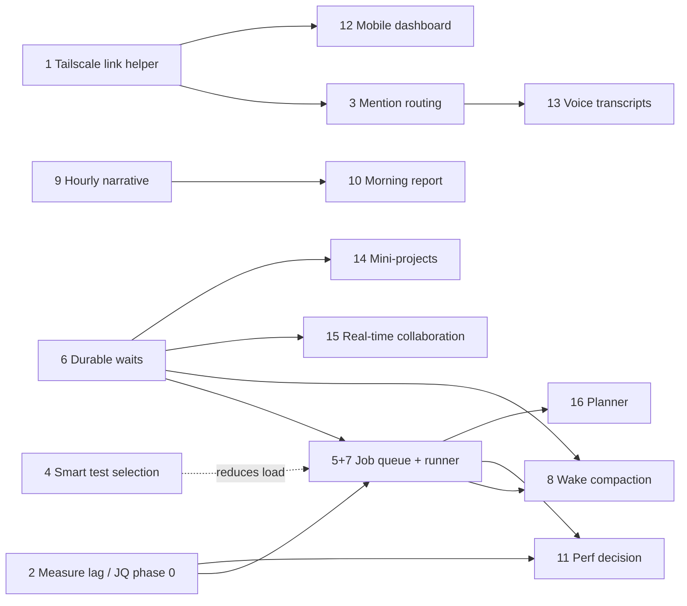

# Operator feedback roadmap — now / next / later / backlog

**Date:** 2026-09-24 · **Status:** preliminary — an index over sixteen preliminary specs; no item is approved
**Source:** operator brain dump of 2026-09-24 (voice notes, summarised into five feature areas plus one process item)
**Audience:** the operator, and the agents that will iterate on each spec

This page owns no design. It indexes one preliminary spec per feature. For
each one it gives the operator's priority, how that priority changed once the
code was read, the rough size, and what blocks it. Each linked spec has the
analysis, the options and the open questions. Where this index and a spec
disagree, the spec wins, and this page should be fixed.

Every spec follows the same outline: *the ask*, *what exists today* (with
file and line references), *gaps*, *implementation options*, *initial take*,
*open questions*, *dependencies*, *non-goals*. They are written to be iterated
on. The open questions are the work, not the options.

---

## 1. Index

Sizes are the spec authors' first estimates (S = days, M = about a week,
L = several weeks, XL = a programme). *Bucket* is this roadmap's
recommendation, explained in §3.

| # | Feature | Area | Spec | Bucket | Size | Hard dependencies |
|---|---|---|---|---|---|---|
| 1 | Tailscale dashboard link not posting (bug) | Discord | [tailscale-dashboard-link](2026-09-24-tailscale-dashboard-link.md) | **Now** | S | — |
| 2 | Dashboard/daemon separation: verify, then measure under load | Dashboard | [dashboard-performance-and-separation](2026-09-24-dashboard-performance-and-separation.md) | **Now** (verify + measure only) | S–M | — |
| 3 | @mention → supervisor routing | Discord | [discord-mention-routing](2026-09-24-discord-mention-routing.md) | **Now**, after an operator decision | M | 1 (shared link helper) |
| 4 | Smart test selection | Resources | [smart-test-selection](2026-09-24-smart-test-selection.md) | **Now** (shadow mode) | M | — |
| 5 | Exclusive job queue | Resources | [exclusive-job-queue](2026-09-24-exclusive-job-queue.md) | **Next** (keystone) | L overall, phased | Phase 3 needs 6 |
| 6 | Agent sleep/wake and durable waits | Resources | [agent-sleep-wake](2026-09-24-agent-sleep-wake.md) | **Next** (shared primitive) | L | — |
| 7 | Managed long-running commands | Resources | [managed-long-running-commands](2026-09-24-managed-long-running-commands.md) | **Next**, merged with 5's runner | M on top of 5 | 5 |
| 8 | Wake context compaction | Resources | [wake-context-compaction](2026-09-24-wake-context-compaction.md) | **Next** (result digests first) | S–M per option | 7 (result store), 6 |
| 9 | Supervisor hourly narrative | Supervisor hub | [supervisor-narrative-updates](2026-09-24-supervisor-narrative-updates.md) | **Next** | M | none hard; 8 for cost |
| 10 | Morning report playbook | Supervisor hub | [morning-report-playbook](2026-09-24-morning-report-playbook.md) | **Next**, after 9 | M (L alone) | 9 (request/submit/outbox) |
| 11 | Dashboard performance decision (cache / split read API) | Dashboard | [dashboard-performance-and-separation](2026-09-24-dashboard-performance-and-separation.md) | **Later**, re-measure after 5 | M–XL | 2, 5 |
| 12 | Mobile dashboard | Dashboard | [mobile-dashboard](2026-09-24-mobile-dashboard.md) | **Later** (focus routes may come early) | M | 1 (access), 2 |
| 13 | Voice transcripts via Discord | Supervisor hub | [discord-voice-transcripts](2026-09-24-discord-voice-transcripts.md) | **Later** | S after 3 (text); M for audio | 3 |
| 14 | Adversarial review recipe | Collaboration | [adversarial-review-recipe](2026-09-24-adversarial-review-recipe.md) | **Recipe now, feature skipped** | S (docs + skill) | — |
| 15 | Mini-projects (ideation sessions) | Collaboration | [mini-projects](2026-09-24-mini-projects.md) | **Backlog** (a cheap skill-first cut exists) | S–M first cut; L–XL as an entity | none for the first cut; 14 for the critique phase |
| 16 | Real-time agent collaboration | Collaboration | [realtime-agent-collaboration](2026-09-24-realtime-agent-collaboration.md) | **Backlog** | S–M (`message wait`) → XL (shared workspace) | 6 |
| 17 | Resource-aware (Gantt) planner | Resources | [resource-aware-planner](2026-09-24-resource-aware-planner.md) | **Backlog** | XL (staged) | 5 phases 0–2 (data) |

---

## 2. What reading the code changed

The operator's summary proposed an order. The specs mostly confirm it. Seven
findings move items or reshape them.

1. **The Tailscale bug has a confident root cause, and it isn't a Tailscale problem.**
   `src/main.py` builds the link base for digests and escalations from
   `health_check.base_url`, falling back to `http://localhost:{health_check.port}`.
   That is the daemon API on :8081, which serves no dashboard pages. The
   dashboard server listens on :8082, and `dashboard.public_url` is ignored on
   this path. Two further failures sit behind it: the one-shot `tailscale`
   lookup at startup is neither logged nor checked by doctor, and the dashboard
   server listens only on loopback. That makes it a small, well-understood fix,
   and it stays first.
2. **"Is the dashboard separated from the daemon?" Only partly.** The
   dashboard server shipped as its own process (`src/dashboard_server/`,
   2026-09-21). The daemon is API-only. But every `/api` and `/ws` call is
   still answered by the daemon, in the same event loop as the orchestrator
   cycle and sharing one database pool. The proxy has no cache. Daemon load
   therefore still shows up directly as dashboard latency. The separation task
   landed; the separation the operator probably wanted, isolating reads from
   daemon load, did not.
3. **@mention routing is not a small bug fix. It reverses a deliberate
   decision.** Today a mention is dropped silently: `classify_inbound` rejects
   it as "not in a thread" and nothing is logged. The 2026-09-08 Discord
   simplification removed general mention handling on purpose, and
   `tests/test_escalation_intake.py` pins that behaviour. There is also no
   outbound path by which the supervisor could reply in Discord. It stays in
   *Now* because it is the operator's only remote feedback channel, but it
   needs an explicit operator sign-off on the guardrails in its spec §5.
   Logging *why* a mention was ignored (option D) is worth doing immediately
   either way.
4. **The job queue is two jobs at two sizes.** Phase 0 measures the lag (PSI,
   test-slot occupancy, a `test_slots=1` comparison). Phase 1 adds
   shared/exclusive classes to the existing flock semaphore. Both are S–M and
   could start this week. The daemon-owned durable queue with detach and wake
   (Phases 2–3) is the L part. The claim that the queue fixes frontend lag is
   still a hypothesis: sessions already run at `nice +10`, so memory pressure,
   disk I/O or PostgreSQL contention may matter more. Phase 0 and item 2's
   measurement answer this together; run them as one task.
5. **Agents cannot go dormant during a job today, and not because of tokens.**
   An idle harness costs nothing. The waste comes from:
   - the stall ladder, which nudges after 480 s of silence and then restarts;
   - the bootstrap prompt's heartbeat instruction;
   - the session backstop, which ages sessions out regardless of heartbeats.

   More fundamentally, stopping a session kills every process carrying its
   `AQ_INSTANCE_TOKEN`, including the agent's own test run. A job therefore has
   to leave the agent's process tree before the agent can sleep. Items 5, 6 and
   7 are one design problem.
6. **The hourly digest already exists and was built LLM-free on purpose.**
   The narrative spec recommends that the supervisor's text *ride on* the
   digest's window, dedup and delivery machinery rather than replace it. The
   deterministic text remains the fallback when the supervisor is down or slow.
   That also makes the hourly narrative independent of the sleep/wake
   primitive: the digest window already is the hourly timer.
7. **Smart test selection cannot be a pure import graph.** `src.database`,
   `src.models` and `src.config` are each imported by 199–276 of the 657 test
   modules. 49 modules are ratchets that scan source as text. The spec
   recommends an LLM pick from a generated area catalogue on top of a
   deterministic minimum set that cannot be removed. It runs in shadow mode
   first, and its recall is measured against the failing test ids the CI
   sentinel already records per red commit.
8. **Adversarial review mostly exists already. It is hidden in the document
   review subsystem.**
   - `aq review dispatch --to <profile>` creates a reviewer task with an
     adversarial brief. `review decide --decision request_changes` sends the
     open comments back to the author for another revision, and each new
     revision can be dispatched again.
   - Every worker rung, `astra-high-codex` included, holds the review grants.
   - The only documentation is one table row in `docs/guides/reviews.md`, so
     this really is a discoverability problem, as the operator guessed.

   One hazard: a Claude author on a `preferred` profile can fail over to
   OpenAI during an outage and silently put both sides on one model family.
   The recipe uses `--pin` to prevent this. Automating the loop as a playbook
   is blocked because `review_dispatch` and `review_decide` are not contracted
   commands.

---

## 3. Buckets

### Now (days; independent; each shippable alone)

1. **Tailscale link fix.** Spec options 1 and 2: one link helper built from
   the dashboard server's settings (used by digests, escalations and reviews),
   a periodic re-probe of `tailscale` that logs its result, and a
   `dashboard.remote_link` doctor check. Document reachability (option 3):
   `tailscale serve` plus `public_url` plus a trusted origin.
2. **Measure the lag.** Instrument event-loop lag and per-route latency on the
   daemon. Run the existing `scripts/dashboard-perf/` harness against the
   dashboard server (not `vite preview`) under a synthetic `aq test` load. This
   doubles as job-queue Phase 0. It records that the separation landed and
   what it does not cover.
3. **Mention routing, after sign-off.** Start with the logging (option D), then
   the small command-plus-outbox version the spec recommends. It is off by
   default, refused when `authorized_users` is empty, and replay-safe through
   IDs derived from the Discord message ID. A Discord message never counts as
   human approval.
4. **Smart test selection, in shadow mode.** Build the area catalogue, the
   minimum set and the recall harness, and add `aq test --aq-smart`. Make it
   the profile default only after replaying red sentinel commits shows the
   agreed recall.
5. **Adversarial review recipe.** Write up the `review dispatch` / `review
   decide` loop as a docs page and an agent skill. Add a supervisor rule if
   the operator delegates reviews. Describe the example playbook in prose
   only, since it needs contracted review commands. Consider letting
   `review_dispatch` pin the reviewer's provider. Build nothing further unless
   someone asks.

### Next (weeks; foundational)

Design these as **one** programme with one runner and one wait primitive (§4):

6. **Durable waits** (`agent-sleep-wake` option C, with delivery mode A). A
   `waits` table, a `WaitReconciler` that scans durable state the way
   `ChildTaskReconciler` does, `aq wait`, and a stall-ladder exemption for a
   waiting session. The task stays `IN_PROGRESS` while it waits. Ending the
   session and relaunching it (option B) is deferred until measurement shows
   waits are long enough to justify it.
7. **Exclusive job queue, Phases 1–3,** with **managed long-running
   commands** as its output and delivery contract. The daemon owns execution
   in a runner that is detached, re-adopted after restart, and gets a
   session-equivalent environment, never the daemon's. Output goes to
   `<data_dir>/runs/<id>/` and results are trimmed in this order: failures
   first, then head errors, then the tail. The job's completion is the first
   producer for the wait primitive.
8. **Wake compaction, starting with result digests** (option D: a
   deterministic pytest digest, diffed against the baseline, plus a pointer to
   the full log), then agent-written hand-off notes (option B). Fix the empty
   `PreCompact` hand-off note in passing (see §6).
9. **Supervisor hourly narrative** on the digest window: `digest.window_ready`
   triggers a reviewed system playbook, which calls `digest_narrative_request`,
   the supervisor calls `digest_narrative_submit`, and the existing sender
   posts the text, falling back to the deterministic text.
10. **Morning report,** reusing item 9's request/submit/outbox piece. It needs
    a deterministic `morning_report_brief` with a watermark, a
    `reports.timezone` setting and a cutoff for late starts, because
    `cron.HH:MM` currently fires late after a late daemon start.

### Later

11. **Dashboard performance decision.** Re-measure once item 7 has landed.
    Cheap OS-priority work (option D: cgroups on by default, `ionice`, test
    databases off the daemon's PostgreSQL) can come earlier if item 2 points at
    it. Split the read API into its own process only if specific reads stay
    slow. A cache is the last resort.
12. **Mobile dashboard.** Full-screen focus routes for the terminal, task
    detail and a phone home, which desktop can use too. Then the minimum
    responsive shell: the rail as a drawer, a full-screen sheet, card rows.
    Viewport screenshot tests from day one. This is one codebase, which answers
    the two-layout concern. The focus-route URL shape should be agreed early,
    because the morning report, the narrative and Discord replies will link to
    it.
13. **Voice transcripts.** Text and `.txt` attachments first. Discord turns
    long pastes into `message.txt`, so even "text only" needs attachment
    support. The supervisor always *proposes* through the existing
    `task_batch_propose` gate and never creates tasks straight from a
    transcript. Audio transcription through a provider API comes later behind
    an opt-in.

### Backlog / skip for now

14. **Mini-projects.** The cheap cut is one facilitator task that fans out to
    harness sub-agents, shipped as a skill, plus a light `mini-project`
    formula (diverge → critique → converge). It also needs a thinking-only
    profile that takes no repo worktree slot. Three existing limits get in the
    way:
    - `formula_cook` is elevated-only.
    - No formulas ship.
    - A downstream task's prime does not show its dependencies' summaries.

    This document set is itself an instance, minus the critique round and a
    durable per-agent record: one brain dump fanned out to seven sub-agents
    and converged into this index.
15. **Real-time collaboration.** Messaging between tasks already works
    (`message_send`/`inbox`/`reply`), but delivery reaches only idle sessions,
    agents cannot tail each other's panes, and two writers on one branch
    serialize on git's one-worktree-per-branch rule. The first step is an
    `aq message wait` long-poll, modelled on `task close --claim-next --wait`.
    Anything more should consume item 6, whose wake conditions must include
    "message on thread T" and "task X reached state S". Shared-workspace
    pairing is deferred.
16. **Resource-aware planner.** Needs the duration and resource data that item
    7 starts producing. The staged path begins with feedback-driven caps on job
    slots and a read-only Gantt view, well before a reservation scheduler.

---

## 4. The shared substrate — design it once

The operator's summary flagged one design thread. The specs agree and make it
concrete. Four pieces of infrastructure are each wanted by several features.
Each should be built once.

| Substrate | Wanted by | Owning spec | Duplication risk if ignored |
|---|---|---|---|
| **Durable wait + wake** (a `waits` row with a kind; a reconciler that scans state; delivery by nudging an idle session or through prime) | job queue, managed commands, supervisor completion hook, voice transcription jobs, collaboration ("partner posted"), and later a retrofit of agent questions | [agent-sleep-wake](2026-09-24-agent-sleep-wake.md) | Each feature invents its own "stay quiet until X", which is how questions, playbook waits and slot waits already diverged |
| **One detached command runner** (durable run row, output store, trimmed result, session-equivalent env, re-adopted after restart) | job queue, managed commands, smart selection's runs, development validation (`run_check`), `aq stream` | [exclusive-job-queue](2026-09-24-exclusive-job-queue.md) + [managed-long-running-commands](2026-09-24-managed-long-running-commands.md) | Both specs call this their biggest risk. There are already two partial runners (`run_check`, `StreamRegistry`), and the latter runs with the daemon's environment |
| **Supervisor request → submit → outbox** (a deterministic brief, one message to the supervisor, a submit command that re-neutralises the text, delivery by an idempotent daemon service with a deterministic fallback) | hourly narrative, morning report, mention replies, voice replies | [supervisor-narrative-updates](2026-09-24-supervisor-narrative-updates.md) | Three separate Discord posting paths. Today only escalations, the digest and `ReviewNotifier` post, and the supervisor has no outbound path at all |
| **One dashboard link helper** (from `dashboard.public_url`, else the dashboard server's host and port rewritten for Tailscale) | Tailscale fix, escalations, digest, reviews, morning report, mention replies, mobile deep links | [tailscale-dashboard-link](2026-09-24-tailscale-dashboard-link.md) | This is the current bug: three call sites, each building a different base URL |

---

## 5. Decisions only the operator can make

These gate work. Each spec has more; these are the ones that change the plan.

1. **Mention routing guardrails.** Accept the relaxation of the 2026-09-08
   "notification-only Discord" decision under the guardrails in
   [the mention-routing spec §5](2026-09-24-discord-mention-routing.md)? What
   may the supervisor *do* in response to a Discord message: answer only,
   propose, or act?
2. **What "snappy" means.** A latency number under load (for example, task
   detail p95 under 300 ms while a full-suite `aq test` runs) turns item 11
   into a pass/fail check instead of a feeling.
3. **What the "CI agent" was when the lag appeared:** an agent running
   `aq test`, or an un-niced runner or shell? This decides whether the queue
   is expected to fix the lag at all.
4. **"One at a time":** does it mean *every* heavy job, or only jobs
   classified exclusive? And may agents submit arbitrary commands, or only
   named presets? The second question is the security contract for the
   runner.
5. **Who "Jev" is.** The smart-selection spec assumed a `fast-low`
   intelligence-class call through the LLM direct path. Confirm, or name the
   intended model or agent.
6. **Mobile terminals:** watch-only, or must the phone type into agents? Typing
   needs the `/ws/terminal` loopback gate relaxed and a tmux resize policy,
   because today a phone attach would reflow the agent's real terminal for
   every viewer.
7. **Narrative and morning report: default-on or opt-in** for other Agent Q
   installs? And how do operators change the schedule without re-importing a
   reviewed playbook? That second question affects every configurable shipped
   playbook.

---

## 6. Incidental findings

The spec authors noticed these while reading code. They are small, unrelated
to any one feature, and could be filed as tasks directly. Each is reported
from reading the code and should be verified before it is fixed.

- **Empty `PreCompact` hand-off note.** `PreCompact` calls
  `aq handoff --auto` with no subject or detail, and the CLI ignores the
  hook's stdin, so an empty note appears to be recorded. The "latest" hand-off
  note is chosen by insertion order, because `task_context` has no timestamp.
  Nothing subscribes to `session.restart_requested`. See
  [wake-context-compaction §2](2026-09-24-wake-context-compaction.md).
- **Session backstop default disagrees with itself.** The dataclass default
  is 1800 and the loader default is 0 (`src/config.py`). See
  [agent-sleep-wake §2](2026-09-24-agent-sleep-wake.md).
- **Empty Discord allowlist lets everyone in.** When `authorized_users` is
  empty, `bot._is_authorized` authorises everyone. Any new inbound route must
  refuse in that case instead. See
  [discord-mention-routing](2026-09-24-discord-mention-routing.md).
- **`aq stream` runs with the daemon's environment.**
  `development_validation.run_check` does too. See
  [managed-long-running-commands](2026-09-24-managed-long-running-commands.md).
- **Session metrics count the wrong slots.** The `slots` field counts
  worktree slots, not test slots, and pressure (PSI) is not sampled. See
  [exclusive-job-queue](2026-09-24-exclusive-job-queue.md).
- **CLAUDE.md drift:**
  - `size_pools` and `place_pool_actions` live in `src/scheduler.py`, not
    `src/orchestrator/scheduler.py`.
  - `blocked-task-escalation` is listed in `RETIRED_DEFAULT_SYSTEM_PLAYBOOK_IDS`
    (`src/playbooks/required.py`); `supervisor-failure-triage` now owns
    `task.failed`.
  - Fix these when CLAUDE.md is next edited.

---

## 7. How to iterate on these specs

- Work the **open questions** first. Answering them, not choosing between
  options, is what moves a spec from preliminary to design.
- Items that share a substrate (§4) should be iterated together, or the
  substrate spec should be settled first.
- A spec that becomes a design keeps its filename. Update its **Status**
  line, and update this index's bucket and size.
- Line numbers cited in the specs are from the 2026-09-24 tree and will
  drift. Re-verify before relying on one.
