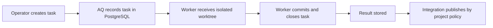

# Run your first isolated task

Create a disposable Git project, ask AQ for one small change, and inspect the
result without giving a worker your normal repository. This follows
[installation](install.md); it assumes the installer's **First-task readiness**
summary is ready.

## Confirm that a live task is admissible

Do this before creating the sample project. `aq install` may complete when an
optional provider was skipped, but that is not evidence that AQ can start a
coding worker. Its closing summary (and `--json` under
`onboarding.readiness`) reports separate, observed checks for the PostgreSQL
connection, daemon health, dashboard reachability, harness authentication,
profile routing, Git/tmux worktree prerequisites, and a configured project
root that is readable and writable.

Every check must say `ready` for this tutorial. In particular, do not infer
agent authentication from an executable being on `PATH`, or daemon readiness
from a started process. Repair the named check and rerun the installer; it
revalidates completed steps rather than starting over.

A fresh installation reports **needs attention** for **Project root**: AQ
derives its defaults from this machine's cores and memory and deliberately
invents no filesystem location, so `project_roots` starts empty and
`aq project onboard` has no `--root-id` to take. [A realistic disposable
example](#a-realistic-disposable-example) below configures one; that is the
step the installer is asking for.

Choose one active **standard-medium** profile for this demonstration. It is
small enough to make the live run inexpensive and clear; do not use a
`deep-high` profile for a one-file hello-world change. The example below uses
Codex only when it appears as active on *your* daemon; otherwise substitute
the active `worker-standard-medium-<provider>` profile shown by the command.

```bash
aq agent list-profiles
export AQ_FIRST_PROFILE=worker-standard-medium-codex
aq agent check-profile --profile-id "$AQ_FIRST_PROFILE"
```

This is a real live-agent demonstration, not a dry run. It starts one worker
and consumes whatever usage your chosen provider/account applies (included
plan allowance or API usage) as well as local CPU and one worktree slot. Keep
the prompt below unchanged and do not queue more tasks until you have observed
the result. Provider credentials stay with the provider CLI; never paste a
key into the task description or AQ configuration.

## Why this exists

The useful unit in AQ is a task, not a chat prompt. A task records the desired
change and its project. AQ prepares an isolated worktree for the worker,
records the worker's final summary, and later delivers the finished branch
under the project's integration policy. Creating a small project first makes
that boundary visible and safe.

## Vocabulary

* A **project** connects AQ to one repository and its configuration.
* A **task** is a durable description of work for one project.
* A **worker session** is a harness CLI running the task in an isolated
  worktree, not in the project checkout you initialized.
* A **result** is the stored completion summary, changed-file list, error (if
  any), and token information. It is not proof that a branch was integrated.

The [glossary](../reference/glossary.md) has the broader vocabulary.

## A realistic disposable example

Choose an empty directory that AQ is allowed to manage. AQ only onboards below
a configured `project_roots` entry, and the root is distinct from the worker
worktree directory. Add one through Settings or `aq system config edit` before
continuing; the minimum YAML shape is:

```yaml
project_roots:
  - id: aq-tutorials
    label: AQ tutorials
    path: ~/aq-tutorials
```

Create that directory, reload/validate the configuration as prompted by the
editor, and verify it:

```bash
mkdir -p ~/aq-tutorials
aq project list-roots
```

```text
… aq-tutorials … readable … writable …
```

Now let AQ initialize the example repository. `init` only accepts a new,
nonexistent destination and creates an initial README by default, so it is
safe to repeat this tutorial by choosing a new `--relative-path`.

```bash
aq project onboard \
  --source-mode init \
  --root-id aq-tutorials \
  --relative-path hello-aq \
  --project-name "Hello AQ" \
  --project-id hello-aq \
  --request-id hello-aq-first-run
```

```text
Onboarded hello-aq (workspace hello-aq-primary)
~/aq-tutorials/hello-aq
```

The command and output form above come from the current CLI renderer
([src/cli/projects.py](../../src/cli/projects.py)); paths and generated IDs are
local to your machine. Re-running the same request ID with the same input
returns the durable status/result rather than creating a second project. Use a
new request ID if you change the input.

Create a task small enough to understand at a glance. This command's flags
were checked with `aq task create --help`; replace the profile only after
checking the profiles actually installed on your host.

```bash
aq agent list-profiles
aq task create \
  --project hello-aq \
  --title "Add a hello script" \
  --description "Create hello.sh that prints Hello, AQ! and add a short README note." \
  --profile "$AQ_FIRST_PROFILE"
```

```text
… task created …
… project: hello-aq …
… status: READY …
```

The profile is a configured choice verified above. The task's default
`project-repo` workspace requirement
is shipped behaviour; you do not need to pass `--requires-kind` for this
single-repository example ([task creation](../../src/commands/task_commands.py)).

Watch the task transition and read the result after it becomes terminal:

```bash
aq task list --project hello-aq --include-completed
aq task get --task-id <task-id>
aq task get-result --task-id <task-id>
```

```text
<task-id>  …  Add a hello script
… summary: …
… files changed: …
```

`aq task get-result` is the current command name; `aq task result` is not a
command. A running task means AQ has assigned a worker session; use the
dashboard to follow it visually or `aq task get`/`aq task comments` to inspect
durable task state. The worker will work in an AQ-managed worktree and commit
to its task branch, leaving `~/aq-tutorials/hello-aq` as the project checkout.

Then inspect the integration that this project's configured policy actually
performed; do not assume a worker's completion summary means the default
branch changed:

```bash
aq integration status hello-aq
```

The status reports the project's rollout mode, readiness, active work, and
cleanup. A successful result plus an integration record is the end-to-end
proof for this disposable run. If the status names a pending or blocked
integration item, follow that diagnostic before deleting the project.



## Inputs and outputs

| Input | Owner | Result |
| --- | --- | --- |
| `project_roots` id and relative path | Operator configuration | A new Git repository and AQ project/workspace. |
| Project ID, title, description, profile | Operator creating the task | A durable task with its initial state and routing data. |
| Worker harness credentials | Daemon host / selected profile | A worker can start a session when capacity and routing allow. |
| Worker commit and close summary | Worker | `aq task get-result` returns completion information. |

## State ownership

AQ owns project registration, task state, task results, session metadata, and
onboarding request records in PostgreSQL. It owns the worktree slot and task
branch while the worker runs. You own the configured root and its base
repository. GitHub authentication, when you use a GitHub source mode, belongs
to the daemon host's `gh` login; AQ does not ask a worker to reveal a token
([onboarding command](../../src/commands/project_onboarding_commands.py)).

For this `init` example, AQ writes the new repository. In `link` mode it
registers an existing valid repository without modifying it. `github_clone`
is an optional onboarding mode that clones a repository visible to daemon-host
GitHub credentials ([onboarding service](../../src/projects/onboarding.py)).
Those are choices, not defaults for this tutorial.

Finishing is distinct from delivery. A completed task has a stored worker
result; its branch is delivered according to the project integration policy.
Inspect the project and your Git remote before treating completion as a change
on the default branch.

## Common failures and recovery

| Symptom | Diagnose | Recovery |
| --- | --- | --- |
| `root_unavailable` or no roots listed | `aq project list-roots`, then `aq doctor` | Create/fix the configured directory and its read/write permissions; retry. |
| `destination_conflict` | Check the requested relative path | Choose a new path. AQ will not overwrite an existing destination. |
| `project_id_conflict` | `aq project get --project-id hello-aq` | Reuse the existing project only if intended, otherwise choose a new ID. |
| Task remains ready | `aq task get --task-id <task-id>` and inspect profile availability | Check `aq agent check-profile <profile-id>` and daemon status; do not edit worker worktrees by hand. |
| No result yet | `aq task get --task-id <task-id>` | The task has not closed. Wait for a terminal state, then run `aq task get-result`. |
| Onboarding was interrupted | `aq project get-onboarding --request-id hello-aq-first-run` | Retry unchanged with the same ID; change input only with a new ID. |

## Cleanup

Wait for the task to finish, inspect its result, and check the integration
status first. Then delete the disposable AQ project through the dashboard or
the project-management CLI. The CLI refuses to delete a project with a live
task, which protects the worker and its worktree:

```bash
aq project delete --project-id hello-aq
rm -rf ~/aq-tutorials/hello-aq
```

Only run the `rm -rf` line after confirming that exact path is the disposable
tutorial repository. AQ deletes its own task/project records; the repository
directory is still yours. `aq stop` is optional and ends all agent sessions,
so use it only when you mean to stop AQ rather than merely remove the sample.

## Related pages

* [Install and start AQ](install.md) — prerequisites, secrets, and daemon
  lifecycle.
* [Project onboarding](../guides/project-onboarding.md) — all source modes and
  exact recovery semantics.
* [Task state machine](../guides/task-state-machine.md) — task lifecycle
  reference after the first run.
* [Development integration](../guides/development-integration.md) — how a
  completed branch is delivered.

## Source and tests

Implementation: [src/cli/projects.py](../../src/cli/projects.py),
[src/commands/project_onboarding_commands.py](../../src/commands/project_onboarding_commands.py),
[src/projects/onboarding.py](../../src/projects/onboarding.py), and
[src/commands/task_commands.py](../../src/commands/task_commands.py).

Focused verification: `aq project onboard --help`, `aq project list-roots --help`,
`aq task create --help`, `aq task get-result --help`,
`aq test tests/test_project_onboarding_commands.py tests/test_project_onboarding_service.py tests/test_cli_projects.py`.
