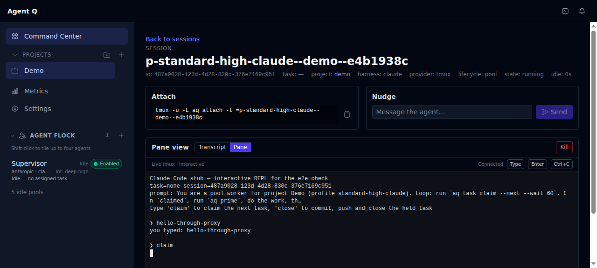

# End-to-end check: the API-only daemon and the dashboard server

Acceptance evidence for `smart-meadow.6`, the end-to-end check of the change
that made the daemon API only and moved the dashboard into its own process
(`smart-meadow.1`–`.5`; what ships is described in the
[dashboard guide](../guides/dashboard.md) and the
[release notes](../release-notes.md)). It is a record of one run on
2026-09-21 against `main` `7a0956cb0`, not a description of current behaviour:
where it and the code disagree later, the code is right.

Every command below was run in a disposable `ubuntu:24.04` container started
from a bare clone of this repository, as
[installer testing](../contributing/installer-testing.md) describes; output is
real, trimmed with `…`, with the home directory written as `~`. No provider
credentials were used: the `claude` harness was a stub, so what the run proves is
the install, the processes, the relay and the terminal, not an agent's work.

## Findings and follow-ups

| # | Severity | Finding | Follow-up |
|---|---|---|---|
| F1 | High | After a daemon crash, `aq start` mistakes the running dashboard server for the daemon (`src/cli/daemon.py` `_find_daemon_pid` `pgrep` fallback matches its command line) and starts nothing; `aq stop --no-dashboard-server` with the daemon down stops the dashboard server. `aq restart` recovers. | `smart-meadow.7` |
| F2 | High (acceptance) | The daemon still returns HTML at `/docs`, `/docs/oauth2-redirect` and `/redoc` (FastAPI, `src/api/app.py`), and — found afterwards by reading `src/api/health.py`, not seen in this run because no plan existed — at `/plans/<task_id>`. Every other path returns JSON or plain text. | `smart-meadow.8` |
| F7 | High | The first `aq update` from an install older than `13c58d2bd` exits 20 ("the daemon is up but not serving the dashboard") although the end state is correct: the old in-memory updater probes the daemon's `/dashboard/` and the daemon answers `404` where the design chose `307`. | `smart-meadow.9`; documented in the release notes |
| F3 | Medium | With the daemon down the page loads but shows *Preferences unavailable* and *Loading…*, never "daemon unreachable". | documented; not filed |
| F4 | Low | `HEAD /health`, `/ready`, `/api/health` on the daemon answer `404 text/plain` (GET-only routes; pre-existing). | not filed |
| F5 | Low | `aq task explain` suggests `aq playbook runs`; the command is `aq playbook list-runs`. | not filed |
| F6 | Low | `aq doctor` counts a zombie dashboard server as running where the CLI says `stale_pid` (only without an init process). | not filed |
| F8 | Low | `aq update` counts 5183 commits for a shallow install 110 behind (pre-existing). | not filed |

No Critical finding: every install reached `ready`, and every update ended on
the tip with the schema at head and both processes serving.

## Environment

| | |
|---|---|
| Host | WSL2 (kernel `6.18.33.2-microsoft-standard-WSL2`), Docker 29.3.1 |
| Container image | `ubuntu:24.04` (`sha256:6232b3879100…`, created 2026-09-11), one fresh container per case |
| Pre-installed in the container | `sudo`, `python3` (3.12.3), `curl`, `ca-certificates` only — what a fresh WSL Ubuntu has; user `ubuntu` with NOPASSWD sudo |
| Installed by AQ | git 2.43.0, tmux 3.4, PostgreSQL 16.15, Node v24.21.0 (AQ's own toolchain), the venv |
| Repository | a bare clone of this repository mounted read-only at `/srv/aq.git`; install with `scripts/install.sh file:///srv/aq.git` (clone `--depth 1`, follows `origin/main`); `main` moved between commits to stage each case |
| Tip | `7a0956cb0` feat(install): build, serve and open the dashboard through the dashboard server (smart-meadow.5) |
| Old commits | `4ccbb90d3` (last main before `update_finish`, daemon mount), `390a8445b` (has `update_finish`, before the dashboard server), `e0ce2df64` (just before the removal `19eef1e53`) |
| Harness CLI | `~/.local/bin/claude` stub (`--version`, `auth status` → signed in; as an agent: a REPL). No provider credentials anywhere |
| Browser | `agent-browser` 0.27.0 (headless Chromium) on the host, through a TCP forwarder in the container (container `127.0.0.1:8082` → host `127.0.0.1:1808x`, equivalent to `ssh -L`) |

Quirk: `docker exec` sometimes drops stdout on this box, so commands wrote to a file in the container that was copied out.
The first container ran without an init process; see the note at A7.

## Results at a glance

| Step | Result |
|---|---|
| A1 one-command install (interactive) | `ready (exit 0)`; `dashboard.build` → `dashboard.serve` → Dashboard `http://127.0.0.1:8082/` |
| A1 unattended bootstrap (no tty) | stops at `wsl.packages` for approval (`needs_user`, exit 10), by design; a full `aq install --yes` run never opens a browser (U) |
| A2 status surfaces | `aq status`, `aq --json status` (`dashboard_server.state: running`), `aq dashboard status` agree |
| A3 dashboard server | identity, SPA fallback, 404 for `/mcp` `/docs` `/openapi.json` `/dashboard` `/plans`, cache/security headers, `/api/health` relayed, `/ws/events` frame |
| A4 daemon serves no HTML | **no, except** `/docs`, `/docs/oauth2-redirect`, `/redoc` (FastAPI Swagger/ReDoc) — F2 |
| A5 browser | dashboard loads with live data; live project appears without reload; Events tab streams |
| A6 task + interactive terminal | terminal pane "Connected" through the proxy; `claim` and `close` typed in the pane claimed and completed the task; untrusted Origin refused 403 |
| A7 crash / heal / daemon down | dashboard-server crash: `stale_pid`, doctor warns, `aq start` heals ✔; daemon down: `:8082/` 200, `/api/health` 503 `daemon_unreachable` ✔; **`aq start` does not restart a crashed daemon while the dashboard server runs** — F1; page shows only "Loading…" — F3; `aq stop` leaves neither process ✔ |
| A8 `aq update` | both stopped, code moved, both started and validated, exit 0 ✔ |
| B1 `4ccbb90d3` → tip | **exit 20**, `XX Start the daemon — the daemon is up but not serving the dashboard`, not rolled back (migrations); end state is actually correct — F7 |
| B2 `390a8445b` → tip | exit 0, dashboard server started by the new finisher ✔ |
| B3 `e0ce2df64` → tip | exit 0 ✔ |

## Case A — fresh clone at the tip (`main` = `7a0956cb0`), container `aq-e2e-sm6-a`

### A1. One-command install

Unattended (no terminal, stdin `/dev/null` — the `curl … | bash` path with no tty):

```bash
bash /tmp/install.sh file:///srv/aq.git          # as user ubuntu, no tty
```

```text
Cloning into '~/.local/share/agent-queue'...
Running the common AQ installer (aq install)...
[1/30] OK Confirm the host is supported
[2/30] !! Install prerequisites with apt
!! wsl.packages: unattended run has no approval for the mutating step 'wsl.packages'
   next: Rerun with `--approve wsl.packages` (or `--yes` to approve every mutating step), …
needs_user (exit 10) — host windows-wsl2
```

That is the documented behaviour for a run with no terminal (nothing mutating without approval; no browser opened).
The interactive path, under a pty with Enter for every default:

```bash
(for i in $(seq 1 40); do printf '\n'; sleep 2; done) | script -qec "bash /tmp/install.sh file:///srv/aq.git" /dev/null
```

```text
AQ checkout at ~/.local/share/agent-queue is up to date (7a0956c).
Running the common AQ installer (aq install)...
Setting up AQ on this machine. Press Enter to accept each default.
  Use Claude Code? [Y/n]:   Use Codex CLI? [y/N]:   Use Gemini CLI? [y/N]:
  Where do your code projects live? [~/Projects]:
AQ will:
  • Coding agents: Claude Code
  • Database: install PostgreSQL and start it with this machine
  • Settings tuned for this machine (24 cores, 31 GiB)
  • Start AQ in the background, build the dashboard and open it in your browser
  • Projects folder: ~/Projects
Go ahead? [Y/n]:
[1/30] OK Confirm the host is supported
[2/30] OK Install prerequisites with apt
…
[20/30] OK Check the AQ database connection
[21/30] !! Start PostgreSQL again after a restart        # no systemd in a container (advisory)
[22/30] OK Write configuration defaults for this machine
…
[26/30] OK Start the AQ daemon
[27/30] OK Build the dashboard
[28/30] OK Serve the dashboard
[29/30] OK Report the dashboard URL
[30/30] OK Open the dashboard
ready (exit 0) — host windows-wsl2
AQ is installed and ready.
…
Dashboard
  http://127.0.0.1:8082/
First-task readiness ready for a live first task
  OK Database: AQ connected to its PostgreSQL database in this install run.
  OK Daemon: The daemon answered its health endpoint.
  OK Dashboard: The dashboard is reachable at http://127.0.0.1:8082/.
  …
Next
  1. Open the dashboard at http://127.0.0.1:8082/.
exit=0
```

Resume record for the last four steps (`~/.agent-queue/install-state.json`):

```text
dashboard.build   succeeded  built the dashboard                                   15:41:00
dashboard.serve   succeeded  started the dashboard server at http://127.0.0.1:8082/  15:41:02
daemon.dashboard  succeeded  open http://127.0.0.1:8082/                           15:41:02
dashboard.open    succeeded  open http://127.0.0.1:8082/ in your browser           15:41:02
```

(`dashboard.open` has no `wslview`/`explorer.exe` in a container, so it printed the URL.)

### A2. Status surfaces

```text
$ aq status
…
Dashboard: running at http://127.0.0.1:8082/ (PID 7132)

$ aq --json status   # .data.dashboard_server
{"state": "running", "url": "http://127.0.0.1:8082/", "pid": 7132, "enabled": true, "detail": "",
 "version": "0.1.0", "bundle": {"version": "0.1.0", "files": 42, "verified": true, "manifest_sha256": "b5438e49…"},
 "bundle_current": true, "api_url": "http://127.0.0.1:8081", "upstream_ok": true,
 "log": "~/.agent-queue/dashboard-server.log"}

$ aq dashboard status
Dashboard server: running at http://127.0.0.1:8082/ (PID 7132)
  bundle 0.1.0 (42 files); proxying http://127.0.0.1:8081 (daemon answering)
  log: ~/.agent-queue/dashboard-server.log
```

### A3. The dashboard server (:8082)

```text
== /__aq/health
{"service": "aq-dashboard-server", "version": "0.1.0", "pid": 7132, "bundle": {"version": "0.1.0", "files": 42,
 "verified": true, "manifest_sha256": "b5438e49…"}, "api_url": "http://127.0.0.1:8081", "upstream_ok": true}
path                   status               content-type                      body sha256
/                      HTTP/1.1 200 OK      text/html; charset=utf-8          79463f0fa514
/tasks                 HTTP/1.1 200 OK      text/html; charset=utf-8          79463f0fa514
/projects/demo/graph   HTTP/1.1 200 OK      text/html; charset=utf-8          79463f0fa514
/nope.js               HTTP/1.1 404         text/plain; charset=utf-8
/mcp                   HTTP/1.1 404         application/json
/docs                  HTTP/1.1 404         application/json
/openapi.json          HTTP/1.1 404         application/json
/dashboard             HTTP/1.1 404         application/json
/plans/x               HTTP/1.1 404         application/json
/api/nope              HTTP/1.1 404         text/plain; charset=utf-8   (the daemon's own 404, relayed)
== index headers
cache-control: no-cache
x-content-type-options: nosniff
content-security-policy: frame-ancestors 'self'
x-aq-dashboard-server: 0.1.0
asset /assets/index-GErg3tmF.js: 200, cache-control: public, max-age=31536000, immutable
== /api/health via 8082 vs 8081
{"status":"ok"}
{"status":"ok"}
== websockets client on ws://127.0.0.1:8082/ws/events
received frame: {"type":"hello","epoch":"0fc5d670-680a-4a0e-a0cb-8be9d62003d9"}
```

### A4. The daemon (:8081) — does it serve HTML anywhere?

```text
GET  /                                   404 | text/plain; charset=utf-8
GET  /dashboard                          404 | application/json
GET  /dashboard/                         404 | application/json
GET  /dashboard/index.html               404 | application/json
GET  /dashboard/tasks                    404 | application/json
GET  /dashboard/assets/index-GErg3tmF.js 404 | application/json
GET  /index.html                         404 | text/plain; charset=utf-8
GET  /tasks                              404 | text/plain; charset=utf-8
GET  /projects/demo/graph                404 | text/plain; charset=utf-8
GET  /assets/index-GErg3tmF.js           404 | text/plain; charset=utf-8
GET  /favicon.ico                        404 | text/plain; charset=utf-8
GET  /docs                               200 | text/html; charset=utf-8  <-- HTML
GET  /docs/oauth2-redirect               200 | text/html; charset=utf-8  <-- HTML
GET  /redoc                              200 | text/html; charset=utf-8  <-- HTML
GET  /openapi.json                       200 | application/json
GET  /mcp                                406 | application/json
GET  /mcp/                               307 (to /mcp)
GET  /plans/x                            404 | application/json
GET  /health  /ready  /api/health        200 | application/json
HEAD /health  /ready  /api/health        404 | text/plain            (GET-only routes; HEAD falls to the MCP mount)
GET  /api/nope  /does-not-exist  /static/x.css   404 | text/plain
(every path above was also requested with HEAD and with Accept: text/html: no other HTML)
== /dashboard/ body
{"ok":false,"error":"dashboard_not_served_here","dashboard_url":"http://127.0.0.1:8082/","hint":"The daemon is API-only. Run `aq dashboard status`."}
```

`/docs` is FastAPI's Swagger UI (`<title>Agent Q API - Swagger UI</title>`, scripts from `cdn.jsdelivr.net/npm/swagger-ui-dist@5`),
`/redoc` is ReDoc (`cdn.jsdelivr.net/npm/redoc@2`) — `src/api/app.py:89-90` (`docs_url="/docs"`, `redoc_url="/redoc"`).

### A5. The dashboard in a real browser

Container `127.0.0.1:8082` forwarded to host `127.0.0.1:18082` by a TCP forwarder in the container (equivalent to
`ssh -L 18082:127.0.0.1:8082`), then `agent-browser` (0.27.0, headless Chromium) on the host:

```text
$ agent-browser open http://127.0.0.1:18082/
✓ Agent Q Dashboard
$ agent-browser get url
http://127.0.0.1:18082/command-center
```

Screenshot `a5-dashboard-home.png`: the Command Center with live data (Supervisor agent, "5 idle pools").
Creating a project from the CLI (`aq project onboard --source-mode link … --project-id demo`) made **Demo** appear in the
left rail with no reload, and the Activity drawer's Events tab streams `metrics.tick` once a second
([`a5-live-project-and-events.png`](img/api-only-daemon-e2e/a5-live-project-and-events.png)) — the browser's `/ws/events` works through the proxy.

### A6. Run a task, drive it from the interactive terminal pane

`~/.local/bin/claude` is a stub (answers `--version` and `auth status`; launched as an agent it prints the prompt and
runs a REPL: `claim` → `aq task claim --next`, `close` → commit, push, `aq task close --outcome pass`). No credentials.

```text
$ aq task create --project demo --title "E2E: add a stub change file" --description "…"
Task created: stark-cascade
# the installer enabled swarm and made 5 claude pools; a standard-high-claude pool session started at once:
$ aq --json session list   → p-standard-high-claude--demo--e4b1938c  lifecycle=pool  state=running
$ aq task explain --task-id stark-cascade
  awaiting_intelligence_route: task has no intelligence class yet; the assignment routing playbook answers
  task.route_needed and writes one (check `aq playbook runs`)          # needs an LLM; none in the container
$ aq task route --task-id stark-cascade --profile-id standard-high-claude --intelligence-class standard-high
{"success": true, "task_id": "stark-cascade", "provider_intent": "preferred", "resolved_gate_ids": []}
```

Terminal websocket through the dashboard server (Python `websockets`, subprotocol `aq-terminal-v1`, Origin `http://127.0.0.1:8082`):

```text
accepted subprotocol: aq-terminal-v1
control: {"type":"ready","session_id":"487a9028-…","cols":100,"rows":30}
output tail: '…❯\xa0hello-through-proxy\r\nyou typed: hello-through-proxy\r\n…'
echo seen: True
== untrusted Origin (http://evil.example)
handshake refused: 403 application/json {"ok": false, "error": "origin_not_allowed", "message": "This origin may not drive this install. Add it to api_auth.trusted_dashboard_origins if it should."}
```

In the browser: Demo → Sessions → the pool session → **Pane** shows "Live tmux · interactive — Connected"
(`a6-terminal-pane-attached.png`). The line `hello-through-proxy` was typed into the pane and echoed by the stub, then `claim`:



Typed `claim` + Enter in the pane (`a6-terminal-claimed.png`):

```text
❯ claim
claimed: stark-cascade — E2E: add a stub change file
claim_epoch=1
```

Typed `close` + Enter. The project's default integration mode is `pull_request`, so the first close was refused for a
missing GitHub PR (policy, expected with a local-only remote); after `aq task edit --task-id stark-cascade
--integration-mode direct`, `close` again in the pane (`a6-terminal-close2.png`):

```text
❯ close
committed
{ "success": true, "task_id": "stark-cascade", "outcome": "pass", "status": "COMPLETED", "pipeline_ok": true, … }
$ aq task show stark-cascade → 🟢 COMPLETED   Branch: aq/stark-cascade
$ git -C ~/remotes/demo.git log --oneline --all → 9fd7145 e2e stub change / … / c9571b9 init
```

The task ran and completed, driven entirely by keystrokes typed into the dashboard's interactive terminal pane over
`/ws/terminal` through the dashboard server.

### A7 (first pass, container without an init process). Crash, heal, daemon down

> This container's PID 1 is `sleep infinity`, which never reaps orphans, so every exited daemon or dashboard-server
> process lingered as a zombie and `os.kill(pid, 0)` still succeeded. That made `aq dashboard stop` report "did not exit
> after SIGKILL", `aq stop` wait 10 s and SIGKILL, and `aq doctor` call a dead PID "running". None of that happens on a
> host with a real init; step 7 was repeated in an `--init` container (A7 below) for clean evidence. What follows is
> the part that does not depend on process reaping.

```text
$ kill -9 $(cat ~/.agent-queue/dashboard-server.pid)            # 7132
$ aq --json status   # .data.dashboard_server
{'state': 'stale_pid', 'url': 'http://127.0.0.1:8082/', 'pid': None, 'detail': 'not running: the PID file names PID 7132,
 which has exited (see ~/.agent-queue/dashboard-server.log); `aq start` or `aq dashboard start` starts it again'}
$ aq start
Daemon is already running (PID 6843)
Dashboard server started at http://127.0.0.1:8082/ (PID 9299).
$ curl :8082/ → 200
```

Daemon down, dashboard server up (`aq stop --no-dashboard-server --keep-sessions`):

```text
GET / 200 text/html; charset=utf-8
GET /api/health:
HTTP/1.1 503 Service Unavailable
cache-control: no-store
x-aq-dashboard-server: 0.1.0
retry-after: 2
{"ok": false, "error": "daemon_unreachable", "api_url": "http://127.0.0.1:8081"}
ws/events handshake: denied 503 {"ok": false, "error": "daemon_unreachable", "api_url": "http://127.0.0.1:8081"}
$ aq dashboard status
Dashboard server: running at http://127.0.0.1:8082/ (PID 9299); the daemon is not answering it
```

The browser page with the daemon down (`a7-daemon-down.png`, [`a7-daemon-down-25s.png`](img/api-only-daemon-e2e/a7-daemon-down-25s.png)): the shell renders,
the header says "Preferences unavailable", and the main pane and agent list stay on "Loading…" indefinitely — the page
never says the daemon is unreachable.

**`aq start` does not start the daemon while the dashboard server runs.** With `daemon.pid` already removed by the stop:

```text
$ cat ~/.agent-queue/daemon.pid
cat: ~/.agent-queue/daemon.pid: No such file or directory
$ aq start
Daemon is already running (PID 9299)
Dashboard server is already running at http://127.0.0.1:8082/ (PID 9299).
$ curl http://127.0.0.1:8081/health → 000 (connection refused)
$ pgrep -af "agent-queue.*~/.agent-queue/config.yaml"
9299 ~/.local/share/agent-queue/.venv/bin/python3 -m src.dashboard_server --config ~/.agent-queue/config.yaml --bundle-dir …
```

PID 9299 is the dashboard server. `src/cli/daemon.py:_find_daemon_pid` falls back to
`pgrep -f "agent-queue.*{CONFIG_PATH}"` when there is no live PID file, and the dashboard server's command line matches it
(the checkout path `~/.local/share/agent-queue` and `--config ~/.agent-queue/config.yaml`). Workaround:
`aq dashboard stop` (or `aq stop`) first, then `aq start`.

### A7. Crash, heal, daemon down — clean run (container `aq-e2e-sm6-a2`, started with `--init`)

Same one-command install at `7a0956cb0` (`ready (exit 0)`, `[27/30] OK Build the dashboard`, `[28/30] OK Serve the dashboard`).

Dashboard server crash and heal:

```text
daemon=6704 dashboard-server=7003
$ kill -9 7003
$ aq status
Dashboard: stopped (stale PID file) -- not running: the PID file names PID 7003, which has exited (see
~/.agent-queue/dashboard-server.log); `aq start` or `aq dashboard start` starts it again
$ aq --json status → dashboard_server.state = stale_pid
$ aq doctor
│ dashboard.server.running │ warn │ the dashboard server is not running: it crashed or was killed (its PID file names
│                          │      │ PID 7003, which has exited); `aq dashboard start` starts …
$ aq start
Daemon is already running (PID 6704)
Dashboard server started at http://127.0.0.1:8082/ (PID 7123).
GET :8082/ 200
$ aq doctor → dashboard.server.running  ok  running at http://127.0.0.1:8082/ (PID …
```

**Daemon crash while the dashboard server runs — `aq start` does not heal it:**

```text
daemon=6704 dashboard-server=7123
$ kill -9 6704                                  # simulate a daemon crash
(daemon PID 6704 gone)
daemon :8081/health 000
:8082/api/health → {"ok": false, "error": "daemon_unreachable", "api_url": "http://127.0.0.1:8081"} 503
$ aq start
Daemon is already running (PID 7123)            # 7123 is the dashboard server
Dashboard server is already running at http://127.0.0.1:8082/ (PID 7123).
daemon :8081/health after aq start: 000
$ ls ~/.agent-queue/daemon.pid
ls: cannot access '~/.agent-queue/daemon.pid': No such file or directory
$ aq restart                                    # stops the dashboard server first, so the match disappears
Daemon started (PID 7169)
Dashboard server started at http://127.0.0.1:8082/ (PID 7181).
daemon :8081/health after aq restart: 200
```

**`aq stop --no-dashboard-server` with the daemon already down kills the dashboard server:**

```text
$ aq stop --no-dashboard-server --keep-sessions      # daemon down, dashboard server 7181 up, no daemon.pid
Stopping daemon (PID 7181)...
Daemon stopped.
Agent sessions left running (--keep-sessions).
dashboard server 7181 was KILLED
$ aq dashboard status
Dashboard server: stopped (stale PID file) -- …
```

Root cause for both: `src/cli/daemon.py:_find_daemon_pid()` → `pgrep -f "agent-queue.*{CONFIG_PATH}"` matches
`~/.local/share/agent-queue/.venv/bin/python3 -m src.dashboard_server --config ~/.agent-queue/config.yaml …`.

Stops, with and without a browser attached (events socket and pages open through the proxy):

```text
$ aq stop                                   # browser attached
Dashboard server stopped (PID 7247).
Stopping daemon (PID 7237)...
Daemon stopped.
aq stop took 3.0s
(no daemon, dashboard-server or tmux process left)
$ aq stop --no-dashboard-server --keep-sessions   # browser attached
daemon-only stop took 2.8s
$ aq stop --no-dashboard-server --keep-sessions   # no browser
daemon-only stop, no browser: 2.9s
```

### A8. `aq update` on the tip install

A docs-only commit was pushed to the bare repository's `main`, then:

```text
before: 770ae3a  daemon=7483 dashboard-server=7494
$ aq update --yes
An update is available:
  • 1 commit(s) from origin/main (770ae3a79 -> 3a0e7045f)
  • Stops the dashboard server for the update and starts it again
  • Stops the daemon for the update and starts it again; running agents keep running
  • Rolls back to the current version if anything fails
  OK Stop the dashboard server
  OK Stop the daemon — agent sessions keep running
  OK Update the code — 770ae3a79 -> 3a0e7045f
  OK Start the daemon — agent sessions are re-adopted
  OK Start the dashboard server — http://127.0.0.1:8082/
AQ is updated to 3a0e7045f.
exit=0
after: 3a0e704  daemon=7546 dashboard-server=7556
daemon /health 200
/__aq/health {'service': 'aq-dashboard-server', 'pid': 7556, 'upstream_ok': True} bundle verified=True
GET :8082/ 200
GET :8081/dashboard/ 404 application/json
aq --json status → dashboard_server.state = running
```

An earlier attempt ran with the daemon down (left down by the A7 stop test; the preceding `aq start` had answered
"Daemon is already running (PID 7370)", the dashboard server's PID). `aq update` then correctly updated the code and
restarted only the dashboard server (`OK Stop the dashboard server` / `OK Update the code — 7a0956cb0 -> 770ae3a79` /
`OK Start the dashboard server`, exit 0), leaving the daemon down as it found it.

## Case B — upgrades from older installs

### B1. Install at `4ccbb90d3` (daemon mount, updater before `update_finish`), then `aq update` to `7a0956cb0`

Container `aq-e2e-sm6-b1` (`--init`), the one-command install from that commit's `scripts/install.sh`:

```text
[26/29] OK Start the AQ daemon
[27/29] OK Build the dashboard
[28/29] OK Report the dashboard URL
[29/29] OK Open the dashboard
ready (exit 0) — host windows-wsl2
Dashboard
  http://127.0.0.1:8081/dashboard/
GET :8081/dashboard/ 200 text/html; charset=utf-8          # the pre-change daemon mount
GET :8082/ 000
```

`main` moved to `7a0956cb0`; the old code's updater runs:

```text
$ aq update --yes
An update is available:
  • 5183 commit(s) from origin/main (4ccbb90d3 -> 7a0956cb0)
  • Includes database migrations: the database is backed up first
  • Reinstalls Python dependencies
  • Rebuilds the dashboard
  • Stops the daemon for the update and starts it again; running agents keep running
  • Rolls back to the current version if anything fails
  …
  OK Back up the database — ~/.agent-queue/backups/agent_queue-4ccbb90d3b33-20260921T160458Z.dump
  OK Stop the daemon — agent sessions keep running
  OK Update the code — 4ccbb90d3 -> 7a0956cb0
  OK Reinstall Python dependencies
  OK Rebuild the dashboard
  XX Start the daemon — the daemon is up but not serving the dashboard

The update failed. The update's database migrations may already have run, so AQ was not rolled back. Read
~/.agent-queue/daemon.log for why the daemon did not start, fix it, and run `aq start`. A backup from before the
update is at ~/.agent-queue/backups/agent_queue-4ccbb90d3b33-20260921T160458Z.dump.
exit=20
```

The state it left is in fact the correct end state:

```text
checkout: 7a0956cb feat(install): build, serve and open the dashboard through the dashboard server (smart-meadow.5)
daemon /health 200
GET :8081/dashboard/ → 404 {"ok":false,"error":"dashboard_not_served_here","dashboard_url":"http://127.0.0.1:8082/","hint":"The daemon is API-only. Run `aq dashboard status`."}
:8082/__aq/health → {"service": "aq-dashboard-server", "pid": 7318, "bundle": {…, "verified": true, …}, "upstream_ok": true}
GET :8082/ 200
$ aq db current → head: a00000000013 / schema is at head
bundle manifest base: /
```

Recovery: nothing is broken; `aq start` reports both running. A rerun of the install records the move and names the new URL
without opening a second browser window:

```text
$ aq install            # interactive rerun
[27/30] OK Build the dashboard
[28/30] OK Serve the dashboard
[29/30] OK Report the dashboard URL
[30/30] OK Open the dashboard
ready (exit 0)
Dashboard
  http://127.0.0.1:8082/
resume record: dashboard.serve  succeeded  the dashboard server is already serving http://127.0.0.1:8082/
               dashboard.open   succeeded  already satisfied; verified without repeating the step
$ aq update --yes → AQ is up to date (origin/main at 7a0956cb0).
```

Why: the pre-`13c58d2bd` updater keeps its old in-memory `_start_daemon`, which probes `GET <daemon>/dashboard/` and
treats `>= 400` as failure (`src/install/update.py` at `4ccbb90d3`, lines 508-515). The daemon now answers `404`.
docs/specs/dashboard-server.md §5 predicted exactly this and chose `307` to avoid it; smart-meadow.4 shipped `404`.
Every install whose checkout predates `13c58d2bd` (main `07fc89638`, 2026-09-20 20:57) and is behind migration
`a00000000013` takes this path, so none of them can reach the roll-back branch.

### B2. Install at `390a8445b` (daemon mount, `update_finish` present, no dashboard server yet), then `aq update` to `7a0956cb0`

Container `aq-e2e-sm6-b2`: install `ready (exit 0)`, Dashboard `http://127.0.0.1:8081/dashboard/` (200 text/html), `:8082` closed.

```text
$ aq update --yes
An update is available:
  • 5183 commit(s) from origin/main (390a8445b -> 7a0956cb0)
  • Includes database migrations: the database is backed up first
  • Reinstalls Python dependencies
  • Rebuilds the dashboard
  • Stops the daemon for the update and starts it again; running agents keep running
  • Rolls back to the current version if anything fails
  OK Back up the database — ~/.agent-queue/backups/agent_queue-390a8445b9e9-20260921T161459Z.dump
  OK Stop the daemon — agent sessions keep running
  OK Update the code — 390a8445b -> 7a0956cb0
  OK Reinstall Python dependencies
  OK Rebuild the dashboard
  OK Start the daemon — agent sessions are re-adopted
  OK Start the dashboard server — http://127.0.0.1:8082/
AQ is updated to 7a0956cb0.
exit=0
daemon=7219 dashboard-server=7230   daemon /health 200   schema is at head
GET :8081/dashboard/ → 404 {"ok":false,"error":"dashboard_not_served_here","dashboard_url":"http://127.0.0.1:8082/",…}
GET :8082/ 200   /__aq/health pid 7230 bundle verified True upstream_ok True   dashboard_server.state running
```

The old process passes only `--start-daemon` to the new `python -m src.install.update_finish` (it predates
`--start-dashboard-server`); the tip's finisher starts the dashboard server as part of `_start_daemon`, so it works.

### B3. Install at `e0ce2df64` (the commit just before the removal), then `aq update` to `7a0956cb0`

Container `aq-e2e-sm6-b3`. That commit's installer still ends at the daemon mount, but its `aq start` already manages
the dashboard server:

```text
[27/29] OK Build the dashboard
[28/29] OK Report the dashboard URL
[29/29] OK Open the dashboard
ready (exit 0)
Dashboard
  http://127.0.0.1:8081/dashboard/
GET :8081/dashboard/ 200 text/html                   # index.html references "/assets/index-GErg3tmF.js"
GET :8081/assets/index-GErg3tmF.js 404               # so the URL this installer printed renders a blank page
GET :8082/ 200
Dashboard server: running at http://127.0.0.1:8082/ (PID 6921)
manifest base: /
```

```text
$ aq update --yes
An update is available:
  • 2 commit(s) from origin/main (e0ce2df64 -> 7a0956cb0)
  • Stops the dashboard server for the update and starts it again
  • Stops the daemon for the update and starts it again; running agents keep running
  • Rolls back to the current version if anything fails
    7a0956c feat(install): build, serve and open the dashboard through the dashboard server (smart-meadow.5)
    19eef1e api: make the daemon API-only, stop serving the dashboard mount
  OK Stop the dashboard server
  OK Stop the daemon — agent sessions keep running
  OK Update the code — e0ce2df64 -> 7a0956cb0
  OK Start the daemon — agent sessions are re-adopted
  OK Start the dashboard server — http://127.0.0.1:8082/
AQ is updated to 7a0956cb0.
exit=0
daemon=7034 dashboard-server=7044   daemon /health 200
GET :8081/dashboard/ → 404 {"ok":false,"error":"dashboard_not_served_here","dashboard_url":"http://127.0.0.1:8082/",…}
GET :8082/ 200   /__aq/health pid 7044 bundle verified True upstream_ok True
```

### U. A fully unattended install never opens a browser (container `aq-e2e-sm6-u`, tip)

Logging stubs for `wslview`, `xdg-open` and `explorer.exe` on `PATH` record any attempt to open a browser.

```text
$ bash /tmp/install.sh file:///srv/aq.git </dev/null        # bootstrap, no terminal
…
exit=10                                                     # needs_user: wsl.packages needs approval
$ aq install --yes --with postgres-managed --with provider.claude --with daemon </dev/null
…
[26/30] OK Start the AQ daemon
[27/30] OK Build the dashboard
[28/30] OK Serve the dashboard
[29/30] OK Report the dashboard URL
[30/30] -- Open the dashboard
-- dashboard.open: an unattended install never opens a browser
ready (exit 0) — host windows-wsl2
Dashboard
  http://127.0.0.1:8082/
  OK Dashboard: The dashboard is reachable at http://127.0.0.1:8082/.
exit=0
$ cat /tmp/browser-open.log
(no browser-open attempts: /tmp/browser-open.log absent)
```

Two interactive reruns afterwards also opened nothing (`dashboard.open` is recorded once; reruns never open a window,
`src/install/dashboard.py:dashboard_open_step`). Not exercised here: a first *interactive* run with an opener present
(Case A had no `wslview`, so the step printed the URL).
